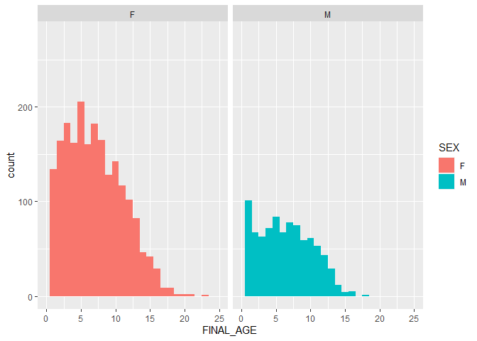
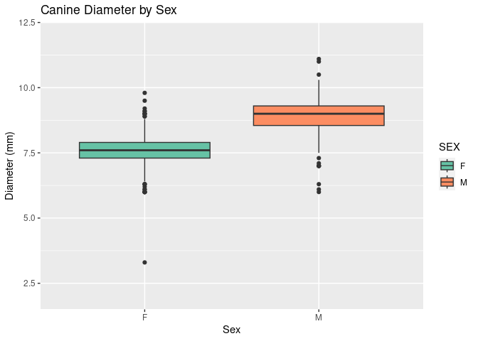
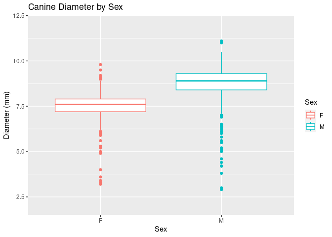
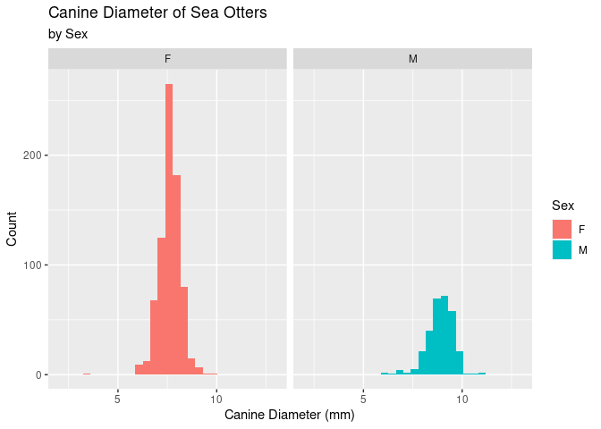
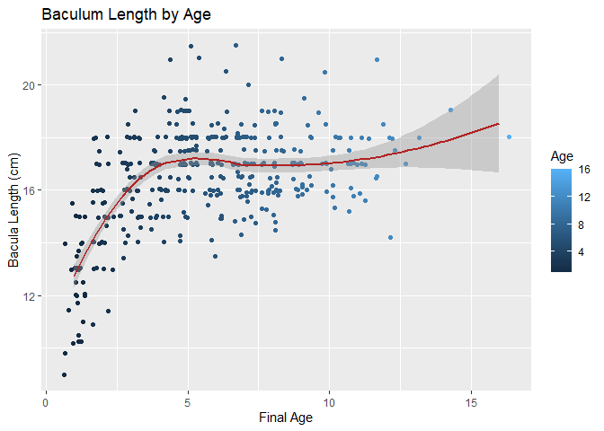

Analysis
================
Autumn Pauly and Asher Panikian

# Loading the Data

``` r
library(tidyverse)
```

    ## ── Attaching core tidyverse packages ──────────────────────── tidyverse 2.0.0 ──
    ## ✔ dplyr     1.1.4     ✔ readr     2.1.5
    ## ✔ forcats   1.0.0     ✔ stringr   1.5.1
    ## ✔ ggplot2   3.4.4     ✔ tibble    3.2.1
    ## ✔ lubridate 1.9.3     ✔ tidyr     1.3.1
    ## ✔ purrr     1.0.2     
    ## ── Conflicts ────────────────────────────────────────── tidyverse_conflicts() ──
    ## ✖ dplyr::filter() masks stats::filter()
    ## ✖ dplyr::lag()    masks stats::lag()
    ## ℹ Use the conflicted package (<http://conflicted.r-lib.org/>) to force all conflicts to become errors

``` r
knitr::opts_chunk$set(echo = TRUE)
```

``` r
seot = read.csv("/cloud/project/data/seot.csv", h = T)
```

# Glimpsing the Data

## Yearly Observations

First, let’s look at the yearly observations for the sea otters. \[add
something here about the gap between 1970 and 1985\].

``` r
seot %>% 
  ggplot(aes(x = YEAR)) +
  geom_histogram(binwidth = 1) + 
  scale_fill_viridis_d(option = "magma") +
  labs(title = "Count of Observations Per Year",
       x = "Year", 
       y = "Count")
```

<!-- -->

## Age Diversity Among Sexes With Observations

``` r
seot %>% 
  filter(SEX != "U") %>% 
  ggplot(aes(x=FINAL_AGE, fill = SEX)) + 
   geom_histogram(binwidth = 1) + 
  xlim(0,25) + 
  facet_grid(~SEX)
```

    ## Warning: Removed 993 rows containing non-finite values (`stat_bin()`).

    ## Warning: Removed 4 rows containing missing values (`geom_bar()`).

<!-- -->

# Statistical Analysis

## Paw Width and Prey

The paw width data was collected in an effort to study the estimates of
prey size in relation to paw size for sea otter foraging studies. If we
are able to find the appropriate datasets, it would be interesting to
study the relationship between paw size and prey size.

## Canine and Sexing

The canine width was measured as a potential metric to sex the
individuals. We would like to see if there are any significant
differences between male canine lengths and female canine lengths (with
respect to the ages of the individuals).

The canine measurement is labeled under the `CAN_DIA` column, where a
measurement of the diameter of canine tooth (mm) was taken at the gum
line, which is the widest dimension. This canine width was measured with
a caliper and recorded to the nearest 0.1 mm.

### Creating Plots

Let’s create a plot to visualize the distribution of the data. This will
help us determine which type of statistical test will be the most
appropriate to use. First, we have to filter the `seot` dataset so that
we will be able to visualize the `CAN_DIA` and `SEX` variables that
we’re interested in.

``` r
seot_sex <- seot %>% 
  mutate(CAN_DIA = as.numeric(CAN_DIA)) %>% 
  filter(SEX != "U") %>% 
  filter(CAN_DIA > 0)

#scatterplot
ggplot(data = seot_sex, mapping = aes(x = SEX, y = CAN_DIA, color = SEX)) + 
  geom_jitter() + 
  ylim(2,12) + 
  labs(title = "Canine Diameter by Sex",
       x = "Sex",
       y = "Diameter (mm)", 
       color = "Sex")
```

<!-- -->

``` r
#boxplot
ggplot(data = seot_sex, mapping = aes(x = SEX, y = CAN_DIA, color = SEX)) + 
  geom_boxplot() + 
  ylim(2,12) + 
  labs(title = "Canine Diameter by Sex",
       x = "Sex",
       y = "Diameter (mm)", 
       color = "Sex")
```

<!-- -->

``` r
#histogram
ggplot(data = seot_sex, mapping = aes(x = CAN_DIA, fill = SEX)) +
  geom_histogram() + 
  facet_grid(~SEX) + 
  xlim(2,13) + 
  theme_gray() + 
  scale_fill_viridis_d(option = "turbo") + 
  labs( title = "Canine Diameter of Sea Otters", 
        subtitle = "by Sex", 
        x = "Canine Diameter (mm)", 
        y = "Count", 
        fill = "Sex")
```

    ## `stat_bin()` using `bins = 30`. Pick better value with `binwidth`.

    ## Warning: Removed 4 rows containing missing values (`geom_bar()`).

<!-- -->

To truly determine if the measurement of the canine diameter at the gum
line is an appropriate metric by which to sex a sea otter, statistical
testing should be performed. As was seen above, the distribution of both
sexes appears to conform to a normal distribution. This suggests that we
can use a test that follows a two-sample t-test with equal variance.

``` r
t.test(CAN_DIA ~ SEX, data = seot_sex, var.equal = TRUE)
```

    ## 
    ##  Two Sample t-test
    ## 
    ## data:  CAN_DIA by SEX
    ## t = -19.164, df = 1132, p-value < 2.2e-16
    ## alternative hypothesis: true difference in means between group F and group M is not equal to 0
    ## 95 percent confidence interval:
    ##  -1.1519975 -0.9380158
    ## sample estimates:
    ## mean in group F mean in group M 
    ##        7.546934        8.591940

The diameter of the canine tooth for female sea otters is significantly
smaller than that of the male otters (Two Sample t-test; t = -19.164, df
= 1132, p-value \< 2.2e-16). This would mean that this would be an
appropriate metric by which to determine the sex of an unknown sea
otter.

## Baculum Length and Aging

The baculum length was measured on males a way to estimate age-class of
the animal. We would like to perform statistical analysis on if there is
a difference in baculum length in males of various ages and if this is
an appropriate metric by which to estimate the age of male individuals.

The baculum measurement is found under the `BACULA_LGTH` column with the
unit of measurement being centimeters. The baculum length was measure
using a tape measure and feeling the ends of the bone and recorded to
the nearest 0.5 cm.

### Creating Plots

Let’s create a plot to visualize the distribution of the data. This will
help us determine which type of statistical test will be the most
appropriate to use. First, we have to filter the `seot` dataset so that
we will be able to visualize the `BACULA_LGTH` and `FINAL_AGE` variables
that we’re interested in.

``` r
seot_baculum <- seot %>% 
  filter(SEX == "M") %>% 
  mutate(FINAL_AGE = as.numeric(FINAL_AGE)) %>% 
  filter(FINAL_AGE > 0) %>% 
  mutate(BACULA_LGTH = as.numeric(BACULA_LGTH)) %>% 
  filter(BACULA_LGTH > 0)

ggplot(data = seot_baculum, mapping = aes(x = FINAL_AGE, y = BACULA_LGTH, color = FINAL_AGE)) +
  geom_jitter() + 
  geom_smooth() + 
  labs(title = "Baculum Length by Age", 
       x = "Final Age", 
       y = "Bacula Length (cm)", 
       color = "Age")
```

    ## `geom_smooth()` using method = 'loess' and formula = 'y ~ x'

    ## Warning: The following aesthetics were dropped during statistical transformation: colour
    ## ℹ This can happen when ggplot fails to infer the correct grouping structure in
    ##   the data.
    ## ℹ Did you forget to specify a `group` aesthetic or to convert a numerical
    ##   variable into a factor?

<!-- -->

The statistics that we find with the Tukey HSD test that we performed is
a little convoluted, so let’s tidy this up and group ages into
categories and try again.

``` r
#create dataframe that includes the variables we want
seot_baculum <- seot_baculum %>% 
  mutate(FINAL_AGE = as.factor(FINAL_AGE)) %>% 
  select(BACULA_LGTH, FINAL_AGE) 
seot_baculum
```

    ##     BACULA_LGTH FINAL_AGE
    ## 1          15.8        11
    ## 2          15.9        10
    ## 3          14.9         6
    ## 4          16.9         8
    ## 5          15.9         8
    ## 6          14.8         7
    ## 7          15.8         9
    ## 8          14.3         7
    ## 9          15.9         6
    ## 10         14.3         5
    ## 11         11.4         2
    ## 12         16.2        10
    ## 13         16.2         7
    ## 14         14.8         7
    ## 15         14.9         6
    ## 16         15.0         5
    ## 17         16.1        11
    ## 18         16.7         7
    ## 19         15.9         7
    ## 20         15.0         7
    ## 21         16.2         8
    ## 22         14.1         6
    ## 23         15.8         9
    ## 24         15.7         7
    ## 25         15.3         8
    ## 26         14.1         5
    ## 27         14.9         7
    ## 28         14.5         8
    ## 29         14.2        12
    ## 30         15.6         7
    ## 31         15.3        10
    ## 32         13.5         6
    ## 33         16.8        10
    ## 34         16.3         8
    ## 35         15.9         6
    ## 36         15.8         6
    ## 37         16.2         9
    ## 38         16.1         9
    ## 39         15.3         8
    ## 40         15.8         7
    ## 41         15.9         8
    ## 42         16.4         5
    ## 43         16.2         9
    ## 44         15.8         7
    ## 45         15.9         7
    ## 46         15.9        11
    ## 47         14.3         3
    ## 48         14.8         8
    ## 49         10.3         1
    ## 50         15.6        11
    ## 51         15.8         8
    ## 52         15.1         8
    ## 53         15.9         8
    ## 54         13.4         3
    ## 55         10.9         2
    ## 56          9.8         1
    ## 57         15.2         5
    ## 58         15.4         6
    ## 59         10.2         1
    ## 60         16.1         9
    ## 61         15.8         6
    ## 62         15.7        10
    ## 63         15.2        11
    ## 64         16.4         9
    ## 65         21.0         4
    ## 66         14.0         2
    ## 67         15.2         3
    ## 68         14.6         3
    ## 69         16.8         3
    ## 70         14.5         3
    ## 71         15.0         3
    ## 72         15.7         3
    ## 73         17.0         7
    ## 74         17.0        11
    ## 75         18.0        16
    ## 76         14.5         4
    ## 77         15.0         5
    ## 78         15.0         6
    ## 79         16.5         7
    ## 80         16.5         8
    ## 81         17.5         5
    ## 82         16.0         5
    ## 83         17.0         9
    ## 84         17.0         9
    ## 85         16.0         7
    ## 86         15.0         4
    ## 87         15.0         3
    ## 88         17.0         7
    ## 89         16.0         6
    ## 90         15.0         2
    ## 91         17.0         9
    ## 92         17.0         5
    ## 93         16.5         6
    ## 94         16.5         7
    ## 95         16.0         5
    ## 96         12.0         1
    ## 97         19.0         5
    ## 98         14.0         2
    ## 99         17.5         5
    ## 100        16.5         5
    ## 101        16.0         7
    ## 102        17.0         5
    ## 103        17.0         5
    ## 104        19.5         4
    ## 105        21.0        12
    ## 106        17.0         5
    ## 107        16.0         5
    ## 108        17.0         8
    ## 109        16.0         4
    ## 110        17.0         3
    ## 111        18.0         8
    ## 112        16.5         9
    ## 113        17.0         7
    ## 114        16.5         5
    ## 115        16.0         8
    ## 116        16.5         8
    ## 117        16.0         9
    ## 118        17.0         7
    ## 119        16.0         7
    ## 120        18.0         8
    ## 121        16.5         7
    ## 122        18.0         6
    ## 123        19.0         8
    ## 124        16.0         7
    ## 125        17.0         4
    ## 126        17.0         6
    ## 127        16.0         8
    ## 128        18.0        12
    ## 129        17.0        11
    ## 130        14.0         2
    ## 131        13.0         1
    ## 132        18.0         4
    ## 133        15.5         3
    ## 134        15.5         2
    ## 135        16.0         3
    ## 136        18.0        10
    ## 137        16.0         8
    ## 138        18.0         5
    ## 139        17.0         5
    ## 140        17.0        11
    ## 141        17.0         9
    ## 142        13.0         2
    ## 143        16.0         4
    ## 144        14.0         4
    ## 145        15.0         4
    ## 146        13.0         2
    ## 147        15.0         3
    ## 148        17.0         9
    ## 149        15.0         3
    ## 150        14.0         3
    ## 151        14.0         1
    ## 152        18.0         2
    ## 153        15.5         2
    ## 154        18.0         5
    ## 155        15.0         4
    ## 156        13.0         1
    ## 157        17.0         4
    ## 158        18.0        11
    ## 159        16.5        12
    ## 160        18.0         7
    ## 161        17.0        11
    ## 162        13.5         1
    ## 163        16.0         4
    ## 164        14.0         2
    ## 165        17.0         3
    ## 166        15.0         3
    ## 167        13.0         2
    ## 168        14.0         3
    ## 169        15.0         2
    ## 170        15.0         4
    ## 171        13.0         1
    ## 172        16.0         4
    ## 173        13.0         2
    ## 174        15.0         2
    ## 175        17.0        10
    ## 176        18.0         6
    ## 177        16.0         7
    ## 178        17.0         9
    ## 179        17.5         5
    ## 180        20.5         6
    ## 181        17.0         6
    ## 182        18.0         6
    ## 183        17.0         6
    ## 184        17.0         9
    ## 185        17.0         5
    ## 186        18.0         5
    ## 187        19.0        10
    ## 188        21.0         5
    ## 189        18.0        11
    ## 190        17.0         8
    ## 191        15.0         4
    ## 192        16.5         4
    ## 193        16.0         9
    ## 194        17.5         5
    ## 195        18.5         8
    ## 196        17.5         5
    ## 197        17.5         8
    ## 198        16.0         6
    ## 199        18.0         7
    ## 200        17.0         8
    ## 201        18.0         7
    ## 202        18.5        10
    ## 203        17.0         9
    ## 204        17.0         7
    ## 205        18.5         7
    ## 206        17.5         7
    ## 207        16.5         6
    ## 208        18.0         3
    ## 209        17.0         7
    ## 210        18.0         5
    ## 211        18.0         5
    ## 212        17.5        10
    ## 213        18.5         8
    ## 214        20.0         7
    ## 215        18.0         6
    ## 216        18.0         6
    ## 217        17.0         9
    ## 218        16.0         8
    ## 219        17.0         4
    ## 220        17.0         5
    ## 221        17.0        10
    ## 222        18.0         5
    ## 223        17.0         6
    ## 224        16.0         8
    ## 225        17.0         4
    ## 226        18.0         4
    ## 227        18.0         7
    ## 228        21.0         8
    ## 229        17.5         8
    ## 230        17.0         3
    ## 231        17.0        11
    ## 232        17.5        11
    ## 233        18.0        11
    ## 234        17.0        11
    ## 235        18.0         6
    ## 236        18.0         9
    ## 237        17.5         4
    ## 238        18.5        12
    ## 239        18.0        12
    ## 240        18.0         5
    ## 241        19.0         5
    ## 242        16.0         5
    ## 243        19.0         5
    ## 244        19.0         8
    ## 245        17.0         2
    ## 246        18.0        10
    ## 247        17.0         2
    ## 248        18.0         5
    ## 249        18.0         5
    ## 250        18.0        13
    ## 251        17.5         8
    ## 252        13.0         1
    ## 253        16.0         3
    ## 254        17.0        13
    ## 255        17.5         5
    ## 256        18.0         7
    ## 257        18.0         5
    ## 258        17.5         3
    ## 259        19.0         8
    ## 260        18.0         3
    ## 261        19.0         3
    ## 262        16.0         2
    ## 263        18.0         3
    ## 264        17.0         5
    ## 265        18.0         3
    ## 266        17.0         3
    ## 267        12.0         1
    ## 268        17.0         2
    ## 269        14.0         1
    ## 270        14.0         1
    ## 271        16.0         2
    ## 272        15.0         1
    ## 273        18.0         7
    ## 274        15.0         2
    ## 275        16.0         3
    ## 276        18.3         6
    ## 277        16.0         2
    ## 278        19.0         4
    ## 279        18.5         5
    ## 280        15.6         4
    ## 281        16.0         3
    ## 282        17.5         5
    ## 283        17.0         6
    ## 284        17.0         7
    ## 285        18.5         6
    ## 286        17.0         5
    ## 287        18.0         6
    ## 288        19.0         8
    ## 289        17.5         4
    ## 290        17.0         5
    ## 291        16.0         4
    ## 292        17.5         5
    ## 293        20.5        10
    ## 294        21.5         5
    ## 295        21.5         7
    ## 296        16.5         7
    ## 297        18.5         6
    ## 298        17.0         5
    ## 299        18.5         8
    ## 300        17.0         6
    ## 301        17.0         7
    ## 302        17.0         5
    ## 303        16.0         4
    ## 304        16.5         6
    ## 305        16.0         2
    ## 306        18.0         5
    ## 307        17.5         7
    ## 308        18.0         7
    ## 309        17.0         4
    ## 310        19.0         5
    ## 311        17.5         8
    ## 312        18.0         5
    ## 313        19.0         6
    ## 314        17.5         6
    ## 315        15.5         4
    ## 316        16.5        12
    ## 317        16.5         7
    ## 318        12.0         1
    ## 319        17.0         3
    ## 320        16.0         6
    ## 321        18.0         3
    ## 322        18.0        10
    ## 323        19.5         5
    ## 324        18.5         7
    ## 325        18.0         5
    ## 326        18.5         5
    ## 327        18.3         6
    ## 328        11.7         1
    ## 329        17.5         6
    ## 330        17.7         5
    ## 331        18.0         6
    ## 332        17.0         7
    ## 333        18.5         3
    ## 334        12.5         1
    ## 335        16.5         3
    ## 336        10.2         1
    ## 337        18.0         7
    ## 338        18.0         2
    ## 339         9.0         1
    ## 340        11.0         1
    ## 341        19.0         5
    ## 342        10.5         1
    ## 343        14.0         1
    ## 344        16.0         3
    ## 345        17.0         3
    ## 346        18.0         3
    ## 347        16.5         3
    ## 348        14.0         2
    ## 349        16.5         3
    ## 350        17.5        12
    ## 351        18.2         7
    ## 352        13.0         1
    ## 353        17.0         8
    ## 354        17.5         2
    ## 355        15.0         2
    ## 356        18.5         4
    ## 357        19.0        14
    ## 358        11.4         1
    ## 359        18.0         7
    ## 360        15.5         1
    ## 361        13.0         1
    ## 362        17.0         5
    ## 363        18.0         5
    ## 364        17.5         4
    ## 365        17.5         9
    ## 366        18.5         9
    ## 367        16.0         4
    ## 368        17.0        10
    ## 369        16.5         4
    ## 370        17.5         9
    ## 371        18.0         6
    ## 372        18.0         9
    ## 373        19.5         9
    ## 374        17.0         4
    ## 375        14.0         2
    ## 376        15.5         2
    ## 377        12.5         1
    ## 378        12.0         1
    ## 379        13.7         1
    ## 380        18.0         2
    ## 381        15.0         1
    ## 382        17.0         4
    ## 383        15.0         1
    ## 384        14.7         2

``` r
#creating the ANOVA test
aovbaculum <- aov(BACULA_LGTH~FINAL_AGE, data = seot_baculum)
summary(aovbaculum)
```

    ##              Df Sum Sq Mean Sq F value Pr(>F)    
    ## FINAL_AGE    14    666   47.57    23.1 <2e-16 ***
    ## Residuals   369    760    2.06                   
    ## ---
    ## Signif. codes:  0 '***' 0.001 '**' 0.01 '*' 0.05 '.' 0.1 ' ' 1

``` r
#Tukey HSD Test
TukeyHSD(aovbaculum)
```

    ##   Tukey multiple comparisons of means
    ##     95% family-wise confidence level
    ## 
    ## Fit: aov(formula = BACULA_LGTH ~ FINAL_AGE, data = seot_baculum)
    ## 
    ## $FINAL_AGE
    ##              diff         lwr        upr     p adj
    ## 2-1    2.48931452  1.25440609  3.7242229 0.0000000
    ## 3-1    3.70806452  2.52209858  4.8940305 0.0000000
    ## 4-1    4.07865275  2.86174772  5.2955578 0.0000000
    ## 5-1    4.90116796  3.81093208  5.9914039 0.0000000
    ## 6-1    4.40165426  3.22253921  5.5807693 0.0000000
    ## 7-1    4.34556452  3.21646455  5.4746645 0.0000000
    ## 8-1    4.41482127  3.22167672  5.6079658 0.0000000
    ## 9-1    4.38206452  3.06482886  5.6993002 0.0000000
    ## 10-1   4.81806452  3.27681571  6.3593133 0.0000000
    ## 11-1   4.26473118  2.72348237  5.8059800 0.0000000
    ## 12-1   4.98306452  3.03982301  6.9263060 0.0000000
    ## 13-1   4.95806452  1.38302012  8.5331089 0.0003057
    ## 14-1   6.45806452  1.47938172 11.4367473 0.0011769
    ## 16-1   5.45806452  0.47938172 10.4367473 0.0169371
    ## 3-2    1.21875000  0.04303368  2.3944663 0.0336807
    ## 4-2    1.58933824  0.38242004  2.7962564 0.0008820
    ## 5-2    2.41185345  1.33277608  3.4909308 0.0000000
    ## 6-2    1.91233974  0.74353438  3.0811451 0.0000046
    ## 7-2    1.85625000  0.73792071  2.9745793 0.0000030
    ## 8-2    1.92550676  0.74254962  3.1084639 0.0000054
    ## 9-2    1.89275000  0.58473493  3.2007651 0.0001178
    ## 10-2   2.32875000  0.79537413  3.8621259 0.0000360
    ## 11-2   1.77541667  0.24204080  3.3087925 0.0079063
    ## 12-2   2.49375000  0.55674685  4.4307532 0.0013545
    ## 13-2   2.46875000 -1.10290734  6.0404073 0.5461845
    ## 14-2   3.96875000 -1.00750120  8.9450012 0.2950481
    ## 16-2   2.96875000 -2.00750120  7.9450012 0.7748084
    ## 4-3    0.37058824 -0.78620384  1.5273803 0.9989533
    ## 5-3    1.19310345  0.17039902  2.2158079 0.0070639
    ## 6-3    0.69358974 -0.42338043  1.8105599 0.7205652
    ## 7-3    0.63750000 -0.42653796  1.7015380 0.7693689
    ## 8-3    0.70675676 -0.42501352  1.8385270 0.7123695
    ## 9-3    0.67400000 -0.58791118  1.9359112 0.8871835
    ## 10-3   1.11000000 -0.38424159  2.6042416 0.4170397
    ## 11-3   0.55666667 -0.93757493  2.0509083 0.9948619
    ## 12-3   1.27500000 -0.63117355  3.1811735 0.6031593
    ## 13-3   1.25000000 -2.30503200  4.8050320 0.9971596
    ## 14-3   2.75000000 -2.21433202  7.7143320 0.8561537
    ## 16-3   1.75000000 -3.21433202  6.7143320 0.9970828
    ## 5-4    0.82251521 -0.23591145  1.8809419 0.3381666
    ## 6-4    0.32300151 -0.82676587  1.4727689 0.9997636
    ## 7-4    0.26691176 -0.83150503  1.3653286 0.9999581
    ## 8-4    0.33616852 -0.82798208  1.5003191 0.9996749
    ## 9-4    0.30341176 -0.98761979  1.5944433 0.9999722
    ## 10-4   0.73941176 -0.77950252  2.2583260 0.9429105
    ## 11-4   0.18607843 -1.33283585  1.7049927 1.0000000
    ## 12-4   0.90441176 -1.02116354  2.8299871 0.9571105
    ## 13-4   0.87941176 -2.68606088  4.4448844 0.9999498
    ## 14-4   2.37941176 -2.59240230  7.3512258 0.9500976
    ## 16-4   1.37941176 -3.59240230  6.3512258 0.9997956
    ## 6-5   -0.49951370 -1.51426562  0.5152382 0.9377597
    ## 7-5   -0.55560345 -1.51178119  0.4005743 0.8065949
    ## 8-5   -0.48634669 -1.51736709  0.5446737 0.9555781
    ## 9-5   -0.51910345 -1.69150223  0.6532953 0.9739241
    ## 10-5  -0.08310345 -1.50256005  1.3363532 1.0000000
    ## 11-5  -0.63643678 -2.05589338  0.7830198 0.9709339
    ## 12-5   0.08189655 -1.76623675  1.9300299 1.0000000
    ## 13-5   0.05689655 -3.46735537  3.5811485 1.0000000
    ## 14-5   1.55689655 -3.38544009  6.4992332 0.9991308
    ## 16-5   0.55689655 -4.38544009  5.4992332 1.0000000
    ## 7-6   -0.05608974 -1.11248640  1.0003069 1.0000000
    ## 8-6    0.01316701 -1.11142228  1.1377563 1.0000000
    ## 9-6   -0.01958974 -1.27506453  1.2358850 1.0000000
    ## 10-6   0.41641026 -1.07239969  1.9052202 0.9997754
    ## 11-6  -0.13692308 -1.62573302  1.3518869 1.0000000
    ## 12-6   0.58141026 -1.32050843  2.4833289 0.9993783
    ## 13-6   0.55641026 -2.99634214  4.1091627 0.9999998
    ## 14-6   2.05641026 -2.90628956  7.0191101 0.9856237
    ## 16-6   1.05641026 -3.90628956  6.0191101 0.9999919
    ## 8-7    0.06925676 -1.00277659  1.1412901 1.0000000
    ## 9-7    0.03650000 -1.17212374  1.2451237 1.0000000
    ## 10-7   0.47250000 -0.97702043  1.9220204 0.9987343
    ## 11-7  -0.08083333 -1.53035376  1.3686871 1.0000000
    ## 12-7   0.63750000 -1.23382283  2.5088228 0.9979648
    ## 13-7   0.61250000 -2.92396774  4.1489677 0.9999994
    ## 14-7   2.11250000 -2.83855483  7.0635548 0.9812164
    ## 16-7   1.11250000 -3.83855483  6.0635548 0.9999841
    ## 9-8   -0.03275676 -1.30141689  1.2359034 1.0000000
    ## 10-8   0.40324324 -1.09670231  1.9031888 0.9998589
    ## 11-8  -0.15009009 -1.65003564  1.3498555 1.0000000
    ## 12-8   0.56824324 -1.34240490  2.4788914 0.9995444
    ## 13-8   0.54324324 -3.01418999  4.1006765 0.9999999
    ## 14-8   2.04324324 -2.92280862  7.0092951 0.9865410
    ## 16-8   1.04324324 -3.92280862  6.0092951 0.9999931
    ## 10-9   0.43600000 -1.16442260  2.0364226 0.9998350
    ## 11-9  -0.11733333 -1.71775594  1.4830893 1.0000000
    ## 12-9   0.60100000 -1.38950048  2.5915005 0.9994593
    ## 13-9   0.57600000 -3.02495086  4.1769509 0.9999998
    ## 14-9   2.07600000 -2.92131798  7.0733180 0.9852834
    ## 16-9   1.07600000 -3.92131798  6.0733180 0.9999907
    ## 11-10 -0.55333333 -2.34266020  1.2359935 0.9992925
    ## 12-10  0.16500000 -1.98032755  2.3103275 1.0000000
    ## 13-10  0.14000000 -3.54879183  3.8287918 1.0000000
    ## 14-10  1.64000000 -3.42098064  6.7009806 0.9988134
    ## 16-10  0.64000000 -4.42098064  5.7009806 1.0000000
    ## 12-11  0.71833333 -1.42699421  2.8636609 0.9983079
    ## 13-11  0.69333333 -2.99545850  4.3821252 0.9999983
    ## 14-11  2.19333333 -2.86764731  7.2543140 0.9784031
    ## 16-11  1.19333333 -3.86764731  6.2543140 0.9999710
    ## 13-12 -0.02500000 -3.89900631  3.8490063 1.0000000
    ## 14-12  1.47500000 -3.72252487  6.6725249 0.9997341
    ## 16-12  0.47500000 -4.72252487  5.6725249 1.0000000
    ## 14-13  1.50000000 -4.50158476  7.5015848 0.9999411
    ## 16-13  0.50000000 -5.50158476  6.5015848 1.0000000
    ## 16-14 -1.00000000 -7.93003315  5.9300332 0.9999999

Now we can more clearly see how the baculum length relates to ages.

``` r
#create dataframe that includes the variables we want
seot_baculum_2 <- seot %>% 
  filter(SEX == "M") %>% 
  mutate(AGE_CATEGORY = as.numeric(AGE_CATEGORY)) %>% 
  filter(AGE_CATEGORY > 0) %>% 
  mutate(BACULA_LGTH = as.numeric(BACULA_LGTH)) %>% 
  filter(BACULA_LGTH > 0)

seot_baculum_2 <- seot_baculum_2 %>% 
  mutate(AGE_CATEGORY = as.factor(AGE_CATEGORY)) %>% 
  select(BACULA_LGTH, AGE_CATEGORY) 
seot_baculum_2
```

    ##     BACULA_LGTH AGE_CATEGORY
    ## 1          13.5            7
    ## 2          14.0            7
    ## 3          14.5            7
    ## 4          11.2          1.5
    ## 5          14.3            7
    ## 6          13.8            7
    ## 7          13.9            7
    ## 8          14.1            7
    ## 9          14.2            7
    ## 10         14.2            7
    ## 11         13.2            7
    ## 12         16.3            7
    ## 13         17.3            7
    ## 14         15.0            7
    ## 15         15.4            7
    ## 16         15.6            7
    ## 17         16.0            7
    ## 18         11.7          1.5
    ## 19         15.2            7
    ## 20         14.8            7
    ## 21         15.1            7
    ## 22         16.2           13
    ## 23         11.2          1.5
    ## 24         16.0            7
    ## 25         16.9            7
    ## 26         15.3            7
    ## 27         15.1            7
    ## 28         16.4           13
    ## 29         15.0            7
    ## 30         16.8            7
    ## 31         16.9           13
    ## 32         15.3           13
    ## 33         17.0            7
    ## 34         13.4          1.5
    ## 35         15.4           13
    ## 36         13.1          1.5
    ## 37         12.7          1.5
    ## 38         13.8            7
    ## 39         15.8           13
    ## 40         15.9            7
    ## 41         14.9            7
    ## 42         15.0            7
    ## 43         16.9            7
    ## 44         15.9            7
    ## 45         14.8            7
    ## 46         15.8            7
    ## 47         14.3            7
    ## 48         15.9            7
    ## 49         15.9            7
    ## 50         14.9            7
    ## 51         15.5            7
    ## 52         16.2            7
    ## 53         16.1            7
    ## 54         14.4            7
    ## 55         14.3            7
    ## 56         11.4          1.5
    ## 57         16.2            7
    ## 58         16.2            7
    ## 59         14.8            7
    ## 60         14.9            7
    ## 61         15.0            7
    ## 62         16.1           13
    ## 63         16.7            7
    ## 64         15.9            7
    ## 65         15.0            7
    ## 66         16.2            7
    ## 67         14.1            7
    ## 68         15.8            7
    ## 69         15.7            7
    ## 70         15.3            7
    ## 71         14.1            7
    ## 72         15.2            7
    ## 73         16.1            7
    ## 74         14.9            7
    ## 75         14.5            7
    ## 76         14.2           13
    ## 77         15.6            7
    ## 78         15.3            7
    ## 79         14.8            7
    ## 80         13.5            7
    ## 81         16.8            7
    ## 82         16.3            7
    ## 83         15.9            7
    ## 84         15.8            7
    ## 85         16.2            7
    ## 86         16.1            7
    ## 87         15.3            7
    ## 88         15.8            7
    ## 89         15.9            7
    ## 90         16.4            7
    ## 91         16.2            7
    ## 92         15.8            7
    ## 93         15.9            7
    ## 94         16.1            7
    ## 95         15.9           13
    ## 96         16.2            7
    ## 97         14.3            7
    ## 98         14.8            7
    ## 99         10.3          1.5
    ## 100        15.2            7
    ## 101        15.6           13
    ## 102        15.8            7
    ## 103        15.7            7
    ## 104        15.1            7
    ## 105        15.9            7
    ## 106        13.4            7
    ## 107        10.9          1.5
    ## 108        15.5            7
    ## 109         9.8          1.5
    ## 110        15.2            7
    ## 111        15.4            7
    ## 112        10.2          1.5
    ## 113        14.6            7
    ## 114        16.1            7
    ## 115        15.8            7
    ## 116        15.7            7
    ## 117        15.2           13
    ## 118        16.4            7
    ## 119        16.2            7
    ## 120        16.0          1.5
    ## 121        16.5          1.5
    ## 122        18.0            7
    ## 123        12.0          1.5
    ## 124        21.6            7
    ## 125        16.0            7
    ## 126        21.6            7
    ## 127        14.0          1.5
    ## 128        15.0          1.5
    ## 129        16.5            7
    ## 130        15.0          1.5
    ## 131        16.0          1.5
    ## 132        14.6          1.5
    ## 133        11.0          1.5
    ## 134        21.0            7
    ## 135        18.0          1.5
    ## 136        12.1          1.5
    ## 137        14.0          1.5
    ## 138        15.2            7
    ## 139        14.6            7
    ## 140        16.8            7
    ## 141        14.5            7
    ## 142        15.0            7
    ## 143        15.7            7
    ## 144        17.0            7
    ## 145        17.0           13
    ## 146        18.0           13
    ## 147        14.5            7
    ## 148        21.0            7
    ## 149        15.0            7
    ## 150        15.0            7
    ## 151        16.5            7
    ## 152        16.5            7
    ## 153        17.5            7
    ## 154        16.0            7
    ## 155        17.0            7
    ## 156        17.0            7
    ## 157        16.0            7
    ## 158        15.0            7
    ## 159        15.0            7
    ## 160        17.0            7
    ## 161        16.0            7
    ## 162        15.0          1.5
    ## 163        17.0            7
    ## 164        17.0            7
    ## 165        16.5            7
    ## 166        16.5            7
    ## 167        16.0            7
    ## 168        12.0          1.5
    ## 169        19.0            7
    ## 170        14.0          1.5
    ## 171        17.5            7
    ## 172        16.5            7
    ## 173        16.0            7
    ## 174        17.0            7
    ## 175        17.0            7
    ## 176        19.5            7
    ## 177        21.0           13
    ## 178        17.0            7
    ## 179        16.0            7
    ## 180        17.0            7
    ## 181        16.0            7
    ## 182        17.0            7
    ## 183        18.0            7
    ## 184        16.5            7
    ## 185        17.0            7
    ## 186        16.5            7
    ## 187        16.0            7
    ## 188        16.5            7
    ## 189        16.0            7
    ## 190        17.0            7
    ## 191        16.0            7
    ## 192        18.0            7
    ## 193        16.5            7
    ## 194        18.0            7
    ## 195        19.0            7
    ## 196        16.0            7
    ## 197        17.0            7
    ## 198        17.0            7
    ## 199        16.0            7
    ## 200        18.0           13
    ## 201        17.0           13
    ## 202        14.0          1.5
    ## 203        13.0          1.5
    ## 204        18.0            7
    ## 205        15.5            7
    ## 206        15.5          1.5
    ## 207        16.0            7
    ## 208        18.0            7
    ## 209        18.0            7
    ## 210        16.0            7
    ## 211        18.0            7
    ## 212        17.0            7
    ## 213        17.0           13
    ## 214        17.0            7
    ## 215        13.0          1.5
    ## 216        16.0            7
    ## 217        14.0            7
    ## 218        15.0            7
    ## 219        13.0          1.5
    ## 220        15.0            7
    ## 221        17.0            7
    ## 222        15.0            7
    ## 223        14.0            7
    ## 224        14.0          1.5
    ## 225        18.0          1.5
    ## 226        15.5          1.5
    ## 227        18.0            7
    ## 228        15.0            7
    ## 229        13.0          1.5
    ## 230        17.0            7
    ## 231        18.0           13
    ## 232        16.5           13
    ## 233        18.0            7
    ## 234        17.0           13
    ## 235        13.5          1.5
    ## 236        16.0            7
    ## 237        14.0          1.5
    ## 238        17.0            7
    ## 239        15.0            7
    ## 240        13.0          1.5
    ## 241        14.0            7
    ## 242        15.0          1.5
    ## 243        15.0            7
    ## 244        13.0          1.5
    ## 245        16.0            7
    ## 246        13.0          1.5
    ## 247        15.0          1.5
    ## 248        17.0            7
    ## 249        18.0            7
    ## 250        16.0            7
    ## 251        17.0            7
    ## 252        17.5            7
    ## 253        20.5            7
    ## 254        17.0            7
    ## 255        18.0            7
    ## 256        17.0            7
    ## 257        17.0            7
    ## 258        17.0            7
    ## 259        18.0            7
    ## 260        19.0            7
    ## 261        21.0            7
    ## 262        18.0           13
    ## 263        17.0            7
    ## 264        15.0            7
    ## 265        16.5            7
    ## 266        16.0            7
    ## 267        17.5            7
    ## 268        18.5            7
    ## 269        17.0            7
    ## 270        17.5            7
    ## 271        17.5            7
    ## 272        16.0            7
    ## 273        17.0            7
    ## 274        18.0            7
    ## 275        17.0            7
    ## 276        18.0            7
    ## 277        18.5            7
    ## 278        18.0            7
    ## 279        17.0            7
    ## 280        17.0            7
    ## 281        18.5            7
    ## 282        17.5            7
    ## 283        16.5            7
    ## 284        18.0            7
    ## 285        17.0            7
    ## 286        18.0            7
    ## 287        18.0            7
    ## 288        17.5            7
    ## 289        18.5            7
    ## 290        20.0            7
    ## 291        18.0            7
    ## 292        18.0            7
    ## 293        17.0            7
    ## 294        16.0            7
    ## 295        17.0            7
    ## 296        17.0            7
    ## 297        17.0            7
    ## 298        18.0            7
    ## 299        17.0            7
    ## 300        16.0            7
    ## 301        17.0            7
    ## 302        18.0            7
    ## 303        18.0            7
    ## 304        21.0            7
    ## 305        17.5            7
    ## 306        17.0            7
    ## 307        17.0           13
    ## 308        17.5           13
    ## 309        18.0           13
    ## 310        17.0           13
    ## 311        18.0            7
    ## 312        18.0            7
    ## 313        17.5            7
    ## 314        18.5           13
    ## 315        18.0           13
    ## 316        18.0            7
    ## 317        19.0            7
    ## 318        16.0            7
    ## 319        19.0            7
    ## 320        19.0            7
    ## 321        17.0          1.5
    ## 322        18.0            7
    ## 323        17.0          1.5
    ## 324        18.0            7
    ## 325        18.0            7
    ## 326        18.0           13
    ## 327        17.5            7
    ## 328        13.0          1.5
    ## 329        16.0            7
    ## 330        17.0           13
    ## 331        17.5            7
    ## 332        18.0            7
    ## 333        18.0            7
    ## 334        17.5            7
    ## 335        19.0            7
    ## 336        18.0            7
    ## 337        19.0            7
    ## 338        16.0          1.5
    ## 339        18.0            7
    ## 340        17.0            7
    ## 341        18.0            7
    ## 342        17.0            7
    ## 343        12.0          1.5
    ## 344        17.0          1.5
    ## 345        14.0          1.5
    ## 346        14.0          1.5
    ## 347        16.0          1.5
    ## 348        15.0          1.5
    ## 349        18.0            7
    ## 350        15.0          1.5
    ## 351        16.0            7
    ## 352        18.3            7
    ## 353        16.0          1.5
    ## 354        19.0            7
    ## 355        18.5            7
    ## 356        15.6            7
    ## 357        16.0            7
    ## 358        17.5            7
    ## 359        17.0            7
    ## 360        17.0            7
    ## 361        18.5            7
    ## 362        17.0            7
    ## 363        18.0            7
    ## 364        19.0            7
    ## 365        17.5            7
    ## 366        17.0            7
    ## 367        16.0            7
    ## 368        17.5            7
    ## 369        20.5            7
    ## 370        21.5            7
    ## 371        21.5            7
    ## 372        16.5            7
    ## 373        18.5            7
    ## 374        17.0            7
    ## 375        18.5            7
    ## 376        17.0            7
    ## 377        17.0            7
    ## 378        17.0            7
    ## 379        16.0            7
    ## 380        16.5            7
    ## 381        16.0          1.5
    ## 382        18.0            7
    ## 383        17.5            7
    ## 384        18.0            7
    ## 385        17.0            7
    ## 386        19.0            7
    ## 387        17.5            7
    ## 388        18.0            7
    ## 389        19.0            7
    ## 390        17.5            7
    ## 391        15.5            7
    ## 392        16.5           13
    ## 393        16.5            7
    ## 394        12.0          1.5
    ## 395        17.0            7
    ## 396        16.0            7
    ## 397        18.0            7
    ## 398        18.0            7
    ## 399        19.5            7
    ## 400        18.5            7
    ## 401        18.0            7
    ## 402        18.5            7
    ## 403        18.3            7
    ## 404        11.7          1.5
    ## 405        17.5            7
    ## 406        17.7            7
    ## 407        18.0            7
    ## 408        17.0            7
    ## 409        18.5            7
    ## 410        12.5          1.5
    ## 411        16.5            7
    ## 412        10.2          1.5
    ## 413        18.0            7
    ## 414        18.0          1.5
    ## 415         9.0          1.5
    ## 416        11.0          1.5
    ## 417        19.0            7
    ## 418        10.5          1.5
    ## 419        14.0          1.5
    ## 420        16.0            7
    ## 421        17.0            7
    ## 422        18.0            7
    ## 423        16.5            7
    ## 424        14.0          1.5
    ## 425        16.5            7
    ## 426        17.5           13
    ## 427        18.2            7
    ## 428        13.0          1.5
    ## 429        17.0            7
    ## 430        17.5          1.5
    ## 431        15.0          1.5
    ## 432        18.5            7
    ## 433        19.0           13
    ## 434        11.4          1.5
    ## 435        18.0            7
    ## 436        15.5          1.5
    ## 437        13.0          1.5
    ## 438        17.0            7
    ## 439        18.0            7
    ## 440        17.5            7
    ## 441        17.5            7
    ## 442        18.5            7
    ## 443        16.0            7
    ## 444        17.0            7
    ## 445        16.5            7
    ## 446        17.5            7
    ## 447        18.0            7
    ## 448        18.0            7
    ## 449        19.5            7
    ## 450        17.0            7
    ## 451        14.0          1.5
    ## 452        15.5          1.5
    ## 453        12.5          1.5
    ## 454        12.0          1.5
    ## 455        13.7          1.5
    ## 456        18.0          1.5
    ## 457        15.0          1.5
    ## 458        17.0            7
    ## 459        15.0          1.5
    ## 460        14.7          1.5

``` r
#creating the ANOVA test
aovbaculum2 <- aov(BACULA_LGTH~AGE_CATEGORY, data = seot_baculum_2)
summary(aovbaculum2)
```

    ##               Df Sum Sq Mean Sq F value Pr(>F)    
    ## AGE_CATEGORY   2  591.6  295.79     112 <2e-16 ***
    ## Residuals    457 1207.4    2.64                   
    ## ---
    ## Signif. codes:  0 '***' 0.001 '**' 0.01 '*' 0.05 '.' 0.1 ' ' 1

``` r
#Tukey HSD Test
TukeyHSD(aovbaculum2)
```

    ##   Tukey multiple comparisons of means
    ##     95% family-wise confidence level
    ## 
    ## Fit: aov(formula = BACULA_LGTH ~ AGE_CATEGORY, data = seot_baculum_2)
    ## 
    ## $AGE_CATEGORY
    ##             diff        lwr       upr     p adj
    ## 7-1.5  2.9650718  2.4911866 3.4389571 0.0000000
    ## 13-1.5 3.2243750  2.4249551 4.0237949 0.0000000
    ## 13-7   0.2593032 -0.4467105 0.9653168 0.6635316

The baculum length of individuals who are ages 1 - 7 are significantly
different than one another (one-way ANOVA, F_2,457, = 112, P \< 0.005).
In a Tukey HSD post-hoc test, the baculum length of individuals who were
from ages 7 to 13 did not differ significantly (refer to Tukey multiple
comparisons of means). This would suggest that you could use the baculum
length to estimate the age of individuals who were 7 years or younger,
but not for individuals who are over 7 years old.

## Recapture Data

``` r
seot %>% 
  mutate(OTTER.NO = as.factor(OTTER.NO)) %>% 
  count(OTTER.NO) %>% 
  arrange(desc(n))
```

    ##         OTTER.NO n
    ## 1       SO-01-28 4
    ## 2       SO-02-07 4
    ## 3       SO-96-02 4
    ## 4       SO-97-28 4
    ## 5       SO-97-29 4
    ## 6       SO-98-29 4
    ## 7       SO-98-38 4
    ## 8          68227 3
    ## 9          70091 3
    ## 10      SO-01-22 3
    ## 11      SO-01-27 3
    ## 12      SO-02-08 3
    ## 13      SO-02-32 3
    ## 14      SO-97-21 3
    ## 15      SO-97-23 3
    ## 16      SO-97-43 3
    ## 17         67138 2
    ## 18         67201 2
    ## 19         67416 2
    ## 20         70927 2
    ## 21        89-111 2
    ## 22        89-124 2
    ## 23        89-134 2
    ## 24        89-152 2
    ## 25        90-043 2
    ## 26        90-050 2
    ## 27        90-067 2
    ## 28        90-073 2
    ## 29     AM-92-033 2
    ## 30     AM-92-044 2
    ## 31     AM-92-086 2
    ## 32      EC-99-01 2
    ## 33      EC-99-02 2
    ## 34      EC-99-04 2
    ## 35      EC-99-06 2
    ## 36      EC-99-07 2
    ## 37      EC-99-08 2
    ## 38      EC-99-09 2
    ## 39      EC-99-10 2
    ## 40      EC-99-12 2
    ## 41      EC-99-15 2
    ## 42      EC-99-17 2
    ## 43      EC-99-18 2
    ## 44      EC-99-19 2
    ## 45      EC-99-20 2
    ## 46     KOD-88-48 2
    ## 47     KOD-88-50 2
    ## 48     KOD-88-51 2
    ## 49     KOD-88-52 2
    ## 50      KWK-55-1 2
    ## 51     KWK-55-12 2
    ## 52     KWK-55-16 2
    ## 53     KWK-55-18 2
    ## 54     KWK-55-27 2
    ## 55     KWK-55-28 2
    ## 56      KWK-55-4 2
    ## 57      KWK-55-7 2
    ## 58     KWK-56-45 2
    ## 59     KWK-56-50 2
    ## 60     KWK-56-63 2
    ## 61     KWK-56-78 2
    ## 62     KWK-56-79 2
    ## 63     KWK-56-80 2
    ## 64      KWK-57-1 2
    ## 65     KWK-57-16 2
    ## 66     KWK-57-17 2
    ## 67     KWK-57-19 2
    ## 68      KWK-57-2 2
    ## 69     KWK-57-20 2
    ## 70     KWK-57-21 2
    ## 71     KWK-57-22 2
    ## 72     KWK-57-23 2
    ## 73      KWK-57-3 2
    ## 74      KWK-57-6 2
    ## 75      KWK-57-7 2
    ## 76      KWK-57-8 2
    ## 77    KWK-59-159 2
    ## 78    KWK-59-162 2
    ## 79      SE-98-04 2
    ## 80      SO-01-01 2
    ## 81      SO-01-24 2
    ## 82      SO-02-01 2
    ## 83      SO-02-04 2
    ## 84      SO-02-27 2
    ## 85      SO-02-28 2
    ## 86      SO-02-31 2
    ## 87      SO-03-06 2
    ## 88      SO-03-07 2
    ## 89      SO-03-09 2
    ## 90      SO-03-10 2
    ## 91      SO-03-13 2
    ## 92      SO-03-15 2
    ## 93      SO-04-04 2
    ## 94      SO-04-05 2
    ## 95      SO-04-07 2
    ## 96      SO-04-24 2
    ## 97      SO-05-05 2
    ## 98      SO-05-10 2
    ## 99      SO-05-25 2
    ## 100     SO-05-30 2
    ## 101     SO-06-07 2
    ## 102     SO-08-26 2
    ## 103     SO-08-31 2
    ## 104     SO-08-32 2
    ## 105     SO-10-18 2
    ## 106     SO-10-19 2
    ## 107     SO-10-20 2
    ## 108     SO-96-03 2
    ## 109     SO-96-06 2
    ## 110     SO-96-08 2
    ## 111     SO-96-09 2
    ## 112     SO-96-12 2
    ## 113     SO-96-34 2
    ## 114     SO-96-41 2
    ## 115     SO-97-25 2
    ## 116     SO-97-45 2
    ## 117     SO-97-49 2
    ## 118        67001 1
    ## 119        67002 1
    ## 120        67003 1
    ## 121        67004 1
    ## 122        67005 1
    ## 123        67006 1
    ## 124        67007 1
    ## 125        67008 1
    ## 126        67009 1
    ## 127        67010 1
    ## 128        67011 1
    ## 129        67012 1
    ## 130        67013 1
    ## 131        67014 1
    ## 132        67015 1
    ## 133        67016 1
    ## 134        67017 1
    ## 135        67018 1
    ## 136        67019 1
    ## 137        67020 1
    ## 138        67021 1
    ## 139        67022 1
    ## 140        67023 1
    ## 141        67024 1
    ## 142        67025 1
    ## 143        67026 1
    ## 144        67027 1
    ## 145        67028 1
    ## 146        67029 1
    ## 147        67030 1
    ## 148        67031 1
    ## 149        67032 1
    ## 150        67033 1
    ## 151        67034 1
    ## 152        67035 1
    ## 153        67036 1
    ## 154        67037 1
    ## 155        67038 1
    ## 156        67039 1
    ## 157        67040 1
    ## 158        67041 1
    ## 159        67042 1
    ## 160        67043 1
    ## 161        67044 1
    ## 162        67045 1
    ## 163        67046 1
    ## 164        67047 1
    ## 165        67048 1
    ## 166        67049 1
    ## 167        67050 1
    ## 168        67051 1
    ## 169        67052 1
    ## 170        67053 1
    ## 171        67054 1
    ## 172        67055 1
    ## 173        67056 1
    ## 174        67057 1
    ## 175        67058 1
    ## 176        67059 1
    ## 177        67060 1
    ## 178        67061 1
    ## 179        67062 1
    ## 180        67063 1
    ## 181        67064 1
    ## 182        67065 1
    ## 183        67066 1
    ## 184        67067 1
    ## 185        67068 1
    ## 186        67069 1
    ## 187        67070 1
    ## 188        67071 1
    ## 189        67072 1
    ## 190        67073 1
    ## 191        67074 1
    ## 192        67075 1
    ## 193        67076 1
    ## 194        67077 1
    ## 195        67078 1
    ## 196        67079 1
    ## 197        67080 1
    ## 198        67081 1
    ## 199        67082 1
    ## 200        67083 1
    ## 201        67084 1
    ## 202        67085 1
    ## 203        67086 1
    ## 204        67087 1
    ## 205        67088 1
    ## 206        67089 1
    ## 207        67090 1
    ## 208        67091 1
    ## 209        67092 1
    ## 210        67093 1
    ## 211        67094 1
    ## 212        67095 1
    ## 213        67096 1
    ## 214        67097 1
    ## 215        67098 1
    ## 216        67099 1
    ## 217        67100 1
    ## 218        67101 1
    ## 219        67102 1
    ## 220        67103 1
    ## 221        67104 1
    ## 222        67105 1
    ## 223        67106 1
    ## 224        67107 1
    ## 225        67108 1
    ## 226        67109 1
    ## 227        67110 1
    ## 228        67111 1
    ## 229        67112 1
    ## 230        67113 1
    ## 231        67114 1
    ## 232        67115 1
    ## 233        67116 1
    ## 234        67117 1
    ## 235        67118 1
    ## 236        67119 1
    ## 237        67120 1
    ## 238        67121 1
    ## 239        67122 1
    ## 240        67123 1
    ## 241        67124 1
    ## 242        67125 1
    ## 243        67126 1
    ## 244        67127 1
    ## 245        67128 1
    ## 246        67129 1
    ## 247        67130 1
    ## 248        67131 1
    ## 249        67132 1
    ## 250        67133 1
    ## 251        67134 1
    ## 252        67135 1
    ## 253        67136 1
    ## 254        67137 1
    ## 255        67139 1
    ## 256        67140 1
    ## 257        67141 1
    ## 258        67142 1
    ## 259        67143 1
    ## 260        67144 1
    ## 261        67145 1
    ## 262        67146 1
    ## 263        67147 1
    ## 264        67148 1
    ## 265        67149 1
    ## 266        67150 1
    ## 267        67151 1
    ## 268        67152 1
    ## 269        67153 1
    ## 270        67154 1
    ## 271        67155 1
    ## 272        67156 1
    ## 273        67157 1
    ## 274        67158 1
    ## 275        67159 1
    ## 276        67160 1
    ## 277        67161 1
    ## 278        67162 1
    ## 279        67163 1
    ## 280        67164 1
    ## 281        67165 1
    ## 282        67166 1
    ## 283        67167 1
    ## 284        67168 1
    ## 285        67169 1
    ## 286        67170 1
    ## 287        67171 1
    ## 288        67172 1
    ## 289        67173 1
    ## 290        67174 1
    ## 291        67175 1
    ## 292        67176 1
    ## 293        67177 1
    ## 294        67178 1
    ## 295        67179 1
    ## 296        67180 1
    ## 297        67181 1
    ## 298        67182 1
    ## 299        67183 1
    ## 300        67184 1
    ## 301        67185 1
    ## 302        67186 1
    ## 303        67187 1
    ## 304        67188 1
    ## 305        67189 1
    ## 306        67190 1
    ## 307        67191 1
    ## 308        67192 1
    ## 309        67193 1
    ## 310        67194 1
    ## 311        67195 1
    ## 312        67196 1
    ## 313        67197 1
    ## 314        67198 1
    ## 315        67199 1
    ## 316        67200 1
    ## 317        67202 1
    ## 318        67203 1
    ## 319        67204 1
    ## 320        67205 1
    ## 321        67206 1
    ## 322        67207 1
    ## 323        67208 1
    ## 324        67209 1
    ## 325        67210 1
    ## 326        67211 1
    ## 327        67212 1
    ## 328        67213 1
    ## 329        67214 1
    ## 330        67215 1
    ## 331        67216 1
    ## 332        67217 1
    ## 333        67218 1
    ## 334        67219 1
    ## 335        67220 1
    ## 336        67221 1
    ## 337        67222 1
    ## 338        67223 1
    ## 339        67224 1
    ## 340        67225 1
    ## 341        67226 1
    ## 342        67227 1
    ## 343        67228 1
    ## 344        67229 1
    ## 345        67230 1
    ## 346        67231 1
    ## 347        67232 1
    ## 348        67233 1
    ## 349        67234 1
    ## 350        67235 1
    ## 351        67236 1
    ## 352        67237 1
    ## 353        67238 1
    ## 354        67239 1
    ## 355        67240 1
    ## 356        67241 1
    ## 357        67242 1
    ## 358        67243 1
    ## 359        67244 1
    ## 360        67245 1
    ## 361        67246 1
    ## 362        67247 1
    ## 363        67248 1
    ## 364        67249 1
    ## 365        67250 1
    ## 366        67251 1
    ## 367        67252 1
    ## 368        67253 1
    ## 369        67254 1
    ## 370        67255 1
    ## 371        67256 1
    ## 372        67257 1
    ## 373        67258 1
    ## 374        67259 1
    ## 375        67260 1
    ## 376        67261 1
    ## 377        67262 1
    ## 378        67263 1
    ## 379        67264 1
    ## 380        67265 1
    ## 381        67266 1
    ## 382        67267 1
    ## 383        67268 1
    ## 384        67269 1
    ## 385        67270 1
    ## 386        67271 1
    ## 387        67272 1
    ## 388        67273 1
    ## 389        67274 1
    ## 390        67275 1
    ## 391        67276 1
    ## 392        67277 1
    ## 393        67278 1
    ## 394        67279 1
    ## 395        67280 1
    ## 396        67281 1
    ## 397        67282 1
    ## 398        67283 1
    ## 399        67284 1
    ## 400        67285 1
    ## 401        67286 1
    ## 402        67287 1
    ## 403        67288 1
    ## 404        67289 1
    ## 405        67290 1
    ## 406        67291 1
    ## 407        67292 1
    ## 408        67293 1
    ## 409        67294 1
    ## 410        67295 1
    ## 411        67296 1
    ## 412        67297 1
    ## 413        67298 1
    ## 414        67299 1
    ## 415        67300 1
    ## 416        67301 1
    ## 417        67302 1
    ## 418        67303 1
    ## 419        67304 1
    ## 420        67305 1
    ## 421        67306 1
    ## 422        67307 1
    ## 423        67308 1
    ## 424        67309 1
    ## 425        67310 1
    ## 426        67311 1
    ## 427        67312 1
    ## 428        67313 1
    ## 429        67314 1
    ## 430        67315 1
    ## 431        67316 1
    ## 432        67317 1
    ## 433        67318 1
    ## 434        67319 1
    ## 435        67320 1
    ## 436        67321 1
    ## 437        67322 1
    ## 438        67323 1
    ## 439        67324 1
    ## 440        67325 1
    ## 441        67326 1
    ## 442        67327 1
    ## 443        67328 1
    ## 444        67329 1
    ## 445        67330 1
    ## 446        67331 1
    ## 447        67332 1
    ## 448        67333 1
    ## 449        67334 1
    ## 450        67335 1
    ## 451        67336 1
    ## 452        67337 1
    ## 453        67338 1
    ## 454        67339 1
    ## 455        67340 1
    ## 456        67341 1
    ## 457        67342 1
    ## 458        67343 1
    ## 459        67344 1
    ## 460        67345 1
    ## 461        67346 1
    ## 462        67347 1
    ## 463        67348 1
    ## 464        67349 1
    ## 465        67350 1
    ## 466        67351 1
    ## 467        67352 1
    ## 468        67353 1
    ## 469        67354 1
    ## 470        67355 1
    ## 471        67356 1
    ## 472        67357 1
    ## 473        67358 1
    ## 474        67359 1
    ## 475        67360 1
    ## 476        67361 1
    ## 477        67362 1
    ## 478        67363 1
    ## 479        67364 1
    ## 480        67365 1
    ## 481        67366 1
    ## 482        67367 1
    ## 483        67368 1
    ## 484        67369 1
    ## 485        67370 1
    ## 486        67371 1
    ## 487        67372 1
    ## 488        67373 1
    ## 489        67374 1
    ## 490        67375 1
    ## 491        67376 1
    ## 492        67377 1
    ## 493        67378 1
    ## 494        67379 1
    ## 495        67380 1
    ## 496        67381 1
    ## 497        67382 1
    ## 498        67383 1
    ## 499        67384 1
    ## 500        67385 1
    ## 501        67386 1
    ## 502        67387 1
    ## 503        67388 1
    ## 504        67389 1
    ## 505        67390 1
    ## 506        67391 1
    ## 507        67392 1
    ## 508        67393 1
    ## 509        67394 1
    ## 510        67395 1
    ## 511        67396 1
    ## 512        67397 1
    ## 513        67398 1
    ## 514        67399 1
    ## 515        67400 1
    ## 516        67401 1
    ## 517        67402 1
    ## 518        67403 1
    ## 519        67404 1
    ## 520        67405 1
    ## 521        67406 1
    ## 522        67407 1
    ## 523        67408 1
    ## 524        67409 1
    ## 525        67410 1
    ## 526        67411 1
    ## 527        67412 1
    ## 528        67413 1
    ## 529        67414 1
    ## 530        67415 1
    ## 531        67417 1
    ## 532        67418 1
    ## 533        67419 1
    ## 534        67420 1
    ## 535        67421 1
    ## 536        67422 1
    ## 537        67423 1
    ## 538        67424 1
    ## 539        67425 1
    ## 540        67426 1
    ## 541        67427 1
    ## 542        67428 1
    ## 543        67429 1
    ## 544        67430 1
    ## 545        67431 1
    ## 546        67432 1
    ## 547        67433 1
    ## 548        67434 1
    ## 549        67435 1
    ## 550        67436 1
    ## 551        67437 1
    ## 552        67438 1
    ## 553        67439 1
    ## 554        67440 1
    ## 555        67441 1
    ## 556        67442 1
    ## 557        67443 1
    ## 558        67444 1
    ## 559        67445 1
    ## 560        67446 1
    ## 561        67447 1
    ## 562        67448 1
    ## 563        67449 1
    ## 564        67450 1
    ## 565        67451 1
    ## 566        67452 1
    ## 567        67453 1
    ## 568        67454 1
    ## 569        67455 1
    ## 570        67456 1
    ## 571        67457 1
    ## 572        67458 1
    ## 573        67459 1
    ## 574        67460 1
    ## 575        67461 1
    ## 576        67462 1
    ## 577        67463 1
    ## 578        67464 1
    ## 579        67465 1
    ## 580        67466 1
    ## 581        67467 1
    ## 582        67468 1
    ## 583        67469 1
    ## 584        67470 1
    ## 585        67471 1
    ## 586        67472 1
    ## 587        67473 1
    ## 588        67474 1
    ## 589        67475 1
    ## 590        67476 1
    ## 591        67477 1
    ## 592        67478 1
    ## 593        67479 1
    ## 594        67480 1
    ## 595        67481 1
    ## 596        67482 1
    ## 597        67483 1
    ## 598        67484 1
    ## 599        67485 1
    ## 600        67486 1
    ## 601        67487 1
    ## 602        67488 1
    ## 603        67489 1
    ## 604        67490 1
    ## 605        67491 1
    ## 606        67492 1
    ## 607        67493 1
    ## 608        67494 1
    ## 609        67495 1
    ## 610        67496 1
    ## 611        67497 1
    ## 612        67498 1
    ## 613        67499 1
    ## 614        67500 1
    ## 615        67501 1
    ## 616        67502 1
    ## 617        67503 1
    ## 618        67504 1
    ## 619        67505 1
    ## 620        67968 1
    ## 621        68141 1
    ## 622        68142 1
    ## 623        68143 1
    ## 624        68144 1
    ## 625        68145 1
    ## 626        68146 1
    ## 627        68147 1
    ## 628        68148 1
    ## 629        68149 1
    ## 630        68150 1
    ## 631        68151 1
    ## 632        68152 1
    ## 633        68153 1
    ## 634        68154 1
    ## 635        68155 1
    ## 636        68156 1
    ## 637        68157 1
    ## 638        68158 1
    ## 639        68159 1
    ## 640        68160 1
    ## 641        68161 1
    ## 642        68162 1
    ## 643        68163 1
    ## 644        68164 1
    ## 645        68165 1
    ## 646        68166 1
    ## 647        68167 1
    ## 648        68168 1
    ## 649        68169 1
    ## 650        68170 1
    ## 651        68171 1
    ## 652        68172 1
    ## 653        68173 1
    ## 654        68174 1
    ## 655        68175 1
    ## 656        68176 1
    ## 657        68177 1
    ## 658        68178 1
    ## 659        68179 1
    ## 660        68180 1
    ## 661        68181 1
    ## 662        68182 1
    ## 663        68183 1
    ## 664        68184 1
    ## 665        68185 1
    ## 666        68186 1
    ## 667        68187 1
    ## 668        68188 1
    ## 669        68189 1
    ## 670        68190 1
    ## 671        68191 1
    ## 672        68192 1
    ## 673        68193 1
    ## 674        68194 1
    ## 675        68195 1
    ## 676        68196 1
    ## 677        68197 1
    ## 678        68198 1
    ## 679        68199 1
    ## 680        68200 1
    ## 681        68201 1
    ## 682        68202 1
    ## 683        68203 1
    ## 684        68204 1
    ## 685        68205 1
    ## 686        68206 1
    ## 687        68207 1
    ## 688        68208 1
    ## 689        68209 1
    ## 690        68210 1
    ## 691        68211 1
    ## 692        68212 1
    ## 693        68213 1
    ## 694        68214 1
    ## 695        68215 1
    ## 696        68216 1
    ## 697        68217 1
    ## 698        68218 1
    ## 699        68219 1
    ## 700        68220 1
    ## 701        68221 1
    ## 702        68222 1
    ## 703        68223 1
    ## 704        68224 1
    ## 705        68225 1
    ## 706        68226 1
    ## 707        68228 1
    ## 708        68229 1
    ## 709        68230 1
    ## 710        68231 1
    ## 711        68232 1
    ## 712        68233 1
    ## 713        68234 1
    ## 714        68235 1
    ## 715        68236 1
    ## 716        68237 1
    ## 717        68238 1
    ## 718        68239 1
    ## 719        68240 1
    ## 720        68241 1
    ## 721        68242 1
    ## 722        68243 1
    ## 723        68244 1
    ## 724        68245 1
    ## 725        68246 1
    ## 726        68247 1
    ## 727        68248 1
    ## 728        68249 1
    ## 729        68250 1
    ## 730        68251 1
    ## 731        68252 1
    ## 732        68253 1
    ## 733        68254 1
    ## 734        68255 1
    ## 735        68256 1
    ## 736        68257 1
    ## 737        68258 1
    ## 738        68259 1
    ## 739        68260 1
    ## 740        68261 1
    ## 741        68262 1
    ## 742        68263 1
    ## 743        68264 1
    ## 744        68265 1
    ## 745        68266 1
    ## 746        68267 1
    ## 747        68268 1
    ## 748        68269 1
    ## 749        68270 1
    ## 750        68271 1
    ## 751        68272 1
    ## 752        68273 1
    ## 753        68274 1
    ## 754        68275 1
    ## 755        68276 1
    ## 756        68277 1
    ## 757        68278 1
    ## 758        68279 1
    ## 759        68280 1
    ## 760        68281 1
    ## 761        68282 1
    ## 762        68283 1
    ## 763        68284 1
    ## 764        68285 1
    ## 765        68286 1
    ## 766        68287 1
    ## 767        68288 1
    ## 768        68289 1
    ## 769        68290 1
    ## 770        68291 1
    ## 771        68292 1
    ## 772        68293 1
    ## 773        68294 1
    ## 774        68295 1
    ## 775        68296 1
    ## 776        68297 1
    ## 777        68298 1
    ## 778        68299 1
    ## 779        68300 1
    ## 780        68301 1
    ## 781        68302 1
    ## 782        68303 1
    ## 783        68304 1
    ## 784        68305 1
    ## 785        68306 1
    ## 786        68307 1
    ## 787        68308 1
    ## 788        68309 1
    ## 789        68310 1
    ## 790        68311 1
    ## 791        68312 1
    ## 792        68313 1
    ## 793        68314 1
    ## 794        68315 1
    ## 795        68316 1
    ## 796        68317 1
    ## 797        68318 1
    ## 798        68319 1
    ## 799        68320 1
    ## 800        68321 1
    ## 801        68322 1
    ## 802        68323 1
    ## 803        68324 1
    ## 804        68325 1
    ## 805        68326 1
    ## 806        68327 1
    ## 807        68328 1
    ## 808        68329 1
    ## 809        68330 1
    ## 810        68331 1
    ## 811        68332 1
    ## 812        68333 1
    ## 813        68334 1
    ## 814        68335 1
    ## 815        68336 1
    ## 816        68337 1
    ## 817        68338 1
    ## 818        68339 1
    ## 819        68340 1
    ## 820        68341 1
    ## 821        68342 1
    ## 822        68343 1
    ## 823        68344 1
    ## 824        68345 1
    ## 825        68346 1
    ## 826        68347 1
    ## 827        68348 1
    ## 828        68349 1
    ## 829        68350 1
    ## 830        68351 1
    ## 831        68352 1
    ## 832        68353 1
    ## 833        68354 1
    ## 834        68355 1
    ## 835        68356 1
    ## 836        68357 1
    ## 837        68358 1
    ## 838        68359 1
    ## 839        68360 1
    ## 840        68361 1
    ## 841        68362 1
    ## 842        68363 1
    ## 843        68364 1
    ## 844        68365 1
    ## 845        68366 1
    ## 846        68367 1
    ## 847        68368 1
    ## 848        68369 1
    ## 849        68370 1
    ## 850        68371 1
    ## 851        68372 1
    ## 852        68373 1
    ## 853        68374 1
    ## 854        68375 1
    ## 855        68376 1
    ## 856        68377 1
    ## 857        68378 1
    ## 858        68379 1
    ## 859        68380 1
    ## 860        68381 1
    ## 861        68382 1
    ## 862        68383 1
    ## 863        68384 1
    ## 864        68385 1
    ## 865        68386 1
    ## 866        68387 1
    ## 867        68388 1
    ## 868        68389 1
    ## 869        68390 1
    ## 870        68391 1
    ## 871        68392 1
    ## 872        68393 1
    ## 873        68394 1
    ## 874        68395 1
    ## 875        68396 1
    ## 876        68397 1
    ## 877        68398 1
    ## 878        68399 1
    ## 879        68400 1
    ## 880        68401 1
    ## 881        68402 1
    ## 882        68403 1
    ## 883        68404 1
    ## 884        68405 1
    ## 885        68406 1
    ## 886        68407 1
    ## 887        68408 1
    ## 888        68409 1
    ## 889        68410 1
    ## 890        68411 1
    ## 891        68412 1
    ## 892        68413 1
    ## 893        68414 1
    ## 894        68415 1
    ## 895        68416 1
    ## 896        68417 1
    ## 897        68418 1
    ## 898        68419 1
    ## 899        68420 1
    ## 900        68421 1
    ## 901        68422 1
    ## 902        68423 1
    ## 903        68424 1
    ## 904        68425 1
    ## 905        68426 1
    ## 906        68427 1
    ## 907        68428 1
    ## 908        68429 1
    ## 909        68430 1
    ## 910        68431 1
    ## 911        68432 1
    ## 912        68433 1
    ## 913        68434 1
    ## 914        68435 1
    ## 915        68436 1
    ## 916        68437 1
    ## 917        68438 1
    ## 918        68439 1
    ## 919        68440 1
    ## 920        68441 1
    ## 921        68442 1
    ## 922        68443 1
    ## 923        68444 1
    ## 924        68445 1
    ## 925        68446 1
    ## 926        68447 1
    ## 927        68448 1
    ## 928        68449 1
    ## 929        68450 1
    ## 930        68451 1
    ## 931        68452 1
    ## 932        68453 1
    ## 933        68454 1
    ## 934        68455 1
    ## 935        68456 1
    ## 936        68457 1
    ## 937        68458 1
    ## 938        68459 1
    ## 939        68460 1
    ## 940        68461 1
    ## 941        68462 1
    ## 942        68463 1
    ## 943        68464 1
    ## 944        68465 1
    ## 945        68466 1
    ## 946        68467 1
    ## 947        68468 1
    ## 948        68469 1
    ## 949        68470 1
    ## 950        68471 1
    ## 951        68472 1
    ## 952        68473 1
    ## 953        68474 1
    ## 954        68475 1
    ## 955        68476 1
    ## 956        68477 1
    ## 957        68478 1
    ## 958        68479 1
    ## 959        68480 1
    ## 960        68481 1
    ## 961        68482 1
    ## 962        68483 1
    ## 963        68484 1
    ## 964        68485 1
    ## 965        68486 1
    ## 966        68487 1
    ## 967        68488 1
    ## 968        68489 1
    ## 969        68490 1
    ## 970        68491 1
    ## 971        68492 1
    ## 972        68493 1
    ## 973        68494 1
    ## 974        68495 1
    ## 975        68496 1
    ## 976        68497 1
    ## 977        68498 1
    ## 978        68499 1
    ## 979        68500 1
    ## 980        68501 1
    ## 981        68502 1
    ## 982        68503 1
    ## 983        68504 1
    ## 984        68505 1
    ## 985        68506 1
    ## 986        68507 1
    ## 987        68508 1
    ## 988        68509 1
    ## 989        68510 1
    ## 990        68511 1
    ## 991        68512 1
    ## 992        68513 1
    ## 993        68514 1
    ## 994        68515 1
    ## 995        68516 1
    ## 996        68517 1
    ## 997        68518 1
    ## 998        68519 1
    ## 999        68520 1
    ## 1000       68521 1
    ## 1001       68522 1
    ## 1002       68523 1
    ## 1003       68524 1
    ## 1004       68525 1
    ## 1005       68526 1
    ## 1006       68527 1
    ## 1007       68528 1
    ## 1008       68529 1
    ## 1009       68530 1
    ## 1010       68531 1
    ## 1011       68532 1
    ## 1012       68533 1
    ## 1013       68534 1
    ## 1014       68535 1
    ## 1015       68536 1
    ## 1016       68537 1
    ## 1017       68538 1
    ## 1018       68539 1
    ## 1019       68540 1
    ## 1020       68541 1
    ## 1021       68542 1
    ## 1022       68543 1
    ## 1023       68544 1
    ## 1024       68545 1
    ## 1025       68546 1
    ## 1026       68547 1
    ## 1027       68548 1
    ## 1028       68549 1
    ## 1029       68550 1
    ## 1030       68551 1
    ## 1031       68552 1
    ## 1032       68553 1
    ## 1033       68554 1
    ## 1034       68555 1
    ## 1035       68556 1
    ## 1036       68557 1
    ## 1037       68558 1
    ## 1038       68559 1
    ## 1039       68560 1
    ## 1040       68561 1
    ## 1041       68562 1
    ## 1042       68563 1
    ## 1043       68564 1
    ## 1044       68565 1
    ## 1045       68566 1
    ## 1046       68567 1
    ## 1047       68568 1
    ## 1048       68569 1
    ## 1049       68570 1
    ## 1050       68571 1
    ## 1051       68572 1
    ## 1052       68573 1
    ## 1053       68574 1
    ## 1054       68575 1
    ## 1055       68576 1
    ## 1056       68577 1
    ## 1057       68578 1
    ## 1058       68579 1
    ## 1059       68580 1
    ## 1060       68581 1
    ## 1061       68582 1
    ## 1062       68583 1
    ## 1063       68584 1
    ## 1064       68585 1
    ## 1065       68586 1
    ## 1066       68587 1
    ## 1067       68588 1
    ## 1068       68589 1
    ## 1069       68590 1
    ## 1070       68591 1
    ## 1071       68592 1
    ## 1072       68593 1
    ## 1073       68594 1
    ## 1074       68595 1
    ## 1075       68596 1
    ## 1076       68597 1
    ## 1077       68598 1
    ## 1078       68599 1
    ## 1079       68600 1
    ## 1080       68601 1
    ## 1081       68602 1
    ## 1082       68603 1
    ## 1083       68604 1
    ## 1084       68605 1
    ## 1085       68606 1
    ## 1086       68607 1
    ## 1087       68608 1
    ## 1088       68609 1
    ## 1089       68610 1
    ## 1090       68611 1
    ## 1091       68612 1
    ## 1092       68613 1
    ## 1093       68614 1
    ## 1094       68615 1
    ## 1095       68616 1
    ## 1096       68617 1
    ## 1097       68618 1
    ## 1098       68619 1
    ## 1099       68620 1
    ## 1100       68621 1
    ## 1101       68622 1
    ## 1102       68623 1
    ## 1103       68624 1
    ## 1104       68625 1
    ## 1105       68626 1
    ## 1106       68627 1
    ## 1107       68628 1
    ## 1108       68629 1
    ## 1109       68630 1
    ## 1110       68631 1
    ## 1111       68632 1
    ## 1112       68633 1
    ## 1113       68634 1
    ## 1114       68635 1
    ## 1115       68636 1
    ## 1116       68637 1
    ## 1117       68638 1
    ## 1118       68639 1
    ## 1119       68640 1
    ## 1120       68641 1
    ## 1121       68642 1
    ## 1122       68643 1
    ## 1123       68644 1
    ## 1124       68645 1
    ## 1125       68646 1
    ## 1126       68647 1
    ## 1127       68648 1
    ## 1128       68649 1
    ## 1129       68650 1
    ## 1130       68651 1
    ## 1131       68652 1
    ## 1132       68653 1
    ## 1133       68654 1
    ## 1134       68655 1
    ## 1135       68656 1
    ## 1136       70004 1
    ## 1137       70005 1
    ## 1138       70006 1
    ## 1139       70007 1
    ## 1140       70008 1
    ## 1141       70009 1
    ## 1142       70010 1
    ## 1143       70011 1
    ## 1144       70012 1
    ## 1145       70013 1
    ## 1146       70014 1
    ## 1147       70015 1
    ## 1148       70016 1
    ## 1149       70017 1
    ## 1150       70018 1
    ## 1151       70019 1
    ## 1152       70020 1
    ## 1153       70021 1
    ## 1154       70022 1
    ## 1155       70023 1
    ## 1156       70024 1
    ## 1157       70025 1
    ## 1158       70026 1
    ## 1159       70027 1
    ## 1160       70028 1
    ## 1161       70029 1
    ## 1162       70030 1
    ## 1163       70031 1
    ## 1164       70032 1
    ## 1165       70033 1
    ## 1166       70034 1
    ## 1167       70035 1
    ## 1168       70036 1
    ## 1169       70037 1
    ## 1170       70038 1
    ## 1171       70039 1
    ## 1172       70040 1
    ## 1173       70041 1
    ## 1174       70042 1
    ## 1175       70043 1
    ## 1176       70044 1
    ## 1177       70045 1
    ## 1178       70046 1
    ## 1179       70047 1
    ## 1180       70048 1
    ## 1181       70049 1
    ## 1182       70050 1
    ## 1183       70051 1
    ## 1184       70052 1
    ## 1185       70053 1
    ## 1186       70054 1
    ## 1187       70055 1
    ## 1188       70056 1
    ## 1189       70057 1
    ## 1190       70058 1
    ## 1191       70059 1
    ## 1192       70060 1
    ## 1193       70061 1
    ## 1194       70062 1
    ## 1195       70063 1
    ## 1196       70064 1
    ## 1197       70065 1
    ## 1198       70066 1
    ## 1199       70067 1
    ## 1200       70068 1
    ## 1201       70069 1
    ## 1202       70070 1
    ## 1203       70071 1
    ## 1204       70072 1
    ## 1205       70073 1
    ## 1206       70074 1
    ## 1207       70075 1
    ## 1208       70076 1
    ## 1209       70077 1
    ## 1210       70078 1
    ## 1211       70079 1
    ## 1212       70080 1
    ## 1213       70081 1
    ## 1214       70082 1
    ## 1215       70083 1
    ## 1216       70084 1
    ## 1217       70085 1
    ## 1218       70086 1
    ## 1219       70087 1
    ## 1220       70088 1
    ## 1221       70089 1
    ## 1222       70090 1
    ## 1223       70092 1
    ## 1224       70093 1
    ## 1225       70094 1
    ## 1226       70095 1
    ## 1227       70096 1
    ## 1228       70097 1
    ## 1229       70098 1
    ## 1230       70099 1
    ## 1231       70100 1
    ## 1232       70101 1
    ## 1233       70102 1
    ## 1234       70103 1
    ## 1235       70104 1
    ## 1236       70105 1
    ## 1237       70106 1
    ## 1238       70107 1
    ## 1239       70108 1
    ## 1240       70109 1
    ## 1241       70110 1
    ## 1242       70111 1
    ## 1243       70112 1
    ## 1244       70113 1
    ## 1245       70114 1
    ## 1246       70115 1
    ## 1247       70116 1
    ## 1248       70117 1
    ## 1249       70118 1
    ## 1250       70119 1
    ## 1251       70120 1
    ## 1252       70121 1
    ## 1253       70122 1
    ## 1254       70123 1
    ## 1255       70124 1
    ## 1256       70125 1
    ## 1257       70126 1
    ## 1258       70127 1
    ## 1259       70128 1
    ## 1260       70129 1
    ## 1261       70130 1
    ## 1262       70131 1
    ## 1263       70132 1
    ## 1264       70133 1
    ## 1265       70134 1
    ## 1266       70135 1
    ## 1267       70136 1
    ## 1268       70137 1
    ## 1269       70138 1
    ## 1270       70139 1
    ## 1271       70140 1
    ## 1272       70141 1
    ## 1273       70142 1
    ## 1274       70143 1
    ## 1275       70144 1
    ## 1276       70145 1
    ## 1277       70146 1
    ## 1278       70147 1
    ## 1279       70148 1
    ## 1280       70149 1
    ## 1281       70150 1
    ## 1282       70151 1
    ## 1283       70152 1
    ## 1284       70153 1
    ## 1285       70154 1
    ## 1286       70155 1
    ## 1287       70156 1
    ## 1288       70157 1
    ## 1289       70158 1
    ## 1290       70159 1
    ## 1291       70160 1
    ## 1292       70161 1
    ## 1293       70162 1
    ## 1294       70163 1
    ## 1295       70164 1
    ## 1296       70165 1
    ## 1297       70166 1
    ## 1298       70167 1
    ## 1299       70168 1
    ## 1300       70169 1
    ## 1301       70170 1
    ## 1302       70171 1
    ## 1303       70172 1
    ## 1304       70173 1
    ## 1305       70174 1
    ## 1306       70175 1
    ## 1307       70176 1
    ## 1308       70177 1
    ## 1309       70178 1
    ## 1310       70179 1
    ## 1311       70180 1
    ## 1312       70181 1
    ## 1313       70182 1
    ## 1314       70183 1
    ## 1315       70184 1
    ## 1316       70185 1
    ## 1317       70186 1
    ## 1318       70187 1
    ## 1319       70188 1
    ## 1320       70189 1
    ## 1321       70190 1
    ## 1322       70191 1
    ## 1323       70192 1
    ## 1324       70193 1
    ## 1325       70194 1
    ## 1326       70195 1
    ## 1327       70196 1
    ## 1328       70197 1
    ## 1329       70198 1
    ## 1330       70199 1
    ## 1331       70200 1
    ## 1332       70201 1
    ## 1333       70202 1
    ## 1334       70203 1
    ## 1335       70204 1
    ## 1336       70205 1
    ## 1337       70206 1
    ## 1338       70207 1
    ## 1339       70208 1
    ## 1340       70209 1
    ## 1341       70210 1
    ## 1342       70211 1
    ## 1343       70212 1
    ## 1344       70213 1
    ## 1345       70214 1
    ## 1346       70215 1
    ## 1347       70216 1
    ## 1348       70217 1
    ## 1349       70218 1
    ## 1350       70219 1
    ## 1351       70220 1
    ## 1352       70221 1
    ## 1353       70222 1
    ## 1354       70223 1
    ## 1355       70224 1
    ## 1356       70225 1
    ## 1357       70226 1
    ## 1358       70227 1
    ## 1359       70228 1
    ## 1360       70229 1
    ## 1361       70230 1
    ## 1362       70231 1
    ## 1363       70232 1
    ## 1364       70233 1
    ## 1365       70234 1
    ## 1366       70235 1
    ## 1367       70236 1
    ## 1368       70237 1
    ## 1369       70238 1
    ## 1370       70239 1
    ## 1371       70240 1
    ## 1372       70241 1
    ## 1373       70242 1
    ## 1374       70243 1
    ## 1375       70244 1
    ## 1376       70245 1
    ## 1377       70246 1
    ## 1378       70247 1
    ## 1379       70248 1
    ## 1380       70249 1
    ## 1381       70250 1
    ## 1382       70251 1
    ## 1383       70252 1
    ## 1384       70253 1
    ## 1385       70254 1
    ## 1386       70255 1
    ## 1387       70256 1
    ## 1388       70257 1
    ## 1389       70258 1
    ## 1390       70259 1
    ## 1391       70260 1
    ## 1392       70261 1
    ## 1393       70262 1
    ## 1394       70263 1
    ## 1395       70264 1
    ## 1396       70265 1
    ## 1397       70266 1
    ## 1398       70267 1
    ## 1399       70268 1
    ## 1400       70269 1
    ## 1401       70270 1
    ## 1402       70271 1
    ## 1403       70272 1
    ## 1404       70273 1
    ## 1405       70274 1
    ## 1406       70275 1
    ## 1407       70276 1
    ## 1408       70277 1
    ## 1409       70278 1
    ## 1410       70279 1
    ## 1411       70280 1
    ## 1412       70281 1
    ## 1413       70282 1
    ## 1414       70283 1
    ## 1415       70284 1
    ## 1416       70285 1
    ## 1417       70286 1
    ## 1418       70287 1
    ## 1419       70288 1
    ## 1420       70289 1
    ## 1421       70290 1
    ## 1422       70291 1
    ## 1423       70292 1
    ## 1424       70293 1
    ## 1425       70294 1
    ## 1426       70295 1
    ## 1427       70296 1
    ## 1428       70297 1
    ## 1429       70298 1
    ## 1430       70299 1
    ## 1431       70300 1
    ## 1432       70301 1
    ## 1433       70302 1
    ## 1434       70303 1
    ## 1435       70304 1
    ## 1436       70305 1
    ## 1437       70306 1
    ## 1438       70307 1
    ## 1439       70308 1
    ## 1440       70309 1
    ## 1441       70310 1
    ## 1442       70311 1
    ## 1443       70312 1
    ## 1444       70313 1
    ## 1445       70314 1
    ## 1446       70315 1
    ## 1447       70316 1
    ## 1448       70317 1
    ## 1449       70318 1
    ## 1450       70319 1
    ## 1451       70320 1
    ## 1452       70321 1
    ## 1453       70322 1
    ## 1454       70323 1
    ## 1455       70324 1
    ## 1456       70325 1
    ## 1457       70326 1
    ## 1458       70327 1
    ## 1459       70328 1
    ## 1460       70329 1
    ## 1461       70330 1
    ## 1462       70331 1
    ## 1463       70332 1
    ## 1464       70333 1
    ## 1465       70334 1
    ## 1466       70335 1
    ## 1467       70336 1
    ## 1468       70337 1
    ## 1469       70338 1
    ## 1470       70339 1
    ## 1471       70340 1
    ## 1472       70341 1
    ## 1473       70342 1
    ## 1474       70343 1
    ## 1475       70344 1
    ## 1476       70345 1
    ## 1477       70346 1
    ## 1478       70347 1
    ## 1479       70348 1
    ## 1480       70349 1
    ## 1481       70350 1
    ## 1482       70351 1
    ## 1483       70352 1
    ## 1484       70353 1
    ## 1485       70354 1
    ## 1486       70355 1
    ## 1487       70356 1
    ## 1488       70357 1
    ## 1489       70358 1
    ## 1490       70359 1
    ## 1491       70360 1
    ## 1492       70361 1
    ## 1493       70362 1
    ## 1494       70363 1
    ## 1495       70364 1
    ## 1496       70365 1
    ## 1497       70366 1
    ## 1498       70367 1
    ## 1499       70368 1
    ## 1500       70369 1
    ## 1501       70370 1
    ## 1502       70371 1
    ## 1503       70372 1
    ## 1504       70373 1
    ## 1505       70374 1
    ## 1506       70375 1
    ## 1507       70376 1
    ## 1508       70377 1
    ## 1509       70378 1
    ## 1510       70379 1
    ## 1511       70380 1
    ## 1512       70381 1
    ## 1513       70382 1
    ## 1514       70383 1
    ## 1515       70384 1
    ## 1516       70385 1
    ## 1517       70386 1
    ## 1518       70387 1
    ## 1519       70388 1
    ## 1520       70389 1
    ## 1521       70390 1
    ## 1522       70391 1
    ## 1523       70392 1
    ## 1524       70393 1
    ## 1525       70394 1
    ## 1526       70395 1
    ## 1527       70396 1
    ## 1528       70397 1
    ## 1529       70398 1
    ## 1530       70399 1
    ## 1531       70400 1
    ## 1532       70401 1
    ## 1533       70402 1
    ## 1534       70403 1
    ## 1535       70404 1
    ## 1536       70405 1
    ## 1537       70406 1
    ## 1538       70407 1
    ## 1539       70408 1
    ## 1540       70409 1
    ## 1541       70410 1
    ## 1542       70411 1
    ## 1543       70412 1
    ## 1544       70413 1
    ## 1545       70414 1
    ## 1546       70415 1
    ## 1547       70416 1
    ## 1548       70417 1
    ## 1549       70418 1
    ## 1550       70419 1
    ## 1551       70420 1
    ## 1552       70421 1
    ## 1553       70422 1
    ## 1554       70423 1
    ## 1555       70424 1
    ## 1556       70425 1
    ## 1557       70426 1
    ## 1558       70427 1
    ## 1559       70428 1
    ## 1560       70429 1
    ## 1561       70430 1
    ## 1562       70431 1
    ## 1563       70432 1
    ## 1564       70433 1
    ## 1565       70434 1
    ## 1566       70435 1
    ## 1567       70436 1
    ## 1568       70437 1
    ## 1569       70438 1
    ## 1570       70439 1
    ## 1571       70440 1
    ## 1572       70441 1
    ## 1573       70442 1
    ## 1574       70443 1
    ## 1575       70444 1
    ## 1576       70445 1
    ## 1577       70446 1
    ## 1578       70447 1
    ## 1579       70448 1
    ## 1580       70449 1
    ## 1581       70450 1
    ## 1582       70451 1
    ## 1583       70452 1
    ## 1584       70453 1
    ## 1585       70454 1
    ## 1586       70455 1
    ## 1587       70456 1
    ## 1588       70457 1
    ## 1589       70458 1
    ## 1590       70459 1
    ## 1591       70460 1
    ## 1592       70461 1
    ## 1593       70462 1
    ## 1594       70463 1
    ## 1595       70464 1
    ## 1596       70465 1
    ## 1597       70466 1
    ## 1598       70467 1
    ## 1599       70468 1
    ## 1600       70469 1
    ## 1601       70470 1
    ## 1602       70471 1
    ## 1603       70472 1
    ## 1604       70473 1
    ## 1605       70474 1
    ## 1606       70475 1
    ## 1607       70476 1
    ## 1608       70477 1
    ## 1609       70478 1
    ## 1610       70479 1
    ## 1611       70480 1
    ## 1612       70481 1
    ## 1613       70482 1
    ## 1614       70483 1
    ## 1615       70484 1
    ## 1616       70485 1
    ## 1617       70486 1
    ## 1618       70487 1
    ## 1619       70488 1
    ## 1620       70489 1
    ## 1621       70490 1
    ## 1622       70491 1
    ## 1623       70492 1
    ## 1624       70493 1
    ## 1625       70494 1
    ## 1626       70495 1
    ## 1627       70496 1
    ## 1628       70497 1
    ## 1629       70498 1
    ## 1630       70499 1
    ## 1631       70500 1
    ## 1632       70501 1
    ## 1633       70502 1
    ## 1634       70503 1
    ## 1635       70504 1
    ## 1636       70505 1
    ## 1637       70506 1
    ## 1638       70507 1
    ## 1639       70508 1
    ## 1640       70509 1
    ## 1641       70510 1
    ## 1642       70511 1
    ## 1643       70512 1
    ## 1644       70513 1
    ## 1645       70514 1
    ## 1646       70515 1
    ## 1647       70516 1
    ## 1648       70517 1
    ## 1649       70518 1
    ## 1650       70519 1
    ## 1651       70520 1
    ## 1652       70521 1
    ## 1653       70522 1
    ## 1654       70523 1
    ## 1655       70524 1
    ## 1656       70525 1
    ## 1657       70526 1
    ## 1658       70527 1
    ## 1659       70528 1
    ## 1660       70529 1
    ## 1661       70530 1
    ## 1662       70531 1
    ## 1663       70532 1
    ## 1664       70533 1
    ## 1665       70534 1
    ## 1666       70535 1
    ## 1667       70536 1
    ## 1668       70537 1
    ## 1669       70538 1
    ## 1670       70539 1
    ## 1671       70540 1
    ## 1672       70541 1
    ## 1673       70542 1
    ## 1674       70543 1
    ## 1675       70544 1
    ## 1676       70545 1
    ## 1677       70546 1
    ## 1678       70547 1
    ## 1679       70548 1
    ## 1680       70549 1
    ## 1681       70550 1
    ## 1682       70551 1
    ## 1683       70552 1
    ## 1684       70553 1
    ## 1685       70554 1
    ## 1686       70555 1
    ## 1687       70556 1
    ## 1688       70557 1
    ## 1689       70558 1
    ## 1690       70559 1
    ## 1691       70560 1
    ## 1692       70561 1
    ## 1693       70562 1
    ## 1694       70563 1
    ## 1695       70564 1
    ## 1696       70565 1
    ## 1697       70566 1
    ## 1698       70567 1
    ## 1699       70568 1
    ## 1700       70569 1
    ## 1701       70570 1
    ## 1702       70571 1
    ## 1703       70572 1
    ## 1704       70573 1
    ## 1705       70574 1
    ## 1706       70575 1
    ## 1707       70576 1
    ## 1708       70577 1
    ## 1709       70578 1
    ## 1710       70579 1
    ## 1711       70580 1
    ## 1712       70581 1
    ## 1713       70582 1
    ## 1714       70583 1
    ## 1715       70584 1
    ## 1716       70585 1
    ## 1717       70586 1
    ## 1718       70587 1
    ## 1719       70588 1
    ## 1720       70589 1
    ## 1721       70590 1
    ## 1722       70591 1
    ## 1723       70592 1
    ## 1724       70593 1
    ## 1725       70594 1
    ## 1726       70595 1
    ## 1727       70596 1
    ## 1728       70597 1
    ## 1729       70598 1
    ## 1730       70599 1
    ## 1731       70600 1
    ## 1732       70601 1
    ## 1733       70602 1
    ## 1734       70603 1
    ## 1735       70604 1
    ## 1736       70605 1
    ## 1737       70606 1
    ## 1738       70607 1
    ## 1739       70608 1
    ## 1740       70609 1
    ## 1741       70610 1
    ## 1742       70611 1
    ## 1743       70612 1
    ## 1744       70613 1
    ## 1745       70614 1
    ## 1746       70615 1
    ## 1747       70616 1
    ## 1748       70617 1
    ## 1749       70618 1
    ## 1750       70619 1
    ## 1751       70620 1
    ## 1752       70621 1
    ## 1753       70622 1
    ## 1754       70623 1
    ## 1755       70624 1
    ## 1756       70625 1
    ## 1757       70626 1
    ## 1758       70627 1
    ## 1759       70628 1
    ## 1760       70629 1
    ## 1761       70630 1
    ## 1762       70631 1
    ## 1763       70632 1
    ## 1764       70633 1
    ## 1765       70634 1
    ## 1766       70635 1
    ## 1767       70636 1
    ## 1768       70637 1
    ## 1769       70638 1
    ## 1770       70639 1
    ## 1771       70640 1
    ## 1772       70641 1
    ## 1773       70642 1
    ## 1774       70643 1
    ## 1775       70644 1
    ## 1776       70645 1
    ## 1777       70646 1
    ## 1778       70647 1
    ## 1779       70648 1
    ## 1780       70649 1
    ## 1781       70650 1
    ## 1782       70651 1
    ## 1783       70652 1
    ## 1784       70653 1
    ## 1785       70654 1
    ## 1786       70655 1
    ## 1787       70656 1
    ## 1788       70657 1
    ## 1789       70658 1
    ## 1790       70659 1
    ## 1791       70660 1
    ## 1792       70661 1
    ## 1793       70662 1
    ## 1794       70663 1
    ## 1795       70664 1
    ## 1796       70665 1
    ## 1797       70666 1
    ## 1798       70667 1
    ## 1799       70668 1
    ## 1800       70669 1
    ## 1801       70670 1
    ## 1802       70671 1
    ## 1803       70672 1
    ## 1804       70673 1
    ## 1805       70674 1
    ## 1806       70675 1
    ## 1807       70676 1
    ## 1808       70677 1
    ## 1809       70678 1
    ## 1810       70679 1
    ## 1811       70680 1
    ## 1812       70681 1
    ## 1813       70682 1
    ## 1814       70683 1
    ## 1815       70684 1
    ## 1816       70685 1
    ## 1817       70686 1
    ## 1818       70687 1
    ## 1819       70688 1
    ## 1820       70689 1
    ## 1821       70690 1
    ## 1822       70691 1
    ## 1823       70692 1
    ## 1824       70693 1
    ## 1825       70694 1
    ## 1826       70695 1
    ## 1827       70696 1
    ## 1828       70697 1
    ## 1829       70698 1
    ## 1830       70699 1
    ## 1831       70700 1
    ## 1832       70701 1
    ## 1833       70702 1
    ## 1834       70703 1
    ## 1835       70704 1
    ## 1836       70705 1
    ## 1837       70706 1
    ## 1838       70707 1
    ## 1839       70708 1
    ## 1840       70709 1
    ## 1841       70710 1
    ## 1842       70711 1
    ## 1843       70712 1
    ## 1844       70713 1
    ## 1845       70714 1
    ## 1846       70715 1
    ## 1847       70716 1
    ## 1848       70717 1
    ## 1849       70718 1
    ## 1850       70719 1
    ## 1851       70720 1
    ## 1852       70721 1
    ## 1853       70722 1
    ## 1854       70723 1
    ## 1855       70724 1
    ## 1856       70725 1
    ## 1857       70726 1
    ## 1858       70727 1
    ## 1859       70728 1
    ## 1860       70729 1
    ## 1861       70730 1
    ## 1862       70731 1
    ## 1863       70732 1
    ## 1864       70733 1
    ## 1865       70734 1
    ## 1866       70735 1
    ## 1867       70736 1
    ## 1868       70737 1
    ## 1869       70738 1
    ## 1870       70739 1
    ## 1871       70740 1
    ## 1872       70741 1
    ## 1873       70742 1
    ## 1874       70743 1
    ## 1875       70744 1
    ## 1876       70745 1
    ## 1877       70746 1
    ## 1878       70747 1
    ## 1879       70748 1
    ## 1880       70749 1
    ## 1881       70750 1
    ## 1882       70751 1
    ## 1883       70752 1
    ## 1884       70753 1
    ## 1885       70754 1
    ## 1886       70755 1
    ## 1887       70756 1
    ## 1888       70757 1
    ## 1889       70758 1
    ## 1890       70759 1
    ## 1891       70760 1
    ## 1892       70761 1
    ## 1893       70762 1
    ## 1894       70763 1
    ## 1895       70764 1
    ## 1896       70765 1
    ## 1897       70766 1
    ## 1898       70767 1
    ## 1899       70768 1
    ## 1900       70769 1
    ## 1901       70770 1
    ## 1902       70771 1
    ## 1903       70772 1
    ## 1904       70773 1
    ## 1905       70774 1
    ## 1906       70775 1
    ## 1907       70776 1
    ## 1908       70777 1
    ## 1909       70778 1
    ## 1910       70779 1
    ## 1911       70780 1
    ## 1912       70781 1
    ## 1913       70782 1
    ## 1914       70783 1
    ## 1915       70784 1
    ## 1916       70785 1
    ## 1917       70786 1
    ## 1918       70787 1
    ## 1919       70788 1
    ## 1920       70789 1
    ## 1921       70790 1
    ## 1922       70791 1
    ## 1923       70792 1
    ## 1924       70793 1
    ## 1925       70794 1
    ## 1926       70795 1
    ## 1927       70796 1
    ## 1928       70797 1
    ## 1929       70798 1
    ## 1930       70799 1
    ## 1931       70800 1
    ## 1932       70801 1
    ## 1933       70802 1
    ## 1934       70803 1
    ## 1935       70804 1
    ## 1936       70805 1
    ## 1937       70806 1
    ## 1938       70807 1
    ## 1939       70808 1
    ## 1940       70809 1
    ## 1941       70810 1
    ## 1942       70811 1
    ## 1943       70812 1
    ## 1944       70813 1
    ## 1945       70814 1
    ## 1946       70815 1
    ## 1947       70816 1
    ## 1948       70817 1
    ## 1949       70818 1
    ## 1950       70819 1
    ## 1951       70820 1
    ## 1952       70821 1
    ## 1953       70822 1
    ## 1954       70823 1
    ## 1955       70824 1
    ## 1956       70825 1
    ## 1957       70826 1
    ## 1958       70827 1
    ## 1959       70828 1
    ## 1960       70829 1
    ## 1961       70830 1
    ## 1962       70831 1
    ## 1963       70832 1
    ## 1964       70833 1
    ## 1965       70834 1
    ## 1966       70835 1
    ## 1967       70836 1
    ## 1968       70837 1
    ## 1969       70838 1
    ## 1970       70839 1
    ## 1971       70840 1
    ## 1972       70841 1
    ## 1973       70842 1
    ## 1974       70843 1
    ## 1975       70844 1
    ## 1976       70845 1
    ## 1977       70846 1
    ## 1978       70847 1
    ## 1979       70848 1
    ## 1980       70849 1
    ## 1981       70850 1
    ## 1982       70851 1
    ## 1983       70852 1
    ## 1984       70853 1
    ## 1985       70854 1
    ## 1986       70855 1
    ## 1987       70856 1
    ## 1988       70857 1
    ## 1989       70858 1
    ## 1990       70859 1
    ## 1991       70860 1
    ## 1992       70861 1
    ## 1993       70862 1
    ## 1994       70863 1
    ## 1995       70864 1
    ## 1996       70865 1
    ## 1997       70866 1
    ## 1998       70867 1
    ## 1999       70868 1
    ## 2000       70869 1
    ## 2001       70870 1
    ## 2002       70871 1
    ## 2003       70872 1
    ## 2004       70873 1
    ## 2005       70874 1
    ## 2006       70875 1
    ## 2007       70876 1
    ## 2008       70877 1
    ## 2009       70878 1
    ## 2010       70879 1
    ## 2011       70880 1
    ## 2012       70881 1
    ## 2013       70882 1
    ## 2014       70883 1
    ## 2015       70884 1
    ## 2016       70885 1
    ## 2017       70886 1
    ## 2018       70887 1
    ## 2019       70888 1
    ## 2020       70889 1
    ## 2021       70890 1
    ## 2022       70891 1
    ## 2023       70892 1
    ## 2024       70893 1
    ## 2025       70894 1
    ## 2026       70895 1
    ## 2027       70896 1
    ## 2028       70897 1
    ## 2029       70898 1
    ## 2030       70899 1
    ## 2031       70900 1
    ## 2032       70901 1
    ## 2033       70902 1
    ## 2034       70903 1
    ## 2035       70904 1
    ## 2036       70905 1
    ## 2037       70906 1
    ## 2038       70907 1
    ## 2039       70908 1
    ## 2040       70909 1
    ## 2041       70910 1
    ## 2042       70911 1
    ## 2043       70912 1
    ## 2044       70913 1
    ## 2045       70914 1
    ## 2046       70915 1
    ## 2047       70916 1
    ## 2048       70917 1
    ## 2049       70918 1
    ## 2050       70919 1
    ## 2051       70920 1
    ## 2052       70921 1
    ## 2053       70922 1
    ## 2054       70923 1
    ## 2055       70924 1
    ## 2056       70925 1
    ## 2057       70926 1
    ## 2058       70928 1
    ## 2059       70929 1
    ## 2060       70930 1
    ## 2061       70931 1
    ## 2062       70932 1
    ## 2063       70933 1
    ## 2064       70934 1
    ## 2065       70935 1
    ## 2066       70936 1
    ## 2067       70937 1
    ## 2068       70938 1
    ## 2069       70939 1
    ## 2070       70940 1
    ## 2071       70941 1
    ## 2072       70942 1
    ## 2073       70943 1
    ## 2074       70944 1
    ## 2075       70945 1
    ## 2076       70946 1
    ## 2077       70947 1
    ## 2078       70948 1
    ## 2079       70949 1
    ## 2080       70950 1
    ## 2081       70951 1
    ## 2082       70952 1
    ## 2083       70953 1
    ## 2084       70954 1
    ## 2085       70955 1
    ## 2086       70956 1
    ## 2087       70957 1
    ## 2088       70958 1
    ## 2089       71032 1
    ## 2090       71033 1
    ## 2091       71034 1
    ## 2092       71035 1
    ## 2093       71036 1
    ## 2094       71037 1
    ## 2095       71038 1
    ## 2096       71039 1
    ## 2097       71040 1
    ## 2098       71041 1
    ## 2099       71042 1
    ## 2100       71043 1
    ## 2101       71044 1
    ## 2102       71045 1
    ## 2103       71046 1
    ## 2104       71047 1
    ## 2105       71048 1
    ## 2106       71049 1
    ## 2107       71050 1
    ## 2108       71051 1
    ## 2109       71052 1
    ## 2110       71053 1
    ## 2111       71054 1
    ## 2112       71055 1
    ## 2113       71056 1
    ## 2114       71057 1
    ## 2115       71058 1
    ## 2116       71059 1
    ## 2117       71060 1
    ## 2118       71061 1
    ## 2119       71062 1
    ## 2120       71063 1
    ## 2121       71064 1
    ## 2122       71065 1
    ## 2123       71066 1
    ## 2124       71067 1
    ## 2125       71068 1
    ## 2126       71069 1
    ## 2127       71070 1
    ## 2128       71071 1
    ## 2129       71072 1
    ## 2130       71073 1
    ## 2131       71074 1
    ## 2132       71075 1
    ## 2133       71076 1
    ## 2134       71077 1
    ## 2135       71078 1
    ## 2136       71079 1
    ## 2137       71080 1
    ## 2138       71081 1
    ## 2139       71082 1
    ## 2140       71083 1
    ## 2141       71084 1
    ## 2142       71085 1
    ## 2143       71086 1
    ## 2144       71087 1
    ## 2145       71088 1
    ## 2146       71089 1
    ## 2147       71090 1
    ## 2148       71091 1
    ## 2149       71092 1
    ## 2150       71093 1
    ## 2151       71094 1
    ## 2152       71095 1
    ## 2153       71096 1
    ## 2154       71097 1
    ## 2155       71098 1
    ## 2156       71099 1
    ## 2157       71100 1
    ## 2158       71101 1
    ## 2159       71102 1
    ## 2160       71103 1
    ## 2161       71104 1
    ## 2162       71105 1
    ## 2163       71106 1
    ## 2164       71107 1
    ## 2165       71108 1
    ## 2166       71109 1
    ## 2167       71110 1
    ## 2168       71111 1
    ## 2169       71112 1
    ## 2170       71113 1
    ## 2171       71114 1
    ## 2172       71115 1
    ## 2173       71116 1
    ## 2174       71117 1
    ## 2175       71118 1
    ## 2176       71119 1
    ## 2177       71120 1
    ## 2178       71121 1
    ## 2179       71122 1
    ## 2180       71123 1
    ## 2181       71124 1
    ## 2182      88-186 1
    ## 2183      89-010 1
    ## 2184      89-101 1
    ## 2185      89-102 1
    ## 2186      89-103 1
    ## 2187      89-104 1
    ## 2188      89-105 1
    ## 2189      89-106 1
    ## 2190      89-107 1
    ## 2191      89-108 1
    ## 2192      89-109 1
    ## 2193      89-110 1
    ## 2194      89-112 1
    ## 2195      89-113 1
    ## 2196      89-114 1
    ## 2197      89-115 1
    ## 2198      89-116 1
    ## 2199      89-117 1
    ## 2200      89-118 1
    ## 2201      89-119 1
    ## 2202      89-120 1
    ## 2203      89-121 1
    ## 2204      89-122 1
    ## 2205      89-123 1
    ## 2206      89-125 1
    ## 2207      89-126 1
    ## 2208      89-127 1
    ## 2209      89-128 1
    ## 2210      89-129 1
    ## 2211      89-130 1
    ## 2212      89-131 1
    ## 2213      89-132 1
    ## 2214      89-133 1
    ## 2215      89-135 1
    ## 2216      89-136 1
    ## 2217      89-137 1
    ## 2218      89-138 1
    ## 2219      89-140 1
    ## 2220      89-141 1
    ## 2221      89-142 1
    ## 2222      89-143 1
    ## 2223      89-144 1
    ## 2224      89-145 1
    ## 2225      89-146 1
    ## 2226      89-147 1
    ## 2227      89-148 1
    ## 2228      89-149 1
    ## 2229      89-150 1
    ## 2230      89-151 1
    ## 2231      89-153 1
    ## 2232      89-155 1
    ## 2233      89-220 1
    ## 2234      90-001 1
    ## 2235      90-002 1
    ## 2236      90-003 1
    ## 2237      90-004 1
    ## 2238      90-005 1
    ## 2239      90-006 1
    ## 2240      90-007 1
    ## 2241      90-008 1
    ## 2242      90-009 1
    ## 2243      90-010 1
    ## 2244      90-011 1
    ## 2245      90-012 1
    ## 2246      90-013 1
    ## 2247      90-014 1
    ## 2248      90-015 1
    ## 2249      90-016 1
    ## 2250      90-017 1
    ## 2251      90-018 1
    ## 2252      90-019 1
    ## 2253      90-020 1
    ## 2254      90-021 1
    ## 2255      90-022 1
    ## 2256      90-023 1
    ## 2257      90-024 1
    ## 2258      90-025 1
    ## 2259      90-026 1
    ## 2260      90-027 1
    ## 2261      90-028 1
    ## 2262      90-029 1
    ## 2263      90-030 1
    ## 2264      90-031 1
    ## 2265      90-032 1
    ## 2266      90-033 1
    ## 2267      90-034 1
    ## 2268      90-035 1
    ## 2269      90-036 1
    ## 2270      90-037 1
    ## 2271      90-038 1
    ## 2272      90-039 1
    ## 2273      90-040 1
    ## 2274      90-041 1
    ## 2275      90-042 1
    ## 2276      90-044 1
    ## 2277      90-045 1
    ## 2278      90-046 1
    ## 2279      90-047 1
    ## 2280      90-048 1
    ## 2281      90-049 1
    ## 2282      90-051 1
    ## 2283      90-052 1
    ## 2284      90-053 1
    ## 2285      90-054 1
    ## 2286      90-055 1
    ## 2287      90-056 1
    ## 2288      90-057 1
    ## 2289      90-058 1
    ## 2290      90-059 1
    ## 2291      90-060 1
    ## 2292      90-061 1
    ## 2293      90-062 1
    ## 2294      90-063 1
    ## 2295      90-064 1
    ## 2296      90-065 1
    ## 2297      90-066 1
    ## 2298      90-068 1
    ## 2299      90-069 1
    ## 2300      90-070 1
    ## 2301      90-071 1
    ## 2302      90-072 1
    ## 2303      90-074 1
    ## 2304      90-075 1
    ## 2305      90-076 1
    ## 2306      90-077 1
    ## 2307      90-101 1
    ## 2308      90-102 1
    ## 2309      90-103 1
    ## 2310      90-104 1
    ## 2311      90-106 1
    ## 2312      90-107 1
    ## 2313      90-108 1
    ## 2314      90-110 1
    ## 2315      90-111 1
    ## 2316      90-112 1
    ## 2317      90-113 1
    ## 2318      90-114 1
    ## 2319      90-115 1
    ## 2320      90-116 1
    ## 2321      90-117 1
    ## 2322      90-118 1
    ## 2323      90-119 1
    ## 2324      90-120 1
    ## 2325      90-121 1
    ## 2326      90-122 1
    ## 2327      90-123 1
    ## 2328      90-124 1
    ## 2329      90-125 1
    ## 2330      90-126 1
    ## 2331      90-127 1
    ## 2332      90-128 1
    ## 2333      90-129 1
    ## 2334      90-130 1
    ## 2335      90-131 1
    ## 2336      90-132 1
    ## 2337      90-133 1
    ## 2338      90-134 1
    ## 2339      90-135 1
    ## 2340      90-136 1
    ## 2341      90-137 1
    ## 2342      90-138 1
    ## 2343      90-139 1
    ## 2344      90-140 1
    ## 2345      90-141 1
    ## 2346      90-142 1
    ## 2347      90-143 1
    ## 2348      90-144 1
    ## 2349      90-145 1
    ## 2350      90-146 1
    ## 2351      90-147 1
    ## 2352      90-148 1
    ## 2353      90-149 1
    ## 2354      90-150 1
    ## 2355      90-151 1
    ## 2356      90-152 1
    ## 2357      90-153 1
    ## 2358      90-154 1
    ## 2359      90-155 1
    ## 2360      90-156 1
    ## 2361      90-157 1
    ## 2362      90-158 1
    ## 2363      90-159 1
    ## 2364      90-160 1
    ## 2365      90-161 1
    ## 2366      90-162 1
    ## 2367      90-163 1
    ## 2368      90-164 1
    ## 2369      90-165 1
    ## 2370      90-166 1
    ## 2371      90-167 1
    ## 2372      90-168 1
    ## 2373      90-169 1
    ## 2374      90-171 1
    ## 2375      90-172 1
    ## 2376      90-173 1
    ## 2377      90-174 1
    ## 2378      90-175 1
    ## 2379      90-176 1
    ## 2380      90-177 1
    ## 2381      90-178 1
    ## 2382      90-179 1
    ## 2383      90-180 1
    ## 2384      92-100 1
    ## 2385      92-101 1
    ## 2386      92-103 1
    ## 2387      92-104 1
    ## 2388      92-105 1
    ## 2389      92-106 1
    ## 2390      92-107 1
    ## 2391      92-108 1
    ## 2392      92-109 1
    ## 2393      92-110 1
    ## 2394      92-111 1
    ## 2395      92-112 1
    ## 2396      92-113 1
    ## 2397      92-115 1
    ## 2398      92-116 1
    ## 2399      92-117 1
    ## 2400      92-118 1
    ## 2401      92-119 1
    ## 2402      92-120 1
    ## 2403      92-121 1
    ## 2404      92-122 1
    ## 2405      92-124 1
    ## 2406      92-125 1
    ## 2407      92-126 1
    ## 2408      92-127 1
    ## 2409      92-128 1
    ## 2410      92-129 1
    ## 2411      92-130 1
    ## 2412      92-131 1
    ## 2413      92-132 1
    ## 2414      92-133 1
    ## 2415      92-134 1
    ## 2416      92-135 1
    ## 2417      92-136 1
    ## 2418      92-137 1
    ## 2419      92-138 1
    ## 2420      92-139 1
    ## 2421      92-140 1
    ## 2422      92-141 1
    ## 2423      92-142 1
    ## 2424      92-143 1
    ## 2425      92-144 1
    ## 2426      92-145 1
    ## 2427      92-146 1
    ## 2428      92-147 1
    ## 2429      92-148 1
    ## 2430      92-149 1
    ## 2431      92-150 1
    ## 2432      92-151 1
    ## 2433      92-152 1
    ## 2434      92-153 1
    ## 2435      92-154 1
    ## 2436      92-155 1
    ## 2437      92-157 1
    ## 2438      92-158 1
    ## 2439      92-159 1
    ## 2440      92-160 1
    ## 2441      92-161 1
    ## 2442      92-162 1
    ## 2443      92-163 1
    ## 2444      92-164 1
    ## 2445      92-165 1
    ## 2446      92-166 1
    ## 2447      92-167 1
    ## 2448      92-168 1
    ## 2449      92-169 1
    ## 2450      92-170 1
    ## 2451      92-171 1
    ## 2452      92-172 1
    ## 2453      92-173 1
    ## 2454      92-174 1
    ## 2455      92-175 1
    ## 2456      92-176 1
    ## 2457      92-177 1
    ## 2458      92-178 1
    ## 2459      92-179 1
    ## 2460      92-180 1
    ## 2461      92-181 1
    ## 2462      92-182 1
    ## 2463      92-183 1
    ## 2464      92-184 1
    ## 2465      92-185 1
    ## 2466      92-186 1
    ## 2467      92-187 1
    ## 2468      92-188 1
    ## 2469      92-189 1
    ## 2470      92-190 1
    ## 2471      92-191 1
    ## 2472      92-192 1
    ## 2473      92-193 1
    ## 2474      92-194 1
    ## 2475      92-195 1
    ## 2476      92-196 1
    ## 2477      92-197 1
    ## 2478      92-198 1
    ## 2479      92-199 1
    ## 2480      92-200 1
    ## 2481      92-201 1
    ## 2482      92-202 1
    ## 2483      92-203 1
    ## 2484      92-204 1
    ## 2485      92-205 1
    ## 2486      92-206 1
    ## 2487      92-207 1
    ## 2488      92-208 1
    ## 2489      92-209 1
    ## 2490      92-210 1
    ## 2491      92-211 1
    ## 2492      92-212 1
    ## 2493      92-213 1
    ## 2494      92-214 1
    ## 2495      92-215 1
    ## 2496      92-216 1
    ## 2497      92-217 1
    ## 2498      92-218 1
    ## 2499      92-219 1
    ## 2500      92-220 1
    ## 2501      92-221 1
    ## 2502      92-222 1
    ## 2503      92-223 1
    ## 2504      92-224 1
    ## 2505      92-225 1
    ## 2506      92-226 1
    ## 2507      92-227 1
    ## 2508      92-228 1
    ## 2509      92-229 1
    ## 2510      92-230 1
    ## 2511      92-231 1
    ## 2512      92-232 1
    ## 2513      92-233 1
    ## 2514      92-234 1
    ## 2515      92-235 1
    ## 2516      92-236 1
    ## 2517      92-237 1
    ## 2518      92-238 1
    ## 2519      92-239 1
    ## 2520      92-240 1
    ## 2521      92-241 1
    ## 2522      92-242 1
    ## 2523      92-243 1
    ## 2524      92-244 1
    ## 2525      92-245 1
    ## 2526      92-246 1
    ## 2527      92-247 1
    ## 2528      92-248 1
    ## 2529      92-249 1
    ## 2530      92-250 1
    ## 2531      92-251 1
    ## 2532      92-253 1
    ## 2533      92-254 1
    ## 2534      92-255 1
    ## 2535      92-256 1
    ## 2536      92-257 1
    ## 2537      92-258 1
    ## 2538      92-259 1
    ## 2539      92-260 1
    ## 2540      92-261 1
    ## 2541      92-262 1
    ## 2542      92-263 1
    ## 2543      92-264 1
    ## 2544      92-265 1
    ## 2545      92-266 1
    ## 2546      92-267 1
    ## 2547      92-268 1
    ## 2548      92-269 1
    ## 2549      92-270 1
    ## 2550      92-271 1
    ## 2551      92-272 1
    ## 2552    AD-95-01 1
    ## 2553    AD-95-02 1
    ## 2554    AD-95-03 1
    ## 2555    AD-95-04 1
    ## 2556    AD-95-05 1
    ## 2557    AD-95-06 1
    ## 2558    AD-95-07 1
    ## 2559    AD-95-08 1
    ## 2560    AD-95-09 1
    ## 2561    AD-95-10 1
    ## 2562    AD-95-11 1
    ## 2563    AD-95-12 1
    ## 2564    AD-95-13 1
    ## 2565    AD-95-14 1
    ## 2566    AD-95-15 1
    ## 2567    AD-95-16 1
    ## 2568    AD-95-17 1
    ## 2569    AD-95-18 1
    ## 2570    AD-95-19 1
    ## 2571    AD-95-20 1
    ## 2572    AD-95-21 1
    ## 2573    AD-95-22 1
    ## 2574    AD-95-23 1
    ## 2575    AD-95-24 1
    ## 2576    AD-95-25 1
    ## 2577    AD-95-26 1
    ## 2578    AD-95-27 1
    ## 2579    AD-95-28 1
    ## 2580    AD-95-29 1
    ## 2581    AD-95-30 1
    ## 2582    AD-95-31 1
    ## 2583    AD-95-32 1
    ## 2584    AD-95-33 1
    ## 2585    AD-95-34 1
    ## 2586    AD-95-35 1
    ## 2587    AD-95-36 1
    ## 2588    AD-95-37 1
    ## 2589    AD-95-38 1
    ## 2590    AD-95-39 1
    ## 2591    AD-95-40 1
    ## 2592    AD-95-41 1
    ## 2593    AD-95-42 1
    ## 2594    AD-95-43 1
    ## 2595    AD-95-44 1
    ## 2596    AD-95-45 1
    ## 2597    AD-95-46 1
    ## 2598    AD-95-47 1
    ## 2599    AD-95-48 1
    ## 2600    AD-95-49 1
    ## 2601    AD-95-50 1
    ## 2602    AD-95-51 1
    ## 2603    AD-95-52 1
    ## 2604    AD-95-53 1
    ## 2605    AD-95-54 1
    ## 2606    AD-97-01 1
    ## 2607    AD-97-02 1
    ## 2608    AD-97-03 1
    ## 2609    AD-97-04 1
    ## 2610    AD-97-05 1
    ## 2611    AD-97-06 1
    ## 2612    AD-97-07 1
    ## 2613    AD-97-08 1
    ## 2614    AD-97-09 1
    ## 2615    AD-97-10 1
    ## 2616    AD-97-11 1
    ## 2617    AD-97-12 1
    ## 2618    AD-97-13 1
    ## 2619    AD-97-14 1
    ## 2620    AD-97-15 1
    ## 2621    AD-97-16 1
    ## 2622    AD-97-17 1
    ## 2623    AD-97-18 1
    ## 2624    AD-97-19 1
    ## 2625    AD-97-20 1
    ## 2626    AD-97-21 1
    ## 2627    ADFG-505 1
    ## 2628    ADFG-506 1
    ## 2629    ADFG-507 1
    ## 2630    ADFG-508 1
    ## 2631    ADFG-509 1
    ## 2632    ADFG-510 1
    ## 2633    ADFG-511 1
    ## 2634    ADFG-512 1
    ## 2635    ADFG-513 1
    ## 2636    ADFG-514 1
    ## 2637    ADFG-515 1
    ## 2638    ADFG-516 1
    ## 2639    ADFG-517 1
    ## 2640    ADFG-518 1
    ## 2641    ADFG-519 1
    ## 2642    ADFG-520 1
    ## 2643    ADFG-521 1
    ## 2644    ADFG-522 1
    ## 2645    ADFG-523 1
    ## 2646    ADFG-524 1
    ## 2647   ADK-12-01 1
    ## 2648   ADK-12-02 1
    ## 2649   ADK-12-03 1
    ## 2650   ADK-12-04 1
    ## 2651   ADK-12-05 1
    ## 2652   ADK-12-06 1
    ## 2653   ADK-12-07 1
    ## 2654   ADK-12-08 1
    ## 2655   ADK-12-09 1
    ## 2656   ADK-12-10 1
    ## 2657   ADK-12-11 1
    ## 2658   ADK-12-12 1
    ## 2659   ADK-12-13 1
    ## 2660   ADK-12-14 1
    ## 2661   ADK-12-15 1
    ## 2662   ADK-12-16 1
    ## 2663   ADK-12-17 1
    ## 2664   ADK-12-18 1
    ## 2665   ADK-12-19 1
    ## 2666   ADK-12-20 1
    ## 2667   ADK-12-21 1
    ## 2668   ADK-12-22 1
    ## 2669   ADK-12-23 1
    ## 2670   ADK-12-24 1
    ## 2671  AIE-04-001 1
    ## 2672  AIE-04-002 1
    ## 2673  AIE-04-003 1
    ## 2674  AIE-04-004 1
    ## 2675   AIW-04-01 1
    ## 2676   AIW-04-02 1
    ## 2677   AIW-04-03 1
    ## 2678   AIW-04-04 1
    ## 2679   AIW-04-05 1
    ## 2680   AIW-04-06 1
    ## 2681   AIW-04-07 1
    ## 2682   AIW-04-08 1
    ## 2683   AIW-04-09 1
    ## 2684   AIW-04-10 1
    ## 2685   AIW-04-11 1
    ## 2686   AM-92-001 1
    ## 2687   AM-92-002 1
    ## 2688   AM-92-003 1
    ## 2689   AM-92-004 1
    ## 2690   AM-92-005 1
    ## 2691   AM-92-006 1
    ## 2692   AM-92-007 1
    ## 2693   AM-92-008 1
    ## 2694   AM-92-009 1
    ## 2695   AM-92-010 1
    ## 2696   AM-92-011 1
    ## 2697   AM-92-012 1
    ## 2698   AM-92-013 1
    ## 2699   AM-92-014 1
    ## 2700   AM-92-015 1
    ## 2701   AM-92-016 1
    ## 2702   AM-92-017 1
    ## 2703   AM-92-018 1
    ## 2704   AM-92-019 1
    ## 2705   AM-92-020 1
    ## 2706   AM-92-021 1
    ## 2707   AM-92-022 1
    ## 2708   AM-92-023 1
    ## 2709   AM-92-024 1
    ## 2710   AM-92-025 1
    ## 2711   AM-92-026 1
    ## 2712   AM-92-027 1
    ## 2713   AM-92-028 1
    ## 2714   AM-92-029 1
    ## 2715   AM-92-030 1
    ## 2716   AM-92-031 1
    ## 2717   AM-92-032 1
    ## 2718   AM-92-034 1
    ## 2719   AM-92-035 1
    ## 2720   AM-92-036 1
    ## 2721   AM-92-037 1
    ## 2722   AM-92-038 1
    ## 2723   AM-92-039 1
    ## 2724   AM-92-040 1
    ## 2725   AM-92-041 1
    ## 2726   AM-92-042 1
    ## 2727   AM-92-043 1
    ## 2728   AM-92-045 1
    ## 2729   AM-92-046 1
    ## 2730   AM-92-047 1
    ## 2731   AM-92-048 1
    ## 2732   AM-92-049 1
    ## 2733   AM-92-050 1
    ## 2734   AM-92-051 1
    ## 2735   AM-92-052 1
    ## 2736   AM-92-053 1
    ## 2737   AM-92-054 1
    ## 2738   AM-92-055 1
    ## 2739   AM-92-056 1
    ## 2740   AM-92-057 1
    ## 2741   AM-92-058 1
    ## 2742   AM-92-059 1
    ## 2743   AM-92-060 1
    ## 2744   AM-92-061 1
    ## 2745   AM-92-062 1
    ## 2746   AM-92-063 1
    ## 2747   AM-92-064 1
    ## 2748   AM-92-065 1
    ## 2749   AM-92-066 1
    ## 2750   AM-92-067 1
    ## 2751   AM-92-068 1
    ## 2752   AM-92-069 1
    ## 2753   AM-92-070 1
    ## 2754   AM-92-071 1
    ## 2755   AM-92-072 1
    ## 2756   AM-92-073 1
    ## 2757   AM-92-074 1
    ## 2758   AM-92-075 1
    ## 2759   AM-92-076 1
    ## 2760   AM-92-077 1
    ## 2761   AM-92-078 1
    ## 2762   AM-92-079 1
    ## 2763   AM-92-080 1
    ## 2764   AM-92-081 1
    ## 2765   AM-92-082 1
    ## 2766   AM-92-083 1
    ## 2767   AM-92-084 1
    ## 2768   AM-92-085 1
    ## 2769   AM-92-087 1
    ## 2770   AM-92-088 1
    ## 2771   AM-92-089 1
    ## 2772   AM-92-090 1
    ## 2773   AM-92-091 1
    ## 2774   AM-92-092 1
    ## 2775   AM-92-093 1
    ## 2776   AM-92-094 1
    ## 2777   AM-92-095 1
    ## 2778   AM-92-096 1
    ## 2779   AM-93-101 1
    ## 2780   AM-93-102 1
    ## 2781   AM-93-103 1
    ## 2782   AM-93-104 1
    ## 2783   AM-93-105 1
    ## 2784   AM-93-106 1
    ## 2785   AM-93-107 1
    ## 2786   AM-93-108 1
    ## 2787   AM-93-109 1
    ## 2788   AM-93-110 1
    ## 2789   AM-93-111 1
    ## 2790   AM-93-112 1
    ## 2791   AM-93-113 1
    ## 2792   AM-93-114 1
    ## 2793   AM-93-115 1
    ## 2794   AM-93-116 1
    ## 2795   AM-93-117 1
    ## 2796   AM-93-118 1
    ## 2797    AM-97-01 1
    ## 2798    AM-97-02 1
    ## 2799    AM-97-03 1
    ## 2800    AM-97-04 1
    ## 2801    AM-97-05 1
    ## 2802    AM-97-06 1
    ## 2803    AM-97-07 1
    ## 2804    AM-97-08 1
    ## 2805    AM-97-09 1
    ## 2806     BDM-128 1
    ## 2807     BDM-129 1
    ## 2808   BOI-97-01 1
    ## 2809   BOI-97-02 1
    ## 2810   BOI-97-03 1
    ## 2811   BOI-97-04 1
    ## 2812   BOI-97-05 1
    ## 2813   BOI-97-06 1
    ## 2814   BOI-97-07 1
    ## 2815   BOI-97-08 1
    ## 2816   BOI-97-09 1
    ## 2817   BOI-97-10 1
    ## 2818   BOI-97-11 1
    ## 2819   BOI-97-12 1
    ## 2820   BOI-97-13 1
    ## 2821   BOI-97-14 1
    ## 2822   BOI-97-15 1
    ## 2823   BOI-97-16 1
    ## 2824   BOI-97-17 1
    ## 2825   BOI-97-18 1
    ## 2826   BOI-97-19 1
    ## 2827   BOI-97-20 1
    ## 2828    EC-97-01 1
    ## 2829    EC-97-02 1
    ## 2830    EC-97-03 1
    ## 2831    EC-97-04 1
    ## 2832    EC-97-05 1
    ## 2833    EC-97-06 1
    ## 2834    EC-97-07 1
    ## 2835    EC-97-08 1
    ## 2836    EC-97-09 1
    ## 2837   EC-97-09a 1
    ## 2838    EC-97-10 1
    ## 2839    EC-97-11 1
    ## 2840    EC-97-12 1
    ## 2841    EC-97-13 1
    ## 2842    EC-97-14 1
    ## 2843    EC-97-15 1
    ## 2844    EC-97-16 1
    ## 2845    EC-97-17 1
    ## 2846    EC-97-18 1
    ## 2847    EC-97-19 1
    ## 2848    EC-97-20 1
    ## 2849    EC-97-21 1
    ## 2850    EC-97-22 1
    ## 2851    EC-97-23 1
    ## 2852    EC-97-24 1
    ## 2853    EC-99-03 1
    ## 2854    EC-99-05 1
    ## 2855    EC-99-11 1
    ## 2856    EC-99-13 1
    ## 2857    EC-99-14 1
    ## 2858    EC-99-16 1
    ## 2859    EC-99-22 1
    ## 2860   GE-91-001 1
    ## 2861   GE-91-002 1
    ## 2862   GE-91-003 1
    ## 2863   GE-91-004 1
    ## 2864   GE-91-005 1
    ## 2865   GE-91-006 1
    ## 2866   GE-91-007 1
    ## 2867   GE-91-008 1
    ## 2868   GE-91-009 1
    ## 2869   GE-91-010 1
    ## 2870   GE-91-011 1
    ## 2871   GE-91-012 1
    ## 2872   GE-91-013 1
    ## 2873   GE-91-014 1
    ## 2874   GE-91-015 1
    ## 2875   GE-91-016 1
    ## 2876   GE-91-017 1
    ## 2877   GE-91-018 1
    ## 2878   GE-91-019 1
    ## 2879   GE-91-020 1
    ## 2880   GE-91-021 1
    ## 2881   GE-91-022 1
    ## 2882   GE-91-023 1
    ## 2883   GE-91-024 1
    ## 2884   GE-91-025 1
    ## 2885   GE-91-026 1
    ## 2886   GE-91-027 1
    ## 2887   GE-91-028 1
    ## 2888   GE-91-029 1
    ## 2889   GE-91-030 1
    ## 2890   GE-91-031 1
    ## 2891   GE-91-032 1
    ## 2892   GE-91-033 1
    ## 2893   GE-91-034 1
    ## 2894   GE-91-050 1
    ## 2895   GE-91-052 1
    ## 2896   GE-91-053 1
    ## 2897   GE-91-054 1
    ## 2898   GE-91-055 1
    ## 2899   GE-91-056 1
    ## 2900   GE-91-057 1
    ## 2901   GE-91-058 1
    ## 2902   GE-91-059 1
    ## 2903   GE-91-060 1
    ## 2904   GE-91-061 1
    ## 2905   GE-91-062 1
    ## 2906   GE-91-063 1
    ## 2907   GE-91-064 1
    ## 2908   GE-91-065 1
    ## 2909   GE-91-066 1
    ## 2910   GE-91-067 1
    ## 2911   GE-91-068 1
    ## 2912   GE-91-069 1
    ## 2913   GE-91-070 1
    ## 2914   GE-91-071 1
    ## 2915   GE-91-072 1
    ## 2916   GE-91-073 1
    ## 2917   GE-91-074 1
    ## 2918   GE-91-075 1
    ## 2919   GE-91-076 1
    ## 2920   GE-91-077 1
    ## 2921   GE-91-078 1
    ## 2922   GE-91-100 1
    ## 2923   GE-91-101 1
    ## 2924   GE-91-102 1
    ## 2925   GE-91-103 1
    ## 2926   GE-91-104 1
    ## 2927   GE-91-105 1
    ## 2928   GE-91-106 1
    ## 2929   GE-91-107 1
    ## 2930   GE-91-108 1
    ## 2931   GE-91-109 1
    ## 2932   GE-91-110 1
    ## 2933   GE-91-111 1
    ## 2934   GE-91-112 1
    ## 2935   GE-91-113 1
    ## 2936   GE-91-114 1
    ## 2937   GE-91-115 1
    ## 2938   GE-91-116 1
    ## 2939   GE-91-117 1
    ## 2940   GE-91-120 1
    ## 2941   GE-91-121 1
    ## 2942   GE-91-122 1
    ## 2943   GE-91-123 1
    ## 2944   GE-91-124 1
    ## 2945   GE-91-125 1
    ## 2946   GE-91-126 1
    ## 2947   GE-91-127 1
    ## 2948   GE-91-128 1
    ## 2949   GE-91-129 1
    ## 2950   GE-91-130 1
    ## 2951   GE-91-131 1
    ## 2952   GE-91-132 1
    ## 2953   GE-91-133 1
    ## 2954   GE-91-134 1
    ## 2955   GE-91-135 1
    ## 2956   GE-91-136 1
    ## 2957   GE-91-137 1
    ## 2958   GE-91-138 1
    ## 2959   GE-91-139 1
    ## 2960   GE-91-140 1
    ## 2961   GE-91-141 1
    ## 2962   GE-91-142 1
    ## 2963   GE-91-143 1
    ## 2964  JEB-63-003 1
    ## 2965  JEB-63-004 1
    ## 2966  JEB-63-005 1
    ## 2967  JEB-63-006 1
    ## 2968  JEB-63-007 1
    ## 2969  JEB-63-008 1
    ## 2970  JEB-63-009 1
    ## 2971  JEB-63-010 1
    ## 2972  JEB-63-011 1
    ## 2973  JEB-63-012 1
    ## 2974  JEB-63-013 1
    ## 2975  JEB-63-014 1
    ## 2976  JEB-63-015 1
    ## 2977  JEB-63-016 1
    ## 2978  JEB-63-017 1
    ## 2979  JEB-63-018 1
    ## 2980  JEB-63-019 1
    ## 2981  JEB-63-020 1
    ## 2982  JEB-63-021 1
    ## 2983  JEB-63-022 1
    ## 2984  JEB-63-023 1
    ## 2985  JEB-63-024 1
    ## 2986  JEB-63-026 1
    ## 2987  JEB-63-027 1
    ## 2988  JEB-63-028 1
    ## 2989  JEB-63-038 1
    ## 2990  JEB-63-039 1
    ## 2991  JEB-63-040 1
    ## 2992  JEB-63-041 1
    ## 2993  JEB-63-042 1
    ## 2994  JEB-63-043 1
    ## 2995  JEB-63-044 1
    ## 2996  JEB-63-045 1
    ## 2997  JEB-63-046 1
    ## 2998  JEB-63-047 1
    ## 2999  JEB-63-048 1
    ## 3000  JEB-63-049 1
    ## 3001  JEB-63-050 1
    ## 3002  JEB-63-051 1
    ## 3003  JEB-63-052 1
    ## 3004  JEB-63-053 1
    ## 3005  JEB-63-054 1
    ## 3006  JEB-63-055 1
    ## 3007  JEB-63-056 1
    ## 3008  JEB-63-058 1
    ## 3009  JEB-63-059 1
    ## 3010  JEB-63-060 1
    ## 3011  JEB-63-061 1
    ## 3012  JEB-63-062 1
    ## 3013  JEB-63-063 1
    ## 3014  JEB-63-064 1
    ## 3015  JEB-63-065 1
    ## 3016  JEB-63-066 1
    ## 3017  JEB-63-067 1
    ## 3018  JEB-63-068 1
    ## 3019  JEB-63-069 1
    ## 3020  JEB-63-070 1
    ## 3021  JEB-63-071 1
    ## 3022  JEB-63-072 1
    ## 3023  JEB-63-073 1
    ## 3024  JEB-63-074 1
    ## 3025  JEB-63-075 1
    ## 3026  JEB-63-076 1
    ## 3027  JEB-63-077 1
    ## 3028  JEB-63-078 1
    ## 3029  JEB-63-081 1
    ## 3030  JEB-63-082 1
    ## 3031  JEB-63-083 1
    ## 3032  JEB-63-084 1
    ## 3033  JEB-63-085 1
    ## 3034  JEB-63-086 1
    ## 3035  JEB-63-087 1
    ## 3036  JEB-63-088 1
    ## 3037  JEB-63-089 1
    ## 3038  JEB-63-090 1
    ## 3039  JEB-63-091 1
    ## 3040  JEB-63-092 1
    ## 3041  JEB-63-093 1
    ## 3042  JEB-63-094 1
    ## 3043  JEB-63-095 1
    ## 3044  JEB-63-096 1
    ## 3045  JEB-63-097 1
    ## 3046  JEB-63-098 1
    ## 3047  JEB-63-099 1
    ## 3048  JEB-63-100 1
    ## 3049  JEB-63-101 1
    ## 3050  JEB-63-102 1
    ## 3051  JEB-63-103 1
    ## 3052  JEB-63-104 1
    ## 3053  JEB-63-105 1
    ## 3054  JEB-63-106 1
    ## 3055  JEB-63-107 1
    ## 3056  JEB-63-108 1
    ## 3057  JEB-63-109 1
    ## 3058  JEB-63-110 1
    ## 3059  JEB-63-111 1
    ## 3060  JEB-63-112 1
    ## 3061  JEB-63-113 1
    ## 3062  JEB-63-114 1
    ## 3063  JEB-63-115 1
    ## 3064  JEB-63-116 1
    ## 3065  JEB-63-117 1
    ## 3066  JEB-63-118 1
    ## 3067  JEB-63-119 1
    ## 3068  JEB-63-120 1
    ## 3069  JEB-63-121 1
    ## 3070  JEB-63-122 1
    ## 3071  JEB-63-125 1
    ## 3072  JEB-63-126 1
    ## 3073  JEB-63-127 1
    ## 3074  JEB-63-128 1
    ## 3075  JEB-63-129 1
    ## 3076  JEB-63-130 1
    ## 3077  JEB-63-131 1
    ## 3078  JEB-63-132 1
    ## 3079  JEB-63-135 1
    ## 3080  JEB-63-136 1
    ## 3081  JEB-63-137 1
    ## 3082  JEB-63-138 1
    ## 3083  JEB-63-139 1
    ## 3084  JEB-63-140 1
    ## 3085  JEB-63-142 1
    ## 3086  JEB-63-143 1
    ## 3087  JEB-63-144 1
    ## 3088  JEB-63-145 1
    ## 3089  JEB-63-146 1
    ## 3090  JEB-63-147 1
    ## 3091  JEB-63-148 1
    ## 3092  JEB-63-149 1
    ## 3093  JEB-63-150 1
    ## 3094  JEB-63-151 1
    ## 3095  JEB-63-152 1
    ## 3096  JEB-63-153 1
    ## 3097  JEB-63-154 1
    ## 3098  JEB-63-155 1
    ## 3099  JEB-63-156 1
    ## 3100  JEB-63-157 1
    ## 3101  JEB-63-158 1
    ## 3102  JEB-63-159 1
    ## 3103  JEB-63-160 1
    ## 3104  JEB-63-161 1
    ## 3105  JEB-63-162 1
    ## 3106  JEB-63-163 1
    ## 3107  JEB-63-164 1
    ## 3108  JEB-63-165 1
    ## 3109  JEB-63-166 1
    ## 3110  JEB-63-167 1
    ## 3111  JEB-63-168 1
    ## 3112  JEB-63-169 1
    ## 3113  JEB-63-170 1
    ## 3114  JEB-63-171 1
    ## 3115  JEB-63-172 1
    ## 3116  JEB-63-173 1
    ## 3117  JEB-63-174 1
    ## 3118  JEB-63-175 1
    ## 3119  JEB-63-176 1
    ## 3120  JEB-63-177 1
    ## 3121  JEB-63-178 1
    ## 3122  JEB-63-179 1
    ## 3123  JEB-63-180 1
    ## 3124  JEB-63-181 1
    ## 3125  JEB-63-182 1
    ## 3126  JEB-63-184 1
    ## 3127  JEB-63-185 1
    ## 3128  JEB-63-186 1
    ## 3129  JEB-63-187 1
    ## 3130  JEB-63-188 1
    ## 3131  JEB-63-189 1
    ## 3132  JEB-63-190 1
    ## 3133  JEB-63-191 1
    ## 3134  JEB-63-192 1
    ## 3135  JEB-63-193 1
    ## 3136  JEB-63-194 1
    ## 3137  JEB-63-195 1
    ## 3138  JEB-63-196 1
    ## 3139  JEB-63-197 1
    ## 3140  JEB-63-198 1
    ## 3141  JEB-63-199 1
    ## 3142  JEB-63-200 1
    ## 3143  JEB-63-201 1
    ## 3144  JEB-63-202 1
    ## 3145  JEB-63-203 1
    ## 3146  JEB-63-204 1
    ## 3147  JEB-63-205 1
    ## 3148  JEB-63-206 1
    ## 3149  JEB-63-212 1
    ## 3150  JEB-63-213 1
    ## 3151  JEB-63-214 1
    ## 3152  JEB-63-215 1
    ## 3153  JEB-63-216 1
    ## 3154  JEB-63-217 1
    ## 3155  JEB-63-218 1
    ## 3156  JEB-63-219 1
    ## 3157  JEB-63-220 1
    ## 3158  JEB-63-221 1
    ## 3159  JEB-63-222 1
    ## 3160  JEB-63-223 1
    ## 3161  JEB-63-224 1
    ## 3162  JEB-63-225 1
    ## 3163  JEB-63-226 1
    ## 3164  JEB-63-227 1
    ## 3165  JEB-63-228 1
    ## 3166  JEB-63-229 1
    ## 3167  JEB-63-230 1
    ## 3168  JEB-63-231 1
    ## 3169  JEB-63-232 1
    ## 3170  JEB-63-233 1
    ## 3171  JEB-63-234 1
    ## 3172  JEB-63-235 1
    ## 3173  JEB-63-236 1
    ## 3174  JEB-63-237 1
    ## 3175  JEB-63-238 1
    ## 3176  JEB-63-239 1
    ## 3177  JEB-63-241 1
    ## 3178  JEB-63-242 1
    ## 3179  JEB-63-243 1
    ## 3180  JEB-63-244 1
    ## 3181  JEB-63-246 1
    ## 3182  JEB-63-247 1
    ## 3183  JEB-63-248 1
    ## 3184  JEB-63-249 1
    ## 3185  JEB-63-250 1
    ## 3186  JEB-63-251 1
    ## 3187  JEB-63-252 1
    ## 3188  JEB-63-253 1
    ## 3189  JEB-63-254 1
    ## 3190  JEB-63-255 1
    ## 3191  JEB-63-256 1
    ## 3192  JEB-63-257 1
    ## 3193  JEB-63-258 1
    ## 3194  JEB-63-259 1
    ## 3195  JEB-63-260 1
    ## 3196  JEB-63-261 1
    ## 3197  JEB-63-262 1
    ## 3198  JEB-63-263 1
    ## 3199  JEB-63-264 1
    ## 3200  JEB-63-265 1
    ## 3201  JEB-63-266 1
    ## 3202  JEB-63-267 1
    ## 3203  JEB-63-268 1
    ## 3204  JEB-63-269 1
    ## 3205  JEB-63-270 1
    ## 3206  JEB-63-271 1
    ## 3207  JEB-63-272 1
    ## 3208  JEB-63-273 1
    ## 3209  JEB-63-274 1
    ## 3210  JEB-63-275 1
    ## 3211  JEB-63-276 1
    ## 3212  JEB-63-279 1
    ## 3213  JEB-63-280 1
    ## 3214  JEB-63-281 1
    ## 3215  JEB-63-282 1
    ## 3216  JEB-63-283 1
    ## 3217  JEB-63-284 1
    ## 3218  JEB-63-285 1
    ## 3219  JEB-63-286 1
    ## 3220  JEB-63-287 1
    ## 3221  JEB-63-288 1
    ## 3222  JEB-63-289 1
    ## 3223  JEB-63-290 1
    ## 3224  JEB-63-291 1
    ## 3225  JEB-63-292 1
    ## 3226  JEB-63-293 1
    ## 3227  JEB-63-296 1
    ## 3228  JEB-63-297 1
    ## 3229  JEB-63-298 1
    ## 3230  JEB-63-299 1
    ## 3231  JEB-63-300 1
    ## 3232  JEB-63-301 1
    ## 3233  JEB-63-302 1
    ## 3234  JEB-63-303 1
    ## 3235  JEB-63-304 1
    ## 3236  JEB-63-305 1
    ## 3237  JEB-63-306 1
    ## 3238  JEB-63-307 1
    ## 3239  JEB-63-308 1
    ## 3240  JEB-63-309 1
    ## 3241  JEB-63-310 1
    ## 3242  JEB-63-311 1
    ## 3243  JEB-63-312 1
    ## 3244  JEB-63-313 1
    ## 3245  JEB-63-314 1
    ## 3246  JEB-63-315 1
    ## 3247  JEB-63-316 1
    ## 3248  JEB-63-317 1
    ## 3249  JEB-63-318 1
    ## 3250  JEB-63-328 1
    ## 3251    K2019001 1
    ## 3252   K2019001a 1
    ## 3253    K2019002 1
    ## 3254   K2019002a 1
    ## 3255    K2019003 1
    ## 3256    K2019004 1
    ## 3257   K2019004a 1
    ## 3258    K2019005 1
    ## 3259   K2019005a 1
    ## 3260    K2019006 1
    ## 3261   K2019006a 1
    ## 3262    K2019007 1
    ## 3263    K2019008 1
    ## 3264    K2019009 1
    ## 3265    K2019010 1
    ## 3266   K2019010a 1
    ## 3267    K2019011 1
    ## 3268    K2019012 1
    ## 3269   K2019012a 1
    ## 3270    K2019013 1
    ## 3271    K2019014 1
    ## 3272    K2019015 1
    ## 3273    K2019016 1
    ## 3274   K2019016a 1
    ## 3275    K2019017 1
    ## 3276   K2019017a 1
    ## 3277    K2019018 1
    ## 3278   K2019018a 1
    ## 3279    K2019019 1
    ## 3280   K2019019a 1
    ## 3281    K2019020 1
    ## 3282    KA-97-01 1
    ## 3283    KA-97-02 1
    ## 3284    KA-97-03 1
    ## 3285    KA-97-04 1
    ## 3286    KA-97-05 1
    ## 3287    KA-97-06 1
    ## 3288    KA-97-07 1
    ## 3289    KA-97-08 1
    ## 3290    KI-88-04 1
    ## 3291    KI-97-01 1
    ## 3292    KI-97-02 1
    ## 3293    KI-97-03 1
    ## 3294    KI-97-04 1
    ## 3295    KI-97-05 1
    ## 3296    KI-97-06 1
    ## 3297    KI-97-07 1
    ## 3298    KI-97-08 1
    ## 3299    KI-97-09 1
    ## 3300    KI-97-10 1
    ## 3301    KI-97-11 1
    ## 3302    KI-97-12 1
    ## 3303    KI-97-13 1
    ## 3304    KI-97-14 1
    ## 3305  KOD-04-100 1
    ## 3306  KOD-04-101 1
    ## 3307  KOD-04-102 1
    ## 3308  KOD-04-103 1
    ## 3309  KOD-04-104 1
    ## 3310  KOD-04-105 1
    ## 3311  KOD-04-106 1
    ## 3312  KOD-04-107 1
    ## 3313  KOD-04-108 1
    ## 3314  KOD-04-109 1
    ## 3315  KOD-04-110 1
    ## 3316  KOD-04-111 1
    ## 3317  KOD-04-112 1
    ## 3318  KOD-04-113 1
    ## 3319  KOD-04-114 1
    ## 3320  KOD-04-115 1
    ## 3321  KOD-04-116 1
    ## 3322  KOD-04-117 1
    ## 3323  KOD-04-118 1
    ## 3324  KOD-04-119 1
    ## 3325  KOD-04-120 1
    ## 3326  KOD-04-121 1
    ## 3327  KOD-04-122 1
    ## 3328  KOD-04-123 1
    ## 3329  KOD-04-124 1
    ## 3330  KOD-04-125 1
    ## 3331  KOD-04-126 1
    ## 3332  KOD-04-127 1
    ## 3333  KOD-04-128 1
    ## 3334  KOD-04-129 1
    ## 3335  KOD-04-130 1
    ## 3336  KOD-04-131 1
    ## 3337  KOD-04-132 1
    ## 3338  KOD-04-133 1
    ## 3339  KOD-04-134 1
    ## 3340  KOD-04-135 1
    ## 3341  KOD-04-136 1
    ## 3342  KOD-04-137 1
    ## 3343  KOD-04-138 1
    ## 3344  KOD-04-139 1
    ## 3345  KOD-04-140 1
    ## 3346  KOD-04-141 1
    ## 3347  KOD-04-142 1
    ## 3348  KOD-04-143 1
    ## 3349  KOD-05-001 1
    ## 3350  KOD-05-002 1
    ## 3351  KOD-05-003 1
    ## 3352  KOD-05-004 1
    ## 3353  KOD-05-005 1
    ## 3354  KOD-05-006 1
    ## 3355  KOD-05-007 1
    ## 3356  KOD-05-008 1
    ## 3357  KOD-05-009 1
    ## 3358  KOD-05-010 1
    ## 3359  KOD-05-011 1
    ## 3360 KOD-05-011P 1
    ## 3361  KOD-05-012 1
    ## 3362  KOD-05-013 1
    ## 3363  KOD-05-014 1
    ## 3364 KOD-05-014P 1
    ## 3365  KOD-05-015 1
    ## 3366  KOD-05-016 1
    ## 3367  KOD-05-017 1
    ## 3368  KOD-05-018 1
    ## 3369  KOD-05-019 1
    ## 3370  KOD-05-020 1
    ## 3371  KOD-05-021 1
    ## 3372  KOD-05-022 1
    ## 3373  KOD-05-023 1
    ## 3374  KOD-05-024 1
    ## 3375  KOD-05-025 1
    ## 3376  KOD-05-026 1
    ## 3377  KOD-05-027 1
    ## 3378  KOD-05-028 1
    ## 3379  KOD-05-029 1
    ## 3380  KOD-05-030 1
    ## 3381  KOD-05-031 1
    ## 3382  KOD-05-032 1
    ## 3383  KOD-05-033 1
    ## 3384  KOD-05-034 1
    ## 3385  KOD-05-035 1
    ## 3386  KOD-05-036 1
    ## 3387  KOD-05-037 1
    ## 3388  KOD-05-038 1
    ## 3389  KOD-05-039 1
    ## 3390  KOD-86-001 1
    ## 3391  KOD-86-002 1
    ## 3392  KOD-86-003 1
    ## 3393  KOD-86-004 1
    ## 3394  KOD-86-005 1
    ## 3395  KOD-86-006 1
    ## 3396  KOD-86-007 1
    ## 3397  KOD-86-008 1
    ## 3398  KOD-86-009 1
    ## 3399  KOD-86-010 1
    ## 3400  KOD-86-012 1
    ## 3401  KOD-86-013 1
    ## 3402  KOD-86-014 1
    ## 3403  KOD-86-015 1
    ## 3404  KOD-86-016 1
    ## 3405  KOD-86-017 1
    ## 3406  KOD-86-018 1
    ## 3407  KOD-86-019 1
    ## 3408  KOD-86-020 1
    ## 3409  KOD-86-021 1
    ## 3410 KOD-86-1000 1
    ## 3411  KOD-87-022 1
    ## 3412  KOD-87-023 1
    ## 3413  KOD-87-024 1
    ## 3414  KOD-87-025 1
    ## 3415  KOD-87-026 1
    ## 3416  KOD-87-027 1
    ## 3417  KOD-87-028 1
    ## 3418  KOD-87-029 1
    ## 3419  KOD-87-030 1
    ## 3420  KOD-87-031 1
    ## 3421  KOD-87-032 1
    ## 3422  KOD-87-033 1
    ## 3423  KOD-87-034 1
    ## 3424  KOD-87-035 1
    ## 3425  KOD-87-036 1
    ## 3426  KOD-87-037 1
    ## 3427  KOD-87-038 1
    ## 3428  KOD-87-039 1
    ## 3429  KOD-87-040 1
    ## 3430  KOD-87-041 1
    ## 3431  KOD-87-042 1
    ## 3432  KOD-87-043 1
    ## 3433  KOD-87-044 1
    ## 3434  KOD-87-045 1
    ## 3435  KOD-87-046 1
    ## 3436  KOD-88-100 1
    ## 3437   KOD-88-46 1
    ## 3438   KOD-88-47 1
    ## 3439   KOD-88-49 1
    ## 3440   KOD-88-53 1
    ## 3441   KOD-88-54 1
    ## 3442   KOD-88-55 1
    ## 3443   KOD-88-56 1
    ## 3444   KWK-55-10 1
    ## 3445   KWK-55-11 1
    ## 3446   KWK-55-13 1
    ## 3447   KWK-55-14 1
    ## 3448   KWK-55-15 1
    ## 3449   KWK-55-17 1
    ## 3450   KWK-55-19 1
    ## 3451    KWK-55-2 1
    ## 3452   KWK-55-20 1
    ## 3453   KWK-55-21 1
    ## 3454   KWK-55-22 1
    ## 3455   KWK-55-23 1
    ## 3456   KWK-55-24 1
    ## 3457   KWK-55-25 1
    ## 3458   KWK-55-26 1
    ## 3459    KWK-55-3 1
    ## 3460    KWK-55-5 1
    ## 3461    KWK-55-6 1
    ## 3462    KWK-55-8 1
    ## 3463    KWK-55-9 1
    ## 3464    KWK-56-1 1
    ## 3465   KWK-56-33 1
    ## 3466   KWK-56-34 1
    ## 3467  KWK-56-45A 1
    ## 3468   KWK-56-46 1
    ## 3469   KWK-56-76 1
    ## 3470   KWK-56-77 1
    ## 3471   KWK-57-10 1
    ## 3472   KWK-57-24 1
    ## 3473    KWK-57-4 1
    ## 3474    KWK-57-5 1
    ## 3475    KWK-57-9 1
    ## 3476  KWK-59-103 1
    ## 3477   KWK-59-13 1
    ## 3478   KWK-59-14 1
    ## 3479   KWK-59-15 1
    ## 3480  KWK-59-156 1
    ## 3481  KWK-59-157 1
    ## 3482   KWK-59-16 1
    ## 3483  KWK-59-160 1
    ## 3484  KWK-59-161 1
    ## 3485  KWK-59-165 1
    ## 3486   KWK-59-17 1
    ## 3487   KWK-59-20 1
    ## 3488   KWK-59-21 1
    ## 3489   KWK-59-22 1
    ## 3490   KWK-59-27 1
    ## 3491   KWK-59-28 1
    ## 3492   KWK-59-29 1
    ## 3493   KWK-59-30 1
    ## 3494   KWK-59-31 1
    ## 3495   KWK-59-38 1
    ## 3496   KWK-59-39 1
    ## 3497   KWK-59-48 1
    ## 3498   KWK-59-50 1
    ## 3499   KWK-59-52 1
    ## 3500   KWK-59-53 1
    ## 3501   KWK-59-60 1
    ## 3502   KWK-59-61 1
    ## 3503   KWK-59-62 1
    ## 3504   KWK-59-63 1
    ## 3505   KWK-59-64 1
    ## 3506   KWK-59-65 1
    ## 3507   KWK-60-16 1
    ## 3508   KWK-60-17 1
    ## 3509   KWK-60-18 1
    ## 3510   KWK-60-19 1
    ## 3511   KWK-60-20 1
    ## 3512   KWK-60-21 1
    ## 3513    KWK-60-3 1
    ## 3514    KWK-60-4 1
    ## 3515    KWK-60-5 1
    ## 3516    KWK-60-6 1
    ## 3517    KWK-60-7 1
    ## 3518    KWK-60-8 1
    ## 3519    KWK-60-9 1
    ## 3520    KWK-62-1 1
    ## 3521   KWK-62-10 1
    ## 3522  KWK-62-105 1
    ## 3523  KWK-62-106 1
    ## 3524  KWK-62-107 1
    ## 3525  KWK-62-108 1
    ## 3526  KWK-62-109 1
    ## 3527   KWK-62-11 1
    ## 3528  KWK-62-110 1
    ## 3529  KWK-62-111 1
    ## 3530  KWK-62-112 1
    ## 3531  KWK-62-113 1
    ## 3532  KWK-62-114 1
    ## 3533  KWK-62-115 1
    ## 3534  KWK-62-116 1
    ## 3535  KWK-62-117 1
    ## 3536  KWK-62-118 1
    ## 3537  KWK-62-119 1
    ## 3538   KWK-62-12 1
    ## 3539  KWK-62-120 1
    ## 3540  KWK-62-121 1
    ## 3541  KWK-62-122 1
    ## 3542  KWK-62-123 1
    ## 3543  KWK-62-124 1
    ## 3544  KWK-62-128 1
    ## 3545  KWK-62-129 1
    ## 3546   KWK-62-13 1
    ## 3547  KWK-62-130 1
    ## 3548  KWK-62-131 1
    ## 3549  KWK-62-132 1
    ## 3550  KWK-62-133 1
    ## 3551  KWK-62-134 1
    ## 3552  KWK-62-135 1
    ## 3553  KWK-62-136 1
    ## 3554  KWK-62-137 1
    ## 3555  KWK-62-138 1
    ## 3556  KWK-62-139 1
    ## 3557   KWK-62-14 1
    ## 3558  KWK-62-140 1
    ## 3559  KWK-62-141 1
    ## 3560  KWK-62-142 1
    ## 3561  KWK-62-143 1
    ## 3562  KWK-62-144 1
    ## 3563  KWK-62-145 1
    ## 3564  KWK-62-146 1
    ## 3565  KWK-62-147 1
    ## 3566  KWK-62-148 1
    ## 3567  KWK-62-149 1
    ## 3568   KWK-62-15 1
    ## 3569  KWK-62-150 1
    ## 3570  KWK-62-151 1
    ## 3571  KWK-62-152 1
    ## 3572  KWK-62-153 1
    ## 3573  KWK-62-154 1
    ## 3574  KWK-62-155 1
    ## 3575  KWK-62-157 1
    ## 3576  KWK-62-158 1
    ## 3577  KWK-62-159 1
    ## 3578   KWK-62-16 1
    ## 3579  KWK-62-160 1
    ## 3580  KWK-62-161 1
    ## 3581  KWK-62-162 1
    ## 3582  KWK-62-163 1
    ## 3583  KWK-62-164 1
    ## 3584  KWK-62-165 1
    ## 3585  KWK-62-166 1
    ## 3586  KWK-62-167 1
    ## 3587  KWK-62-168 1
    ## 3588  KWK-62-169 1
    ## 3589   KWK-62-17 1
    ## 3590  KWK-62-170 1
    ## 3591  KWK-62-178 1
    ## 3592   KWK-62-18 1
    ## 3593   KWK-62-19 1
    ## 3594    KWK-62-2 1
    ## 3595   KWK-62-20 1
    ## 3596   KWK-62-21 1
    ## 3597   KWK-62-22 1
    ## 3598  KWK-62-224 1
    ## 3599  KWK-62-225 1
    ## 3600  KWK-62-226 1
    ## 3601  KWK-62-227 1
    ## 3602  KWK-62-228 1
    ## 3603   KWK-62-23 1
    ## 3604   KWK-62-24 1
    ## 3605   KWK-62-25 1
    ## 3606   KWK-62-26 1
    ## 3607   KWK-62-27 1
    ## 3608   KWK-62-28 1
    ## 3609   KWK-62-29 1
    ## 3610   KWK-62-30 1
    ## 3611  KWK-62-307 1
    ## 3612  KWK-62-308 1
    ## 3613  KWK-62-309 1
    ## 3614   KWK-62-31 1
    ## 3615  KWK-62-310 1
    ## 3616  KWK-62-311 1
    ## 3617  KWK-62-312 1
    ## 3618  KWK-62-313 1
    ## 3619  KWK-62-314 1
    ## 3620  KWK-62-315 1
    ## 3621  KWK-62-316 1
    ## 3622  KWK-62-317 1
    ## 3623  KWK-62-318 1
    ## 3624  KWK-62-319 1
    ## 3625   KWK-62-32 1
    ## 3626  KWK-62-320 1
    ## 3627  KWK-62-321 1
    ## 3628  KWK-62-322 1
    ## 3629  KWK-62-323 1
    ## 3630  KWK-62-324 1
    ## 3631  KWK-62-325 1
    ## 3632  KWK-62-326 1
    ## 3633  KWK-62-327 1
    ## 3634  KWK-62-328 1
    ## 3635  KWK-62-329 1
    ## 3636   KWK-62-33 1
    ## 3637  KWK-62-330 1
    ## 3638   KWK-62-34 1
    ## 3639   KWK-62-35 1
    ## 3640   KWK-62-36 1
    ## 3641   KWK-62-37 1
    ## 3642   KWK-62-38 1
    ## 3643   KWK-62-39 1
    ## 3644   KWK-62-40 1
    ## 3645   KWK-62-41 1
    ## 3646   KWK-62-42 1
    ## 3647   KWK-62-43 1
    ## 3648   KWK-62-44 1
    ## 3649   KWK-62-46 1
    ## 3650   KWK-62-47 1
    ## 3651   KWK-62-48 1
    ## 3652   KWK-62-49 1
    ## 3653    KWK-62-5 1
    ## 3654   KWK-62-50 1
    ## 3655   KWK-62-51 1
    ## 3656   KWK-62-52 1
    ## 3657   KWK-62-53 1
    ## 3658   KWK-62-54 1
    ## 3659   KWK-62-55 1
    ## 3660   KWK-62-56 1
    ## 3661   KWK-62-57 1
    ## 3662   KWK-62-58 1
    ## 3663   KWK-62-59 1
    ## 3664    KWK-62-6 1
    ## 3665   KWK-62-60 1
    ## 3666   KWK-62-61 1
    ## 3667   KWK-62-62 1
    ## 3668   KWK-62-63 1
    ## 3669   KWK-62-64 1
    ## 3670   KWK-62-65 1
    ## 3671   KWK-62-68 1
    ## 3672   KWK-62-72 1
    ## 3673   KWK-62-73 1
    ## 3674   KWK-62-74 1
    ## 3675   KWK-62-75 1
    ## 3676   KWK-62-76 1
    ## 3677   KWK-62-77 1
    ## 3678   KWK-62-78 1
    ## 3679   KWK-62-79 1
    ## 3680    KWK-62-8 1
    ## 3681   KWK-62-80 1
    ## 3682   KWK-62-81 1
    ## 3683   KWK-62-82 1
    ## 3684   KWK-62-83 1
    ## 3685   KWK-62-84 1
    ## 3686   KWK-62-86 1
    ## 3687   KWK-62-87 1
    ## 3688   KWK-62-88 1
    ## 3689   KWK-62-89 1
    ## 3690    KWK-62-9 1
    ## 3691   KWK-62-90 1
    ## 3692   KWK-62-91 1
    ## 3693   KWK-62-92 1
    ## 3694   KWK-62-93 1
    ## 3695   KWK-62-94 1
    ## 3696   KWK-62-95 1
    ## 3697   KWK-62-96 1
    ## 3698   KWK-62-97 1
    ## 3699     LCI-001 1
    ## 3700     LCI-002 1
    ## 3701     LCI-003 1
    ## 3702     LCI-004 1
    ## 3703     LCI-005 1
    ## 3704     LCI-006 1
    ## 3705     LCI-007 1
    ## 3706     LCI-008 1
    ## 3707     LCI-009 1
    ## 3708     LCI-010 1
    ## 3709     LCI-011 1
    ## 3710     LCI-012 1
    ## 3711     LCI-013 1
    ## 3712     LCI-014 1
    ## 3713     LCI-015 1
    ## 3714     LCI-016 1
    ## 3715     LCI-017 1
    ## 3716     LCI-018 1
    ## 3717     LCI-019 1
    ## 3718     LCI-020 1
    ## 3719     LCI-021 1
    ## 3720     LCI-022 1
    ## 3721     LCI-023 1
    ## 3722     LCI-024 1
    ## 3723     LCI-025 1
    ## 3724     LCI-026 1
    ## 3725     LCI-027 1
    ## 3726     LCI-028 1
    ## 3727     LCI-029 1
    ## 3728     LCI-030 1
    ## 3729     LCI-031 1
    ## 3730     LCI-032 1
    ## 3731     LCI-033 1
    ## 3732     LCI-034 1
    ## 3733     LCI-035 1
    ## 3734     LCI-036 1
    ## 3735     LCI-037 1
    ## 3736     LCI-038 1
    ## 3737     LCI-039 1
    ## 3738     LCI-040 1
    ## 3739     LCI-041 1
    ## 3740     LCI-042 1
    ## 3741     LCI-043 1
    ## 3742     LCI-044 1
    ## 3743     M90-001 1
    ## 3744     M90-002 1
    ## 3745     M90-003 1
    ## 3746     M90-004 1
    ## 3747     M90-005 1
    ## 3748     M90-008 1
    ## 3749     M90-009 1
    ## 3750     M90-011 1
    ## 3751     M90-013 1
    ## 3752     M90-014 1
    ## 3753     M90-016 1
    ## 3754     M90-017 1
    ## 3755     M90-027 1
    ## 3756     M90-028 1
    ## 3757     M90-044 1
    ## 3758     M90-045 1
    ## 3759     M90-046 1
    ## 3760     M90-047 1
    ## 3761     M90-048 1
    ## 3762     M90-049 1
    ## 3763     M90-052 1
    ## 3764     M90-057 1
    ## 3765     M90-061 1
    ## 3766     M90-065 1
    ## 3767     M90-069 1
    ## 3768     M90-071 1
    ## 3769     M90-072 1
    ## 3770     M90-073 1
    ## 3771     M90-079 1
    ## 3772   SE-91-003 1
    ## 3773    SE-96-01 1
    ## 3774    SE-96-02 1
    ## 3775    SE-96-03 1
    ## 3776    SE-96-04 1
    ## 3777    SE-96-05 1
    ## 3778    SE-96-06 1
    ## 3779    SE-98-01 1
    ## 3780    SE-98-02 1
    ## 3781    SE-98-03 1
    ## 3782    SE-98-05 1
    ## 3783    SE-98-06 1
    ## 3784    SE-98-07 1
    ## 3785    SE-98-08 1
    ## 3786    SE-98-09 1
    ## 3787    SE-98-10 1
    ## 3788    SH-95-01 1
    ## 3789    SH-95-02 1
    ## 3790    SH-95-03 1
    ## 3791    SH-95-04 1
    ## 3792    SH-95-05 1
    ## 3793    SH-95-06 1
    ## 3794    SH-95-07 1
    ## 3795    SH-96-01 1
    ## 3796    SO-01-02 1
    ## 3797    SO-01-03 1
    ## 3798    SO-01-04 1
    ## 3799   SO-01-04b 1
    ## 3800    SO-01-05 1
    ## 3801    SO-01-06 1
    ## 3802    SO-01-07 1
    ## 3803    SO-01-08 1
    ## 3804    SO-01-09 1
    ## 3805    SO-01-10 1
    ## 3806    SO-01-11 1
    ## 3807    SO-01-12 1
    ## 3808    SO-01-13 1
    ## 3809    SO-01-14 1
    ## 3810    SO-01-15 1
    ## 3811    SO-01-16 1
    ## 3812    SO-01-17 1
    ## 3813    SO-01-18 1
    ## 3814    SO-01-19 1
    ## 3815    SO-01-20 1
    ## 3816    SO-01-21 1
    ## 3817    SO-01-23 1
    ## 3818    SO-01-25 1
    ## 3819   SO-01-25b 1
    ## 3820    SO-01-26 1
    ## 3821    SO-01-29 1
    ## 3822    SO-01-30 1
    ## 3823    SO-02-02 1
    ## 3824    SO-02-03 1
    ## 3825    SO-02-05 1
    ## 3826    SO-02-06 1
    ## 3827    SO-02-09 1
    ## 3828    SO-02-10 1
    ## 3829    SO-02-11 1
    ## 3830    SO-02-12 1
    ## 3831    SO-02-13 1
    ## 3832    SO-02-14 1
    ## 3833    SO-02-15 1
    ## 3834   SO-02-15b 1
    ## 3835    SO-02-16 1
    ## 3836    SO-02-17 1
    ## 3837    SO-02-18 1
    ## 3838    SO-02-19 1
    ## 3839    SO-02-20 1
    ## 3840    SO-02-21 1
    ## 3841    SO-02-22 1
    ## 3842    SO-02-23 1
    ## 3843    SO-02-24 1
    ## 3844    SO-02-25 1
    ## 3845    SO-02-26 1
    ## 3846    SO-02-30 1
    ## 3847    SO-02-33 1
    ## 3848    SO-03-01 1
    ## 3849    SO-03-02 1
    ## 3850    SO-03-03 1
    ## 3851    SO-03-04 1
    ## 3852    SO-03-05 1
    ## 3853    SO-03-08 1
    ## 3854    SO-03-11 1
    ## 3855    SO-03-12 1
    ## 3856    SO-03-14 1
    ## 3857    SO-03-16 1
    ## 3858    SO-03-17 1
    ## 3859    SO-04-01 1
    ## 3860    SO-04-03 1
    ## 3861   SO-04-05a 1
    ## 3862    SO-04-06 1
    ## 3863    SO-04-08 1
    ## 3864    SO-04-09 1
    ## 3865    SO-04-10 1
    ## 3866    SO-04-11 1
    ## 3867    SO-04-12 1
    ## 3868    SO-04-13 1
    ## 3869    SO-04-14 1
    ## 3870    SO-04-15 1
    ## 3871    SO-04-16 1
    ## 3872    SO-04-17 1
    ## 3873    SO-04-18 1
    ## 3874    SO-04-19 1
    ## 3875    SO-04-20 1
    ## 3876    SO-04-21 1
    ## 3877    SO-04-22 1
    ## 3878    SO-04-23 1
    ## 3879    SO-04-25 1
    ## 3880    SO-05-01 1
    ## 3881    SO-05-02 1
    ## 3882    SO-05-03 1
    ## 3883    SO-05-04 1
    ## 3884    SO-05-06 1
    ## 3885    SO-05-07 1
    ## 3886    SO-05-08 1
    ## 3887    SO-05-09 1
    ## 3888    SO-05-11 1
    ## 3889    SO-05-12 1
    ## 3890    SO-05-13 1
    ## 3891    SO-05-14 1
    ## 3892    SO-05-15 1
    ## 3893    SO-05-16 1
    ## 3894    SO-05-17 1
    ## 3895    SO-05-18 1
    ## 3896    SO-05-19 1
    ## 3897    SO-05-20 1
    ## 3898    SO-05-21 1
    ## 3899    SO-05-22 1
    ## 3900    SO-05-23 1
    ## 3901    SO-05-24 1
    ## 3902    SO-05-26 1
    ## 3903    SO-05-27 1
    ## 3904    SO-05-28 1
    ## 3905    SO-05-29 1
    ## 3906    SO-06-01 1
    ## 3907    SO-06-02 1
    ## 3908    SO-06-03 1
    ## 3909    SO-06-04 1
    ## 3910    SO-06-05 1
    ## 3911    SO-06-06 1
    ## 3912    SO-06-08 1
    ## 3913    SO-06-09 1
    ## 3914    SO-06-10 1
    ## 3915    SO-06-11 1
    ## 3916    SO-06-12 1
    ## 3917    SO-06-13 1
    ## 3918    SO-06-14 1
    ## 3919    SO-06-15 1
    ## 3920    SO-06-16 1
    ## 3921    SO-06-17 1
    ## 3922    SO-06-18 1
    ## 3923    SO-06-19 1
    ## 3924    SO-07-01 1
    ## 3925    SO-07-02 1
    ## 3926    SO-07-03 1
    ## 3927    SO-07-04 1
    ## 3928    SO-07-05 1
    ## 3929    SO-07-06 1
    ## 3930    SO-07-07 1
    ## 3931    SO-07-08 1
    ## 3932    SO-07-09 1
    ## 3933    SO-07-10 1
    ## 3934    SO-07-12 1
    ## 3935    SO-07-13 1
    ## 3936   SO-07-13a 1
    ## 3937    SO-07-14 1
    ## 3938    SO-07-15 1
    ## 3939    SO-07-16 1
    ## 3940    SO-07-17 1
    ## 3941    SO-07-18 1
    ## 3942    SO-07-19 1
    ## 3943    SO-07-20 1
    ## 3944    SO-07-21 1
    ## 3945    SO-08-01 1
    ## 3946    SO-08-02 1
    ## 3947    SO-08-03 1
    ## 3948    SO-08-04 1
    ## 3949    SO-08-05 1
    ## 3950    SO-08-06 1
    ## 3951    SO-08-07 1
    ## 3952    SO-08-09 1
    ## 3953    SO-08-10 1
    ## 3954    SO-08-11 1
    ## 3955    SO-08-12 1
    ## 3956    SO-08-13 1
    ## 3957    SO-08-14 1
    ## 3958    SO-08-15 1
    ## 3959    SO-08-16 1
    ## 3960    SO-08-17 1
    ## 3961    SO-08-18 1
    ## 3962    SO-08-19 1
    ## 3963    SO-08-20 1
    ## 3964    SO-08-21 1
    ## 3965    SO-08-22 1
    ## 3966    SO-08-23 1
    ## 3967    SO-08-24 1
    ## 3968    SO-08-25 1
    ## 3969    SO-08-27 1
    ## 3970    SO-08-28 1
    ## 3971    SO-08-29 1
    ## 3972    SO-08-30 1
    ## 3973    SO-08-33 1
    ## 3974    SO-08-34 1
    ## 3975    SO-08-35 1
    ## 3976    SO-08-36 1
    ## 3977    SO-08-37 1
    ## 3978    SO-08-38 1
    ## 3979    SO-08-39 1
    ## 3980    SO-08-40 1
    ## 3981    SO-08-41 1
    ## 3982    SO-08-42 1
    ## 3983    SO-09-01 1
    ## 3984    SO-09-02 1
    ## 3985    SO-09-03 1
    ## 3986    SO-09-04 1
    ## 3987    SO-09-05 1
    ## 3988    SO-09-06 1
    ## 3989    SO-09-07 1
    ## 3990    SO-09-08 1
    ## 3991    SO-09-09 1
    ## 3992    SO-09-10 1
    ## 3993    SO-09-11 1
    ## 3994    SO-09-12 1
    ## 3995    SO-09-13 1
    ## 3996    SO-09-14 1
    ## 3997    SO-09-15 1
    ## 3998    SO-09-16 1
    ## 3999    SO-09-17 1
    ## 4000    SO-09-18 1
    ## 4001    SO-09-19 1
    ## 4002    SO-09-20 1
    ## 4003    SO-09-21 1
    ## 4004    SO-09-22 1
    ## 4005    SO-09-23 1
    ## 4006    SO-09-24 1
    ## 4007    SO-09-25 1
    ## 4008    SO-09-26 1
    ## 4009    SO-09-27 1
    ## 4010    SO-09-28 1
    ## 4011    SO-09-29 1
    ## 4012    SO-09-30 1
    ## 4013    SO-09-31 1
    ## 4014    SO-09-32 1
    ## 4015    SO-09-33 1
    ## 4016    SO-09-34 1
    ## 4017    SO-09-35 1
    ## 4018    SO-09-36 1
    ## 4019    SO-09-37 1
    ## 4020    SO-09-38 1
    ## 4021    SO-09-39 1
    ## 4022    SO-09-40 1
    ## 4023    SO-09-41 1
    ## 4024    SO-09-42 1
    ## 4025    SO-09-43 1
    ## 4026    SO-09-44 1
    ## 4027    SO-09-45 1
    ## 4028    SO-09-46 1
    ## 4029    SO-09-47 1
    ## 4030    SO-09-48 1
    ## 4031    SO-09-49 1
    ## 4032    SO-09-50 1
    ## 4033    SO-09-51 1
    ## 4034    SO-09-52 1
    ## 4035    SO-09-53 1
    ## 4036    SO-09-54 1
    ## 4037    SO-09-55 1
    ## 4038    SO-09-57 1
    ## 4039    SO-09-58 1
    ## 4040    SO-09-59 1
    ## 4041    SO-09-60 1
    ## 4042    SO-09-61 1
    ## 4043    SO-09-62 1
    ## 4044    SO-09-63 1
    ## 4045    SO-09-64 1
    ## 4046    SO-09-65 1
    ## 4047    SO-10-01 1
    ## 4048    SO-10-02 1
    ## 4049    SO-10-03 1
    ## 4050    SO-10-04 1
    ## 4051    SO-10-05 1
    ## 4052    SO-10-06 1
    ## 4053    SO-10-07 1
    ## 4054    SO-10-08 1
    ## 4055    SO-10-09 1
    ## 4056    SO-10-10 1
    ## 4057    SO-10-11 1
    ## 4058    SO-10-12 1
    ## 4059    SO-10-13 1
    ## 4060    SO-10-14 1
    ## 4061    SO-10-15 1
    ## 4062    SO-10-16 1
    ## 4063    SO-10-17 1
    ## 4064    SO-10-21 1
    ## 4065    SO-10-22 1
    ## 4066    SO-10-23 1
    ## 4067    SO-10-24 1
    ## 4068    SO-10-25 1
    ## 4069    SO-10-26 1
    ## 4070    SO-11-01 1
    ## 4071    SO-11-02 1
    ## 4072    SO-11-03 1
    ## 4073    SO-11-04 1
    ## 4074    SO-11-05 1
    ## 4075    SO-11-06 1
    ## 4076    SO-11-07 1
    ## 4077    SO-11-08 1
    ## 4078    SO-11-09 1
    ## 4079    SO-11-10 1
    ## 4080    SO-11-11 1
    ## 4081    SO-11-12 1
    ## 4082    SO-11-13 1
    ## 4083    SO-11-14 1
    ## 4084    SO-11-15 1
    ## 4085    SO-11-16 1
    ## 4086    SO-11-17 1
    ## 4087    SO-11-18 1
    ## 4088    SO-11-19 1
    ## 4089    SO-11-20 1
    ## 4090    SO-11-21 1
    ## 4091    SO-11-22 1
    ## 4092    SO-11-23 1
    ## 4093    SO-11-24 1
    ## 4094    SO-11-25 1
    ## 4095    SO-11-26 1
    ## 4096    SO-11-27 1
    ## 4097    SO-11-28 1
    ## 4098    SO-11-29 1
    ## 4099    SO-11-30 1
    ## 4100    SO-11-31 1
    ## 4101    SO-11-32 1
    ## 4102    SO-11-33 1
    ## 4103    SO-11-34 1
    ## 4104    SO-11-35 1
    ## 4105    SO-11-36 1
    ## 4106    SO-11-37 1
    ## 4107    SO-11-38 1
    ## 4108    SO-11-39 1
    ## 4109    SO-11-40 1
    ## 4110    SO-11-41 1
    ## 4111    SO-11-42 1
    ## 4112    SO-11-43 1
    ## 4113    SO-11-44 1
    ## 4114    SO-11-45 1
    ## 4115    SO-11-46 1
    ## 4116    SO-11-47 1
    ## 4117    SO-11-48 1
    ## 4118    SO-11-49 1
    ## 4119    SO-11-50 1
    ## 4120    SO-11-51 1
    ## 4121    SO-11-52 1
    ## 4122    SO-11-53 1
    ## 4123    SO-11-54 1
    ## 4124    SO-11-55 1
    ## 4125    SO-11-56 1
    ## 4126    SO-11-57 1
    ## 4127    SO-11-58 1
    ## 4128    SO-11-59 1
    ## 4129    SO-11-60 1
    ## 4130    SO-11-61 1
    ## 4131    SO-11-62 1
    ## 4132    SO-12-01 1
    ## 4133    SO-12-02 1
    ## 4134    SO-12-03 1
    ## 4135    SO-12-04 1
    ## 4136    SO-12-05 1
    ## 4137    SO-12-06 1
    ## 4138    SO-12-07 1
    ## 4139    SO-12-08 1
    ## 4140    SO-12-09 1
    ## 4141    SO-12-10 1
    ## 4142    SO-12-11 1
    ## 4143    SO-12-12 1
    ## 4144    SO-12-13 1
    ## 4145    SO-12-14 1
    ## 4146    SO-12-15 1
    ## 4147    SO-12-16 1
    ## 4148    SO-12-17 1
    ## 4149    SO-12-18 1
    ## 4150    SO-12-19 1
    ## 4151    SO-12-20 1
    ## 4152    SO-12-21 1
    ## 4153    SO-12-22 1
    ## 4154    SO-12-23 1
    ## 4155    SO-12-24 1
    ## 4156    SO-12-25 1
    ## 4157    SO-12-26 1
    ## 4158    SO-12-27 1
    ## 4159    SO-12-28 1
    ## 4160    SO-12-29 1
    ## 4161    SO-12-30 1
    ## 4162    SO-12-31 1
    ## 4163    SO-12-32 1
    ## 4164    SO-12-33 1
    ## 4165    SO-12-34 1
    ## 4166    SO-12-35 1
    ## 4167    SO-12-36 1
    ## 4168    SO-12-37 1
    ## 4169    SO-12-38 1
    ## 4170    SO-12-39 1
    ## 4171    SO-12-40 1
    ## 4172    SO-12-41 1
    ## 4173    SO-12-42 1
    ## 4174    SO-12-43 1
    ## 4175    SO-12-44 1
    ## 4176    SO-12-45 1
    ## 4177    SO-12-46 1
    ## 4178    SO-12-47 1
    ## 4179    SO-12-48 1
    ## 4180    SO-12-49 1
    ## 4181    SO-12-50 1
    ## 4182    SO-12-51 1
    ## 4183    SO-12-52 1
    ## 4184    SO-12-53 1
    ## 4185    SO-95-01 1
    ## 4186    SO-95-02 1
    ## 4187    SO-95-03 1
    ## 4188    SO-95-04 1
    ## 4189    SO-95-05 1
    ## 4190    SO-95-06 1
    ## 4191    SO-96-01 1
    ## 4192    SO-96-04 1
    ## 4193    SO-96-05 1
    ## 4194    SO-96-07 1
    ## 4195    SO-96-10 1
    ## 4196    SO-96-11 1
    ## 4197    SO-96-13 1
    ## 4198    SO-96-14 1
    ## 4199    SO-96-15 1
    ## 4200    SO-96-16 1
    ## 4201    SO-96-17 1
    ## 4202    SO-96-18 1
    ## 4203    SO-96-19 1
    ## 4204    SO-96-20 1
    ## 4205    SO-96-22 1
    ## 4206    SO-96-23 1
    ## 4207    SO-96-24 1
    ## 4208    SO-96-25 1
    ## 4209    SO-96-26 1
    ## 4210    SO-96-27 1
    ## 4211    SO-96-28 1
    ## 4212    SO-96-29 1
    ## 4213    SO-96-30 1
    ## 4214    SO-96-31 1
    ## 4215    SO-96-32 1
    ## 4216    SO-96-33 1
    ## 4217    SO-96-36 1
    ## 4218    SO-96-37 1
    ## 4219    SO-96-38 1
    ## 4220    SO-96-39 1
    ## 4221    SO-96-40 1
    ## 4222    SO-96-42 1
    ## 4223    SO-96-43 1
    ## 4224    SO-96-44 1
    ## 4225    SO-96-45 1
    ## 4226    SO-96-46 1
    ## 4227    SO-96-47 1
    ## 4228    SO-96-48 1
    ## 4229    SO-96-49 1
    ## 4230    SO-96-50 1
    ## 4231    SO-96-51 1
    ## 4232    SO-96-52 1
    ## 4233    SO-96-53 1
    ## 4234    SO-96-54 1
    ## 4235    SO-96-55 1
    ## 4236    SO-96-56 1
    ## 4237    SO-96-57 1
    ## 4238    SO-96-58 1
    ## 4239    SO-96-59 1
    ## 4240    SO-96-60 1
    ## 4241    SO-96-61 1
    ## 4242    SO-97-01 1
    ## 4243    SO-97-02 1
    ## 4244    SO-97-03 1
    ## 4245    SO-97-05 1
    ## 4246    SO-97-06 1
    ## 4247    SO-97-07 1
    ## 4248    SO-97-08 1
    ## 4249    SO-97-09 1
    ## 4250    SO-97-10 1
    ## 4251    SO-97-11 1
    ## 4252    SO-97-12 1
    ## 4253    SO-97-13 1
    ## 4254    SO-97-14 1
    ## 4255    SO-97-16 1
    ## 4256    SO-97-17 1
    ## 4257    SO-97-18 1
    ## 4258    SO-97-19 1
    ## 4259    SO-97-20 1
    ## 4260   SO-97-23b 1
    ## 4261    SO-97-24 1
    ## 4262    SO-97-26 1
    ## 4263    SO-97-27 1
    ## 4264   SO-97-29a 1
    ## 4265    SO-97-30 1
    ## 4266    SO-97-31 1
    ## 4267    SO-97-32 1
    ## 4268    SO-97-34 1
    ## 4269    SO-97-36 1
    ## 4270    SO-97-37 1
    ## 4271    SO-97-38 1
    ## 4272    SO-97-39 1
    ## 4273    SO-97-41 1
    ## 4274    SO-97-42 1
    ## 4275    SO-97-44 1
    ## 4276    SO-97-46 1
    ## 4277    SO-97-47 1
    ## 4278    SO-97-48 1
    ## 4279    SO-97-50 1
    ## 4280    SO-97-51 1
    ## 4281    SO-97-52 1
    ## 4282    SO-97-53 1
    ## 4283    SO-97-54 1
    ## 4284    SO-97-55 1
    ## 4285    SO-97-56 1
    ## 4286    SO-97-57 1
    ## 4287    SO-98-01 1
    ## 4288    SO-98-02 1
    ## 4289    SO-98-03 1
    ## 4290    SO-98-04 1
    ## 4291    SO-98-05 1
    ## 4292    SO-98-06 1
    ## 4293    SO-98-07 1
    ## 4294    SO-98-08 1
    ## 4295    SO-98-09 1
    ## 4296    SO-98-10 1
    ## 4297    SO-98-11 1
    ## 4298    SO-98-12 1
    ## 4299    SO-98-13 1
    ## 4300    SO-98-14 1
    ## 4301    SO-98-15 1
    ## 4302    SO-98-16 1
    ## 4303    SO-98-17 1
    ## 4304    SO-98-18 1
    ## 4305    SO-98-19 1
    ## 4306    SO-98-20 1
    ## 4307    SO-98-21 1
    ## 4308    SO-98-22 1
    ## 4309    SO-98-23 1
    ## 4310    SO-98-24 1
    ## 4311    SO-98-25 1
    ## 4312    SO-98-26 1
    ## 4313    SO-98-27 1
    ## 4314    SO-98-28 1
    ## 4315    SO-98-30 1
    ## 4316    SO-98-31 1
    ## 4317    SO-98-32 1
    ## 4318    SO-98-33 1
    ## 4319    SO-98-34 1
    ## 4320    SO-98-35 1
    ## 4321    SO-98-36 1
    ## 4322    SO-98-37 1
    ## 4323    SO-98-39 1
    ## 4324    SO-98-40 1
    ## 4325    SO-98-41 1
    ## 4326    SO-98-42 1
    ## 4327    SO-98-43 1
    ## 4328    SO-98-44 1
    ## 4329    SO-98-45 1
    ## 4330    SO-98-46 1
    ## 4331    SO-98-47 1
    ## 4332    SO-98-48 1
    ## 4333    SO-98-49 1
    ## 4334    SO-98-50 1
    ## 4335    SO-98-51 1
    ## 4336    SO-98-52 1
    ## 4337    SO-98-53 1
    ## 4338      SW-155 1

``` r
seot %>% 
  filter(OTTER.NO == "SO-01-28") %>% 
  select(YEAR, OTTER.NO, FINAL_AGE, SEX)
```

    ##   YEAR OTTER.NO FINAL_AGE SEX
    ## 1 2001 SO-01-28         5   M
    ## 2 2002 SO-01-28         6   M
    ## 3 2005 SO-01-28         9   M
    ## 4 2008 SO-01-28        12   M

``` r
seot %>% 
  filter(OTTER.NO == "SO-02-07") %>% 
  select(YEAR, OTTER.NO, FINAL_AGE, SEX)
```

    ##   YEAR OTTER.NO FINAL_AGE SEX
    ## 1 2002 SO-02-07         3   F
    ## 2 2004 SO-02-07         5   F
    ## 3 2005 SO-02-07         6   F
    ## 4 2012 SO-02-07        13   F

``` r
seot %>% 
  filter(FINAL_AGE > 0) %>% 
  select(YEAR, OTTER.NO, FINAL_AGE, SEX)
```

    ##      YEAR    OTTER.NO FINAL_AGE SEX
    ## 1    1967       67001         7   F
    ## 2    1967       67003        11   M
    ## 3    1967       67004         7   M
    ## 4    1967       67005         7   M
    ## 5    1967       67006        10   M
    ## 6    1967       67007         7   F
    ## 7    1967       67008         7   M
    ## 8    1967       67010        11   F
    ## 9    1967       67012         4   F
    ## 10   1967       67013         5   F
    ## 11   1967       67017         9   F
    ## 12   1967       67019        11   M
    ## 13   1967       67020         6   M
    ## 14   1967       67023         5   F
    ## 15   1967       67024         1   F
    ## 16   1967       67025         8   M
    ## 17   1967       67026         8   M
    ## 18   1967       67027         6   M
    ## 19   1967       67028         6   F
    ## 20   1967       67029         5   F
    ## 21   1967       67030         8   M
    ## 22   1967       67031         1   F
    ## 23   1967       67032         6   F
    ## 24   1967       67033         1   F
    ## 25   1967       67034         5   F
    ## 26   1967       67035         5   F
    ## 27   1967       67036         5   F
    ## 28   1967       67039         7   F
    ## 29   1967       67040         3   F
    ## 30   1967       67041         4   F
    ## 31   1967       67043         4   F
    ## 32   1967       67044         7   F
    ## 33   1967       67045         8   M
    ## 34   1967       67046         8   F
    ## 35   1967       67047         1   F
    ## 36   1967       67048         5   F
    ## 37   1967       67049         2   F
    ## 38   1967       67051         6   F
    ## 39   1967       67052         1   F
    ## 40   1967       67053         7   M
    ## 41   1967       67055        10   F
    ## 42   1967       67058         9   M
    ## 43   1967       67061         5   F
    ## 44   1967       67062         7   M
    ## 45   1967       67063        12   F
    ## 46   1967       67064        11   F
    ## 47   1967       67066         7   F
    ## 48   1967       67070         6   M
    ## 49   1967       67071         9   F
    ## 50   1967       67072         5   F
    ## 51   1967       67073         6   F
    ## 52   1967       67074         4   F
    ## 53   1967       67075         6   F
    ## 54   1967       67077         2   F
    ## 55   1967       67079        10   F
    ## 56   1967       67081         6   F
    ## 57   1967       67083         5   F
    ## 58   1967       67084         4   F
    ## 59   1967       67086         3   F
    ## 60   1967       67087         5   F
    ## 61   1967       67088         3   F
    ## 62   1967       67090         6   F
    ## 63   1967       67091         4   F
    ## 64   1967       67092         5   F
    ## 65   1967       67093         5   F
    ## 66   1967       67095         5   F
    ## 67   1967       67097         3   F
    ## 68   1967       67099         7   F
    ## 69   1967       67100         3   F
    ## 70   1967       67101         7   F
    ## 71   1967       67103         5   M
    ## 72   1967       67104         9   F
    ## 73   1967       67105         2   M
    ## 74   1967       67106        10   M
    ## 75   1967       67107         5   F
    ## 76   1967       67108         6   F
    ## 77   1967       67109         3   F
    ## 78   1967       67112         4   F
    ## 79   1967       67113         9   F
    ## 80   1967       67114         8   F
    ## 81   1967       67115         7   F
    ## 82   1967       67116         7   F
    ## 83   1967       67117         5   F
    ## 84   1967       67118         8   F
    ## 85   1967       67119         4   F
    ## 86   1967       67120         7   M
    ## 87   1967       67121         8   F
    ## 88   1967       67122         2   F
    ## 89   1967       67123         3   F
    ## 90   1967       67124         4   F
    ## 91   1967       67126         3   F
    ## 92   1967       67127         5   F
    ## 93   1967       67128         5   F
    ## 94   1967       67129         6   F
    ## 95   1967       67130         7   F
    ## 96   1967       67131         7   M
    ## 97   1967       67132         5   F
    ## 98   1967       67134         7   M
    ## 99   1967       67136         6   F
    ## 100  1967       67138         7   F
    ## 101  1967       67138         7   F
    ## 102  1967       67140         3   F
    ## 103  1967       67142         3   F
    ## 104  1967       67143         5   F
    ## 105  1967       67144         3   F
    ## 106  1967       67145         3   F
    ## 107  1967       67146         7   F
    ## 108  1967       67147         4   F
    ## 109  1967       67149         2   F
    ## 110  1967       67150         4   F
    ## 111  1967       67151         6   M
    ## 112  1967       67152         8   F
    ## 113  1967       67153         5   F
    ## 114  1967       67154         4   F
    ## 115  1967       67155         4   F
    ## 116  1967       67156         4   F
    ## 117  1967       67157         6   F
    ## 118  1967       67158        11   F
    ## 119  1967       67159         3   F
    ## 120  1967       67160         5   M
    ## 121  1967       67162         4   F
    ## 122  1967       67165        11   M
    ## 123  1967       67166         1   F
    ## 124  1967       67168         7   M
    ## 125  1967       67170         8   F
    ## 126  1967       67171         7   M
    ## 127  1967       67172         4   F
    ## 128  1967       67173         7   M
    ## 129  1967       67174         7   F
    ## 130  1967       67175         3   F
    ## 131  1967       67176         7   F
    ## 132  1967       67177         8   M
    ## 133  1967       67178         4   F
    ## 134  1967       67179         6   M
    ## 135  1967       67180         9   M
    ## 136  1967       67181         7   M
    ## 137  1967       67182         5   F
    ## 138  1967       67184         1   F
    ## 139  1967       67185         8   M
    ## 140  1967       67186         5   F
    ## 141  1967       67188        11   F
    ## 142  1967       67189         2   F
    ## 143  1967       67191         5   M
    ## 144  1967       67192         6   F
    ## 145  1967       67193         7   M
    ## 146  1967       67194         4   F
    ## 147  1967       67196         9   F
    ## 148  1967       67199         8   F
    ## 149  1967       67200         7   M
    ## 150  1967       67201         7   F
    ## 151  1967       67201         7   F
    ## 152  1967       67203         4   F
    ## 153  1967       67204         7   F
    ## 154  1967       67206        10   F
    ## 155  1967       67208         6   F
    ## 156  1967       67210        11   M
    ## 157  1967       67211        10   F
    ## 158  1967       67212         4   F
    ## 159  1967       67213         8   M
    ## 160  1967       67215         4   F
    ## 161  1967       67216        12   M
    ## 162  1967       67217         7   F
    ## 163  1967       67218         7   M
    ## 164  1967       67222        10   F
    ## 165  1967       67223         9   F
    ## 166  1967       67224         7   M
    ## 167  1967       67225         6   F
    ## 168  1967       67226         7   F
    ## 169  1967       67228        10   M
    ## 170  1967       67231         7   F
    ## 171  1967       67233         6   F
    ## 172  1967       67234         8   F
    ## 173  1967       67237         8   F
    ## 174  1967       67238         9   F
    ## 175  1967       67239         2   F
    ## 176  1967       67240         1   F
    ## 177  1967       67241         5   F
    ## 178  1967       67242         8   F
    ## 179  1967       67243         6   M
    ## 180  1967       67245         5   F
    ## 181  1967       67246         9   F
    ## 182  1967       67247         9   F
    ## 183  1967       67248        10   M
    ## 184  1967       67249        15   F
    ## 185  1967       67250         7   F
    ## 186  1967       67251         8   M
    ## 187  1967       67252         8   F
    ## 188  1967       67254         3   F
    ## 189  1967       67255         6   M
    ## 190  1967       67256         1   F
    ## 191  1967       67257         6   M
    ## 192  1967       67260         9   M
    ## 193  1967       67261         9   M
    ## 194  1967       67262         7   F
    ## 195  1967       67263         5   F
    ## 196  1967       67264         8   M
    ## 197  1967       67265         2   F
    ## 198  1967       67266         8   F
    ## 199  1967       67267         3   F
    ## 200  1967       67268         4   F
    ## 201  1967       67271         2   F
    ## 202  1967       67272         7   M
    ## 203  1967       67275         6   F
    ## 204  1967       67276         8   M
    ## 205  1967       67277        10   F
    ## 206  1967       67278         3   F
    ## 207  1967       67280         9   F
    ## 208  1967       67281         7   F
    ## 209  1967       67283         5   M
    ## 210  1967       67286         7   F
    ## 211  1967       67288         9   M
    ## 212  1967       67289         5   F
    ## 213  1967       67291         6   F
    ## 214  1967       67292         7   M
    ## 215  1967       67293         8   F
    ## 216  1967       67294        11   F
    ## 217  1967       67295         7   M
    ## 218  1967       67297         5   F
    ## 219  1967       67298         4   F
    ## 220  1967       67301        11   M
    ## 221  1967       67303         9   F
    ## 222  1967       67304         5   F
    ## 223  1967       67305         7   F
    ## 224  1967       67306        14   F
    ## 225  1967       67307         6   F
    ## 226  1967       67308         3   F
    ## 227  1967       67309         2   F
    ## 228  1967       67310         2   F
    ## 229  1967       67312         3   M
    ## 230  1967       67313         8   M
    ## 231  1967       67314         1   M
    ## 232  1967       67316         5   F
    ## 233  1967       67318         4   F
    ## 234  1967       67321         3   F
    ## 235  1967       67326         1   F
    ## 236  1967       67329         7   F
    ## 237  1967       67330        10   F
    ## 238  1967       67331         9   F
    ## 239  1967       67334        10   F
    ## 240  1967       67335         7   F
    ## 241  1967       67340         3   F
    ## 242  1967       67341         8   F
    ## 243  1967       67343        13   F
    ## 244  1967       67345         2   F
    ## 245  1967       67347         7   F
    ## 246  1967       67349        12   F
    ## 247  1967       67351        11   M
    ## 248  1967       67352         6   F
    ## 249  1967       67353         2   F
    ## 250  1967       67358         1   F
    ## 251  1967       67359         4   F
    ## 252  1967       67360         8   M
    ## 253  1967       67361        16   F
    ## 254  1967       67363         8   M
    ## 255  1967       67364         8   M
    ## 256  1967       67365         7   F
    ## 257  1967       67366         8   F
    ## 258  1967       67367         3   M
    ## 259  1967       67368         3   F
    ## 260  1967       67369         1   F
    ## 261  1967       67370         3   F
    ## 262  1967       67371         2   M
    ## 263  1967       67373         3   F
    ## 264  1967       67376         5   F
    ## 265  1967       67377         7   F
    ## 266  1967       67378         4   F
    ## 267  1967       67379         3   F
    ## 268  1967       67381         7   F
    ## 269  1967       67383         7   F
    ## 270  1967       67395         1   M
    ## 271  1967       67399         5   M
    ## 272  1967       67402         6   M
    ## 273  1967       67405         1   M
    ## 274  1967       67412         8   F
    ## 275  1967       67413         3   F
    ## 276  1967       67414         8   F
    ## 277  1967       67419         1   F
    ## 278  1967       67420         9   M
    ## 279  1967       67423         6   M
    ## 280  1967       67424         4   F
    ## 281  1967       67428         7   F
    ## 282  1967       67429         2   F
    ## 283  1967       67430        10   M
    ## 284  1967       67432         8   F
    ## 285  1967       67434         5   F
    ## 286  1967       67435        13   F
    ## 287  1967       67437         6   F
    ## 288  1967       67438         9   F
    ## 289  1967       67440        10   F
    ## 290  1967       67441        11   M
    ## 291  1967       67442         3   F
    ## 292  1967       67443        15   F
    ## 293  1967       67444         4   F
    ## 294  1967       67445         4   F
    ## 295  1967       67446         3   F
    ## 296  1967       67447         3   F
    ## 297  1967       67448         5   F
    ## 298  1967       67449         4   F
    ## 299  1967       67450         3   F
    ## 300  1967       67451        10   F
    ## 301  1967       67452         3   F
    ## 302  1967       67453        12   F
    ## 303  1967       67454         4   F
    ## 304  1967       67456         6   F
    ## 305  1967       67457         4   F
    ## 306  1967       67458         3   F
    ## 307  1967       67460         5   F
    ## 308  1967       67461         7   F
    ## 309  1967       67462         6   F
    ## 310  1967       67465         4   F
    ## 311  1967       67466         4   F
    ## 312  1967       67467         5   F
    ## 313  1967       67468        12   F
    ## 314  1967       67469         4   F
    ## 315  1967       67471         2   F
    ## 316  1967       67472        11   F
    ## 317  1967       67473         4   F
    ## 318  1967       67474        10   F
    ## 319  1967       67475         5   F
    ## 320  1967       67476        14   F
    ## 321  1967       67478         5   F
    ## 322  1967       67479         9   M
    ## 323  1967       67480         4   F
    ## 324  1967       67481        12   F
    ## 325  1967       67482        11   F
    ## 326  1967       67483         7   F
    ## 327  1967       67484         4   F
    ## 328  1967       67485         3   F
    ## 329  1967       67486         3   F
    ## 330  1967       67487        15   F
    ## 331  1967       67489        13   F
    ## 332  1967       67490         9   F
    ## 333  1967       67491         9   F
    ## 334  1967       67492         8   F
    ## 335  1967       67493        12   F
    ## 336  1967       67494         9   F
    ## 337  1967       67497         7   F
    ## 338  1967       67498         8   F
    ## 339  1967       67502         9   F
    ## 340  1967       67503         5   F
    ## 341  1967       67504         2   F
    ## 342  1967       67505         3   F
    ## 343  1968       68141         3   F
    ## 344  1968       68142         3   M
    ## 345  1968       68143         2   F
    ## 346  1968       68144         3   M
    ## 347  1968       68145         2   M
    ## 348  1968       68146         4   F
    ## 349  1968       68147         1   M
    ## 350  1968       68148         6   F
    ## 351  1968       68149        12   M
    ## 352  1968       68150         3   M
    ## 353  1968       68151        12   M
    ## 354  1968       68152         3   F
    ## 355  1968       68153        11   F
    ## 356  1968       68154        15   F
    ## 357  1968       68155         7   F
    ## 358  1968       68156         8   F
    ## 359  1968       68157        15   F
    ## 360  1968       68159         8   F
    ## 361  1968       68161         8   F
    ## 362  1968       68162         5   F
    ## 363  1968       68163         7   F
    ## 364  1968       68164         6   F
    ## 365  1968       68165         1   M
    ## 366  1968       68166         9   F
    ## 367  1968       68168         2   M
    ## 368  1968       68169         1   F
    ## 369  1968       68170         2   F
    ## 370  1968       68172         7   M
    ## 371  1968       68173        14   M
    ## 372  1968       68174         7   M
    ## 373  1968       68175         6   M
    ## 374  1968       68176         8   M
    ## 375  1968       68177         1   M
    ## 376  1968       68178         2   F
    ## 377  1968       68179        10   F
    ## 378  1968       68180         9   F
    ## 379  1968       68181         2   F
    ## 380  1968       68182         2   F
    ## 381  1968       68183         1   M
    ## 382  1968       68184         7   M
    ## 383  1968       68185        13   M
    ## 384  1968       68186        12   M
    ## 385  1968       68188         1   F
    ## 386  1968       68189         1   M
    ## 387  1968       68191         8   F
    ## 388  1968       68192         3   F
    ## 389  1968       68193        10   F
    ## 390  1968       68194        11   F
    ## 391  1968       68195        15   F
    ## 392  1968       68196         5   F
    ## 393  1968       68197         6   F
    ## 394  1968       68199         7   F
    ## 395  1968       68200         7   F
    ## 396  1968       68201         4   F
    ## 397  1968       68202        11   F
    ## 398  1968       68206         5   F
    ## 399  1968       68207         8   F
    ## 400  1968       68210         5   F
    ## 401  1968       68211         6   F
    ## 402  1968       68212         9   F
    ## 403  1968       68213         2   F
    ## 404  1968       68216        10   M
    ## 405  1968       68220         8   F
    ## 406  1968       68222         3   F
    ## 407  1968       68223         3   F
    ## 408  1968       68226         9   M
    ## 409  1968       68227         6   F
    ## 410  1968       68227         6   F
    ## 411  1968       68227         6   F
    ## 412  1968       68228         6   M
    ## 413  1968       68231         8   F
    ## 414  1968       68233         2   F
    ## 415  1968       68235        13   M
    ## 416  1968       68236        10   F
    ## 417  1968       68241         7   F
    ## 418  1968       68243         8   F
    ## 419  1968       68244         8   F
    ## 420  1968       68245         8   F
    ## 421  1968       68246         3   F
    ## 422  1968       68248        15   F
    ## 423  1968       68249         9   F
    ## 424  1968       68250        16   F
    ## 425  1968       68251        13   F
    ## 426  1968       68252        10   F
    ## 427  1968       68253        10   F
    ## 428  1968       68255        13   F
    ## 429  1968       68258         5   F
    ## 430  1968       68260        11   M
    ## 431  1968       68261        13   F
    ## 432  1968       68262         3   F
    ## 433  1968       68263         7   F
    ## 434  1968       68270         6   F
    ## 435  1968       68271         3   F
    ## 436  1968       68272        14   F
    ## 437  1968       68274        14   F
    ## 438  1968       68275         5   F
    ## 439  1968       68276         9   F
    ## 440  1968       68277         1   M
    ## 441  1968       68278         7   F
    ## 442  1968       68279        10   F
    ## 443  1968       68280        10   F
    ## 444  1968       68282         4   F
    ## 445  1968       68283         2   F
    ## 446  1968       68284         8   F
    ## 447  1968       68286        10   M
    ## 448  1968       68288        11   F
    ## 449  1968       68289         8   M
    ## 450  1968       68291        10   F
    ## 451  1968       68292         6   F
    ## 452  1968       68293        11   M
    ## 453  1968       68294        10   M
    ## 454  1968       68295        12   F
    ## 455  1968       68296         4   F
    ## 456  1968       68297         9   M
    ## 457  1968       68298        12   M
    ## 458  1968       68299         1   M
    ## 459  1968       68300        12   F
    ## 460  1968       68301        10   M
    ## 461  1968       68303        12   F
    ## 462  1968       68304         6   F
    ## 463  1968       68306         1   F
    ## 464  1968       68307         1   F
    ## 465  1968       68308        12   F
    ## 466  1968       68309        15   M
    ## 467  1968       68310        13   F
    ## 468  1968       68311         4   F
    ## 469  1968       68313         4   F
    ## 470  1968       68315        12   F
    ## 471  1968       68316        13   F
    ## 472  1968       68317         6   F
    ## 473  1968       68319        11   M
    ## 474  1968       68321        11   F
    ## 475  1968       68322         9   F
    ## 476  1968       68323        12   M
    ## 477  1968       68325        12   F
    ## 478  1968       68327        15   M
    ## 479  1968       68329         9   F
    ## 480  1968       68330         3   F
    ## 481  1968       68331        12   F
    ## 482  1968       68332        16   F
    ## 483  1968       68333        10   F
    ## 484  1968       68339         2   M
    ## 485  1968       68340         1   F
    ## 486  1968       68342        11   F
    ## 487  1968       68344         1   F
    ## 488  1968       68345         6   F
    ## 489  1968       68346        13   F
    ## 490  1968       68347        12   F
    ## 491  1968       68348         8   F
    ## 492  1968       68349         1   M
    ## 493  1968       68350         1   M
    ## 494  1968       68351         4   M
    ## 495  1968       68352         2   F
    ## 496  1968       68354         2   M
    ## 497  1968       68355         2   M
    ## 498  1968       68356         1   F
    ## 499  1968       68357         9   M
    ## 500  1968       68358         4   M
    ## 501  1968       68359         6   F
    ## 502  1968       68360         1   M
    ## 503  1968       68361        12   M
    ## 504  1968       68362         3   M
    ## 505  1968       68363         2   M
    ## 506  1968       68364         4   M
    ## 507  1968       68365         1   M
    ## 508  1968       68366         1   M
    ## 509  1968       68367        13   M
    ## 510  1968       68368        10   F
    ## 511  1968       68370        10   F
    ## 512  1968       68371        10   M
    ## 513  1968       68372        13   F
    ## 514  1968       68373        14   F
    ## 515  1968       68374        11   F
    ## 516  1968       68376        13   F
    ## 517  1968       68377        13   M
    ## 518  1968       68378         5   F
    ## 519  1968       68379         1   M
    ## 520  1968       68380         6   F
    ## 521  1968       68381         1   F
    ## 522  1968       68382         9   F
    ## 523  1968       68383        13   M
    ## 524  1968       68384         6   F
    ## 525  1968       68385         9   F
    ## 526  1968       68386         1   F
    ## 527  1968       68387        11   F
    ## 528  1968       68388         6   F
    ## 529  1968       68389         2   M
    ## 530  1968       68390        10   F
    ## 531  1968       68391        13   F
    ## 532  1968       68392        13   F
    ## 533  1968       68394        10   M
    ## 534  1968       68396        10   F
    ## 535  1968       68397        11   F
    ## 536  1968       68398         8   F
    ## 537  1968       68399        11   M
    ## 538  1968       68400        12   F
    ## 539  1968       68401         4   F
    ## 540  1968       68402         3   F
    ## 541  1968       68403        13   F
    ## 542  1968       68404         8   F
    ## 543  1968       68405        10   F
    ## 544  1968       68406        12   M
    ## 545  1968       68407         3   F
    ## 546  1968       68409        13   M
    ## 547  1968       68410         3   F
    ## 548  1968       68411         7   F
    ## 549  1968       68412        14   M
    ## 550  1968       68413         5   F
    ## 551  1968       68415        11   F
    ## 552  1968       68416        13   M
    ## 553  1968       68417         7   M
    ## 554  1968       68418         1   M
    ## 555  1968       68419        13   M
    ## 556  1968       68421         9   F
    ## 557  1968       68422         8   M
    ## 558  1968       68423         4   M
    ## 559  1968       68424         1   F
    ## 560  1968       68425        18   F
    ## 561  1968       68426         8   F
    ## 562  1968       68428         6   M
    ## 563  1968       68429         1   M
    ## 564  1968       68430         6   F
    ## 565  1968       68431         6   F
    ## 566  1968       68432         8   M
    ## 567  1968       68433         5   F
    ## 568  1968       68434        10   M
    ## 569  1968       68435        10   M
    ## 570  1968       68436         6   F
    ## 571  1968       68438        12   M
    ## 572  1968       68439         6   F
    ## 573  1968       68440         2   M
    ## 574  1968       68441         9   M
    ## 575  1968       68442         9   M
    ## 576  1968       68443         1   M
    ## 577  1968       68444         6   F
    ## 578  1968       68445         1   F
    ## 579  1968       68446         1   M
    ## 580  1968       68447         3   F
    ## 581  1968       68448        10   M
    ## 582  1968       68449         4   M
    ## 583  1968       68450        10   M
    ## 584  1968       68452        13   M
    ## 585  1968       68453         5   F
    ## 586  1968       68454         3   F
    ## 587  1968       68455         2   M
    ## 588  1968       68456         9   F
    ## 589  1968       68457         1   M
    ## 590  1968       68458         4   M
    ## 591  1968       68459        12   M
    ## 592  1968       68460        14   F
    ## 593  1968       68461         4   F
    ## 594  1968       68462        12   F
    ## 595  1968       68463        13   F
    ## 596  1968       68464         3   F
    ## 597  1968       68465         8   F
    ## 598  1968       68466        11   F
    ## 599  1968       68467         3   F
    ## 600  1968       68468        10   F
    ## 601  1968       68472        12   M
    ## 602  1968       68473        11   F
    ## 603  1968       68474        10   F
    ## 604  1968       68476         9   F
    ## 605  1968       68479        11   F
    ## 606  1968       68480        10   F
    ## 607  1968       68482         5   F
    ## 608  1968       68483        12   F
    ## 609  1968       68484         8   F
    ## 610  1968       68485        12   F
    ## 611  1968       68486        10   F
    ## 612  1968       68487         8   M
    ## 613  1968       68488        10   M
    ## 614  1968       68489        12   M
    ## 615  1968       68490         3   F
    ## 616  1968       68491        10   F
    ## 617  1968       68492         2   F
    ## 618  1968       68493         5   F
    ## 619  1968       68494        10   F
    ## 620  1968       68495         5   F
    ## 621  1968       68496         8   F
    ## 622  1968       68497        11   F
    ## 623  1968       68498         1   F
    ## 624  1968       68499         8   F
    ## 625  1968       68500         9   F
    ## 626  1968       68504         5   F
    ## 627  1968       68505         1   F
    ## 628  1968       68506         5   F
    ## 629  1968       68507         7   F
    ## 630  1968       68508        14   M
    ## 631  1968       68509         8   M
    ## 632  1968       68510        10   F
    ## 633  1968       68511         8   F
    ## 634  1968       68513         1   F
    ## 635  1968       68514         2   F
    ## 636  1968       68515         3   F
    ## 637  1968       68516         7   F
    ## 638  1968       68518         1   F
    ## 639  1968       68519        11   F
    ## 640  1968       68520         7   F
    ## 641  1968       68521         6   M
    ## 642  1968       68522         7   F
    ## 643  1968       68524        10   F
    ## 644  1968       68525         1   F
    ## 645  1968       68526         3   F
    ## 646  1968       68527         1   F
    ## 647  1968       68528         7   M
    ## 648  1968       68529         1   F
    ## 649  1968       68530        11   M
    ## 650  1968       68531        12   M
    ## 651  1968       68533        11   M
    ## 652  1968       68534         1   F
    ## 653  1968       68535         9   F
    ## 654  1968       68536         7   M
    ## 655  1968       68537        11   F
    ## 656  1968       68538        10   F
    ## 657  1968       68539         5   F
    ## 658  1968       68542         6   F
    ## 659  1968       68543         6   F
    ## 660  1968       68545         9   F
    ## 661  1968       68546         8   F
    ## 662  1968       68547         9   F
    ## 663  1968       68548         8   M
    ## 664  1968       68549         4   F
    ## 665  1968       68550         8   M
    ## 666  1968       68551         7   F
    ## 667  1968       68552        12   F
    ## 668  1968       68553         4   F
    ## 669  1968       68554        15   F
    ## 670  1968       68555         7   F
    ## 671  1968       68556        13   F
    ## 672  1968       68557         8   F
    ## 673  1968       68558        15   F
    ## 674  1968       68561         4   F
    ## 675  1968       68562         9   M
    ## 676  1968       68565        13   F
    ## 677  1968       68566        10   F
    ## 678  1968       68567        10   F
    ## 679  1968       68569        12   F
    ## 680  1968       68570         9   F
    ## 681  1968       68571        10   M
    ## 682  1968       68572         6   F
    ## 683  1968       68573        11   M
    ## 684  1968       68574        14   F
    ## 685  1968       68576        10   M
    ## 686  1968       68577        10   F
    ## 687  1968       68578        10   F
    ## 688  1968       68580         7   M
    ## 689  1968       68581         2   F
    ## 690  1968       68582        15   F
    ## 691  1968       68585         4   F
    ## 692  1968       68586         1   F
    ## 693  1968       68588         5   F
    ## 694  1968       68589         2   F
    ## 695  1968       68590        11   M
    ## 696  1968       68591         9   F
    ## 697  1968       68592        11   F
    ## 698  1968       68594        13   F
    ## 699  1968       68597        12   F
    ## 700  1968       68600         5   F
    ## 701  1968       68601         9   M
    ## 702  1968       68602        13   F
    ## 703  1968       68604         6   F
    ## 704  1968       68605         3   F
    ## 705  1968       68606        10   M
    ## 706  1968       68607         4   F
    ## 707  1968       68608         1   M
    ## 708  1968       68609         9   F
    ## 709  1968       68610         9   M
    ## 710  1968       68611         3   F
    ## 711  1968       68612        12   F
    ## 712  1968       68613        15   F
    ## 713  1968       68614        13   M
    ## 714  1968       68616         1   F
    ## 715  1968       68617        11   F
    ## 716  1968       68618        18   F
    ## 717  1968       68619        12   F
    ## 718  1968       68621         2   F
    ## 719  1968       68622         2   F
    ## 720  1968       68624         8   M
    ## 721  1968       68625         7   M
    ## 722  1968       68626         8   F
    ## 723  1968       68627         8   M
    ## 724  1968       68628        17   F
    ## 725  1968       68629        13   F
    ## 726  1968       68631        13   F
    ## 727  1968       68633        10   M
    ## 728  1968       68634        10   F
    ## 729  1968       68635         8   F
    ## 730  1968       68636         2   F
    ## 731  1968       68638        13   M
    ## 732  1968       68639        10   M
    ## 733  1968       68640         6   M
    ## 734  1968       68641         8   F
    ## 735  1968       68642        11   F
    ## 736  1968       68643         6   F
    ## 737  1968       68644        12   M
    ## 738  1968       68645         8   M
    ## 739  1968       68646         9   F
    ## 740  1968       68647         3   F
    ## 741  1968       68648         7   F
    ## 742  1968       68649        10   F
    ## 743  1968       68650         7   M
    ## 744  1968       68651         3   F
    ## 745  1968       68653         8   M
    ## 746  1968       68654         8   M
    ## 747  1968       68655        15   F
    ## 748  1968       68656        10   M
    ## 749  1970       70004         9   M
    ## 750  1970       70005        12   M
    ## 751  1970       70006         1   M
    ## 752  1970       70007         2   M
    ## 753  1970       70008        12   M
    ## 754  1970       70009        13   M
    ## 755  1970       70010         7   F
    ## 756  1970       70011         8   M
    ## 757  1970       70012         7   F
    ## 758  1970       70013         1   M
    ## 759  1970       70014         7   F
    ## 760  1970       70015         8   M
    ## 761  1970       70016         7   F
    ## 762  1970       70017        21   F
    ## 763  1970       70018         1   M
    ## 764  1970       70019        10   M
    ## 765  1970       70020         6   F
    ## 766  1970       70022         8   F
    ## 767  1970       70023         4   M
    ## 768  1970       70024         1   M
    ## 769  1970       70025         9   F
    ## 770  1970       70026         6   F
    ## 771  1970       70027         4   M
    ## 772  1970       70028         3   M
    ## 773  1970       70029        16   F
    ## 774  1970       70030         9   M
    ## 775  1970       70031        14   F
    ## 776  1970       70032         5   F
    ## 777  1970       70033         2   M
    ## 778  1970       70034        11   M
    ## 779  1970       70035        12   M
    ## 780  1970       70036         7   M
    ## 781  1970       70037         6   M
    ## 782  1970       70038        10   M
    ## 783  1970       70039         4   M
    ## 784  1970       70040        11   M
    ## 785  1970       70041        12   F
    ## 786  1970       70042         8   M
    ## 787  1970       70043         7   M
    ## 788  1970       70044         5   M
    ## 789  1970       70045         5   M
    ## 790  1970       70046         9   F
    ## 791  1970       70047         5   F
    ## 792  1970       70048        10   M
    ## 793  1970       70049         7   F
    ## 794  1970       70050         3   M
    ## 795  1970       70051         4   M
    ## 796  1970       70052         8   F
    ## 797  1970       70053         1   M
    ## 798  1970       70054         1   M
    ## 799  1970       70055         1   F
    ## 800  1970       70056        11   M
    ## 801  1970       70057         8   F
    ## 802  1970       70058         9   F
    ## 803  1970       70059         5   F
    ## 804  1970       70060         7   F
    ## 805  1970       70061         5   F
    ## 806  1970       70062         1   F
    ## 807  1970       70063         4   F
    ## 808  1970       70065        11   F
    ## 809  1970       70066         2   F
    ## 810  1970       70067        10   F
    ## 811  1970       70068         4   F
    ## 812  1970       70069         3   F
    ## 813  1970       70070         9   F
    ## 814  1970       70071        11   F
    ## 815  1970       70072         9   F
    ## 816  1970       70073         6   F
    ## 817  1970       70074         6   F
    ## 818  1970       70075        10   F
    ## 819  1970       70076         7   F
    ## 820  1970       70077         7   F
    ## 821  1970       70078        11   F
    ## 822  1970       70079         4   F
    ## 823  1970       70080         3   F
    ## 824  1970       70081         8   F
    ## 825  1970       70082         7   F
    ## 826  1970       70083         5   F
    ## 827  1970       70084         1   F
    ## 828  1970       70085        10   F
    ## 829  1970       70086         7   F
    ## 830  1970       70087        12   F
    ## 831  1970       70088         7   F
    ## 832  1970       70089        14   F
    ## 833  1970       70090         3   F
    ## 834  1970       70091        13   F
    ## 835  1970       70091        13   F
    ## 836  1970       70091        13   F
    ## 837  1970       70092        10   F
    ## 838  1970       70094        10   F
    ## 839  1970       70095        14   F
    ## 840  1970       70099         6   F
    ## 841  1970       70100        10   F
    ## 842  1970       70101         6   M
    ## 843  1970       70102         2   M
    ## 844  1970       70103         9   F
    ## 845  1970       70104         4   M
    ## 846  1970       70106         5   F
    ## 847  1970       70107         8   M
    ## 848  1970       70108         2   M
    ## 849  1970       70109        10   M
    ## 850  1970       70111         5   F
    ## 851  1970       70112         5   M
    ## 852  1970       70113         1   F
    ## 853  1970       70114        11   F
    ## 854  1970       70115         5   M
    ## 855  1970       70116        12   M
    ## 856  1970       70117         5   F
    ## 857  1970       70119         1   F
    ## 858  1970       70120         6   M
    ## 859  1970       70121         9   M
    ## 860  1970       70122         9   M
    ## 861  1970       70123         1   M
    ## 862  1970       70124         1   F
    ## 863  1970       70125         3   F
    ## 864  1970       70126        14   M
    ## 865  1970       70127         5   M
    ## 866  1970       70128         1   M
    ## 867  1970       70129        10   M
    ## 868  1970       70130         1   M
    ## 869  1970       70131        12   M
    ## 870  1970       70132         1   M
    ## 871  1970       70133         6   F
    ## 872  1970       70134         6   M
    ## 873  1970       70135         5   M
    ## 874  1970       70136         2   M
    ## 875  1970       70137         4   M
    ## 876  1970       70138         1   M
    ## 877  1970       70139        11   M
    ## 878  1970       70140         2   M
    ## 879  1970       70141         1   M
    ## 880  1970       70142        11   F
    ## 881  1970       70143         3   F
    ## 882  1970       70144         8   F
    ## 883  1970       70145         9   M
    ## 884  1970       70146         1   F
    ## 885  1970       70147         2   M
    ## 886  1970       70148         4   M
    ## 887  1970       70149         2   M
    ## 888  1970       70150         3   F
    ## 889  1970       70151         4   F
    ## 890  1970       70152         6   M
    ## 891  1970       70153         9   M
    ## 892  1970       70154         1   M
    ## 893  1970       70156         1   M
    ## 894  1970       70157        11   M
    ## 895  1970       70158        11   M
    ## 896  1970       70159         5   F
    ## 897  1970       70160         9   M
    ## 898  1970       70161         3   M
    ## 899  1970       70163         1   F
    ## 900  1970       70164        19   F
    ## 901  1970       70165        10   F
    ## 902  1970       70166         7   F
    ## 903  1970       70167        10   F
    ## 904  1970       70168         9   F
    ## 905  1970       70170         6   M
    ## 906  1970       70171         9   F
    ## 907  1970       70172         1   M
    ## 908  1970       70173        10   F
    ## 909  1970       70174         9   F
    ## 910  1970       70175        11   F
    ## 911  1970       70176        10   F
    ## 912  1970       70177        12   F
    ## 913  1970       70178        10   F
    ## 914  1970       70179        16   F
    ## 915  1970       70180        12   F
    ## 916  1970       70181        13   F
    ## 917  1970       70184        11   F
    ## 918  1970       70185         7   F
    ## 919  1970       70186         3   F
    ## 920  1970       70187        16   F
    ## 921  1970       70188         1   M
    ## 922  1970       70191         7   F
    ## 923  1970       70192         9   M
    ## 924  1970       70193         1   F
    ## 925  1970       70194        12   F
    ## 926  1970       70195         8   F
    ## 927  1970       70197         8   F
    ## 928  1970       70198        12   F
    ## 929  1970       70199        10   F
    ## 930  1970       70200         9   M
    ## 931  1970       70201         3   F
    ## 932  1970       70202        13   F
    ## 933  1970       70203         7   F
    ## 934  1970       70204         7   F
    ## 935  1970       70205         1   M
    ## 936  1970       70206        10   F
    ## 937  1970       70207        12   F
    ## 938  1970       70208        12   F
    ## 939  1970       70209         7   F
    ## 940  1970       70210         6   F
    ## 941  1970       70211         8   M
    ## 942  1970       70212        13   F
    ## 943  1970       70213         4   F
    ## 944  1970       70214         7   F
    ## 945  1970       70215         1   F
    ## 946  1970       70216         8   F
    ## 947  1970       70217         1   F
    ## 948  1970       70218         7   F
    ## 949  1970       70220        11   F
    ## 950  1970       70221        10   F
    ## 951  1970       70222         7   F
    ## 952  1970       70223         1   M
    ## 953  1970       70224         8   F
    ## 954  1970       70225        17   F
    ## 955  1970       70226         1   F
    ## 956  1970       70228         1   F
    ## 957  1970       70229         7   F
    ## 958  1970       70230        11   M
    ## 959  1970       70231         5   F
    ## 960  1970       70232        12   F
    ## 961  1970       70233         7   F
    ## 962  1970       70234        12   F
    ## 963  1970       70235        10   F
    ## 964  1970       70236         8   F
    ## 965  1970       70237         8   F
    ## 966  1970       70238        16   F
    ## 967  1970       70239         8   F
    ## 968  1970       70240         8   M
    ## 969  1970       70241         6   F
    ## 970  1970       70242        16   F
    ## 971  1970       70243        16   F
    ## 972  1970       70244         6   F
    ## 973  1970       70245        12   F
    ## 974  1970       70246        15   F
    ## 975  1970       70247         6   F
    ## 976  1970       70248        12   F
    ## 977  1970       70249        12   F
    ## 978  1970       70251         8   F
    ## 979  1970       70252         1   F
    ## 980  1970       70253         1   F
    ## 981  1970       70254         4   F
    ## 982  1970       70255         1   M
    ## 983  1970       70256         1   F
    ## 984  1970       70257         1   F
    ## 985  1970       70258         1   F
    ## 986  1970       70259        14   F
    ## 987  1970       70260        13   F
    ## 988  1970       70261        13   F
    ## 989  1970       70262         8   F
    ## 990  1970       70263         8   F
    ## 991  1970       70264        15   F
    ## 992  1970       70265        13   F
    ## 993  1970       70266         8   F
    ## 994  1970       70267         2   F
    ## 995  1970       70269        10   F
    ## 996  1970       70270         1   M
    ## 997  1970       70271        12   F
    ## 998  1970       70272         9   F
    ## 999  1970       70273         8   F
    ## 1000 1970       70274        14   F
    ## 1001 1970       70275         8   M
    ## 1002 1970       70276         5   F
    ## 1003 1970       70277        14   F
    ## 1004 1970       70278         1   F
    ## 1005 1970       70279         8   F
    ## 1006 1970       70280         5   F
    ## 1007 1970       70281         8   F
    ## 1008 1970       70283        12   M
    ## 1009 1970       70284        12   M
    ## 1010 1970       70285         6   F
    ## 1011 1970       70286        16   F
    ## 1012 1970       70287        16   F
    ## 1013 1970       70288        12   F
    ## 1014 1970       70289        11   F
    ## 1015 1970       70290         3   F
    ## 1016 1970       70291         8   F
    ## 1017 1970       70292         2   F
    ## 1018 1970       70293        11   F
    ## 1019 1970       70294         1   F
    ## 1020 1970       70295         1   M
    ## 1021 1970       70296         9   F
    ## 1022 1970       70297        11   F
    ## 1023 1970       70298         1   M
    ## 1024 1970       70299         3   F
    ## 1025 1970       70300        10   F
    ## 1026 1970       70301         7   F
    ## 1027 1970       70302        15   F
    ## 1028 1970       70303        12   F
    ## 1029 1970       70304        14   F
    ## 1030 1970       70305         7   F
    ## 1031 1970       70306         7   F
    ## 1032 1970       70308         4   F
    ## 1033 1970       70310         6   F
    ## 1034 1970       70311         1   M
    ## 1035 1970       70312        11   F
    ## 1036 1970       70313        11   F
    ## 1037 1970       70314        13   F
    ## 1038 1970       70315         5   F
    ## 1039 1970       70316        12   F
    ## 1040 1970       70317         9   F
    ## 1041 1970       70318        10   F
    ## 1042 1970       70319        13   M
    ## 1043 1970       70320         6   F
    ## 1044 1970       70321        10   F
    ## 1045 1970       70322        10   F
    ## 1046 1970       70323        10   F
    ## 1047 1970       70324         8   F
    ## 1048 1970       70325         8   F
    ## 1049 1970       70326        11   F
    ## 1050 1970       70327        12   F
    ## 1051 1970       70328         6   F
    ## 1052 1970       70329         6   F
    ## 1053 1970       70330        10   F
    ## 1054 1970       70331        12   F
    ## 1055 1970       70332         7   F
    ## 1056 1970       70333         8   F
    ## 1057 1970       70334         9   M
    ## 1058 1970       70335         5   F
    ## 1059 1970       70336         7   F
    ## 1060 1970       70337        12   F
    ## 1061 1970       70338        12   F
    ## 1062 1970       70339         5   F
    ## 1063 1970       70340         5   F
    ## 1064 1970       70341         6   F
    ## 1065 1970       70342        11   F
    ## 1066 1970       70343         5   F
    ## 1067 1970       70345         4   F
    ## 1068 1970       70346         5   F
    ## 1069 1970       70347         6   F
    ## 1070 1970       70348         1   M
    ## 1071 1970       70349         7   F
    ## 1072 1970       70350         9   F
    ## 1073 1970       70351        11   F
    ## 1074 1970       70352        10   F
    ## 1075 1970       70353        13   F
    ## 1076 1970       70354        10   F
    ## 1077 1970       70355         6   F
    ## 1078 1970       70356         5   F
    ## 1079 1970       70357        11   F
    ## 1080 1970       70358        10   F
    ## 1081 1970       70359         8   F
    ## 1082 1970       70360        14   F
    ## 1083 1970       70361        13   F
    ## 1084 1970       70362         9   F
    ## 1085 1970       70363        11   F
    ## 1086 1970       70364        11   F
    ## 1087 1970       70365         6   F
    ## 1088 1970       70366        16   F
    ## 1089 1970       70367        10   F
    ## 1090 1970       70368         3   F
    ## 1091 1970       70369        10   F
    ## 1092 1970       70370        13   F
    ## 1093 1970       70371         9   F
    ## 1094 1970       70372         7   F
    ## 1095 1970       70373        10   F
    ## 1096 1970       70374        12   F
    ## 1097 1970       70375         1   M
    ## 1098 1970       70376         8   F
    ## 1099 1970       70377        13   F
    ## 1100 1970       70378         8   F
    ## 1101 1970       70379         9   F
    ## 1102 1970       70380         7   F
    ## 1103 1970       70381         7   F
    ## 1104 1970       70382        14   F
    ## 1105 1970       70383         5   F
    ## 1106 1970       70384        12   F
    ## 1107 1970       70385        11   F
    ## 1108 1970       70386         1   F
    ## 1109 1970       70387        12   F
    ## 1110 1970       70388         5   F
    ## 1111 1970       70389        11   F
    ## 1112 1970       70390        15   F
    ## 1113 1970       70391         9   F
    ## 1114 1970       70392        13   F
    ## 1115 1970       70393        10   F
    ## 1116 1970       70394        10   M
    ## 1117 1970       70395         7   F
    ## 1118 1970       70396         6   F
    ## 1119 1970       70397         7   F
    ## 1120 1970       70398         8   M
    ## 1121 1970       70399        13   F
    ## 1122 1970       70400         7   F
    ## 1123 1970       70401         5   F
    ## 1124 1970       70402        14   F
    ## 1125 1970       70403        13   F
    ## 1126 1970       70404         9   F
    ## 1127 1970       70405        14   M
    ## 1128 1970       70406        11   M
    ## 1129 1970       70407        11   F
    ## 1130 1970       70408         5   F
    ## 1131 1970       70410         8   F
    ## 1132 1970       70411        10   F
    ## 1133 1970       70414        11   M
    ## 1134 1970       70415         8   M
    ## 1135 1970       70416         4   F
    ## 1136 1970       70417        12   F
    ## 1137 1970       70418         4   M
    ## 1138 1970       70419        10   M
    ## 1139 1970       70420         6   M
    ## 1140 1970       70421         4   M
    ## 1141 1970       70422         9   M
    ## 1142 1970       70423         3   F
    ## 1143 1970       70424         9   F
    ## 1144 1970       70425        10   F
    ## 1145 1970       70426        13   F
    ## 1146 1970       70427        13   M
    ## 1147 1970       70428        10   F
    ## 1148 1970       70429         9   F
    ## 1149 1970       70430         9   M
    ## 1150 1970       70431         8   F
    ## 1151 1970       70432         4   M
    ## 1152 1970       70433        12   F
    ## 1153 1970       70434        11   M
    ## 1154 1970       70435        10   M
    ## 1155 1970       70436        10   F
    ## 1156 1970       70437         3   M
    ## 1157 1970       70438         4   M
    ## 1158 1970       70439         5   F
    ## 1159 1970       70440         8   F
    ## 1160 1970       70441         2   M
    ## 1161 1970       70442         9   M
    ## 1162 1970       70443        10   M
    ## 1163 1970       70444        10   M
    ## 1164 1970       70445         6   M
    ## 1165 1970       70446         5   M
    ## 1166 1970       70447        10   M
    ## 1167 1970       70448         4   M
    ## 1168 1970       70449         2   M
    ## 1169 1970       70450         2   M
    ## 1170 1970       70452         2   M
    ## 1171 1970       70453         3   M
    ## 1172 1970       70454        12   M
    ## 1173 1970       70455         7   M
    ## 1174 1970       70456        11   M
    ## 1175 1970       70457         7   M
    ## 1176 1970       70458         5   F
    ## 1177 1970       70459        10   F
    ## 1178 1970       70460         6   M
    ## 1179 1970       70461        10   M
    ## 1180 1970       70462        11   M
    ## 1181 1970       70463         6   M
    ## 1182 1970       70464        10   M
    ## 1183 1970       70465        14   M
    ## 1184 1970       70466         5   F
    ## 1185 1970       70467        12   M
    ## 1186 1970       70468         5   M
    ## 1187 1970       70469        13   M
    ## 1188 1970       70470         8   M
    ## 1189 1970       70471         4   M
    ## 1190 1970       70472         3   M
    ## 1191 1970       70473        13   M
    ## 1192 1970       70474         3   M
    ## 1193 1970       70475        13   M
    ## 1194 1970       70476         8   M
    ## 1195 1970       70477         7   M
    ## 1196 1970       70478         6   F
    ## 1197 1970       70479         9   M
    ## 1198 1970       70480        10   M
    ## 1199 1970       70481        10   M
    ## 1200 1970       70482        13   M
    ## 1201 1970       70483        15   F
    ## 1202 1970       70484         4   M
    ## 1203 1970       70485        16   M
    ## 1204 1970       70486         9   M
    ## 1205 1970       70487         8   M
    ## 1206 1970       70488        13   M
    ## 1207 1970       70489         2   M
    ## 1208 1970       70490        12   M
    ## 1209 1970       70491         2   M
    ## 1210 1970       70492        11   M
    ## 1211 1970       70494         9   F
    ## 1212 1970       70495        10   F
    ## 1213 1970       70496        10   F
    ## 1214 1970       70497         5   M
    ## 1215 1970       70498         7   F
    ## 1216 1970       70499         9   M
    ## 1217 1970       70500         9   M
    ## 1218 1970       70501         8   M
    ## 1219 1970       70502         5   F
    ## 1220 1970       70503         8   M
    ## 1221 1970       70504         5   M
    ## 1222 1970       70505        10   M
    ## 1223 1970       70506         8   M
    ## 1224 1970       70507        11   M
    ## 1225 1970       70508         9   M
    ## 1226 1970       70509        13   F
    ## 1227 1970       70510         9   M
    ## 1228 1970       70511         5   M
    ## 1229 1970       70512        11   M
    ## 1230 1970       70513         9   F
    ## 1231 1970       70514        11   M
    ## 1232 1970       70515         3   F
    ## 1233 1970       70516        12   M
    ## 1234 1970       70517        16   F
    ## 1235 1970       70518        12   M
    ## 1236 1970       70519        12   M
    ## 1237 1970       70520         6   M
    ## 1238 1970       70521        16   F
    ## 1239 1970       70522        15   F
    ## 1240 1970       70523        14   F
    ## 1241 1970       70524        16   M
    ## 1242 1970       70525        14   M
    ## 1243 1970       70526        18   F
    ## 1244 1970       70527        15   F
    ## 1245 1970       70528        11   F
    ## 1246 1970       70529        11   F
    ## 1247 1970       70531        10   M
    ## 1248 1970       70532        16   F
    ## 1249 1970       70533        14   M
    ## 1250 1970       70534        18   M
    ## 1251 1970       70535        12   F
    ## 1252 1970       70536        16   M
    ## 1253 1970       70537         4   F
    ## 1254 1970       70538         4   M
    ## 1255 1970       70539        13   M
    ## 1256 1970       70540        12   F
    ## 1257 1970       70541        13   M
    ## 1258 1970       70542        14   F
    ## 1259 1970       70543        11   M
    ## 1260 1970       70544        12   M
    ## 1261 1970       70545         2   M
    ## 1262 1970       70547        11   M
    ## 1263 1970       70548        10   M
    ## 1264 1970       70549         8   M
    ## 1265 1970       70550        13   M
    ## 1266 1970       70551        10   M
    ## 1267 1970       70552         8   M
    ## 1268 1970       70553         2   M
    ## 1269 1970       70554        11   M
    ## 1270 1970       70556         8   M
    ## 1271 1970       70557        11   F
    ## 1272 1970       70558         7   F
    ## 1273 1970       70559        11   F
    ## 1274 1970       70560        14   F
    ## 1275 1970       70561         1   M
    ## 1276 1970       70563         8   F
    ## 1277 1970       70564         1   F
    ## 1278 1970       70565         6   F
    ## 1279 1970       70567         8   F
    ## 1280 1970       70568         5   F
    ## 1281 1970       70569         9   F
    ## 1282 1970       70570        17   F
    ## 1283 1970       70571         3   F
    ## 1284 1970       70573         1   F
    ## 1285 1970       70574        10   F
    ## 1286 1970       70575        10   F
    ## 1287 1970       70576         2   F
    ## 1288 1970       70577         9   F
    ## 1289 1970       70578        15   F
    ## 1290 1970       70579        10   F
    ## 1291 1970       70582        13   M
    ## 1292 1970       70583        12   F
    ## 1293 1970       70584        12   F
    ## 1294 1970       70585         5   F
    ## 1295 1970       70586         7   F
    ## 1296 1970       70587         3   F
    ## 1297 1970       70588        13   F
    ## 1298 1970       70589         7   F
    ## 1299 1970       70590        11   F
    ## 1300 1970       70591        12   M
    ## 1301 1970       70592        11   F
    ## 1302 1970       70593         4   F
    ## 1303 1970       70594         2   F
    ## 1304 1970       70595        12   M
    ## 1305 1970       70596        10   F
    ## 1306 1970       70597        12   M
    ## 1307 1970       70598         7   F
    ## 1308 1970       70599         5   F
    ## 1309 1970       70600         3   F
    ## 1310 1970       70601        10   F
    ## 1311 1970       70602        11   F
    ## 1312 1970       70603         8   F
    ## 1313 1970       70604         8   F
    ## 1314 1970       70605         8   F
    ## 1315 1970       70606        11   F
    ## 1316 1970       70608         8   F
    ## 1317 1970       70609        14   F
    ## 1318 1970       70610        11   F
    ## 1319 1970       70611         7   M
    ## 1320 1970       70612        10   F
    ## 1321 1970       70613         6   F
    ## 1322 1970       70614        11   F
    ## 1323 1970       70615        15   F
    ## 1324 1970       70616        11   F
    ## 1325 1970       70617         2   F
    ## 1326 1970       70618        13   F
    ## 1327 1970       70619        11   M
    ## 1328 1970       70620        15   F
    ## 1329 1970       70621        12   F
    ## 1330 1970       70623        12   F
    ## 1331 1970       70624         8   F
    ## 1332 1970       70625         1   F
    ## 1333 1970       70626        11   F
    ## 1334 1970       70628        14   F
    ## 1335 1970       70629        14   F
    ## 1336 1970       70630        13   F
    ## 1337 1970       70631         9   F
    ## 1338 1970       70632        10   M
    ## 1339 1970       70633        12   F
    ## 1340 1970       70636        12   F
    ## 1341 1970       70637        14   F
    ## 1342 1970       70638         1   F
    ## 1343 1970       70640        15   F
    ## 1344 1970       70641         7   F
    ## 1345 1970       70642        12   F
    ## 1346 1970       70643        16   F
    ## 1347 1970       70644        10   F
    ## 1348 1970       70645         5   M
    ## 1349 1970       70646         4   M
    ## 1350 1970       70647         3   F
    ## 1351 1970       70648         2   F
    ## 1352 1970       70649         4   F
    ## 1353 1970       70650         5   F
    ## 1354 1970       70651         4   F
    ## 1355 1970       70652         4   F
    ## 1356 1970       70653        10   F
    ## 1357 1970       70654        13   F
    ## 1358 1970       70655        10   F
    ## 1359 1970       70657         9   F
    ## 1360 1970       70658        11   F
    ## 1361 1970       70659        10   F
    ## 1362 1970       70660         9   F
    ## 1363 1970       70661        14   F
    ## 1364 1970       70662         8   F
    ## 1365 1970       70663        13   F
    ## 1366 1970       70664        18   F
    ## 1367 1970       70665         8   F
    ## 1368 1970       70666        12   F
    ## 1369 1970       70667         9   F
    ## 1370 1970       70668         2   M
    ## 1371 1970       70669        12   F
    ## 1372 1970       70670         2   M
    ## 1373 1970       70671         9   F
    ## 1374 1970       70673        11   F
    ## 1375 1970       70674        13   F
    ## 1376 1970       70675         1   M
    ## 1377 1970       70676        11   F
    ## 1378 1970       70677         2   F
    ## 1379 1970       70678        13   F
    ## 1380 1970       70679        11   F
    ## 1381 1970       70680        11   M
    ## 1382 1970       70681        11   F
    ## 1383 1970       70682         5   F
    ## 1384 1970       70683         7   M
    ## 1385 1970       70684        11   M
    ## 1386 1970       70685        13   F
    ## 1387 1970       70686        12   F
    ## 1388 1970       70687         8   M
    ## 1389 1970       70688        12   M
    ## 1390 1970       70689        12   F
    ## 1391 1970       70690         8   F
    ## 1392 1970       70691        14   F
    ## 1393 1970       70693        13   F
    ## 1394 1970       70694        12   F
    ## 1395 1970       70695         9   F
    ## 1396 1970       70696         9   M
    ## 1397 1970       70697         8   M
    ## 1398 1970       70698         4   F
    ## 1399 1970       70699         2   M
    ## 1400 1970       70700        14   M
    ## 1401 1970       70701        10   F
    ## 1402 1970       70704         9   M
    ## 1403 1970       70705        10   M
    ## 1404 1970       70706        12   M
    ## 1405 1970       70707         4   M
    ## 1406 1970       70708         3   M
    ## 1407 1970       70709        11   F
    ## 1408 1970       70710        12   M
    ## 1409 1970       70711         4   M
    ## 1410 1970       70712        13   M
    ## 1411 1970       70713        15   M
    ## 1412 1970       70714        13   M
    ## 1413 1970       70715        11   M
    ## 1414 1970       70716        13   M
    ## 1415 1970       70717         5   M
    ## 1416 1970       70718        12   F
    ## 1417 1970       70719         8   F
    ## 1418 1970       70720        11   M
    ## 1419 1970       70721        10   M
    ## 1420 1970       70722         4   M
    ## 1421 1970       70723         4   M
    ## 1422 1970       70724        12   F
    ## 1423 1970       70725        16   M
    ## 1424 1970       70730        15   F
    ## 1425 1970       70731        11   F
    ## 1426 1970       70732         8   F
    ## 1427 1970       70733         8   F
    ## 1428 1970       70734         4   M
    ## 1429 1970       70735         5   F
    ## 1430 1970       70736         3   F
    ## 1431 1970       70737        13   F
    ## 1432 1970       70738         8   F
    ## 1433 1970       70739        14   F
    ## 1434 1970       70740        13   M
    ## 1435 1970       70741         8   F
    ## 1436 1970       70742         4   F
    ## 1437 1970       70743        11   F
    ## 1438 1970       70744        12   F
    ## 1439 1970       70745         2   F
    ## 1440 1970       70746         5   F
    ## 1441 1970       70747         5   F
    ## 1442 1970       70748         8   F
    ## 1443 1970       70749        11   M
    ## 1444 1970       70750         2   M
    ## 1445 1970       70751        11   F
    ## 1446 1970       70752        12   F
    ## 1447 1970       70754        10   F
    ## 1448 1970       70755         8   F
    ## 1449 1970       70756        10   M
    ## 1450 1970       70757        14   F
    ## 1451 1970       70758        19   F
    ## 1452 1970       70762         9   F
    ## 1453 1970       70763         8   F
    ## 1454 1970       70764        20   F
    ## 1455 1970       70765        15   F
    ## 1456 1970       70766        15   F
    ## 1457 1970       70767         4   F
    ## 1458 1970       70768        15   F
    ## 1459 1970       70769         2   F
    ## 1460 1970       70770        15   F
    ## 1461 1970       70772        23   F
    ## 1462 1970       70773        15   F
    ## 1463 1970       70776        13   F
    ## 1464 1970       70777        12   F
    ## 1465 1970       70778        13   F
    ## 1466 1970       70779        17   F
    ## 1467 1970       70780         5   F
    ## 1468 1970       70782         9   F
    ## 1469 1970       70783         4   F
    ## 1470 1970       70784        13   F
    ## 1471 1970       70785        10   F
    ## 1472 1970       70786         4   F
    ## 1473 1970       70787        17   F
    ## 1474 1970       70788        17   F
    ## 1475 1970       70789         3   M
    ## 1476 1970       70790        16   F
    ## 1477 1970       70792         8   F
    ## 1478 1970       70793        15   F
    ## 1479 1970       70794         6   F
    ## 1480 1970       70796        14   F
    ## 1481 1970       70797         7   F
    ## 1482 1970       70799         5   F
    ## 1483 1970       70801         5   F
    ## 1484 1970       70802         5   F
    ## 1485 1970       70803         7   F
    ## 1486 1970       70804         9   F
    ## 1487 1970       70805         6   F
    ## 1488 1970       70806         6   F
    ## 1489 1970       70807         5   F
    ## 1490 1970       70808         6   F
    ## 1491 1970       70809        12   F
    ## 1492 1970       70810         2   F
    ## 1493 1970       70811         9   F
    ## 1494 1970       70812         1   M
    ## 1495 1970       70813        10   F
    ## 1496 1970       70814         7   F
    ## 1497 1970       70815        10   F
    ## 1498 1970       70816        10   F
    ## 1499 1970       70817         9   F
    ## 1500 1970       70818        12   M
    ## 1501 1970       70819        10   F
    ## 1502 1970       70820        18   F
    ## 1503 1970       70822         7   F
    ## 1504 1970       70823        11   F
    ## 1505 1970       70824         7   F
    ## 1506 1970       70825         7   F
    ## 1507 1970       70826         9   F
    ## 1508 1970       70827        16   F
    ## 1509 1970       70828        11   F
    ## 1510 1970       70829        10   F
    ## 1511 1970       70830        11   F
    ## 1512 1970       70831         9   F
    ## 1513 1970       70832         3   F
    ## 1514 1970       70836        17   F
    ## 1515 1970       70838         5   F
    ## 1516 1970       70839        10   F
    ## 1517 1970       70840        11   F
    ## 1518 1970       70841        15   F
    ## 1519 1970       70842        14   F
    ## 1520 1970       70843        14   F
    ## 1521 1970       70844         8   F
    ## 1522 1970       70845        14   F
    ## 1523 1970       70846         4   F
    ## 1524 1970       70847         8   F
    ## 1525 1970       70848        14   F
    ## 1526 1970       70849        11   F
    ## 1527 1970       70850        11   M
    ## 1528 1970       70851        15   F
    ## 1529 1970       70852        15   F
    ## 1530 1970       70853         8   F
    ## 1531 1970       70854        13   F
    ## 1532 1970       70855        14   F
    ## 1533 1970       70857        14   F
    ## 1534 1970       70858        13   F
    ## 1535 1970       70859        12   F
    ## 1536 1970       70860         2   F
    ## 1537 1970       70862        12   F
    ## 1538 1970       70863         8   F
    ## 1539 1970       70864        13   F
    ## 1540 1970       70865        11   M
    ## 1541 1970       70866        13   F
    ## 1542 1970       70867         1   M
    ## 1543 1970       70868        16   F
    ## 1544 1970       70870         9   F
    ## 1545 1970       70871         1   F
    ## 1546 1970       70872        14   F
    ## 1547 1970       70874        10   M
    ## 1548 1970       70875        18   F
    ## 1549 1970       70877        14   F
    ## 1550 1970       70878        11   F
    ## 1551 1970       70879         1   M
    ## 1552 1970       70880        14   F
    ## 1553 1970       70881         1   M
    ## 1554 1970       70883         8   F
    ## 1555 1970       70884         2   M
    ## 1556 1970       70885        21   F
    ## 1557 1970       70886         1   F
    ## 1558 1970       70887        16   F
    ## 1559 1970       70888        17   F
    ## 1560 1970       70890         5   F
    ## 1561 1970       70891         4   F
    ## 1562 1970       70892        12   F
    ## 1563 1970       70893         1   F
    ## 1564 1970       70894         2   F
    ## 1565 1970       70895         4   F
    ## 1566 1970       70896         7   F
    ## 1567 1970       70897         6   F
    ## 1568 1970       70898         6   F
    ## 1569 1970       70899         8   F
    ## 1570 1970       70900         4   F
    ## 1571 1970       70901        16   F
    ## 1572 1970       70902         7   F
    ## 1573 1970       70904         4   F
    ## 1574 1970       70905         1   M
    ## 1575 1970       70906         6   F
    ## 1576 1970       70907        15   F
    ## 1577 1970       70908         7   F
    ## 1578 1970       70909         1   F
    ## 1579 1970       70910         1   F
    ## 1580 1970       70911         1   F
    ## 1581 1970       70912         2   F
    ## 1582 1970       70913         3   F
    ## 1583 1970       70914         7   F
    ## 1584 1970       70915         3   F
    ## 1585 1970       70916        12   F
    ## 1586 1970       70917         6   F
    ## 1587 1970       70918        15   F
    ## 1588 1970       70919        14   M
    ## 1589 1970       70920         8   F
    ## 1590 1970       70921        12   F
    ## 1591 1970       70922        16   F
    ## 1592 1970       70923        10   F
    ## 1593 1970       70924        14   F
    ## 1594 1970       70926        12   F
    ## 1595 1970       70927        13   F
    ## 1596 1970       70927        13   F
    ## 1597 1970       70928         9   F
    ## 1598 1970       70929        17   F
    ## 1599 1970       70930        10   M
    ## 1600 1970       70931        13   F
    ## 1601 1970       70932        14   F
    ## 1602 1970       70933        10   F
    ## 1603 1970       70934         8   F
    ## 1604 1970       70935        11   F
    ## 1605 1970       70937         7   F
    ## 1606 1970       70938         9   F
    ## 1607 1970       70940         1   F
    ## 1608 1970       70942        18   F
    ## 1609 1970       70943        14   F
    ## 1610 1970       70944         1   M
    ## 1611 1970       70945        12   F
    ## 1612 1970       70946         7   F
    ## 1613 1970       70947         6   F
    ## 1614 1970       70948         6   F
    ## 1615 1970       70949         7   F
    ## 1616 1970       70950        11   F
    ## 1617 1970       70951        11   F
    ## 1618 1970       70952         1   F
    ## 1619 1970       70953        10   F
    ## 1620 1970       70955        10   F
    ## 1621 1970       70956        13   F
    ## 1622 1970       70957         1   F
    ## 1623 1986  KOD-86-001         4   F
    ## 1624 1986  KOD-86-002         3   F
    ## 1625 1986  KOD-86-003         4   F
    ## 1626 1986  KOD-86-004         2   F
    ## 1627 1986  KOD-86-005         1   M
    ## 1628 1986  KOD-86-006         1   M
    ## 1629 1986  KOD-86-007         1   M
    ## 1630 1986  KOD-86-008         2   M
    ## 1631 1986  KOD-86-009         1   M
    ## 1632 1986  KOD-86-010         6   M
    ## 1633 1986  KOD-86-012         2   M
    ## 1634 1986  KOD-86-013         1   M
    ## 1635 1986  KOD-86-014         1   F
    ## 1636 1986  KOD-86-015         9   M
    ## 1637 1986  KOD-86-016         1   F
    ## 1638 1986  KOD-86-017         3   F
    ## 1639 1986  KOD-86-018         6   M
    ## 1640 1986  KOD-86-019         3   F
    ## 1641 1986  KOD-86-020         2   F
    ## 1642 1986  KOD-86-021         4   F
    ## 1643 1986 KOD-86-1000         1   M
    ## 1644 1987  KOD-87-022         5   M
    ## 1645 1987  KOD-87-023         4   M
    ## 1646 1987  KOD-87-024         5   M
    ## 1647 1987  KOD-87-025         3   F
    ## 1648 1987  KOD-87-026         2   F
    ## 1649 1987  KOD-87-027         2   F
    ## 1650 1987  KOD-87-028         1   F
    ## 1651 1987  KOD-87-029         3   F
    ## 1652 1987  KOD-87-030         3   F
    ## 1653 1987  KOD-87-031         1   F
    ## 1654 1987  KOD-87-032         1   F
    ## 1655 1987  KOD-87-033         1   M
    ## 1656 1987  KOD-87-034         6   M
    ## 1657 1987  KOD-87-035         2   F
    ## 1658 1987  KOD-87-036         1   F
    ## 1659 1987  KOD-87-037         1   F
    ## 1660 1987  KOD-87-038         2   F
    ## 1661 1987  KOD-87-039         2   F
    ## 1662 1987  KOD-87-040         3   F
    ## 1663 1987  KOD-87-041         2   F
    ## 1664 1987  KOD-87-042         2   F
    ## 1665 1987  KOD-87-043         1   F
    ## 1666 1987  KOD-87-044         2   F
    ## 1667 1987  KOD-87-045         2   F
    ## 1668 1987  KOD-87-046         2   F
    ## 1669 1988    KI-88-04        15   M
    ## 1670 1988  KOD-88-100         2   F
    ## 1671 1988   KOD-88-46         3   M
    ## 1672 1988   KOD-88-47         2   F
    ## 1673 1988   KOD-88-48         6   M
    ## 1674 1988   KOD-88-48         6   M
    ## 1675 1988   KOD-88-49         3   M
    ## 1676 1988   KOD-88-50         2   F
    ## 1677 1988   KOD-88-50         2   F
    ## 1678 1988   KOD-88-51         2   M
    ## 1679 1988   KOD-88-51         2   M
    ## 1680 1988   KOD-88-52         3   M
    ## 1681 1988   KOD-88-52         3   M
    ## 1682 1988   KOD-88-53         1   M
    ## 1683 1988   KOD-88-54         1   M
    ## 1684 1988   KOD-88-55         1   M
    ## 1685 1988   KOD-88-56         1   M
    ## 1686 1989      89-105         1   F
    ## 1687 1989      89-124         3   F
    ## 1688 1989      89-134         3   M
    ## 1689 1989      89-152         4   M
    ## 1690 1990      90-117         3   F
    ## 1691 1990     M90-004         2   M
    ## 1692 1990     M90-005         3   M
    ## 1693 1990     M90-008         3   M
    ## 1694 1990     M90-009         3   M
    ## 1695 1990     M90-013         4   M
    ## 1696 1990     M90-014         3   M
    ## 1697 1990     M90-016         3   M
    ## 1698 1990     M90-017         3   M
    ## 1699 1990     M90-027         7   M
    ## 1700 1990     M90-028        11   M
    ## 1701 1990     M90-079        16   M
    ## 1702 1990      89-134         4   M
    ## 1703 1990      90-043         6   F
    ## 1704 1990      90-050         5   F
    ## 1705 1990      90-067         1   F
    ## 1706 1990      90-073         2   F
    ## 1707 1990     M90-044         1   M
    ## 1708 1990     M90-045         5   M
    ## 1709 1990     M90-046         6   M
    ## 1710 1990     M90-047         7   M
    ## 1711 1990     M90-048         8   M
    ## 1712 1990     M90-049         5   M
    ## 1713 1990     M90-052         5   M
    ## 1714 1990     M90-057         9   M
    ## 1715 1990     M90-061         9   M
    ## 1716 1990     M90-065         7   M
    ## 1717 1990     M90-069         4   M
    ## 1718 1990     M90-071         3   M
    ## 1719 1990     M90-072         7   M
    ## 1720 1990     M90-073         6   M
    ## 1721 1991      90-043         7   F
    ## 1722 1991      90-050         6   F
    ## 1723 1991   GE-91-050         2   M
    ## 1724 1991   GE-91-052         9   F
    ## 1725 1991   GE-91-053         8   F
    ## 1726 1991   GE-91-054         9   F
    ## 1727 1991   GE-91-055         7   F
    ## 1728 1991   GE-91-057         4   F
    ## 1729 1991   GE-91-058         3   F
    ## 1730 1991   GE-91-059         4   F
    ## 1731 1991   GE-91-060         8   F
    ## 1732 1991   GE-91-061         6   F
    ## 1733 1991   GE-91-062         3   F
    ## 1734 1991   GE-91-064         6   F
    ## 1735 1991   GE-91-065         5   F
    ## 1736 1991   GE-91-068        12   F
    ## 1737 1991   GE-91-069         1   F
    ## 1738 1991   GE-91-070         6   F
    ## 1739 1991   GE-91-071        14   F
    ## 1740 1991   GE-91-072         6   F
    ## 1741 1991   GE-91-074         9   M
    ## 1742 1991   GE-91-076         7   F
    ## 1743 1991   GE-91-077         5   F
    ## 1744 1991   GE-91-078         5   F
    ## 1745 1991   GE-91-002         5   M
    ## 1746 1991   GE-91-003         6   M
    ## 1747 1991   GE-91-004         2   F
    ## 1748 1991   GE-91-005         5   F
    ## 1749 1991   GE-91-006         7   M
    ## 1750 1991   GE-91-007         7   F
    ## 1751 1991   GE-91-008         2   F
    ## 1752 1991   GE-91-010         1   F
    ## 1753 1991   GE-91-011         5   F
    ## 1754 1991   GE-91-012         2   F
    ## 1755 1991   GE-91-016         5   M
    ## 1756 1991   GE-91-017         1   M
    ## 1757 1991   GE-91-018         5   M
    ## 1758 1991   GE-91-019         4   F
    ## 1759 1991   GE-91-020         5   F
    ## 1760 1991   GE-91-022         2   M
    ## 1761 1991   GE-91-023         5   F
    ## 1762 1991   GE-91-024         2   F
    ## 1763 1991   GE-91-025         2   F
    ## 1764 1991   GE-91-026         2   F
    ## 1765 1991   GE-91-027        11   F
    ## 1766 1991   GE-91-029         6   F
    ## 1767 1991   GE-91-031         3   F
    ## 1768 1991   GE-91-032        13   F
    ## 1769 1991   GE-91-034         5   M
    ## 1770 1992      89-124         6   F
    ## 1771 1992      92-101         4   F
    ## 1772 1992      92-104         6   F
    ## 1773 1992      92-105         5   M
    ## 1774 1992      92-106         7   M
    ## 1775 1992      92-108         6   F
    ## 1776 1992      92-110         4   F
    ## 1777 1992      92-112         9   F
    ## 1778 1992      92-116         7   F
    ## 1779 1992      92-117         5   M
    ## 1780 1992      92-119         7   F
    ## 1781 1992      92-121         5   M
    ## 1782 1992      92-125        10   F
    ## 1783 1992      92-126         4   M
    ## 1784 1992      92-127         1   M
    ## 1785 1992      92-129         7   F
    ## 1786 1992      92-130        12   M
    ## 1787 1992      92-131         5   M
    ## 1788 1992      92-133         5   F
    ## 1789 1992      92-135         5   M
    ## 1790 1992      92-136         8   M
    ## 1791 1992      92-137         8   M
    ## 1792 1992      92-139         4   F
    ## 1793 1992      92-141        12   F
    ## 1794 1992      92-143         3   F
    ## 1795 1992      92-145        15   F
    ## 1796 1992      92-147         7   F
    ## 1797 1992      92-149        13   F
    ## 1798 1992      92-150         4   M
    ## 1799 1992      92-152         3   F
    ## 1800 1992      92-154         8   F
    ## 1801 1992      92-158         7   F
    ## 1802 1992      92-160         5   F
    ## 1803 1992      92-161         3   M
    ## 1804 1992      92-237         8   M
    ## 1805 1992      92-238         9   M
    ## 1806 1992      92-241         8   F
    ## 1807 1992      92-243         5   F
    ## 1808 1992      92-245         7   F
    ## 1809 1992      92-247        13   F
    ## 1810 1992      92-248         7   M
    ## 1811 1992      92-250         8   F
    ## 1812 1992      92-253         1   F
    ## 1813 1992      92-255        12   F
    ## 1814 1992      92-256         5   M
    ## 1815 1992      92-258         5   F
    ## 1816 1992      92-259         8   M
    ## 1817 1992      92-260         2   F
    ## 1818 1992      92-262        10   F
    ## 1819 1992      92-264        10   F
    ## 1820 1992      92-266         3   F
    ## 1821 1992      92-268         5   F
    ## 1822 1992      92-270         9   F
    ## 1823 1992      92-272         7   F
    ## 1824 1992      SW-155        13   F
    ## 1825 1992      92-163         3   F
    ## 1826 1992      92-165         9   F
    ## 1827 1992      92-167         7   F
    ## 1828 1992      92-169         6   F
    ## 1829 1992      92-170         8   M
    ## 1830 1992      92-172         9   F
    ## 1831 1992      92-173         3   F
    ## 1832 1992      92-174         8   M
    ## 1833 1992      92-176         6   F
    ## 1834 1992      92-178         4   F
    ## 1835 1992      92-180         7   F
    ## 1836 1992      92-182         7   F
    ## 1837 1992      92-184        13   F
    ## 1838 1992      92-186         5   F
    ## 1839 1992      92-188         7   F
    ## 1840 1992      92-190         7   F
    ## 1841 1992      92-192         4   F
    ## 1842 1992      92-194         5   F
    ## 1843 1992      92-195         9   M
    ## 1844 1992      92-197         8   F
    ## 1845 1992      92-199         5   F
    ## 1846 1992      92-201         5   F
    ## 1847 1992      92-204         5   F
    ## 1848 1992      92-206         7   F
    ## 1849 1992      92-208         6   F
    ## 1850 1992      92-210        10   F
    ## 1851 1992      92-212         7   F
    ## 1852 1992      92-214         9   F
    ## 1853 1992      92-218         7   F
    ## 1854 1992      92-220        11   F
    ## 1855 1992      92-221         7   M
    ## 1856 1992      92-224         8   F
    ## 1857 1992      92-226         1   F
    ## 1858 1992      92-227         7   M
    ## 1859 1992      92-230         6   F
    ## 1860 1992      92-231         2   F
    ## 1861 1992      92-234         8   F
    ## 1862 1992      92-236        10   F
    ## 1863 1992   AM-92-001         5   F
    ## 1864 1992   AM-92-002         7   M
    ## 1865 1992   AM-92-003         4   F
    ## 1866 1992   AM-92-004         4   F
    ## 1867 1992   AM-92-005         3   F
    ## 1868 1992   AM-92-006         3   F
    ## 1869 1992   AM-92-007         5   F
    ## 1870 1992   AM-92-008         3   F
    ## 1871 1992   AM-92-009         6   F
    ## 1872 1992   AM-92-010        14   F
    ## 1873 1992   AM-92-011         2   F
    ## 1874 1992   AM-92-012        10   F
    ## 1875 1992   AM-92-013        10   F
    ## 1876 1992   AM-92-014         8   M
    ## 1877 1992   AM-92-015         7   M
    ## 1878 1992   AM-92-016         1   M
    ## 1879 1992   AM-92-017         7   F
    ## 1880 1992   AM-92-019         6   M
    ## 1881 1992   AM-92-020         3   F
    ## 1882 1992   AM-92-021         3   F
    ## 1883 1992   AM-92-022         8   M
    ## 1884 1992   AM-92-023         2   F
    ## 1885 1992   AM-92-024         2   F
    ## 1886 1992   AM-92-025         4   F
    ## 1887 1992   AM-92-028        12   F
    ## 1888 1992   AM-92-029         5   F
    ## 1889 1992   AM-92-031         7   M
    ## 1890 1992   AM-92-032        13   F
    ## 1891 1992   AM-92-033         4   M
    ## 1892 1992   AM-92-034        10   F
    ## 1893 1992   AM-92-035         8   F
    ## 1894 1992   AM-92-037         5   F
    ## 1895 1992   AM-92-039         3   M
    ## 1896 1992   AM-92-040         2   F
    ## 1897 1992   AM-92-041         3   F
    ## 1898 1992   AM-92-042         8   F
    ## 1899 1992   AM-92-044        10   F
    ## 1900 1992   AM-92-046        10   F
    ## 1901 1992   AM-92-048        12   F
    ## 1902 1992   AM-92-050         3   F
    ## 1903 1992   AM-92-051         1   F
    ## 1904 1992   AM-92-052         6   M
    ## 1905 1992   AM-92-053         2   M
    ## 1906 1992   AM-92-054         2   F
    ## 1907 1992   AM-92-055         2   F
    ## 1908 1992   AM-92-056         5   M
    ## 1909 1992   AM-92-057         3   M
    ## 1910 1992   AM-92-058         6   M
    ## 1911 1992   AM-92-059         8   M
    ## 1912 1992   AM-92-060        10   F
    ## 1913 1992   AM-92-062         4   F
    ## 1914 1992   AM-92-063         4   F
    ## 1915 1992   AM-92-064         4   M
    ## 1916 1992   AM-92-065         8   F
    ## 1917 1992   AM-92-066         2   F
    ## 1918 1992   AM-92-067        11   F
    ## 1919 1992   AM-92-069        12   M
    ## 1920 1992   AM-92-070         5   F
    ## 1921 1992   AM-92-071        11   F
    ## 1922 1992   AM-92-072         5   F
    ## 1923 1992   AM-92-074        11   M
    ## 1924 1992   AM-92-075         4   F
    ## 1925 1992   AM-92-076         3   F
    ## 1926 1992   AM-92-078         2   M
    ## 1927 1992   AM-92-079         1   M
    ## 1928 1992   AM-92-080         4   M
    ## 1929 1992   AM-92-081         3   M
    ## 1930 1992   AM-92-082         2   M
    ## 1931 1992   AM-92-083         3   M
    ## 1932 1992   AM-92-084        10   M
    ## 1933 1992   AM-92-085         6   F
    ## 1934 1992   AM-92-086        11   F
    ## 1935 1992   AM-92-087         9   M
    ## 1936 1992   AM-92-088        13   F
    ## 1937 1992   AM-92-089        12   F
    ## 1938 1992   AM-92-091         7   F
    ## 1939 1992   AM-92-093        13   F
    ## 1940 1992   AM-92-095         6   F
    ## 1941 1993   AM-92-033         5   M
    ## 1942 1993   AM-92-044        11   F
    ## 1943 1993   AM-92-086        12   F
    ## 1944 1993   AM-93-102        16   F
    ## 1945 1993   AM-93-103         7   F
    ## 1946 1993   AM-93-105         6   F
    ## 1947 1993   AM-93-107        10   F
    ## 1948 1993   AM-93-108         1   F
    ## 1949 1993   AM-93-109        16   F
    ## 1950 1993   AM-93-110         3   F
    ## 1951 1993   AM-93-112         7   F
    ## 1952 1993   AM-93-113         3   F
    ## 1953 1993   AM-93-114         3   F
    ## 1954 1993   AM-93-115         6   F
    ## 1955 1993   AM-93-117        11   F
    ## 1956 1993   AM-93-118         4   F
    ## 1957 1995    AD-95-01         2   F
    ## 1958 1995    AD-95-02         2   F
    ## 1959 1995    AD-95-03         1   F
    ## 1960 1995    AD-95-04         4   F
    ## 1961 1995    AD-95-05        10   F
    ## 1962 1995    AD-95-06         8   M
    ## 1963 1995    AD-95-07         2   F
    ## 1964 1995    AD-95-08         5   F
    ## 1965 1995    AD-95-09         5   M
    ## 1966 1995    AD-95-10         5   M
    ## 1967 1995    AD-95-11         5   F
    ## 1968 1995    AD-95-12         8   F
    ## 1969 1995    AD-95-14        13   F
    ## 1970 1995    AD-95-15         9   F
    ## 1971 1995    AD-95-16        13   F
    ## 1972 1995    AD-95-17         8   F
    ## 1973 1995    AD-95-18        10   F
    ## 1974 1995    AD-95-19         9   F
    ## 1975 1995    AD-95-20        11   M
    ## 1976 1995    AD-95-21        11   F
    ## 1977 1995    AD-95-22        16   F
    ## 1978 1995    AD-95-23         9   M
    ## 1979 1995    AD-95-24         1   F
    ## 1980 1995    AD-95-25         8   F
    ## 1981 1995    AD-95-26         3   F
    ## 1982 1995    AD-95-27        10   F
    ## 1983 1995    AD-95-28        10   F
    ## 1984 1995    AD-95-30         2   M
    ## 1985 1995    AD-95-31         2   F
    ## 1986 1995    AD-95-32         2   F
    ## 1987 1995    AD-95-33         3   F
    ## 1988 1995    AD-95-34         4   M
    ## 1989 1995    AD-95-35         2   F
    ## 1990 1995    AD-95-36         3   F
    ## 1991 1995    AD-95-37         4   F
    ## 1992 1995    AD-95-38         4   M
    ## 1993 1995    AD-95-39         6   F
    ## 1994 1995    AD-95-40         9   F
    ## 1995 1995    AD-95-41         4   M
    ## 1996 1995    AD-95-42         2   M
    ## 1997 1995    AD-95-43         8   F
    ## 1998 1995    AD-95-44         3   M
    ## 1999 1995    AD-95-45        10   F
    ## 2000 1995    AD-95-46         4   F
    ## 2001 1995    AD-95-47         9   M
    ## 2002 1995    AD-95-48         6   F
    ## 2003 1995    AD-95-49         3   M
    ## 2004 1995    AD-95-50         2   F
    ## 2005 1995    AD-95-51         3   M
    ## 2006 1995    AD-95-52         7   F
    ## 2007 1995    AD-95-53         4   F
    ## 2008 1995    AD-95-54         4   F
    ## 2009 1995    SH-95-01         1   M
    ## 2010 1995    SH-95-02         2   M
    ## 2011 1995    SH-95-03         2   M
    ## 2012 1995    SH-95-04         5   M
    ## 2013 1995    SH-95-05         4   M
    ## 2014 1995    SH-95-06         1   M
    ## 2015 1995    SH-95-07         4   M
    ## 2016 1996      89-152        11   M
    ## 2017 1996    SO-96-01         1   F
    ## 2018 1996    SO-96-02         6   F
    ## 2019 1996    SO-96-03         7   F
    ## 2020 1996    SO-96-04         2   F
    ## 2021 1996    SO-96-05         1   F
    ## 2022 1996    SO-96-06         3   F
    ## 2023 1996    SO-96-07        12   M
    ## 2024 1996    SO-96-08         3   F
    ## 2025 1996    SO-96-09         9   F
    ## 2026 1996    SO-96-10         2   F
    ## 2027 1996    SO-96-11         9   F
    ## 2028 1996    SO-96-12         6   M
    ## 2029 1996    SO-96-14        10   F
    ## 2030 1996    SO-96-15         5   F
    ## 2031 1996    SO-96-16         5   F
    ## 2032 1996    SO-96-17         5   F
    ## 2033 1996    SO-96-18         4   F
    ## 2034 1996    SO-96-19         8   F
    ## 2035 1996    SO-96-20         7   M
    ## 2036 1996    SO-96-22         7   F
    ## 2037 1996    SO-96-23         1   F
    ## 2038 1996    SO-96-24         4   F
    ## 2039 1996    SO-96-25         4   F
    ## 2040 1996    SO-96-26         5   F
    ## 2041 1996    SO-96-27         4   M
    ## 2042 1996    SO-96-28        11   M
    ## 2043 1996    SO-96-29         7   F
    ## 2044 1996    SO-96-30         1   F
    ## 2045 1996    SO-96-31         4   F
    ## 2046 1996    SO-96-32        10   F
    ## 2047 1996    SO-96-33         5   F
    ## 2048 1996    SO-96-34         9   F
    ## 2049 1996    SO-96-36         8   F
    ## 2050 1996    SO-96-37         8   F
    ## 2051 1996    SO-96-38         1   M
    ## 2052 1996    SO-96-39         4   F
    ## 2053 1996    SO-96-40         4   F
    ## 2054 1996    SO-96-41        11   F
    ## 2055 1996    SO-96-42         1   F
    ## 2056 1996    SO-96-43         4   M
    ## 2057 1996    SO-96-44         2   M
    ## 2058 1996    SO-96-45         3   M
    ## 2059 1996    SO-96-46         3   M
    ## 2060 1996    SO-96-47         2   M
    ## 2061 1996    SO-96-48         3   M
    ## 2062 1996    SO-96-49         2   M
    ## 2063 1996    SO-96-50         7   M
    ## 2064 1996    SO-96-51         4   M
    ## 2065 1996    SO-96-52         1   M
    ## 2066 1996    SO-96-53         4   M
    ## 2067 1996    SO-96-54         2   M
    ## 2068 1996    SO-96-55         3   F
    ## 2069 1996    SO-96-56         2   M
    ## 2070 1996    SO-96-57        12   F
    ## 2071 1996    SO-96-58         1   F
    ## 2072 1996    SO-96-59        13   F
    ## 2073 1996    SO-96-60         5   F
    ## 2074 1996    SO-96-61        10   M
    ## 2075 1996    SE-96-01         3   M
    ## 2076 1996    SE-96-02         7   M
    ## 2077 1996    SE-96-03         3   M
    ## 2078 1996    SE-96-04         5   M
    ## 2079 1996    SE-96-05         5   M
    ## 2080 1996    SE-96-06         8   M
    ## 2081 1996    SH-96-01         6   M
    ## 2082 1997      90-067         8   F
    ## 2083 1997      90-073         9   F
    ## 2084 1997    SO-96-03         8   F
    ## 2085 1997    SO-96-06         4   F
    ## 2086 1997    SO-96-12         7   M
    ## 2087 1997    SO-97-01         4   F
    ## 2088 1997    SO-97-02         2   F
    ## 2089 1997    SO-97-03         9   M
    ## 2090 1997    SO-97-05         3   F
    ## 2091 1997    SO-97-06         3   F
    ## 2092 1997    SO-97-07         4   F
    ## 2093 1997    SO-97-08         3   F
    ## 2094 1997    SO-97-09         9   F
    ## 2095 1997    SO-97-10        12   F
    ## 2096 1997    SO-97-11         8   F
    ## 2097 1997    SO-97-12         5   F
    ## 2098 1997    SO-97-13         5   M
    ## 2099 1997    SO-97-14         7   F
    ## 2100 1997    SO-97-16         6   F
    ## 2101 1997    SO-97-17         2   F
    ## 2102 1997    SO-97-18         5   F
    ## 2103 1997    SO-97-19        11   F
    ## 2104 1997    SO-97-20         5   M
    ## 2105 1997    SO-97-21         6   M
    ## 2106 1997    SO-97-23         3   F
    ## 2107 1997    SO-97-24         5   F
    ## 2108 1997    SO-97-25         3   F
    ## 2109 1997    SO-97-26         6   M
    ## 2110 1997    SO-97-27         2   F
    ## 2111 1997    SO-97-28         1   F
    ## 2112 1997    SO-97-29         2   F
    ## 2113 1997    SO-97-30         3   F
    ## 2114 1997    SO-97-31         1   F
    ## 2115 1997    SO-97-34         9   F
    ## 2116 1997    SO-97-36         6   M
    ## 2117 1997    SO-97-37         4   F
    ## 2118 1997    SO-97-38         6   F
    ## 2119 1997    SO-97-39         6   M
    ## 2120 1997    SO-97-41         9   F
    ## 2121 1997    SO-97-42         8   F
    ## 2122 1997    SO-97-43         2   F
    ## 2123 1997    SO-97-44        16   F
    ## 2124 1997    SO-97-45         5   F
    ## 2125 1997    SO-97-46         3   F
    ## 2126 1997    SO-97-47         9   M
    ## 2127 1997    SO-97-48         5   M
    ## 2128 1997    SO-97-49         5   F
    ## 2129 1997    SO-97-50         5   M
    ## 2130 1997    SO-97-51         4   F
    ## 2131 1997    SO-97-52        10   M
    ## 2132 1997    SO-97-53         5   M
    ## 2133 1997    SO-97-54        11   M
    ## 2134 1997    SO-97-55         5   F
    ## 2135 1997    SO-97-56         6   F
    ## 2136 1997    SO-97-57        13   F
    ## 2137 1997    EC-97-01         6   F
    ## 2138 1997    EC-97-02        10   F
    ## 2139 1997    EC-97-03         3   F
    ## 2140 1997    EC-97-04         9   F
    ## 2141 1997    EC-97-05         4   M
    ## 2142 1997    EC-97-06         7   F
    ## 2143 1997    EC-97-07         9   M
    ## 2144 1997    EC-97-08         4   F
    ## 2145 1997    EC-97-09         4   F
    ## 2146 1997    EC-97-10         4   F
    ## 2147 1997    EC-97-11         2   F
    ## 2148 1997    EC-97-12         2   F
    ## 2149 1997    EC-97-13         2   F
    ## 2150 1997    EC-97-14         6   F
    ## 2151 1997    EC-97-15         5   F
    ## 2152 1997    EC-97-16         8   F
    ## 2153 1997    EC-97-17         2   F
    ## 2154 1997    EC-97-18         2   F
    ## 2155 1997    EC-97-19         2   F
    ## 2156 1997    EC-97-20         7   M
    ## 2157 1997    EC-97-21         3   F
    ## 2158 1997    EC-97-22         8   F
    ## 2159 1997    EC-97-23         8   M
    ## 2160 1997    EC-97-24         2   F
    ## 2161 1997    AD-97-01         4   M
    ## 2162 1997    AD-97-02         7   M
    ## 2163 1997    AD-97-03        10   M
    ## 2164 1997    AD-97-05        13   F
    ## 2165 1997    AD-97-06         7   F
    ## 2166 1997    AD-97-07         6   F
    ## 2167 1997    AD-97-09         8   F
    ## 2168 1997    AD-97-10         4   M
    ## 2169 1997    AD-97-11         2   F
    ## 2170 1997    AD-97-12         4   F
    ## 2171 1997    AD-97-13         4   M
    ## 2172 1997    AD-97-14         2   F
    ## 2173 1997    AD-97-15        10   F
    ## 2174 1997    AD-97-16         9   M
    ## 2175 1997    AD-97-17         5   M
    ## 2176 1997    AD-97-18         4   F
    ## 2177 1997    AD-97-19         7   F
    ## 2178 1997    AD-97-20         5   F
    ## 2179 1997    AD-97-21         6   F
    ## 2180 1997   BOI-97-01         5   M
    ## 2181 1997   BOI-97-02         6   F
    ## 2182 1997   BOI-97-03         8   F
    ## 2183 1997   BOI-97-04         8   M
    ## 2184 1997   BOI-97-05         6   F
    ## 2185 1997   BOI-97-09         4   F
    ## 2186 1997   BOI-97-10         6   F
    ## 2187 1997   BOI-97-11         5   M
    ## 2188 1997   BOI-97-12         4   F
    ## 2189 1997   BOI-97-13         3   F
    ## 2190 1997   BOI-97-14         5   F
    ## 2191 1997   BOI-97-15         5   F
    ## 2192 1997   BOI-97-16         5   F
    ## 2193 1997   BOI-97-17         6   F
    ## 2194 1997   BOI-97-18         5   F
    ## 2195 1997   BOI-97-19         5   F
    ## 2196 1997   BOI-97-20         5   F
    ## 2197 1997    KA-97-01         7   F
    ## 2198 1997    KA-97-02         8   M
    ## 2199 1997    KA-97-03         6   M
    ## 2200 1997    KA-97-05         4   F
    ## 2201 1997    AM-97-01         7   M
    ## 2202 1997    AM-97-02         6   F
    ## 2203 1997    AM-97-04        11   F
    ## 2204 1997    AM-97-05         8   M
    ## 2205 1997    AM-97-06         3   F
    ## 2206 1997    AM-97-07         1   M
    ## 2207 1997    AM-97-08         6   F
    ## 2208 1997    AM-97-09         7   M
    ## 2209 1997    KI-97-01         4   F
    ## 2210 1997    KI-97-02         9   F
    ## 2211 1997    KI-97-03         5   F
    ## 2212 1997    KI-97-04        10   F
    ## 2213 1997    KI-97-05         5   M
    ## 2214 1997    KI-97-06        10   M
    ## 2215 1997    KI-97-07         5   F
    ## 2216 1997    KI-97-08         2   F
    ## 2217 1997    KI-97-09         5   F
    ## 2218 1997    KI-97-11         9   F
    ## 2219 1997    KI-97-12         6   F
    ## 2220 1997    KI-97-13         7   F
    ## 2221 1998    SO-96-09        11   F
    ## 2222 1998    SO-96-34        11   F
    ## 2223 1998    SO-97-23         4   F
    ## 2224 1998    SO-97-29         3   F
    ## 2225 1998    SO-97-45         6   F
    ## 2226 1998    SO-98-01         8   F
    ## 2227 1998    SO-98-02         1   F
    ## 2228 1998    SO-98-03         1   F
    ## 2229 1998    SO-98-04         1   F
    ## 2230 1998    SO-98-05         1   F
    ## 2231 1998    SO-98-06         9   M
    ## 2232 1998    SO-98-07         5   F
    ## 2233 1998    SO-98-08         4   F
    ## 2234 1998    SO-98-09         1   F
    ## 2235 1998    SO-98-10        11   F
    ## 2236 1998    SO-98-11         1   F
    ## 2237 1998    SO-98-12        12   F
    ## 2238 1998    SO-98-13         2   F
    ## 2239 1998    SO-98-14         4   F
    ## 2240 1998    SO-98-15         5   F
    ## 2241 1998    SO-98-16         7   F
    ## 2242 1998    SO-98-17         6   F
    ## 2243 1998    SO-98-18         5   F
    ## 2244 1998    SO-98-19         3   F
    ## 2245 1998    SO-98-20         8   F
    ## 2246 1998    SO-98-21         7   F
    ## 2247 1998    SO-98-22         7   F
    ## 2248 1998    SO-98-23        12   F
    ## 2249 1998    SO-98-24         8   F
    ## 2250 1998    SO-98-25         4   F
    ## 2251 1998    SO-98-26         3   F
    ## 2252 1998    SO-98-27         2   F
    ## 2253 1998    SO-98-28        10   F
    ## 2254 1998    SO-98-29         7   M
    ## 2255 1998    SO-98-30         5   F
    ## 2256 1998    SO-98-31         6   F
    ## 2257 1998    SO-98-32        18   F
    ## 2258 1998    SO-98-33         9   F
    ## 2259 1998    SO-98-34         3   F
    ## 2260 1998    SO-98-35         7   F
    ## 2261 1998    SO-98-36         2   F
    ## 2262 1998    SO-98-37        11   F
    ## 2263 1998    SO-98-38         7   M
    ## 2264 1998    SO-98-39         7   M
    ## 2265 1998    SO-98-40         1   F
    ## 2266 1998    SO-98-41         8   F
    ## 2267 1998    SO-98-43         6   M
    ## 2268 1998    SO-98-44         5   F
    ## 2269 1998    SO-98-45         2   F
    ## 2270 1998    SO-98-46         7   F
    ## 2271 1998    SO-98-47         8   F
    ## 2272 1998    SO-98-48         2   F
    ## 2273 1998    SO-98-49         3   M
    ## 2274 1998    SO-98-50         3   F
    ## 2275 1998    SO-98-51         5   F
    ## 2276 1998    SO-98-52        11   F
    ## 2277 1998    SO-98-53        20   F
    ## 2278 1998    SE-98-01        10   F
    ## 2279 1998    SE-98-02         9   F
    ## 2280 1998    SE-98-03         2   F
    ## 2281 1998    SE-98-04        14   F
    ## 2282 1998    SE-98-05         5   F
    ## 2283 1998    SE-98-06         8   F
    ## 2284 1998    SE-98-07        11   F
    ## 2285 1998    SE-98-08         7   F
    ## 2286 1998    SE-98-09         2   F
    ## 2287 1998    SE-98-10         7   F
    ## 2288 1999    EC-99-01         7   M
    ## 2289 1999    EC-99-01         7   M
    ## 2290 1999    EC-99-02         9   F
    ## 2291 1999    EC-99-02         9   F
    ## 2292 1999    EC-99-04         2   F
    ## 2293 1999    EC-99-04         2   F
    ## 2294 1999    EC-99-05         2   F
    ## 2295 1999    EC-99-06         5   M
    ## 2296 1999    EC-99-06         5   M
    ## 2297 1999    EC-99-07         5   M
    ## 2298 1999    EC-99-07         5   M
    ## 2299 1999    EC-99-08         2   F
    ## 2300 1999    EC-99-08         2   F
    ## 2301 1999    EC-99-09         2   F
    ## 2302 1999    EC-99-09         2   F
    ## 2303 1999    EC-99-10        10   M
    ## 2304 1999    EC-99-10        10   M
    ## 2305 1999    EC-99-11         5   F
    ## 2306 1999    EC-99-12        11   F
    ## 2307 1999    EC-99-12        11   F
    ## 2308 1999    EC-99-13         8   M
    ## 2309 1999    EC-99-15         2   F
    ## 2310 1999    EC-99-15         2   F
    ## 2311 1999    EC-99-16         5   F
    ## 2312 1999    EC-99-17         7   M
    ## 2313 1999    EC-99-17         7   M
    ## 2314 1999    EC-99-18         3   F
    ## 2315 1999    EC-99-18         3   F
    ## 2316 1999    EC-99-19         1   F
    ## 2317 1999    EC-99-19         1   F
    ## 2318 1999    EC-99-20         6   F
    ## 2319 1999    EC-99-20         6   F
    ## 2320 1999    EC-99-22         5   F
    ## 2321 1999    SE-98-04        15   F
    ## 2322 2001    SO-01-01         7   F
    ## 2323 2001    SO-01-03         6   M
    ## 2324 2001    SO-01-04         7   F
    ## 2325 2001    SO-01-05         6   M
    ## 2326 2001    SO-01-06        12   F
    ## 2327 2001    SO-01-07         1   F
    ## 2328 2001    SO-01-08         1   F
    ## 2329 2001    SO-01-09         5   F
    ## 2330 2001    SO-01-10         1   F
    ## 2331 2001    SO-01-11         9   M
    ## 2332 2001    SO-01-12         6   F
    ## 2333 2001    SO-01-13         4   F
    ## 2334 2001    SO-01-14        12   F
    ## 2335 2001    SO-01-15         7   F
    ## 2336 2001    SO-01-17        11   F
    ## 2337 2001    SO-01-19         5   F
    ## 2338 2001    SO-01-20         8   F
    ## 2339 2001    SO-01-21         3   F
    ## 2340 2001    SO-01-22         9   F
    ## 2341 2001    SO-01-24         6   F
    ## 2342 2001    SO-01-25         3   F
    ## 2343 2001    SO-01-26         8   M
    ## 2344 2001    SO-01-27         4   M
    ## 2345 2001    SO-01-28         5   M
    ## 2346 2001    SO-01-29         6   F
    ## 2347 2001    SO-01-30         4   F
    ## 2348 2001    SO-96-02        11   F
    ## 2349 2001    SO-96-41        16   F
    ## 2350 2001    SO-97-23         7   F
    ## 2351 2001    SO-98-29        10   M
    ## 2352 2002    SO-01-24         7   F
    ## 2353 2002    SO-01-27         5   M
    ## 2354 2002    SO-01-28         6   M
    ## 2355 2002    SO-02-01         4   F
    ## 2356 2002    SO-02-03         1   F
    ## 2357 2002    SO-02-04         2   F
    ## 2358 2002    SO-02-05        10   F
    ## 2359 2002    SO-02-06         5   F
    ## 2360 2002    SO-02-07         3   F
    ## 2361 2002    SO-02-08         5   F
    ## 2362 2002    SO-02-09         7   F
    ## 2363 2002    SO-02-10         8   F
    ## 2364 2002    SO-02-11         4   F
    ## 2365 2002    SO-02-12         8   M
    ## 2366 2002    SO-02-13         1   F
    ## 2367 2002    SO-02-14         8   F
    ## 2368 2002    SO-02-15         9   F
    ## 2369 2002    SO-02-16         4   M
    ## 2370 2002    SO-02-17         5   F
    ## 2371 2002    SO-02-18         5   F
    ## 2372 2002    SO-02-19         4   M
    ## 2373 2002    SO-02-20         7   M
    ## 2374 2002    SO-02-22         8   M
    ## 2375 2002    SO-02-23         5   F
    ## 2376 2002    SO-02-24         5   F
    ## 2377 2002    SO-02-25         1   F
    ## 2378 2002    SO-02-26         1   F
    ## 2379 2002    SO-02-27         7   F
    ## 2380 2002    SO-02-28         8   M
    ## 2381 2002    SO-02-31         3   M
    ## 2382 2002    SO-02-32        11   M
    ## 2383 2002    SO-02-33         1   F
    ## 2384 2002    SO-96-08         9   F
    ## 2385 2002    SO-97-21        11   M
    ## 2386 2002    SO-97-25         8   F
    ## 2387 2002    SO-97-28         6   F
    ## 2388 2002    SO-98-29        11   M
    ## 2389 2002    SO-98-38        11   M
    ## 2390 2003    SO-01-22        11   F
    ## 2391 2003    SO-01-27         6   M
    ## 2392 2003    SO-02-04         3   F
    ## 2393 2003    SO-02-28         9   M
    ## 2394 2003    SO-02-31         4   M
    ## 2395 2003    SO-02-32        12   M
    ## 2396 2003    SO-03-03         7   F
    ## 2397 2003    SO-03-04         2   F
    ## 2398 2003    SO-03-05         1   F
    ## 2399 2003    SO-03-06         4   F
    ## 2400 2003    SO-03-07         2   F
    ## 2401 2003    SO-03-08         3   F
    ## 2402 2003    SO-03-09         7   F
    ## 2403 2003    SO-03-10         8   F
    ## 2404 2003    SO-03-11         5   F
    ## 2405 2003    SO-03-13         6   F
    ## 2406 2003    SO-03-15         6   F
    ## 2407 2003    SO-03-17         2   F
    ## 2408 2003    SO-96-02        13   F
    ## 2409 2003    SO-97-21        12   M
    ## 2410 2003    SO-97-28         7   F
    ## 2411 2003    SO-97-29         8   F
    ## 2412 2003    SO-98-38        12   M
    ## 2413 2004  AIE-04-002         1   F
    ## 2414 2004  AIE-04-003         1   M
    ## 2415 2004  AIE-04-004         1   F
    ## 2416 2004  AIE-04-001         7   F
    ## 2417 2004  KOD-04-100         5   M
    ## 2418 2004  KOD-04-101         5   M
    ## 2419 2004  KOD-04-102         5   F
    ## 2420 2004  KOD-04-103        12   F
    ## 2421 2004  KOD-04-104        10   F
    ## 2422 2004  KOD-04-106         5   M
    ## 2423 2004  KOD-04-107        11   F
    ## 2424 2004  KOD-04-108        11   F
    ## 2425 2004  KOD-04-114         1   F
    ## 2426 2004  KOD-04-115         5   M
    ## 2427 2004  KOD-04-116         8   M
    ## 2428 2004  KOD-04-117         2   M
    ## 2429 2004  KOD-04-118        10   M
    ## 2430 2004  KOD-04-119         5   F
    ## 2431 2004  KOD-04-120         5   F
    ## 2432 2004  KOD-04-122         7   F
    ## 2433 2004  KOD-04-123         6   M
    ## 2434 2004  KOD-04-124        12   F
    ## 2435 2004  KOD-04-126         3   F
    ## 2436 2004  KOD-04-127         2   M
    ## 2437 2004  KOD-04-128         2   F
    ## 2438 2004  KOD-04-129         1   F
    ## 2439 2004  KOD-04-130        10   F
    ## 2440 2004  KOD-04-132         5   M
    ## 2441 2004  KOD-04-133         5   M
    ## 2442 2004  KOD-04-134         1   M
    ## 2443 2004  KOD-04-135         3   F
    ## 2444 2004  KOD-04-137         2   F
    ## 2445 2004  KOD-04-138         2   F
    ## 2446 2004  KOD-04-139         1   F
    ## 2447 2004  KOD-04-140         8   F
    ## 2448 2004  KOD-04-141         2   F
    ## 2449 2004  KOD-04-142         3   F
    ## 2450 2004  KOD-04-143         8   F
    ## 2451 2004  KOD-04-109         3   F
    ## 2452 2004  KOD-04-110         3   F
    ## 2453 2004  KOD-04-111        16   F
    ## 2454 2004  KOD-04-113        10   F
    ## 2455 2004    SO-01-01        10   F
    ## 2456 2004    SO-01-22        12   F
    ## 2457 2004    SO-02-07         5   F
    ## 2458 2004    SO-02-08         7   F
    ## 2459 2004    SO-02-32        13   M
    ## 2460 2004    SO-03-06         5   F
    ## 2461 2004    SO-03-07         3   F
    ## 2462 2004    SO-03-10         9   F
    ## 2463 2004    SO-03-13         7   F
    ## 2464 2004    SO-04-01         3   F
    ## 2465 2004    SO-04-03         3   F
    ## 2466 2004    SO-04-04         7   F
    ## 2467 2004    SO-04-05         3   F
    ## 2468 2004    SO-04-06         1   F
    ## 2469 2004    SO-04-07         8   M
    ## 2470 2004    SO-04-08         3   F
    ## 2471 2004    SO-04-09         5   F
    ## 2472 2004    SO-04-10         1   F
    ## 2473 2004    SO-04-11         6   F
    ## 2474 2004    SO-04-12         8   F
    ## 2475 2004    SO-04-13         5   F
    ## 2476 2004    SO-04-14        11   F
    ## 2477 2004    SO-04-15         5   F
    ## 2478 2004    SO-04-16         9   F
    ## 2479 2004    SO-04-17         4   F
    ## 2480 2004    SO-04-18         3   F
    ## 2481 2004    SO-04-19         9   F
    ## 2482 2004    SO-04-20         4   F
    ## 2483 2004    SO-04-21         4   F
    ## 2484 2004    SO-04-22         3   F
    ## 2485 2004    SO-04-23         1   M
    ## 2486 2004    SO-04-24         5   F
    ## 2487 2004    SO-04-25         3   M
    ## 2488 2004    SO-97-28         8   F
    ## 2489 2004    SO-97-49        12   F
    ## 2490 2004    SO-98-38        13   M
    ## 2491 2004   AIW-04-01         5   M
    ## 2492 2004   AIW-04-02        12   F
    ## 2493 2004   AIW-04-03         8   F
    ## 2494 2004   AIW-04-04         2   F
    ## 2495 2004   AIW-04-05         2   F
    ## 2496 2004   AIW-04-06         6   F
    ## 2497 2004   AIW-04-11         4   F
    ## 2498 2004   AIW-04-08         9   F
    ## 2499 2004   AIW-04-09         9   F
    ## 2500 2004   AIW-04-10         7   M
    ## 2501 2004   AIW-04-07        13   F
    ## 2502 2005  KOD-05-001         5   F
    ## 2503 2005  KOD-05-002         5   M
    ## 2504 2005  KOD-05-003         2   F
    ## 2505 2005  KOD-05-004         3   M
    ## 2506 2005  KOD-05-005         2   F
    ## 2507 2005  KOD-05-006         8   M
    ## 2508 2005  KOD-05-007         2   F
    ## 2509 2005  KOD-05-008         3   M
    ## 2510 2005  KOD-05-009         8   F
    ## 2511 2005  KOD-05-010         5   F
    ## 2512 2005  KOD-05-011         9   F
    ## 2513 2005  KOD-05-012         3   M
    ## 2514 2005  KOD-05-013         2   M
    ## 2515 2005  KOD-05-014         7   F
    ## 2516 2005  KOD-05-015         3   F
    ## 2517 2005  KOD-05-016         2   F
    ## 2518 2005  KOD-05-017         4   F
    ## 2519 2005  KOD-05-018         2   F
    ## 2520 2005  KOD-05-019         2   F
    ## 2521 2005  KOD-05-020         2   F
    ## 2522 2005  KOD-05-021         3   F
    ## 2523 2005  KOD-05-022         3   M
    ## 2524 2005  KOD-05-023         5   F
    ## 2525 2005  KOD-05-024         2   F
    ## 2526 2005  KOD-05-025         5   M
    ## 2527 2005  KOD-05-026         2   F
    ## 2528 2005  KOD-05-027         3   F
    ## 2529 2005  KOD-05-028         3   M
    ## 2530 2005  KOD-05-029         2   F
    ## 2531 2005  KOD-05-030         3   M
    ## 2532 2005  KOD-05-031         3   M
    ## 2533 2005  KOD-05-032         1   M
    ## 2534 2005  KOD-05-033         2   M
    ## 2535 2005  KOD-05-034         1   M
    ## 2536 2005  KOD-05-035         1   M
    ## 2537 2005  KOD-05-036         2   M
    ## 2538 2005  KOD-05-037         1   M
    ## 2539 2005  KOD-05-038         7   M
    ## 2540 2005  KOD-05-039         2   M
    ## 2541 2005    SO-01-28         9   M
    ## 2542 2005    SO-02-01         7   F
    ## 2543 2005    SO-02-07         6   F
    ## 2544 2005    SO-02-08         8   F
    ## 2545 2005    SO-03-09         9   F
    ## 2546 2005    SO-03-15         8   F
    ## 2547 2005    SO-04-04         8   F
    ## 2548 2005    SO-04-07         9   M
    ## 2549 2005    SO-04-24         6   F
    ## 2550 2005    SO-05-01         3   F
    ## 2551 2005    SO-05-03         6   M
    ## 2552 2005    SO-05-04         3   M
    ## 2553 2005    SO-05-05         3   F
    ## 2554 2005    SO-05-06        10   M
    ## 2555 2005    SO-05-07         5   F
    ## 2556 2005    SO-05-09        11   M
    ## 2557 2005    SO-05-10         4   M
    ## 2558 2005    SO-05-11         3   F
    ## 2559 2005    SO-05-12         3   F
    ## 2560 2005    SO-05-13         4   M
    ## 2561 2005    SO-05-14         1   F
    ## 2562 2005    SO-05-15         6   F
    ## 2563 2005    SO-05-16         5   F
    ## 2564 2005    SO-05-17         2   F
    ## 2565 2005    SO-05-18         4   M
    ## 2566 2005    SO-05-19         7   M
    ## 2567 2005    SO-05-20         5   F
    ## 2568 2005    SO-05-21         3   M
    ## 2569 2005    SO-05-22         6   F
    ## 2570 2005    SO-05-23         4   F
    ## 2571 2005    SO-05-24         5   F
    ## 2572 2005    SO-05-25         5   M
    ## 2573 2005    SO-05-26         7   F
    ## 2574 2005    SO-05-28         4   F
    ## 2575 2005    SO-05-29        10   M
    ## 2576 2005    SO-05-30         2   F
    ## 2577 2005    SO-96-02        15   F
    ## 2578 2005    SO-97-43        10   F
    ## 2579 2005    SO-98-29        14   M
    ## 2580 2006    SO-02-27        11   F
    ## 2581 2006    SO-05-05         4   F
    ## 2582 2006    SO-06-01         3   M
    ## 2583 2006    SO-06-03         2   F
    ## 2584 2006    SO-06-04         2   F
    ## 2585 2006    SO-06-05         6   M
    ## 2586 2006    SO-06-06         4   F
    ## 2587 2006    SO-06-07         8   F
    ## 2588 2006    SO-06-08         8   F
    ## 2589 2006    SO-06-09         2   F
    ## 2590 2006    SO-06-10         2   F
    ## 2591 2006    SO-06-11        12   F
    ## 2592 2006    SO-06-12         2   F
    ## 2593 2006    SO-06-13         3   F
    ## 2594 2006    SO-06-14         2   M
    ## 2595 2006    SO-06-15         6   F
    ## 2596 2006    SO-06-16         3   F
    ## 2597 2006    SO-06-17         9   F
    ## 2598 2006    SO-06-18         3   F
    ## 2599 2006    SO-06-19         9   F
    ## 2600 2006    SO-97-29        11   F
    ## 2601 2007     LCI-001         4   M
    ## 2602 2007     LCI-002         4   F
    ## 2603 2007     LCI-003         3   F
    ## 2604 2007     LCI-004         6   F
    ## 2605 2007     LCI-006         5   M
    ## 2606 2007     LCI-007         6   F
    ## 2607 2007     LCI-008         4   M
    ## 2608 2007     LCI-009         4   F
    ## 2609 2007     LCI-010         3   M
    ## 2610 2007     LCI-011         3   F
    ## 2611 2007     LCI-012         5   M
    ## 2612 2007     LCI-013         6   F
    ## 2613 2007     LCI-015         1   F
    ## 2614 2007     LCI-016         6   F
    ## 2615 2007     LCI-017         3   F
    ## 2616 2007     LCI-018         6   M
    ## 2617 2007     LCI-019         7   M
    ## 2618 2007     LCI-020         6   M
    ## 2619 2007     LCI-021         5   M
    ## 2620 2007     LCI-022         6   M
    ## 2621 2007     LCI-023         8   M
    ## 2622 2007     LCI-024         4   M
    ## 2623 2007     LCI-025         5   M
    ## 2624 2007     LCI-026         4   M
    ## 2625 2007     LCI-027         5   M
    ## 2626 2007     LCI-028        10   M
    ## 2627 2007     LCI-029         5   M
    ## 2628 2007     LCI-030         7   M
    ## 2629 2007     LCI-031         7   M
    ## 2630 2007     LCI-032         6   M
    ## 2631 2007     LCI-033         5   M
    ## 2632 2007     LCI-034         8   M
    ## 2633 2007     LCI-035         6   M
    ## 2634 2007     LCI-036         7   M
    ## 2635 2007     LCI-037         5   M
    ## 2636 2007     LCI-038         4   M
    ## 2637 2007     LCI-039         6   M
    ## 2638 2007     LCI-040         2   M
    ## 2639 2007     LCI-041         5   F
    ## 2640 2007     LCI-042         5   M
    ## 2641 2007     LCI-043         5   M
    ## 2642 2007     LCI-044         7   F
    ## 2643 2007    SO-05-25         7   M
    ## 2644 2007    SO-07-01         6   F
    ## 2645 2007    SO-07-03         3   F
    ## 2646 2007    SO-07-04         7   M
    ## 2647 2007    SO-07-05         4   M
    ## 2648 2007    SO-07-06         5   M
    ## 2649 2007    SO-07-07         8   M
    ## 2650 2007    SO-07-08         5   M
    ## 2651 2007    SO-07-09        12   F
    ## 2652 2007    SO-07-12         6   M
    ## 2653 2007    SO-07-13         6   F
    ## 2654 2007    SO-07-14         3   F
    ## 2655 2007    SO-07-15         3   F
    ## 2656 2007    SO-07-16         2   F
    ## 2657 2007    SO-07-17         3   F
    ## 2658 2007    SO-07-19        11   F
    ## 2659 2007    SO-07-20         6   M
    ## 2660 2007    SO-07-21         4   M
    ## 2661 2008    SO-01-28        12   M
    ## 2662 2008    SO-04-05         7   F
    ## 2663 2008    SO-05-10         7   M
    ## 2664 2008    SO-06-07        10   F
    ## 2665 2008    SO-08-01        10   F
    ## 2666 2008    SO-08-02         4   F
    ## 2667 2008    SO-08-03         4   F
    ## 2668 2008    SO-08-04         4   M
    ## 2669 2008    SO-08-05         7   F
    ## 2670 2008    SO-08-06        12   F
    ## 2671 2008    SO-08-07         4   F
    ## 2672 2008    SO-08-09        10   F
    ## 2673 2008    SO-08-10         1   M
    ## 2674 2008    SO-08-11         4   F
    ## 2675 2008    SO-08-12         3   M
    ## 2676 2008    SO-08-13         9   F
    ## 2677 2008    SO-08-14        12   F
    ## 2678 2008    SO-08-15         6   M
    ## 2679 2008    SO-08-16         6   F
    ## 2680 2008    SO-08-17         2   F
    ## 2681 2008    SO-08-18         3   M
    ## 2682 2008    SO-08-19         1   F
    ## 2683 2008    SO-08-21         1   F
    ## 2684 2008    SO-08-22         1   F
    ## 2685 2008    SO-08-23         1   F
    ## 2686 2008    SO-08-24         1   F
    ## 2687 2008    SO-08-25         9   F
    ## 2688 2008    SO-08-26         6   F
    ## 2689 2008    SO-08-27        11   F
    ## 2690 2008    SO-08-28         8   F
    ## 2691 2008    SO-08-29         7   F
    ## 2692 2008    SO-08-30         8   F
    ## 2693 2008    SO-08-31        10   M
    ## 2694 2008    SO-08-32         6   F
    ## 2695 2008    SO-08-33         7   F
    ## 2696 2008    SO-08-34         7   F
    ## 2697 2008    SO-08-35         8   F
    ## 2698 2008    SO-08-36         7   F
    ## 2699 2008    SO-08-37         7   F
    ## 2700 2008    SO-08-38         5   F
    ## 2701 2008    SO-08-39         2   F
    ## 2702 2008    SO-08-40         5   F
    ## 2703 2008    SO-08-41         3   F
    ## 2704 2008    SO-08-42         3   F
    ## 2705 2008    SO-97-43        13   F
    ## 2706 2009    SO-09-01         7   F
    ## 2707 2009    SO-09-02         5   F
    ## 2708 2009    SO-09-03         4   F
    ## 2709 2009    SO-09-04         6   F
    ## 2710 2009    SO-09-05         5   M
    ## 2711 2009    SO-09-06         6   F
    ## 2712 2009    SO-09-07         4   F
    ## 2713 2009    SO-09-08         7   M
    ## 2714 2009    SO-09-09         4   F
    ## 2715 2009    SO-09-10         5   F
    ## 2716 2009    SO-09-12         5   M
    ## 2717 2009    SO-09-13         4   F
    ## 2718 2009    SO-09-14         5   M
    ## 2719 2009    SO-09-15         6   M
    ## 2720 2009    SO-09-16         1   M
    ## 2721 2009    SO-09-17         4   F
    ## 2722 2009    SO-09-18         6   M
    ## 2723 2009    SO-09-19         4   F
    ## 2724 2009    SO-09-20         5   M
    ## 2725 2009    SO-09-21         6   M
    ## 2726 2009    SO-09-22        10   F
    ## 2727 2009    SO-09-23         7   F
    ## 2728 2009    SO-09-24         7   M
    ## 2729 2009    SO-09-25         4   F
    ## 2730 2009    SO-09-26         3   F
    ## 2731 2009    SO-09-27         9   F
    ## 2732 2009    SO-09-29         3   F
    ## 2733 2009    SO-09-30         3   M
    ## 2734 2009    SO-09-31         1   M
    ## 2735 2009    SO-09-32         3   M
    ## 2736 2009    SO-09-33         1   M
    ## 2737 2009    SO-09-34         7   M
    ## 2738 2009    SO-09-35         1   F
    ## 2739 2009    SO-09-36        11   F
    ## 2740 2009    SO-09-37         2   M
    ## 2741 2009    SO-09-38         8   F
    ## 2742 2009    SO-09-39         9   F
    ## 2743 2009    SO-09-40         1   M
    ## 2744 2009    SO-09-41         1   M
    ## 2745 2009    SO-09-42        15   F
    ## 2746 2009    SO-09-43        11   F
    ## 2747 2009    SO-09-45         8   F
    ## 2748 2009    SO-09-46        12   F
    ## 2749 2009    SO-09-47         5   F
    ## 2750 2009    SO-09-48         8   F
    ## 2751 2009    SO-09-49         5   M
    ## 2752 2009    SO-09-50         1   M
    ## 2753 2009    SO-09-51         1   M
    ## 2754 2009    SO-09-52         3   M
    ## 2755 2009    SO-09-53         6   F
    ## 2756 2009    SO-09-54        11   F
    ## 2757 2009    SO-09-55         3   F
    ## 2758 2009    SO-09-57         3   M
    ## 2759 2009    SO-09-58         5   F
    ## 2760 2009    SO-09-60         3   M
    ## 2761 2009    SO-09-61         3   M
    ## 2762 2009    SO-09-62         2   M
    ## 2763 2009    SO-09-63         3   M
    ## 2764 2009    SO-09-64         4   F
    ## 2765 2009    SO-09-65         4   F
    ## 2766 2010    SO-08-31        12   M
    ## 2767 2010    SO-10-01         8   F
    ## 2768 2010    SO-10-02         5   F
    ## 2769 2010    SO-10-03         9   F
    ## 2770 2010    SO-10-04         7   F
    ## 2771 2010    SO-10-05         7   M
    ## 2772 2010    SO-10-06         1   M
    ## 2773 2010    SO-10-07         6   F
    ## 2774 2010    SO-10-08         8   F
    ## 2775 2010    SO-10-09         6   F
    ## 2776 2010    SO-10-10        11   F
    ## 2777 2010    SO-10-11         7   F
    ## 2778 2010    SO-10-12         4   F
    ## 2779 2010    SO-10-13         8   F
    ## 2780 2010    SO-10-14         5   F
    ## 2781 2010    SO-10-15        10   F
    ## 2782 2010    SO-10-16         4   F
    ## 2783 2010    SO-10-17         3   F
    ## 2784 2010    SO-10-18         8   F
    ## 2785 2010    SO-10-19        16   F
    ## 2786 2010    SO-10-20         8   M
    ## 2787 2010    SO-10-21         9   F
    ## 2788 2010    SO-10-22         4   M
    ## 2789 2010    SO-10-23         4   F
    ## 2790 2010    SO-10-24         4   F
    ## 2791 2010    SO-10-25         2   M
    ## 2792 2010    SO-10-26         2   M
    ## 2793 2011    SO-11-01         3   F
    ## 2794 2011    SO-11-02         3   F
    ## 2795 2011    SO-11-03         4   M
    ## 2796 2011    SO-11-04         2   F
    ## 2797 2011    SO-11-05         3   F
    ## 2798 2011    SO-11-06         6   F
    ## 2799 2011    SO-11-07         2   F
    ## 2800 2011    SO-11-08         5   F
    ## 2801 2011    SO-11-09        14   M
    ## 2802 2011    SO-11-11         1   F
    ## 2803 2011    SO-11-12         2   F
    ## 2804 2011    SO-11-13         5   F
    ## 2805 2011    SO-11-14        11   F
    ## 2806 2011    SO-11-15         6   F
    ## 2807 2011    SO-11-17         2   F
    ## 2808 2011    SO-11-18         4   F
    ## 2809 2011    SO-11-19         5   F
    ## 2810 2011    SO-11-20         3   F
    ## 2811 2011    SO-11-21        11   F
    ## 2812 2011    SO-11-22         5   F
    ## 2813 2011    SO-11-23         1   M
    ## 2814 2011    SO-11-24         6   F
    ## 2815 2011    SO-11-25         7   M
    ## 2816 2011    SO-11-28         7   F
    ## 2817 2011    SO-11-29         1   M
    ## 2818 2011    SO-11-30         1   M
    ## 2819 2011    SO-11-31         4   F
    ## 2820 2011    SO-11-32         6   F
    ## 2821 2011    SO-11-33         6   F
    ## 2822 2011    SO-11-34         6   F
    ## 2823 2011    SO-11-35        13   F
    ## 2824 2011    SO-11-36         5   M
    ## 2825 2011    SO-11-37         6   F
    ## 2826 2011    SO-11-38         5   F
    ## 2827 2011    SO-11-39        11   F
    ## 2828 2011    SO-11-40        13   F
    ## 2829 2011    SO-11-41         5   M
    ## 2830 2011    SO-11-42         3   F
    ## 2831 2011    SO-11-43         3   F
    ## 2832 2011    SO-11-45        10   F
    ## 2833 2011    SO-11-46         2   F
    ## 2834 2011    SO-11-47         5   F
    ## 2835 2011    SO-11-49         9   F
    ## 2836 2011    SO-11-50        12   F
    ## 2837 2011    SO-11-51         3   F
    ## 2838 2011    SO-11-52         5   F
    ## 2839 2011    SO-11-54         7   F
    ## 2840 2011    SO-11-55         5   F
    ## 2841 2011    SO-11-56         4   F
    ## 2842 2011    SO-11-57         6   F
    ## 2843 2011    SO-11-58         4   M
    ## 2844 2011    SO-11-59        10   F
    ## 2845 2011    SO-11-60         9   M
    ## 2846 2011    SO-11-61         9   M
    ## 2847 2011    SO-11-62         4   M
    ## 2848 2012    SO-02-07        13   F
    ## 2849 2012    SO-05-30         9   F
    ## 2850 2012    SO-08-26        10   F
    ## 2851 2012    SO-08-32        10   F
    ## 2852 2012    SO-10-18        10   F
    ## 2853 2012    SO-10-19        18   F
    ## 2854 2012    SO-10-20        10   M
    ## 2855 2012    SO-12-01         4   M
    ## 2856 2012    SO-12-02         2   F
    ## 2857 2012    SO-12-03         4   F
    ## 2858 2012    SO-12-05         9   F
    ## 2859 2012    SO-12-06         6   F
    ## 2860 2012    SO-12-07         9   M
    ## 2861 2012    SO-12-08         3   F
    ## 2862 2012    SO-12-09         4   F
    ## 2863 2012    SO-12-10         3   F
    ## 2864 2012    SO-12-11         2   F
    ## 2865 2012    SO-12-12         2   F
    ## 2866 2012    SO-12-13         6   M
    ## 2867 2012    SO-12-14         9   M
    ## 2868 2012    SO-12-15        13   F
    ## 2869 2012    SO-12-16         2   F
    ## 2870 2012    SO-12-18        12   F
    ## 2871 2012    SO-12-20         9   F
    ## 2872 2012    SO-12-21        14   F
    ## 2873 2012    SO-12-22         9   M
    ## 2874 2012    SO-12-23         7   F
    ## 2875 2012    SO-12-24        11   F
    ## 2876 2012    SO-12-26         9   F
    ## 2877 2012    SO-12-27         4   M
    ## 2878 2012    SO-12-28         5   F
    ## 2879 2012    SO-12-29         2   F
    ## 2880 2012    SO-12-30         3   F
    ## 2881 2012    SO-12-32        12   F
    ## 2882 2012    SO-12-34         5   F
    ## 2883 2012    SO-12-35         8   F
    ## 2884 2012    SO-12-36         6   F
    ## 2885 2012    SO-12-38        10   F
    ## 2886 2012    SO-12-39         8   F
    ## 2887 2012    SO-12-40         2   F
    ## 2888 2012    SO-12-41         2   F
    ## 2889 2012    SO-12-42         2   F
    ## 2890 2012    SO-12-43         3   F
    ## 2891 2012    SO-12-44         2   F
    ## 2892 2012    SO-12-45         1   F
    ## 2893 2012    SO-12-47         5   F
    ## 2894 2012    SO-12-48         2   F
    ## 2895 2012    SO-12-49         8   F
    ## 2896 2012    SO-12-50        11   F
    ## 2897 2012    SO-12-51         6   M
    ## 2898 2012    SO-12-52         7   F
    ## 2899 2012   ADK-12-01        14   F
    ## 2900 2012   ADK-12-02         4   F
    ## 2901 2012   ADK-12-03         1   F
    ## 2902 2012   ADK-12-04         2   F
    ## 2903 2012   ADK-12-05         6   M
    ## 2904 2012   ADK-12-06         2   M
    ## 2905 2012   ADK-12-07         1   F
    ## 2906 2012   ADK-12-08         1   M
    ## 2907 2012   ADK-12-09         1   F
    ## 2908 2012   ADK-12-10         2   M
    ## 2909 2012   ADK-12-11         1   M
    ## 2910 2012   ADK-12-12         2   F
    ## 2911 2012   ADK-12-13         3   F
    ## 2912 2012   ADK-12-14         1   M
    ## 2913 2012   ADK-12-15        15   F
    ## 2914 2012   ADK-12-16         1   M
    ## 2915 2012   ADK-12-17         2   M
    ## 2916 2012   ADK-12-18         1   M
    ## 2917 2012   ADK-12-19         4   M
    ## 2918 2012   ADK-12-20         1   M
    ## 2919 2012   ADK-12-21         1   F
    ## 2920 2012   ADK-12-22         2   M
    ## 2921 2012   ADK-12-23         1   F
    ## 2922 2012   ADK-12-24        11   F
    ## 2923 2019    K2019001         8   F
    ## 2924 2019    K2019002         6   F
    ## 2925 2019    K2019003         4   F
    ## 2926 2019    K2019004         5   F
    ## 2927 2019    K2019005         5   F
    ## 2928 2019    K2019006         7   F
    ## 2929 2019    K2019007         9   F
    ## 2930 2019    K2019008         5   F
    ## 2931 2019    K2019009         9   F
    ## 2932 2019    K2019010        13   F
    ## 2933 2019    K2019011        15   F
    ## 2934 2019    K2019012         9   F
    ## 2935 2019    K2019013        15   F
    ## 2936 2019    K2019014         8   F
    ## 2937 2019    K2019015         7   F
    ## 2938 2019    K2019016        10   F
    ## 2939 2019    K2019017         7   F
    ## 2940 2019    K2019018        10   F
    ## 2941 2019    K2019019         9   F
    ## 2942 2019    K2019020         3   F

# Creating Map

## Introduction

``` r
seot %>% 
  count(LOCATION)
```

    ##               LOCATION    n
    ## 1      PWS - whale bay    3
    ## 2       SE - whale bay   32
    ## 3                 adak  508
    ## 4           adak - boi   20
    ## 5   adak - clam lagoon   41
    ## 6    adak - finger bay    9
    ## 7    adak - gannet rks   12
    ## 8     adak - kuluk bay   25
    ## 9   adak - lucky point   11
    ## 10 adak - sweeper cove   15
    ## 11   adak - zeto point    7
    ## 12         amak island    3
    ## 13            amchitka 1240
    ## 14                attu    2
    ## 15   attu - casco cove    3
    ## 16 attu - massacre bay   18
    ## 17   bainbridge island    4
    ## 18             chenega   32
    ## 19           chichagof   20
    ## 20         chiniak bay   14
    ## 21        cohen Island   26
    ## 22       danger island   20
    ## 23            deep bay   39
    ## 24      delarof island  144
    ## 25      deranof island   20
    ## 26         devils cove   30
    ## 27       dolgoi island   22
    ## 28        evans island   32
    ## 29      fleming island    1
    ## 30         fritz creek    1
    ## 31        green island   56
    ## 32         idaho inlet    8
    ## 33           iktua bay   37
    ## 34        kachemak bay   23
    ## 35              kanaga  328
    ## 36               kiska   14
    ## 37   kuiu / coronation   15
    ## 38     latouche island    3
    ## 39      little koniuji    1
    ## 40            montague  257
    ## 41             mud bay    2
    ## 42        naked island    9
    ## 43          ne afognak    9
    ## 44         neptune bay    3
    ## 45       nitzki island    1
    ## 46             nknight  236
    ## 47        north island   34
    ## 48          nw afognak   12
    ## 49          orca inlet   30
    ## 50        port althorp   99
    ## 51           s afognak   72
    ## 52            seldovia    2
    ## 53         seldovia pt    9
    ## 54       seldovia spit    4
    ## 55           sheep bay   40
    ## 56              shemya    8
    ## 57             simenof    2
    ## 58      simenof harbor    5
    ## 59         simpson bay   64
    ## 60        smith island    2
    ## 61            surf bay    1
    ## 62           sw shuyak    5
    ## 63              tanaga  608
    ## 64         unga island   15
    ## 65       unimak island    3
    ## 66            w kodiak   16
    ## 67             wknight   86
    ## 68        yukon island    5

``` r
seot %>% 
  count(REGION)
```

    ##                 REGION    n
    ## 1    alaskan_peninsula   81
    ## 2       east_aleutians    1
    ## 3               kodiak  148
    ## 4     lower_cook_inlet   75
    ## 5 prince_william_sound  985
    ## 6     southeast_alaska  174
    ## 7       west_aleutians 3014

``` r
seot %>% 
  filter(LOCATION == "adak")
```

    ##      OTTER.NO recap       DATE YEAR LOCATION  STATE         REGION
    ## 1    KWK-60-3     0 1960-01-05 1960     adak Alaska west_aleutians
    ## 2       67001     0 1967-09-10 1967     adak Alaska west_aleutians
    ## 3       67002     0 1967-09-10 1967     adak Alaska west_aleutians
    ## 4       67003     0 1967-09-10 1967     adak Alaska west_aleutians
    ## 5       67004     0 1967-09-10 1967     adak Alaska west_aleutians
    ## 6       67005     0 1967-09-10 1967     adak Alaska west_aleutians
    ## 7       67006     0 1967-09-10 1967     adak Alaska west_aleutians
    ## 8       67007     0 1967-09-10 1967     adak Alaska west_aleutians
    ## 9       67008     0 1967-09-10 1967     adak Alaska west_aleutians
    ## 10      67009     0 1967-09-10 1967     adak Alaska west_aleutians
    ## 11      67010     0 1967-09-10 1967     adak Alaska west_aleutians
    ## 12      67011     0 1967-09-10 1967     adak Alaska west_aleutians
    ## 13      67012     0 1967-09-10 1967     adak Alaska west_aleutians
    ## 14      67013     0 1967-09-10 1967     adak Alaska west_aleutians
    ## 15      67014     0 1967-09-10 1967     adak Alaska west_aleutians
    ## 16      67015     0 1967-09-10 1967     adak Alaska west_aleutians
    ## 17      67016     0 1967-09-10 1967     adak Alaska west_aleutians
    ## 18      67017     0 1967-09-10 1967     adak Alaska west_aleutians
    ## 19      67018     0 1967-09-10 1967     adak Alaska west_aleutians
    ## 20      67019     0 1967-09-10 1967     adak Alaska west_aleutians
    ## 21      67020     0 1967-09-10 1967     adak Alaska west_aleutians
    ## 22      67021     0 1967-09-10 1967     adak Alaska west_aleutians
    ## 23      67022     0 1967-09-10 1967     adak Alaska west_aleutians
    ## 24      67023     0 1967-09-10 1967     adak Alaska west_aleutians
    ## 25      67024     0 1967-09-10 1967     adak Alaska west_aleutians
    ## 26      67025     0 1967-09-10 1967     adak Alaska west_aleutians
    ## 27      67026     0 1967-09-10 1967     adak Alaska west_aleutians
    ## 28      67027     0 1967-09-10 1967     adak Alaska west_aleutians
    ## 29      67028     0 1967-09-10 1967     adak Alaska west_aleutians
    ## 30      67029     0 1967-09-10 1967     adak Alaska west_aleutians
    ## 31      67030     0 1967-09-10 1967     adak Alaska west_aleutians
    ## 32      67031     0 1967-09-10 1967     adak Alaska west_aleutians
    ## 33      67032     0 1967-09-10 1967     adak Alaska west_aleutians
    ## 34      67033     0 1967-09-10 1967     adak Alaska west_aleutians
    ## 35      67034     0 1967-09-10 1967     adak Alaska west_aleutians
    ## 36      67035     0 1967-09-10 1967     adak Alaska west_aleutians
    ## 37      67036     0 1967-09-10 1967     adak Alaska west_aleutians
    ## 38      67037     0 1967-09-10 1967     adak Alaska west_aleutians
    ## 39      67038     0 1967-09-10 1967     adak Alaska west_aleutians
    ## 40      67039     0 1967-09-10 1967     adak Alaska west_aleutians
    ## 41      67040     0 1967-09-10 1967     adak Alaska west_aleutians
    ## 42      67041     0 1967-09-10 1967     adak Alaska west_aleutians
    ## 43      67042     0 1967-09-10 1967     adak Alaska west_aleutians
    ## 44      67043     0 1967-09-10 1967     adak Alaska west_aleutians
    ## 45      67044     0 1967-09-10 1967     adak Alaska west_aleutians
    ## 46      67045     0 1967-09-10 1967     adak Alaska west_aleutians
    ## 47      67046     0 1967-09-10 1967     adak Alaska west_aleutians
    ## 48      67047     0 1967-09-10 1967     adak Alaska west_aleutians
    ## 49      67048     0 1967-09-10 1967     adak Alaska west_aleutians
    ## 50      67049     0 1967-09-10 1967     adak Alaska west_aleutians
    ## 51      67050     0 1967-09-10 1967     adak Alaska west_aleutians
    ## 52      67051     0 1967-09-11 1967     adak Alaska west_aleutians
    ## 53      67052     0 1967-09-11 1967     adak Alaska west_aleutians
    ## 54      67053     0 1967-09-11 1967     adak Alaska west_aleutians
    ## 55      67054     0 1967-09-11 1967     adak Alaska west_aleutians
    ## 56      67055     0 1967-09-11 1967     adak Alaska west_aleutians
    ## 57      67056     0 1967-09-11 1967     adak Alaska west_aleutians
    ## 58      67057     0 1967-09-11 1967     adak Alaska west_aleutians
    ## 59      67058     0 1967-09-11 1967     adak Alaska west_aleutians
    ## 60      67059     0 1967-09-11 1967     adak Alaska west_aleutians
    ## 61      67060     0 1967-09-11 1967     adak Alaska west_aleutians
    ## 62      67061     0 1967-09-11 1967     adak Alaska west_aleutians
    ## 63      67062     0 1967-09-11 1967     adak Alaska west_aleutians
    ## 64      67063     0 1967-09-11 1967     adak Alaska west_aleutians
    ## 65      67064     0 1967-09-11 1967     adak Alaska west_aleutians
    ## 66      67065     0 1967-09-11 1967     adak Alaska west_aleutians
    ## 67      67066     0 1967-09-11 1967     adak Alaska west_aleutians
    ## 68      67067     0 1967-09-11 1967     adak Alaska west_aleutians
    ## 69      67068     0 1967-09-11 1967     adak Alaska west_aleutians
    ## 70      67069     0 1967-09-11 1967     adak Alaska west_aleutians
    ## 71      67070     0 1967-09-11 1967     adak Alaska west_aleutians
    ## 72      67071     0 1967-09-11 1967     adak Alaska west_aleutians
    ## 73      67072     0 1967-09-11 1967     adak Alaska west_aleutians
    ## 74      67073     0 1967-09-11 1967     adak Alaska west_aleutians
    ## 75      67074     0 1967-09-11 1967     adak Alaska west_aleutians
    ## 76      67075     0 1967-09-11 1967     adak Alaska west_aleutians
    ## 77      67076     0 1967-09-11 1967     adak Alaska west_aleutians
    ## 78      67077     0 1967-09-11 1967     adak Alaska west_aleutians
    ## 79      67078     0 1967-09-11 1967     adak Alaska west_aleutians
    ## 80      67079     0 1967-09-11 1967     adak Alaska west_aleutians
    ## 81      67080     0 1967-09-11 1967     adak Alaska west_aleutians
    ## 82      67081     0 1967-09-11 1967     adak Alaska west_aleutians
    ## 83      67082     0 1967-09-11 1967     adak Alaska west_aleutians
    ## 84      67083     0 1967-09-11 1967     adak Alaska west_aleutians
    ## 85      67084     0 1967-09-11 1967     adak Alaska west_aleutians
    ## 86      67085     0 1967-09-11 1967     adak Alaska west_aleutians
    ## 87      67086     0 1967-09-11 1967     adak Alaska west_aleutians
    ## 88      67087     0 1967-09-11 1967     adak Alaska west_aleutians
    ## 89      67088     0 1967-09-11 1967     adak Alaska west_aleutians
    ## 90      67089     0 1967-09-11 1967     adak Alaska west_aleutians
    ## 91      67090     0 1967-09-11 1967     adak Alaska west_aleutians
    ## 92      67091     0 1967-09-11 1967     adak Alaska west_aleutians
    ## 93      67092     0 1967-09-11 1967     adak Alaska west_aleutians
    ## 94      67093     0 1967-09-11 1967     adak Alaska west_aleutians
    ## 95      67094     0 1967-09-11 1967     adak Alaska west_aleutians
    ## 96      67095     0 1967-09-11 1967     adak Alaska west_aleutians
    ## 97      67096     0 1967-09-11 1967     adak Alaska west_aleutians
    ## 98      67097     0 1967-09-11 1967     adak Alaska west_aleutians
    ## 99      67098     0 1967-09-11 1967     adak Alaska west_aleutians
    ## 100     67099     0 1967-09-11 1967     adak Alaska west_aleutians
    ## 101     67100     0 1967-09-11 1967     adak Alaska west_aleutians
    ## 102     67101     0 1967-09-11 1967     adak Alaska west_aleutians
    ## 103     67102     0 1967-09-11 1967     adak Alaska west_aleutians
    ## 104     67103     0 1967-09-11 1967     adak Alaska west_aleutians
    ## 105     67104     0 1967-09-11 1967     adak Alaska west_aleutians
    ## 106     67105     0 1967-09-12 1967     adak Alaska west_aleutians
    ## 107     67106     0 1967-09-12 1967     adak Alaska west_aleutians
    ## 108     67107     0 1967-09-12 1967     adak Alaska west_aleutians
    ## 109     67108     0 1967-09-12 1967     adak Alaska west_aleutians
    ## 110     67109     0 1967-09-12 1967     adak Alaska west_aleutians
    ## 111     67110     0 1967-09-12 1967     adak Alaska west_aleutians
    ## 112     67111     0 1967-09-12 1967     adak Alaska west_aleutians
    ## 113     67112     0 1967-09-12 1967     adak Alaska west_aleutians
    ## 114     67113     0 1967-09-12 1967     adak Alaska west_aleutians
    ## 115     67114     0 1967-09-12 1967     adak Alaska west_aleutians
    ## 116     67115     0 1967-09-12 1967     adak Alaska west_aleutians
    ## 117     67116     0 1967-09-12 1967     adak Alaska west_aleutians
    ## 118     67117     0 1967-09-12 1967     adak Alaska west_aleutians
    ## 119     67118     0 1967-09-12 1967     adak Alaska west_aleutians
    ## 120     67119     0 1967-09-12 1967     adak Alaska west_aleutians
    ## 121     67120     0 1967-09-12 1967     adak Alaska west_aleutians
    ## 122     67121     0 1967-09-13 1967     adak Alaska west_aleutians
    ## 123     67122     0 1967-09-13 1967     adak Alaska west_aleutians
    ## 124     67123     0 1967-09-13 1967     adak Alaska west_aleutians
    ## 125     67124     0 1967-09-13 1967     adak Alaska west_aleutians
    ## 126     67125     0 1967-09-13 1967     adak Alaska west_aleutians
    ## 127     67126     0 1967-09-13 1967     adak Alaska west_aleutians
    ## 128     67127     0 1967-09-13 1967     adak Alaska west_aleutians
    ## 129     67128     0 1967-09-13 1967     adak Alaska west_aleutians
    ## 130     67129     0 1967-09-13 1967     adak Alaska west_aleutians
    ## 131     67130     0 1967-09-13 1967     adak Alaska west_aleutians
    ## 132     67131     0 1967-09-13 1967     adak Alaska west_aleutians
    ## 133     67132     0 1967-09-13 1967     adak Alaska west_aleutians
    ## 134     67133     0 1967-09-13 1967     adak Alaska west_aleutians
    ## 135     67134     0 1967-09-13 1967     adak Alaska west_aleutians
    ## 136     67135     0 1967-09-13 1967     adak Alaska west_aleutians
    ## 137     67136     0 1967-09-13 1967     adak Alaska west_aleutians
    ## 138     67137     0 1967-09-13 1967     adak Alaska west_aleutians
    ## 139     67138     0 1967-09-13 1967     adak Alaska west_aleutians
    ## 140     67138     0 1967-09-13 1967     adak Alaska west_aleutians
    ## 141     67139     0 1967-09-13 1967     adak Alaska west_aleutians
    ## 142     67140     0 1967-09-13 1967     adak Alaska west_aleutians
    ## 143     67141     0 1967-09-13 1967     adak Alaska west_aleutians
    ## 144     67142     0 1967-09-13 1967     adak Alaska west_aleutians
    ## 145     67143     0 1967-09-13 1967     adak Alaska west_aleutians
    ## 146     67144     0 1967-09-13 1967     adak Alaska west_aleutians
    ## 147     67145     0 1967-09-13 1967     adak Alaska west_aleutians
    ## 148     67146     0 1967-09-13 1967     adak Alaska west_aleutians
    ## 149     67147     0 1967-09-13 1967     adak Alaska west_aleutians
    ## 150     67148     0 1967-09-13 1967     adak Alaska west_aleutians
    ## 151     67149     0 1967-09-13 1967     adak Alaska west_aleutians
    ## 152     67150     0 1967-09-13 1967     adak Alaska west_aleutians
    ## 153     67151     0 1967-09-13 1967     adak Alaska west_aleutians
    ## 154     67152     0 1967-09-13 1967     adak Alaska west_aleutians
    ## 155     67153     0 1967-09-13 1967     adak Alaska west_aleutians
    ## 156     67154     0 1967-09-13 1967     adak Alaska west_aleutians
    ## 157     67155     0 1967-09-13 1967     adak Alaska west_aleutians
    ## 158     67156     0 1967-09-13 1967     adak Alaska west_aleutians
    ## 159     67157     0 1967-09-13 1967     adak Alaska west_aleutians
    ## 160     67158     0 1967-09-13 1967     adak Alaska west_aleutians
    ## 161     67159     0 1967-09-13 1967     adak Alaska west_aleutians
    ## 162     67160     0 1967-09-13 1967     adak Alaska west_aleutians
    ## 163     67161     0 1967-09-13 1967     adak Alaska west_aleutians
    ## 164     67162     0 1967-09-13 1967     adak Alaska west_aleutians
    ## 165     67163     0 1967-09-13 1967     adak Alaska west_aleutians
    ## 166     67164     0 1967-09-13 1967     adak Alaska west_aleutians
    ## 167     67165     0 1967-09-13 1967     adak Alaska west_aleutians
    ## 168     67166     0 1967-09-13 1967     adak Alaska west_aleutians
    ## 169     67167     0 1967-09-13 1967     adak Alaska west_aleutians
    ## 170     67168     0 1967-09-13 1967     adak Alaska west_aleutians
    ## 171     67169     0 1967-09-13 1967     adak Alaska west_aleutians
    ## 172     67170     0 1967-09-13 1967     adak Alaska west_aleutians
    ## 173     67171     0 1967-09-13 1967     adak Alaska west_aleutians
    ## 174     67172     0 1967-09-13 1967     adak Alaska west_aleutians
    ## 175     67173     0 1967-09-13 1967     adak Alaska west_aleutians
    ## 176     67174     0 1967-09-13 1967     adak Alaska west_aleutians
    ## 177     67175     0 1967-09-13 1967     adak Alaska west_aleutians
    ## 178     67176     0 1967-09-13 1967     adak Alaska west_aleutians
    ## 179     67177     0 1967-09-13 1967     adak Alaska west_aleutians
    ## 180     67178     0 1967-09-13 1967     adak Alaska west_aleutians
    ## 181     67179     0 1967-09-13 1967     adak Alaska west_aleutians
    ## 182     67180     0 1967-09-13 1967     adak Alaska west_aleutians
    ## 183     67181     0 1967-09-13 1967     adak Alaska west_aleutians
    ## 184     67182     0 1967-09-13 1967     adak Alaska west_aleutians
    ## 185     67183     0 1967-09-13 1967     adak Alaska west_aleutians
    ## 186     67184     0 1967-09-13 1967     adak Alaska west_aleutians
    ## 187     67185     0 1967-09-13 1967     adak Alaska west_aleutians
    ## 188     67186     0 1967-09-13 1967     adak Alaska west_aleutians
    ## 189     67187     0 1967-09-13 1967     adak Alaska west_aleutians
    ## 190     67188     0 1967-09-13 1967     adak Alaska west_aleutians
    ## 191     67189     0 1967-09-14 1967     adak Alaska west_aleutians
    ## 192     67190     0 1967-09-14 1967     adak Alaska west_aleutians
    ## 193     67191     0 1967-09-14 1967     adak Alaska west_aleutians
    ## 194     67192     0 1967-09-14 1967     adak Alaska west_aleutians
    ## 195     67193     0 1967-09-14 1967     adak Alaska west_aleutians
    ## 196     67194     0 1967-09-14 1967     adak Alaska west_aleutians
    ## 197     67195     0 1967-09-14 1967     adak Alaska west_aleutians
    ## 198     67196     0 1967-09-14 1967     adak Alaska west_aleutians
    ## 199     67197     0 1967-09-14 1967     adak Alaska west_aleutians
    ## 200     67198     0 1967-09-14 1967     adak Alaska west_aleutians
    ## 201     67199     0 1967-09-14 1967     adak Alaska west_aleutians
    ## 202     67200     0 1967-09-14 1967     adak Alaska west_aleutians
    ## 203     67201     0 1967-09-14 1967     adak Alaska west_aleutians
    ## 204     67201     0 1967-09-14 1967     adak Alaska west_aleutians
    ## 205     67202     0 1967-09-14 1967     adak Alaska west_aleutians
    ## 206     67203     0 1967-09-14 1967     adak Alaska west_aleutians
    ## 207     67204     0 1967-09-14 1967     adak Alaska west_aleutians
    ## 208     67205     0 1967-09-14 1967     adak Alaska west_aleutians
    ## 209     67206     0 1967-09-14 1967     adak Alaska west_aleutians
    ## 210     67207     0 1967-09-14 1967     adak Alaska west_aleutians
    ## 211     67208     0 1967-09-14 1967     adak Alaska west_aleutians
    ## 212     67209     0 1967-09-14 1967     adak Alaska west_aleutians
    ## 213     67210     0 1967-09-14 1967     adak Alaska west_aleutians
    ## 214     67211     0 1967-09-14 1967     adak Alaska west_aleutians
    ## 215     67212     0 1967-09-14 1967     adak Alaska west_aleutians
    ## 216     67213     0 1967-09-14 1967     adak Alaska west_aleutians
    ## 217     67214     0 1967-09-14 1967     adak Alaska west_aleutians
    ## 218     67215     0 1967-09-14 1967     adak Alaska west_aleutians
    ## 219     67216     0 1967-09-14 1967     adak Alaska west_aleutians
    ## 220     67217     0 1967-09-14 1967     adak Alaska west_aleutians
    ## 221     67218     0 1967-09-14 1967     adak Alaska west_aleutians
    ## 222     67219     0 1967-09-14 1967     adak Alaska west_aleutians
    ## 223     67220     0 1967-09-14 1967     adak Alaska west_aleutians
    ## 224     67221     0 1967-09-14 1967     adak Alaska west_aleutians
    ## 225     67222     0 1967-09-14 1967     adak Alaska west_aleutians
    ## 226     67223     0 1967-09-14 1967     adak Alaska west_aleutians
    ## 227     67224     0 1967-09-14 1967     adak Alaska west_aleutians
    ## 228     67225     0 1967-09-14 1967     adak Alaska west_aleutians
    ## 229     67226     0 1967-09-14 1967     adak Alaska west_aleutians
    ## 230     67227     0 1967-09-14 1967     adak Alaska west_aleutians
    ## 231     67228     0 1967-09-14 1967     adak Alaska west_aleutians
    ## 232     67229     0 1967-09-14 1967     adak Alaska west_aleutians
    ## 233     67230     0 1967-09-14 1967     adak Alaska west_aleutians
    ## 234     67231     0 1967-09-14 1967     adak Alaska west_aleutians
    ## 235     67232     0 1967-09-14 1967     adak Alaska west_aleutians
    ## 236     67233     0 1967-09-14 1967     adak Alaska west_aleutians
    ## 237     67234     0 1967-09-14 1967     adak Alaska west_aleutians
    ## 238     67235     0 1967-09-14 1967     adak Alaska west_aleutians
    ## 239     67236     0 1967-09-14 1967     adak Alaska west_aleutians
    ## 240     67237     0 1967-09-14 1967     adak Alaska west_aleutians
    ## 241     67238     0 1967-09-14 1967     adak Alaska west_aleutians
    ## 242     67239     0 1967-09-15 1967     adak Alaska west_aleutians
    ## 243     67240     0 1967-09-15 1967     adak Alaska west_aleutians
    ## 244     67241     0 1967-09-16 1967     adak Alaska west_aleutians
    ## 245     67242     0 1967-09-16 1967     adak Alaska west_aleutians
    ## 246     67243     0 1967-09-16 1967     adak Alaska west_aleutians
    ## 247     67244     0 1967-09-16 1967     adak Alaska west_aleutians
    ## 248     67245     0 1967-09-16 1967     adak Alaska west_aleutians
    ## 249     67246     0 1967-09-16 1967     adak Alaska west_aleutians
    ## 250     67247     0 1967-09-16 1967     adak Alaska west_aleutians
    ## 251     67248     0 1967-09-16 1967     adak Alaska west_aleutians
    ## 252     67249     0 1967-09-16 1967     adak Alaska west_aleutians
    ## 253     67250     0 1967-09-16 1967     adak Alaska west_aleutians
    ## 254     67251     0 1967-09-16 1967     adak Alaska west_aleutians
    ## 255     67252     0 1967-09-16 1967     adak Alaska west_aleutians
    ## 256     67253     0 1967-09-16 1967     adak Alaska west_aleutians
    ## 257     67254     0 1967-09-16 1967     adak Alaska west_aleutians
    ## 258     67255     0 1967-09-16 1967     adak Alaska west_aleutians
    ## 259     67256     0 1967-09-16 1967     adak Alaska west_aleutians
    ## 260     67257     0 1967-09-16 1967     adak Alaska west_aleutians
    ## 261     67258     0 1967-09-16 1967     adak Alaska west_aleutians
    ## 262     67259     0 1967-09-16 1967     adak Alaska west_aleutians
    ## 263     67260     0 1967-09-16 1967     adak Alaska west_aleutians
    ## 264     67261     0 1967-09-16 1967     adak Alaska west_aleutians
    ## 265     67262     0 1967-09-16 1967     adak Alaska west_aleutians
    ## 266     67263     0 1967-09-16 1967     adak Alaska west_aleutians
    ## 267     67264     0 1967-09-16 1967     adak Alaska west_aleutians
    ## 268     67265     0 1967-09-16 1967     adak Alaska west_aleutians
    ## 269     67266     0 1967-09-16 1967     adak Alaska west_aleutians
    ## 270     67267     0 1967-09-16 1967     adak Alaska west_aleutians
    ## 271     67268     0 1967-09-16 1967     adak Alaska west_aleutians
    ## 272     67269     0 1967-09-16 1967     adak Alaska west_aleutians
    ## 273     67270     0 1967-09-16 1967     adak Alaska west_aleutians
    ## 274     67271     0 1967-09-16 1967     adak Alaska west_aleutians
    ## 275     67272     0 1967-09-16 1967     adak Alaska west_aleutians
    ## 276     67273     0 1967-09-16 1967     adak Alaska west_aleutians
    ## 277     67274     0 1967-09-16 1967     adak Alaska west_aleutians
    ## 278     67275     0 1967-09-16 1967     adak Alaska west_aleutians
    ## 279     67276     0 1967-09-17 1967     adak Alaska west_aleutians
    ## 280     67277     0 1967-09-17 1967     adak Alaska west_aleutians
    ## 281     67278     0 1967-09-17 1967     adak Alaska west_aleutians
    ## 282     67279     0 1967-09-17 1967     adak Alaska west_aleutians
    ## 283     67280     0 1967-09-17 1967     adak Alaska west_aleutians
    ## 284     67281     0 1967-09-17 1967     adak Alaska west_aleutians
    ## 285     67282     0 1967-09-17 1967     adak Alaska west_aleutians
    ## 286     67283     0 1967-09-17 1967     adak Alaska west_aleutians
    ## 287     67284     0 1967-09-17 1967     adak Alaska west_aleutians
    ## 288     67285     0 1967-09-17 1967     adak Alaska west_aleutians
    ## 289     67286     0 1967-09-17 1967     adak Alaska west_aleutians
    ## 290     67287     0 1967-09-17 1967     adak Alaska west_aleutians
    ## 291     67288     0 1967-09-17 1967     adak Alaska west_aleutians
    ## 292     67289     0 1967-09-17 1967     adak Alaska west_aleutians
    ## 293     67290     0 1967-09-17 1967     adak Alaska west_aleutians
    ## 294     67291     0 1967-09-17 1967     adak Alaska west_aleutians
    ## 295     67292     0 1967-09-17 1967     adak Alaska west_aleutians
    ## 296     67293     0 1967-09-17 1967     adak Alaska west_aleutians
    ## 297     67294     0 1967-09-17 1967     adak Alaska west_aleutians
    ## 298     67295     0 1967-09-17 1967     adak Alaska west_aleutians
    ## 299     67296     0 1967-09-17 1967     adak Alaska west_aleutians
    ## 300     67297     0 1967-09-17 1967     adak Alaska west_aleutians
    ## 301     67298     0 1967-09-17 1967     adak Alaska west_aleutians
    ## 302     67299     0 1967-09-17 1967     adak Alaska west_aleutians
    ## 303     67300     0 1967-09-17 1967     adak Alaska west_aleutians
    ## 304     68459     0 1968-10-17 1968     adak Alaska west_aleutians
    ## 305     68460     0 1968-10-17 1968     adak Alaska west_aleutians
    ## 306     68461     0 1968-10-17 1968     adak Alaska west_aleutians
    ## 307     68462     0 1968-10-17 1968     adak Alaska west_aleutians
    ## 308     68463     0 1968-10-17 1968     adak Alaska west_aleutians
    ## 309     68464     0 1968-10-17 1968     adak Alaska west_aleutians
    ## 310     68465     0 1968-10-17 1968     adak Alaska west_aleutians
    ## 311     68466     0 1968-10-17 1968     adak Alaska west_aleutians
    ## 312     68467     0 1968-10-17 1968     adak Alaska west_aleutians
    ## 313     68468     0 1968-10-17 1968     adak Alaska west_aleutians
    ## 314     68469     0 1968-10-17 1968     adak Alaska west_aleutians
    ## 315     68470     0 1968-10-17 1968     adak Alaska west_aleutians
    ## 316     68471     0 1968-10-17 1968     adak Alaska west_aleutians
    ## 317     68472     0 1968-10-17 1968     adak Alaska west_aleutians
    ## 318     68473     0 1968-10-17 1968     adak Alaska west_aleutians
    ## 319     68474     0 1968-10-18 1968     adak Alaska west_aleutians
    ## 320     68475     0 1968-10-18 1968     adak Alaska west_aleutians
    ## 321     68476     0 1968-10-18 1968     adak Alaska west_aleutians
    ## 322     68477     0 1968-10-18 1968     adak Alaska west_aleutians
    ## 323     68478     0 1968-10-18 1968     adak Alaska west_aleutians
    ## 324     68479     0 1968-10-18 1968     adak Alaska west_aleutians
    ## 325     68480     0 1968-10-18 1968     adak Alaska west_aleutians
    ## 326     68481     0 1968-10-18 1968     adak Alaska west_aleutians
    ## 327     68482     0 1968-10-18 1968     adak Alaska west_aleutians
    ## 328     68483     0 1968-10-18 1968     adak Alaska west_aleutians
    ## 329     68484     0 1968-10-18 1968     adak Alaska west_aleutians
    ## 330     68485     0 1968-10-18 1968     adak Alaska west_aleutians
    ## 331     68486     0 1968-10-18 1968     adak Alaska west_aleutians
    ## 332     68487     0 1968-10-18 1968     adak Alaska west_aleutians
    ## 333     68488     0 1968-10-18 1968     adak Alaska west_aleutians
    ## 334     68489     0 1968-10-18 1968     adak Alaska west_aleutians
    ## 335     68490     0 1968-10-18 1968     adak Alaska west_aleutians
    ## 336     68491     0 1968-10-18 1968     adak Alaska west_aleutians
    ## 337     68492     0 1968-10-18 1968     adak Alaska west_aleutians
    ## 338     68493     0 1968-10-18 1968     adak Alaska west_aleutians
    ## 339     68494     0 1968-10-18 1968     adak Alaska west_aleutians
    ## 340     68495     0 1968-10-18 1968     adak Alaska west_aleutians
    ## 341     68496     0 1968-10-18 1968     adak Alaska west_aleutians
    ## 342     68497     0 1968-10-18 1968     adak Alaska west_aleutians
    ## 343     68498     0 1968-10-18 1968     adak Alaska west_aleutians
    ## 344     68499     0 1968-10-18 1968     adak Alaska west_aleutians
    ## 345     68500     0 1968-10-18 1968     adak Alaska west_aleutians
    ## 346     68501     0 1968-10-18 1968     adak Alaska west_aleutians
    ## 347     68502     0 1968-10-18 1968     adak Alaska west_aleutians
    ## 348     68503     0 1968-10-18 1968     adak Alaska west_aleutians
    ## 349     68504     0 1968-10-18 1968     adak Alaska west_aleutians
    ## 350     68505     0 1968-10-18 1968     adak Alaska west_aleutians
    ## 351     68506     0 1968-10-18 1968     adak Alaska west_aleutians
    ## 352     68507     0 1968-10-18 1968     adak Alaska west_aleutians
    ## 353     68508     0 1968-10-18 1968     adak Alaska west_aleutians
    ## 354     68509     0 1968-10-18 1968     adak Alaska west_aleutians
    ## 355     68510     0 1968-10-18 1968     adak Alaska west_aleutians
    ## 356     68511     0 1968-10-18 1968     adak Alaska west_aleutians
    ## 357     68512     0 1968-10-18 1968     adak Alaska west_aleutians
    ## 358     68513     0 1968-10-18 1968     adak Alaska west_aleutians
    ## 359     68514     0 1968-10-18 1968     adak Alaska west_aleutians
    ## 360     68515     0 1968-10-18 1968     adak Alaska west_aleutians
    ## 361     68516     0 1968-10-18 1968     adak Alaska west_aleutians
    ## 362     68517     0 1968-10-18 1968     adak Alaska west_aleutians
    ## 363     68518     0 1968-10-18 1968     adak Alaska west_aleutians
    ## 364     68519     0 1968-10-18 1968     adak Alaska west_aleutians
    ## 365     68520     0 1968-10-18 1968     adak Alaska west_aleutians
    ## 366     68521     0 1968-10-18 1968     adak Alaska west_aleutians
    ## 367     68522     0 1968-10-18 1968     adak Alaska west_aleutians
    ## 368     68523     0 1968-10-18 1968     adak Alaska west_aleutians
    ## 369     68524     0 1968-10-18 1968     adak Alaska west_aleutians
    ## 370     68525     0 1968-10-18 1968     adak Alaska west_aleutians
    ## 371     68526     0 1968-10-18 1968     adak Alaska west_aleutians
    ## 372     68527     0 1968-10-18 1968     adak Alaska west_aleutians
    ## 373     68528     0 1968-10-18 1968     adak Alaska west_aleutians
    ## 374     68529     0 1968-10-18 1968     adak Alaska west_aleutians
    ## 375     68530     0 1968-10-18 1968     adak Alaska west_aleutians
    ## 376     68531     0 1968-10-18 1968     adak Alaska west_aleutians
    ## 377     68532     0 1968-10-18 1968     adak Alaska west_aleutians
    ## 378     68533     0 1968-10-18 1968     adak Alaska west_aleutians
    ## 379     68534     0 1968-10-18 1968     adak Alaska west_aleutians
    ## 380     68535     0 1968-10-18 1968     adak Alaska west_aleutians
    ## 381     68536     0 1968-10-18 1968     adak Alaska west_aleutians
    ## 382     68537     0 1968-10-18 1968     adak Alaska west_aleutians
    ## 383     68538     0 1968-10-18 1968     adak Alaska west_aleutians
    ## 384     68539     0 1968-10-18 1968     adak Alaska west_aleutians
    ## 385     68540     0 1968-10-18 1968     adak Alaska west_aleutians
    ## 386     68541     0 1968-10-18 1968     adak Alaska west_aleutians
    ## 387     68542     0 1968-10-18 1968     adak Alaska west_aleutians
    ## 388     68543     0 1968-10-18 1968     adak Alaska west_aleutians
    ## 389     68544     0 1968-10-18 1968     adak Alaska west_aleutians
    ## 390     68545     0 1968-10-18 1968     adak Alaska west_aleutians
    ## 391     68546     0 1968-10-18 1968     adak Alaska west_aleutians
    ## 392     68547     0 1968-10-18 1968     adak Alaska west_aleutians
    ## 393     68548     0 1968-10-18 1968     adak Alaska west_aleutians
    ## 394     68549     0 1968-10-18 1968     adak Alaska west_aleutians
    ## 395     68550     0 1968-10-18 1968     adak Alaska west_aleutians
    ## 396     68551     0 1968-10-18 1968     adak Alaska west_aleutians
    ## 397     68552     0 1968-10-18 1968     adak Alaska west_aleutians
    ## 398     68553     0 1968-10-18 1968     adak Alaska west_aleutians
    ## 399     68554     0 1968-10-18 1968     adak Alaska west_aleutians
    ## 400     68555     0 1968-10-18 1968     adak Alaska west_aleutians
    ## 401     68556     0 1968-10-18 1968     adak Alaska west_aleutians
    ## 402     68557     0 1968-10-18 1968     adak Alaska west_aleutians
    ## 403     68558     0 1968-10-18 1968     adak Alaska west_aleutians
    ## 404     68559     0 1968-10-18 1968     adak Alaska west_aleutians
    ## 405     68560     0 1968-10-18 1968     adak Alaska west_aleutians
    ## 406     68561     0 1968-10-18 1968     adak Alaska west_aleutians
    ## 407     68562     0 1968-10-18 1968     adak Alaska west_aleutians
    ## 408     68563     0 1968-10-18 1968     adak Alaska west_aleutians
    ## 409     68564     0 1968-10-18 1968     adak Alaska west_aleutians
    ## 410     68565     0 1968-10-18 1968     adak Alaska west_aleutians
    ## 411     68566     0 1968-10-18 1968     adak Alaska west_aleutians
    ## 412     68567     0 1968-10-18 1968     adak Alaska west_aleutians
    ## 413     68568     0 1968-10-18 1968     adak Alaska west_aleutians
    ## 414     68569     0 1968-10-18 1968     adak Alaska west_aleutians
    ## 415     68570     0 1968-10-18 1968     adak Alaska west_aleutians
    ## 416     68571     0 1968-10-18 1968     adak Alaska west_aleutians
    ## 417     68572     0 1968-10-18 1968     adak Alaska west_aleutians
    ## 418     68573     0 1968-10-18 1968     adak Alaska west_aleutians
    ## 419     68574     0 1968-10-20 1968     adak Alaska west_aleutians
    ## 420     68575     0 1968-10-20 1968     adak Alaska west_aleutians
    ## 421     68576     0 1968-10-20 1968     adak Alaska west_aleutians
    ## 422     68577     0 1968-10-20 1968     adak Alaska west_aleutians
    ## 423     68578     0 1968-10-20 1968     adak Alaska west_aleutians
    ## 424     68579     0 1968-10-20 1968     adak Alaska west_aleutians
    ## 425     68580     0 1968-10-20 1968     adak Alaska west_aleutians
    ## 426     68581     0 1968-10-20 1968     adak Alaska west_aleutians
    ## 427     68582     0 1968-10-20 1968     adak Alaska west_aleutians
    ## 428     68583     0 1968-10-20 1968     adak Alaska west_aleutians
    ## 429     68584     0 1968-10-20 1968     adak Alaska west_aleutians
    ## 430     68585     0 1968-10-20 1968     adak Alaska west_aleutians
    ## 431     68586     0 1968-10-20 1968     adak Alaska west_aleutians
    ## 432     68587     0 1968-10-20 1968     adak Alaska west_aleutians
    ## 433     68588     0 1968-10-20 1968     adak Alaska west_aleutians
    ## 434     68589     0 1968-10-20 1968     adak Alaska west_aleutians
    ## 435     68590     0 1968-10-20 1968     adak Alaska west_aleutians
    ## 436     68591     0 1968-10-20 1968     adak Alaska west_aleutians
    ## 437     68592     0 1968-10-20 1968     adak Alaska west_aleutians
    ## 438     68593     0 1968-10-20 1968     adak Alaska west_aleutians
    ## 439     68594     0 1968-10-20 1968     adak Alaska west_aleutians
    ## 440     68595     0 1968-10-20 1968     adak Alaska west_aleutians
    ## 441     68596     0 1968-10-20 1968     adak Alaska west_aleutians
    ## 442     68597     0 1968-10-20 1968     adak Alaska west_aleutians
    ## 443     68598     0 1968-10-20 1968     adak Alaska west_aleutians
    ## 444     68599     0 1968-10-20 1968     adak Alaska west_aleutians
    ## 445     68600     0 1968-10-20 1968     adak Alaska west_aleutians
    ## 446     68601     0 1968-10-20 1968     adak Alaska west_aleutians
    ## 447     68602     0 1968-10-20 1968     adak Alaska west_aleutians
    ## 448     68603     0 1968-10-20 1968     adak Alaska west_aleutians
    ## 449     68604     0 1968-10-20 1968     adak Alaska west_aleutians
    ## 450     68605     0 1968-10-20 1968     adak Alaska west_aleutians
    ## 451     68606     0 1968-10-20 1968     adak Alaska west_aleutians
    ## 452     68607     0 1968-10-20 1968     adak Alaska west_aleutians
    ## 453     68608     0 1968-10-20 1968     adak Alaska west_aleutians
    ## 454     68609     0 1968-10-20 1968     adak Alaska west_aleutians
    ## 455     68610     0 1968-10-20 1968     adak Alaska west_aleutians
    ## 456     68611     0 1968-10-20 1968     adak Alaska west_aleutians
    ## 457     68612     0 1968-10-20 1968     adak Alaska west_aleutians
    ## 458     68613     0 1968-10-20 1968     adak Alaska west_aleutians
    ## 459     68614     0 1968-10-20 1968     adak Alaska west_aleutians
    ## 460     68615     0 1968-10-20 1968     adak Alaska west_aleutians
    ## 461     68616     0 1968-10-20 1968     adak Alaska west_aleutians
    ## 462     68617     0 1968-10-20 1968     adak Alaska west_aleutians
    ## 463     68618     0 1968-10-20 1968     adak Alaska west_aleutians
    ## 464     68619     0 1968-10-20 1968     adak Alaska west_aleutians
    ## 465     68620     0 1968-10-20 1968     adak Alaska west_aleutians
    ## 466     68621     0 1968-10-20 1968     adak Alaska west_aleutians
    ## 467     68622     0 1968-10-20 1968     adak Alaska west_aleutians
    ## 468     68623     0 1968-10-20 1968     adak Alaska west_aleutians
    ## 469     68624     0 1968-10-20 1968     adak Alaska west_aleutians
    ## 470     68625     0 1968-10-20 1968     adak Alaska west_aleutians
    ## 471     68626     0 1968-10-20 1968     adak Alaska west_aleutians
    ## 472     68627     0 1968-10-20 1968     adak Alaska west_aleutians
    ## 473     68628     0 1968-10-20 1968     adak Alaska west_aleutians
    ## 474     68629     0 1968-10-20 1968     adak Alaska west_aleutians
    ## 475     68630     0 1968-10-20 1968     adak Alaska west_aleutians
    ## 476     68631     0 1968-10-20 1968     adak Alaska west_aleutians
    ## 477     68632     0 1968-10-20 1968     adak Alaska west_aleutians
    ## 478     68633     0 1968-10-20 1968     adak Alaska west_aleutians
    ## 479     68634     0 1968-10-20 1968     adak Alaska west_aleutians
    ## 480     68635     0 1968-10-20 1968     adak Alaska west_aleutians
    ## 481     68636     0 1968-10-20 1968     adak Alaska west_aleutians
    ## 482     68637     0 1968-10-20 1968     adak Alaska west_aleutians
    ## 483     68638     0 1968-10-20 1968     adak Alaska west_aleutians
    ## 484     68639     0 1968-10-20 1968     adak Alaska west_aleutians
    ## 485     68640     0 1968-10-20 1968     adak Alaska west_aleutians
    ## 486     68641     0 1968-10-20 1968     adak Alaska west_aleutians
    ## 487     68642     0 1968-10-20 1968     adak Alaska west_aleutians
    ## 488     68643     0 1968-10-20 1968     adak Alaska west_aleutians
    ## 489     68644     0 1968-10-20 1968     adak Alaska west_aleutians
    ## 490     68645     0 1968-10-20 1968     adak Alaska west_aleutians
    ## 491     68646     0 1968-10-20 1968     adak Alaska west_aleutians
    ## 492     68647     0 1968-10-20 1968     adak Alaska west_aleutians
    ## 493     68648     0 1968-10-20 1968     adak Alaska west_aleutians
    ## 494     68649     0 1968-10-20 1968     adak Alaska west_aleutians
    ## 495     68650     0 1968-10-20 1968     adak Alaska west_aleutians
    ## 496     68651     0 1968-10-20 1968     adak Alaska west_aleutians
    ## 497     68652     0 1968-10-20 1968     adak Alaska west_aleutians
    ## 498     68653     0 1968-10-20 1968     adak Alaska west_aleutians
    ## 499     68654     0 1968-10-20 1968     adak Alaska west_aleutians
    ## 500     68655     0 1968-10-20 1968     adak Alaska west_aleutians
    ## 501     68656     0 1968-10-20 1968     adak Alaska west_aleutians
    ## 502 AIW-04-01     0 2004-08-10 2004     adak Alaska west_aleutians
    ## 503 AIW-04-02     0 2004-08-11 2004     adak Alaska west_aleutians
    ## 504 AIW-04-03     0 2004-08-11 2004     adak Alaska west_aleutians
    ## 505 AIW-04-04     0 2004-08-12 2004     adak Alaska west_aleutians
    ## 506 AIW-04-05     0 2004-08-12 2004     adak Alaska west_aleutians
    ## 507 AIW-04-06     0 2004-08-12 2004     adak Alaska west_aleutians
    ## 508 AIW-04-11     0 2004-08-21 2004     adak Alaska west_aleutians
    ##                  AREA      LAT      LONG SEX WEIGHT TAIL_LGTH_1 TAIL_LGTH_2
    ## 1   andreanof_islands 51.88845 -176.6589   M   34.0          -9          -9
    ## 2   andreanof_islands 51.88845 -176.6589   F   20.4          -9          -9
    ## 3   andreanof_islands 51.88845 -176.6589   M    9.5          -9          -9
    ## 4   andreanof_islands 51.88845 -176.6589   M   34.0          -9          -9
    ## 5   andreanof_islands 51.88845 -176.6589   M   32.2          -9          -9
    ## 6   andreanof_islands 51.88845 -176.6589   M   34.0          -9          -9
    ## 7   andreanof_islands 51.88845 -176.6589   M   35.8          -9          -9
    ## 8   andreanof_islands 51.88845 -176.6589   F   21.3          -9          -9
    ## 9   andreanof_islands 51.88845 -176.6589   M   36.7          -9          -9
    ## 10  andreanof_islands 51.88845 -176.6589   F   16.8          -9          -9
    ## 11  andreanof_islands 51.88845 -176.6589   F   22.7          -9          -9
    ## 12  andreanof_islands 51.88845 -176.6589   F   17.2          -9          -9
    ## 13  andreanof_islands 51.88845 -176.6589   F   16.8          -9          -9
    ## 14  andreanof_islands 51.88845 -176.6589   F   15.9          -9          -9
    ## 15  andreanof_islands 51.88845 -176.6589   F   17.7          -9          -9
    ## 16  andreanof_islands 51.88845 -176.6589   F   19.1          -9          -9
    ## 17  andreanof_islands 51.88845 -176.6589   M   35.4          -9          -9
    ## 18  andreanof_islands 51.88845 -176.6589   F   19.1          -9          -9
    ## 19  andreanof_islands 51.88845 -176.6589   F   11.3          -9          -9
    ## 20  andreanof_islands 51.88845 -176.6589   M   34.0          -9          -9
    ## 21  andreanof_islands 51.88845 -176.6589   M   30.4          -9          -9
    ## 22  andreanof_islands 51.88845 -176.6589   M   33.6          -9          -9
    ## 23  andreanof_islands 51.88845 -176.6589   F   23.1          -9          -9
    ## 24  andreanof_islands 51.88845 -176.6589   F   19.1          -9          -9
    ## 25  andreanof_islands 51.88845 -176.6589   F   13.6          -9          -9
    ## 26  andreanof_islands 51.88845 -176.6589   M   36.3          -9          -9
    ## 27  andreanof_islands 51.88845 -176.6589   M   40.4          -9          -9
    ## 28  andreanof_islands 51.88845 -176.6589   M   28.6          -9          -9
    ## 29  andreanof_islands 51.88845 -176.6589   F   23.1          -9          -9
    ## 30  andreanof_islands 51.88845 -176.6589   F   20.0          -9          -9
    ## 31  andreanof_islands 51.88845 -176.6589   M   39.5          -9          -9
    ## 32  andreanof_islands 51.88845 -176.6589   F   13.2          -9          -9
    ## 33  andreanof_islands 51.88845 -176.6589   F   22.2          -9          -9
    ## 34  andreanof_islands 51.88845 -176.6589   F   11.8          -9          -9
    ## 35  andreanof_islands 51.88845 -176.6589   F   20.9          -9          -9
    ## 36  andreanof_islands 51.88845 -176.6589   F   21.8          -9          -9
    ## 37  andreanof_islands 51.88845 -176.6589   F   21.3          -9          -9
    ## 38  andreanof_islands 51.88845 -176.6589   M   31.8          -9          -9
    ## 39  andreanof_islands 51.88845 -176.6589   F   16.3          -9          -9
    ## 40  andreanof_islands 51.88845 -176.6589   F   23.1          -9          -9
    ## 41  andreanof_islands 51.88845 -176.6589   F   18.1          -9          -9
    ## 42  andreanof_islands 51.88845 -176.6589   F   22.7          -9          -9
    ## 43  andreanof_islands 51.88845 -176.6589   F   20.0          -9          -9
    ## 44  andreanof_islands 51.88845 -176.6589   F   17.7          -9          -9
    ## 45  andreanof_islands 51.88845 -176.6589   F   20.0          -9          -9
    ## 46  andreanof_islands 51.88845 -176.6589   M   33.6          -9          -9
    ## 47  andreanof_islands 51.88845 -176.6589   F   20.9          -9          -9
    ## 48  andreanof_islands 51.88845 -176.6589   F   14.5          -9          -9
    ## 49  andreanof_islands 51.88845 -176.6589   F   15.9          -9          -9
    ## 50  andreanof_islands 51.88845 -176.6589   F   16.3          -9          -9
    ## 51  andreanof_islands 51.88845 -176.6589   F   21.8          -9          -9
    ## 52  andreanof_islands 51.88845 -176.6589   F   17.2          -9          -9
    ## 53  andreanof_islands 51.88845 -176.6589   F   11.8          -9          -9
    ## 54  andreanof_islands 51.88845 -176.6589   M   28.1          -9          -9
    ## 55  andreanof_islands 51.88845 -176.6589   F   22.2          -9          -9
    ## 56  andreanof_islands 51.88845 -176.6589   F   20.9          -9          -9
    ## 57  andreanof_islands 51.88845 -176.6589   F   23.1          -9          -9
    ## 58  andreanof_islands 51.88845 -176.6589   F   19.5          -9          -9
    ## 59  andreanof_islands 51.88845 -176.6589   M   29.9          -9          -9
    ## 60  andreanof_islands 51.88845 -176.6589   F   13.6          -9          -9
    ## 61  andreanof_islands 51.88845 -176.6589   F   22.7          -9          -9
    ## 62  andreanof_islands 51.88845 -176.6589   F   19.1          -9          -9
    ## 63  andreanof_islands 51.88845 -176.6589   M   30.4          -9          -9
    ## 64  andreanof_islands 51.88845 -176.6589   F   23.6          -9          -9
    ## 65  andreanof_islands 51.88845 -176.6589   F   19.5          -9          -9
    ## 66  andreanof_islands 51.88845 -176.6589   F   21.3          -9          -9
    ## 67  andreanof_islands 51.88845 -176.6589   F   23.1          -9          -9
    ## 68  andreanof_islands 51.88845 -176.6589   F   24.5          -9          -9
    ## 69  andreanof_islands 51.88845 -176.6589   F   20.4          -9          -9
    ## 70  andreanof_islands 51.88845 -176.6589   M    5.4          -9          -9
    ## 71  andreanof_islands 51.88845 -176.6589   M   26.8          -9          -9
    ## 72  andreanof_islands 51.88845 -176.6589   F   20.9          -9          -9
    ## 73  andreanof_islands 51.88845 -176.6589   F   18.1          -9          -9
    ## 74  andreanof_islands 51.88845 -176.6589   F   18.1          -9          -9
    ## 75  andreanof_islands 51.88845 -176.6589   F   19.5          -9          -9
    ## 76  andreanof_islands 51.88845 -176.6589   F   18.6          -9          -9
    ## 77  andreanof_islands 51.88845 -176.6589   M   38.6          -9          -9
    ## 78  andreanof_islands 51.88845 -176.6589   F   17.2          -9          -9
    ## 79  andreanof_islands 51.88845 -176.6589   F   21.3          -9          -9
    ## 80  andreanof_islands 51.88845 -176.6589   F   22.7          -9          -9
    ## 81  andreanof_islands 51.88845 -176.6589   M   32.2          -9          -9
    ## 82  andreanof_islands 51.88845 -176.6589   F   21.8          -9          -9
    ## 83  andreanof_islands 51.88845 -176.6589   F   19.1          -9          -9
    ## 84  andreanof_islands 51.88845 -176.6589   F   19.5          -9          -9
    ## 85  andreanof_islands 51.88845 -176.6589   F   20.4          -9          -9
    ## 86  andreanof_islands 51.88845 -176.6589   M   31.3          -9          -9
    ## 87  andreanof_islands 51.88845 -176.6589   F   20.4          -9          -9
    ## 88  andreanof_islands 51.88845 -176.6589   F   19.1          -9          -9
    ## 89  andreanof_islands 51.88845 -176.6589   F   18.1          -9          -9
    ## 90  andreanof_islands 51.88845 -176.6589   M   33.1          -9          -9
    ## 91  andreanof_islands 51.88845 -176.6589   F   20.0          -9          -9
    ## 92  andreanof_islands 51.88845 -176.6589   F   21.3          -9          -9
    ## 93  andreanof_islands 51.88845 -176.6589   F   20.9          -9          -9
    ## 94  andreanof_islands 51.88845 -176.6589   F   20.4          -9          -9
    ## 95  andreanof_islands 51.88845 -176.6589   M   24.9          -9          -9
    ## 96  andreanof_islands 51.88845 -176.6589   F   19.5          -9          -9
    ## 97  andreanof_islands 51.88845 -176.6589   F   21.3          -9          -9
    ## 98  andreanof_islands 51.88845 -176.6589   F   17.2          -9          -9
    ## 99  andreanof_islands 51.88845 -176.6589   F   18.6          -9          -9
    ## 100 andreanof_islands 51.88845 -176.6589   F   23.1          -9          -9
    ## 101 andreanof_islands 51.88845 -176.6589   F   16.8          -9          -9
    ## 102 andreanof_islands 51.88845 -176.6589   F   21.8          -9          -9
    ## 103 andreanof_islands 51.88845 -176.6589   M   34.0          -9          -9
    ## 104 andreanof_islands 51.88845 -176.6589   M   30.8          -9          -9
    ## 105 andreanof_islands 51.88845 -176.6589   F   22.7          -9          -9
    ## 106 andreanof_islands 51.88845 -176.6589   M   16.8          -9          -9
    ## 107 andreanof_islands 51.88845 -176.6589   M   34.0          -9          -9
    ## 108 andreanof_islands 51.88845 -176.6589   F   33.6          -9          -9
    ## 109 andreanof_islands 51.88845 -176.6589   F   18.6          -9          -9
    ## 110 andreanof_islands 51.88845 -176.6589   F   20.9          -9          -9
    ## 111 andreanof_islands 51.88845 -176.6589   F    8.6          -9          -9
    ## 112 andreanof_islands 51.88845 -176.6589   F   16.3          -9          -9
    ## 113 andreanof_islands 51.88845 -176.6589   F   21.3          -9          -9
    ## 114 andreanof_islands 51.88845 -176.6589   F   21.8          -9          -9
    ## 115 andreanof_islands 51.88845 -176.6589   F   21.8          -9          -9
    ## 116 andreanof_islands 51.88845 -176.6589   F   17.7          -9          -9
    ## 117 andreanof_islands 51.88845 -176.6589   F   20.9          -9          -9
    ## 118 andreanof_islands 51.88845 -176.6589   F   18.6          -9          -9
    ## 119 andreanof_islands 51.88845 -176.6589   F   25.4          -9          -9
    ## 120 andreanof_islands 51.88845 -176.6589   F   18.1          -9          -9
    ## 121 andreanof_islands 51.88845 -176.6589   M   35.8          -9          -9
    ## 122 andreanof_islands 51.88845 -176.6589   F   24.5          -9          -9
    ## 123 andreanof_islands 51.88845 -176.6589   F   17.2          -9          -9
    ## 124 andreanof_islands 51.88845 -176.6589   F   17.2          -9          -9
    ## 125 andreanof_islands 51.88845 -176.6589   F   16.8          -9          -9
    ## 126 andreanof_islands 51.88845 -176.6589   F   20.0          -9          -9
    ## 127 andreanof_islands 51.88845 -176.6589   F   18.1          -9          -9
    ## 128 andreanof_islands 51.88845 -176.6589   F   24.0          -9          -9
    ## 129 andreanof_islands 51.88845 -176.6589   F   18.6          -9          -9
    ## 130 andreanof_islands 51.88845 -176.6589   F   17.7          -9          -9
    ## 131 andreanof_islands 51.88845 -176.6589   F   24.0          -9          -9
    ## 132 andreanof_islands 51.88845 -176.6589   M   40.4          -9          -9
    ## 133 andreanof_islands 51.88845 -176.6589   F   20.0          -9          -9
    ## 134 andreanof_islands 51.88845 -176.6589   F   23.6          -9          -9
    ## 135 andreanof_islands 51.88845 -176.6589   M   30.8          -9          -9
    ## 136 andreanof_islands 51.88845 -176.6589   F   22.7          -9          -9
    ## 137 andreanof_islands 51.88845 -176.6589   F   18.1          -9          -9
    ## 138 andreanof_islands 51.88845 -176.6589   F   20.0          -9          -9
    ## 139 andreanof_islands 51.88845 -176.6589   F   28.6          -9          -9
    ## 140 andreanof_islands 51.88845 -176.6589   F   28.6          -9          -9
    ## 141 andreanof_islands 51.88845 -176.6589   M   13.2          -9          -9
    ## 142 andreanof_islands 51.88845 -176.6589   F   17.2          -9          -9
    ## 143 andreanof_islands 51.88845 -176.6589   M    9.1          -9          -9
    ## 144 andreanof_islands 51.88845 -176.6589   F   16.8          -9          -9
    ## 145 andreanof_islands 51.88845 -176.6589   F   20.4          -9          -9
    ## 146 andreanof_islands 51.88845 -176.6589   F   16.3          -9          -9
    ## 147 andreanof_islands 51.88845 -176.6589   F   20.9          -9          -9
    ## 148 andreanof_islands 51.88845 -176.6589   F   20.4          -9          -9
    ## 149 andreanof_islands 51.88845 -176.6589   F   18.6          -9          -9
    ## 150 andreanof_islands 51.88845 -176.6589   F   21.3          -9          -9
    ## 151 andreanof_islands 51.88845 -176.6589   F   15.4          -9          -9
    ## 152 andreanof_islands 51.88845 -176.6589   F   21.8          -9          -9
    ## 153 andreanof_islands 51.88845 -176.6589   M   31.3          -9          -9
    ## 154 andreanof_islands 51.88845 -176.6589   F   25.4          -9          -9
    ## 155 andreanof_islands 51.88845 -176.6589   F   17.7          -9          -9
    ## 156 andreanof_islands 51.88845 -176.6589   F   20.9          -9          -9
    ## 157 andreanof_islands 51.88845 -176.6589   F   23.6          -9          -9
    ## 158 andreanof_islands 51.88845 -176.6589   F   18.1          -9          -9
    ## 159 andreanof_islands 51.88845 -176.6589   F   22.7          -9          -9
    ## 160 andreanof_islands 51.88845 -176.6589   F   21.3          -9          -9
    ## 161 andreanof_islands 51.88845 -176.6589   F   19.1          -9          -9
    ## 162 andreanof_islands 51.88845 -176.6589   M   26.3          -9          -9
    ## 163 andreanof_islands 51.88845 -176.6589   F   20.4          -9          -9
    ## 164 andreanof_islands 51.88845 -176.6589   F   18.6          -9          -9
    ## 165 andreanof_islands 51.88845 -176.6589   F   19.5          -9          -9
    ## 166 andreanof_islands 51.88845 -176.6589   M   13.6          -9          -9
    ## 167 andreanof_islands 51.88845 -176.6589   M   33.6          -9          -9
    ## 168 andreanof_islands 51.88845 -176.6589   F   13.6          -9          -9
    ## 169 andreanof_islands 51.88845 -176.6589   F   21.8          -9          -9
    ## 170 andreanof_islands 51.88845 -176.6589   M   34.0          -9          -9
    ## 171 andreanof_islands 51.88845 -176.6589   F    8.2          -9          -9
    ## 172 andreanof_islands 51.88845 -176.6589   F   19.1          -9          -9
    ## 173 andreanof_islands 51.88845 -176.6589   M   30.8          -9          -9
    ## 174 andreanof_islands 51.88845 -176.6589   F   20.0          -9          -9
    ## 175 andreanof_islands 51.88845 -176.6589   M   31.8          -9          -9
    ## 176 andreanof_islands 51.88845 -176.6589   F   25.9          -9          -9
    ## 177 andreanof_islands 51.88845 -176.6589   F   19.5          -9          -9
    ## 178 andreanof_islands 51.88845 -176.6589   F   24.9          -9          -9
    ## 179 andreanof_islands 51.88845 -176.6589   M   38.6          -9          -9
    ## 180 andreanof_islands 51.88845 -176.6589   F   20.0          -9          -9
    ## 181 andreanof_islands 51.88845 -176.6589   M   28.6          -9          -9
    ## 182 andreanof_islands 51.88845 -176.6589   M   31.3          -9          -9
    ## 183 andreanof_islands 51.88845 -176.6589   M   33.1          -9          -9
    ## 184 andreanof_islands 51.88845 -176.6589   F   20.4          -9          -9
    ## 185 andreanof_islands 51.88845 -176.6589   F   25.4          -9          -9
    ## 186 andreanof_islands 51.88845 -176.6589   F    9.5          -9          -9
    ## 187 andreanof_islands 51.88845 -176.6589   M   38.6          -9          -9
    ## 188 andreanof_islands 51.88845 -176.6589   F   22.7          -9          -9
    ## 189 andreanof_islands 51.88845 -176.6589   F   24.9          -9          -9
    ## 190 andreanof_islands 51.88845 -176.6589   F   24.9          -9          -9
    ## 191 andreanof_islands 51.88845 -176.6589   F   15.0          -9          -9
    ## 192 andreanof_islands 51.88845 -176.6589   F   18.1          -9          -9
    ## 193 andreanof_islands 51.88845 -176.6589   M   22.7          -9          -9
    ## 194 andreanof_islands 51.88845 -176.6589   F   20.4          -9          -9
    ## 195 andreanof_islands 51.88845 -176.6589   M   36.7          -9          -9
    ## 196 andreanof_islands 51.88845 -176.6589   F   18.6          -9          -9
    ## 197 andreanof_islands 51.88845 -176.6589   M   27.2          -9          -9
    ## 198 andreanof_islands 51.88845 -176.6589   F   22.7          -9          -9
    ## 199 andreanof_islands 51.88845 -176.6589   F   15.9          -9          -9
    ## 200 andreanof_islands 51.88845 -176.6589   M   29.9          -9          -9
    ## 201 andreanof_islands 51.88845 -176.6589   F   19.5          -9          -9
    ## 202 andreanof_islands 51.88845 -176.6589   M   33.6          -9          -9
    ## 203 andreanof_islands 51.88845 -176.6589   F   29.5          -9          -9
    ## 204 andreanof_islands 51.88845 -176.6589   F   29.5          -9          -9
    ## 205 andreanof_islands 51.88845 -176.6589   F   20.0          -9          -9
    ## 206 andreanof_islands 51.88845 -176.6589   F   20.0          -9          -9
    ## 207 andreanof_islands 51.88845 -176.6589   F   19.1          -9          -9
    ## 208 andreanof_islands 51.88845 -176.6589   F   18.6          -9          -9
    ## 209 andreanof_islands 51.88845 -176.6589   F   24.9          -9          -9
    ## 210 andreanof_islands 51.88845 -176.6589   F    7.7          -9          -9
    ## 211 andreanof_islands 51.88845 -176.6589   F   19.1          -9          -9
    ## 212 andreanof_islands 51.88845 -176.6589   F   23.1          -9          -9
    ## 213 andreanof_islands 51.88845 -176.6589   M   35.4          -9          -9
    ## 214 andreanof_islands 51.88845 -176.6589   F   20.0          -9          -9
    ## 215 andreanof_islands 51.88845 -176.6589   F   20.9          -9          -9
    ## 216 andreanof_islands 51.88845 -176.6589   M   28.1          -9          -9
    ## 217 andreanof_islands 51.88845 -176.6589   M   10.9          -9          -9
    ## 218 andreanof_islands 51.88845 -176.6589   F   16.3          -9          -9
    ## 219 andreanof_islands 51.88845 -176.6589   M   29.5          -9          -9
    ## 220 andreanof_islands 51.88845 -176.6589   F   20.0          -9          -9
    ## 221 andreanof_islands 51.88845 -176.6589   M   29.0          -9          -9
    ## 222 andreanof_islands 51.88845 -176.6589   F   16.8          -9          -9
    ## 223 andreanof_islands 51.88845 -176.6589   F   15.4          -9          -9
    ## 224 andreanof_islands 51.88845 -176.6589   M    9.5          -9          -9
    ## 225 andreanof_islands 51.88845 -176.6589   F   20.9          -9          -9
    ## 226 andreanof_islands 51.88845 -176.6589   F   19.1          -9          -9
    ## 227 andreanof_islands 51.88845 -176.6589   M   31.3          -9          -9
    ## 228 andreanof_islands 51.88845 -176.6589   F   18.1          -9          -9
    ## 229 andreanof_islands 51.88845 -176.6589   F   18.6          -9          -9
    ## 230 andreanof_islands 51.88845 -176.6589   F   16.8          -9          -9
    ## 231 andreanof_islands 51.88845 -176.6589   M   28.6          -9          -9
    ## 232 andreanof_islands 51.88845 -176.6589   F   16.8          -9          -9
    ## 233 andreanof_islands 51.88845 -176.6589   M   30.8          -9          -9
    ## 234 andreanof_islands 51.88845 -176.6589   F   19.5          -9          -9
    ## 235 andreanof_islands 51.88845 -176.6589   F   17.2          -9          -9
    ## 236 andreanof_islands 51.88845 -176.6589   F   16.3          -9          -9
    ## 237 andreanof_islands 51.88845 -176.6589   F   20.0          -9          -9
    ## 238 andreanof_islands 51.88845 -176.6589   F   25.9          -9          -9
    ## 239 andreanof_islands 51.88845 -176.6589   F   27.2          -9          -9
    ## 240 andreanof_islands 51.88845 -176.6589   F   21.3          -9          -9
    ## 241 andreanof_islands 51.88845 -176.6589   F   20.9          -9          -9
    ## 242 andreanof_islands 51.88845 -176.6589   F   16.3          -9          -9
    ## 243 andreanof_islands 51.88845 -176.6589   F    8.6          -9          -9
    ## 244 andreanof_islands 51.88845 -176.6589   F   20.0          -9          -9
    ## 245 andreanof_islands 51.88845 -176.6589   F   22.2          -9          -9
    ## 246 andreanof_islands 51.88845 -176.6589   M   23.1          -9          -9
    ## 247 andreanof_islands 51.88845 -176.6589   F   17.7          -9          -9
    ## 248 andreanof_islands 51.88845 -176.6589   F   19.5          -9          -9
    ## 249 andreanof_islands 51.88845 -176.6589   F   24.0          -9          -9
    ## 250 andreanof_islands 51.88845 -176.6589   F   20.9          -9          -9
    ## 251 andreanof_islands 51.88845 -176.6589   M   36.3          -9          -9
    ## 252 andreanof_islands 51.88845 -176.6589   F   20.4          -9          -9
    ## 253 andreanof_islands 51.88845 -176.6589   F   18.1          -9          -9
    ## 254 andreanof_islands 51.88845 -176.6589   M   35.4          -9          -9
    ## 255 andreanof_islands 51.88845 -176.6589   F   20.9          -9          -9
    ## 256 andreanof_islands 51.88845 -176.6589   F   16.8          -9          -9
    ## 257 andreanof_islands 51.88845 -176.6589   F   14.1          -9          -9
    ## 258 andreanof_islands 51.88845 -176.6589   M   31.8          -9          -9
    ## 259 andreanof_islands 51.88845 -176.6589   F   13.6          -9          -9
    ## 260 andreanof_islands 51.88845 -176.6589   M   26.8          -9          -9
    ## 261 andreanof_islands 51.88845 -176.6589   F   23.6          -9          -9
    ## 262 andreanof_islands 51.88845 -176.6589   F   16.8          -9          -9
    ## 263 andreanof_islands 51.88845 -176.6589   M   29.9          -9          -9
    ## 264 andreanof_islands 51.88845 -176.6589   M   29.5          -9          -9
    ## 265 andreanof_islands 51.88845 -176.6589   F   21.3          -9          -9
    ## 266 andreanof_islands 51.88845 -176.6589   F   19.1          -9          -9
    ## 267 andreanof_islands 51.88845 -176.6589   M   32.2          -9          -9
    ## 268 andreanof_islands 51.88845 -176.6589   F   14.5          -9          -9
    ## 269 andreanof_islands 51.88845 -176.6589   F   20.4          -9          -9
    ## 270 andreanof_islands 51.88845 -176.6589   F   18.1          -9          -9
    ## 271 andreanof_islands 51.88845 -176.6589   F   22.7          -9          -9
    ## 272 andreanof_islands 51.88845 -176.6589   F   14.1          -9          -9
    ## 273 andreanof_islands 51.88845 -176.6589   M   15.9          -9          -9
    ## 274 andreanof_islands 51.88845 -176.6589   F   16.3          -9          -9
    ## 275 andreanof_islands 51.88845 -176.6589   M   28.1          -9          -9
    ## 276 andreanof_islands 51.88845 -176.6589   M   11.3          -9          -9
    ## 277 andreanof_islands 51.88845 -176.6589   F   17.7          -9          -9
    ## 278 andreanof_islands 51.88845 -176.6589   F   19.5          -9          -9
    ## 279 andreanof_islands 51.88845 -176.6589   M   35.4          -9          -9
    ## 280 andreanof_islands 51.88845 -176.6589   F   20.0          -9          -9
    ## 281 andreanof_islands 51.88845 -176.6589   F   17.2          -9          -9
    ## 282 andreanof_islands 51.88845 -176.6589   F   18.1          -9          -9
    ## 283 andreanof_islands 51.88845 -176.6589   F   23.6          -9          -9
    ## 284 andreanof_islands 51.88845 -176.6589   F   23.1          -9          -9
    ## 285 andreanof_islands 51.88845 -176.6589   F   14.1          -9          -9
    ## 286 andreanof_islands 51.88845 -176.6589   M   29.5          -9          -9
    ## 287 andreanof_islands 51.88845 -176.6589   M   14.5          -9          -9
    ## 288 andreanof_islands 51.88845 -176.6589   F   22.2          -9          -9
    ## 289 andreanof_islands 51.88845 -176.6589   F   22.2          -9          -9
    ## 290 andreanof_islands 51.88845 -176.6589   F   23.1          -9          -9
    ## 291 andreanof_islands 51.88845 -176.6589   M   33.1          -9          -9
    ## 292 andreanof_islands 51.88845 -176.6589   F   24.5          -9          -9
    ## 293 andreanof_islands 51.88845 -176.6589   F   21.8          -9          -9
    ## 294 andreanof_islands 51.88845 -176.6589   F   19.5          -9          -9
    ## 295 andreanof_islands 51.88845 -176.6589   M   30.4          -9          -9
    ## 296 andreanof_islands 51.88845 -176.6589   F   19.5          -9          -9
    ## 297 andreanof_islands 51.88845 -176.6589   F   20.4          -9          -9
    ## 298 andreanof_islands 51.88845 -176.6589   M   32.7          -9          -9
    ## 299 andreanof_islands 51.88845 -176.6589   F   20.9          -9          -9
    ## 300 andreanof_islands 51.88845 -176.6589   F   22.7          -9          -9
    ## 301 andreanof_islands 51.88845 -176.6589   F   15.4          -9          -9
    ## 302 andreanof_islands 51.88845 -176.6589   M    8.2          -9          -9
    ## 303 andreanof_islands 51.88845 -176.6589   M   32.2          -9          -9
    ## 304 andreanof_islands 51.88845 -176.6589   M   38.1          -9          -9
    ## 305 andreanof_islands 51.88845 -176.6589   F   20.9          -9          -9
    ## 306 andreanof_islands 51.88845 -176.6589   F   17.2          -9          -9
    ## 307 andreanof_islands 51.88845 -176.6589   F   26.3          -9          -9
    ## 308 andreanof_islands 51.88845 -176.6589   F   20.9          -9          -9
    ## 309 andreanof_islands 51.88845 -176.6589   F   16.8          -9          -9
    ## 310 andreanof_islands 51.88845 -176.6589   F   19.5          -9          -9
    ## 311 andreanof_islands 51.88845 -176.6589   F   23.6          -9          -9
    ## 312 andreanof_islands 51.88845 -176.6589   F   15.4          -9          -9
    ## 313 andreanof_islands 51.88845 -176.6589   F   20.4          -9          -9
    ## 314 andreanof_islands 51.88845 -176.6589   F    4.5          -9          -9
    ## 315 andreanof_islands 51.88845 -176.6589   F   19.1          -9          -9
    ## 316 andreanof_islands 51.88845 -176.6589   M    8.6          -9          -9
    ## 317 andreanof_islands 51.88845 -176.6589   M   33.6          -9          -9
    ## 318 andreanof_islands 51.88845 -176.6589   F   24.5          -9          -9
    ## 319 andreanof_islands 51.88845 -176.6589   F   20.4          -9          -9
    ## 320 andreanof_islands 51.88845 -176.6589   M    5.0          -9          -9
    ## 321 andreanof_islands 51.88845 -176.6589   F   20.0          -9          -9
    ## 322 andreanof_islands 51.88845 -176.6589   M    2.2          -9          -9
    ## 323 andreanof_islands 51.88845 -176.6589   F   19.5          -9          -9
    ## 324 andreanof_islands 51.88845 -176.6589   F   24.0          -9          -9
    ## 325 andreanof_islands 51.88845 -176.6589   F   20.9          -9          -9
    ## 326 andreanof_islands 51.88845 -176.6589   F    9.5          -9          -9
    ## 327 andreanof_islands 51.88845 -176.6589   F   18.1          -9          -9
    ## 328 andreanof_islands 51.88845 -176.6589   F   23.1          -9          -9
    ## 329 andreanof_islands 51.88845 -176.6589   F   20.0          -9          -9
    ## 330 andreanof_islands 51.88845 -176.6589   F   21.3          -9          -9
    ## 331 andreanof_islands 51.88845 -176.6589   F   22.7          -9          -9
    ## 332 andreanof_islands 51.88845 -176.6589   M   33.6          -9          -9
    ## 333 andreanof_islands 51.88845 -176.6589   M   32.7          -9          -9
    ## 334 andreanof_islands 51.88845 -176.6589   M   36.3          -9          -9
    ## 335 andreanof_islands 51.88845 -176.6589   F   18.1          -9          -9
    ## 336 andreanof_islands 51.88845 -176.6589   F   23.6          -9          -9
    ## 337 andreanof_islands 51.88845 -176.6589   F   17.7          -9          -9
    ## 338 andreanof_islands 51.88845 -176.6589   F   20.9          -9          -9
    ## 339 andreanof_islands 51.88845 -176.6589   F   20.9          -9          -9
    ## 340 andreanof_islands 51.88845 -176.6589   F   20.9          -9          -9
    ## 341 andreanof_islands 51.88845 -176.6589   F   17.7          -9          -9
    ## 342 andreanof_islands 51.88845 -176.6589   F   28.6          -9          -9
    ## 343 andreanof_islands 51.88845 -176.6589   F   14.5          -9          -9
    ## 344 andreanof_islands 51.88845 -176.6589   F   25.9          -9          -9
    ## 345 andreanof_islands 51.88845 -176.6589   F   19.5          -9          -9
    ## 346 andreanof_islands 51.88845 -176.6589   F   11.3          -9          -9
    ## 347 andreanof_islands 51.88845 -176.6589   M    9.1          -9          -9
    ## 348 andreanof_islands 51.88845 -176.6589   M    7.7          -9          -9
    ## 349 andreanof_islands 51.88845 -176.6589   F   18.6          -9          -9
    ## 350 andreanof_islands 51.88845 -176.6589   F   15.9          -9          -9
    ## 351 andreanof_islands 51.88845 -176.6589   F   18.6          -9          -9
    ## 352 andreanof_islands 51.88845 -176.6589   F   19.5          -9          -9
    ## 353 andreanof_islands 51.88845 -176.6589   M   28.6          -9          -9
    ## 354 andreanof_islands 51.88845 -176.6589   M   25.9          -9          -9
    ## 355 andreanof_islands 51.88845 -176.6589   F   27.2          -9          -9
    ## 356 andreanof_islands 51.88845 -176.6589   F   28.1          -9          -9
    ## 357 andreanof_islands 51.88845 -176.6589   F    8.6          -9          -9
    ## 358 andreanof_islands 51.88845 -176.6589   F   13.6          -9          -9
    ## 359 andreanof_islands 51.88845 -176.6589   F   15.9          -9          -9
    ## 360 andreanof_islands 51.88845 -176.6589   F   20.4          -9          -9
    ## 361 andreanof_islands 51.88845 -176.6589   F   26.3          -9          -9
    ## 362 andreanof_islands 51.88845 -176.6589   M   12.7          -9          -9
    ## 363 andreanof_islands 51.88845 -176.6589   F   14.5          -9          -9
    ## 364 andreanof_islands 51.88845 -176.6589   F   25.4          -9          -9
    ## 365 andreanof_islands 51.88845 -176.6589   F   24.0          -9          -9
    ## 366 andreanof_islands 51.88845 -176.6589   M   26.3          -9          -9
    ## 367 andreanof_islands 51.88845 -176.6589   F   18.1          -9          -9
    ## 368 andreanof_islands 51.88845 -176.6589   F   20.0          -9          -9
    ## 369 andreanof_islands 51.88845 -176.6589   F   20.0          -9          -9
    ## 370 andreanof_islands 51.88845 -176.6589   F   15.0          -9          -9
    ## 371 andreanof_islands 51.88845 -176.6589   F   17.7          -9          -9
    ## 372 andreanof_islands 51.88845 -176.6589   F   14.1          -9          -9
    ## 373 andreanof_islands 51.88845 -176.6589   M   37.2          -9          -9
    ## 374 andreanof_islands 51.88845 -176.6589   F   10.0          -9          -9
    ## 375 andreanof_islands 51.88845 -176.6589   M   33.1          -9          -9
    ## 376 andreanof_islands 51.88845 -176.6589   M   28.1          -9          -9
    ## 377 andreanof_islands 51.88845 -176.6589   M   11.3          -9          -9
    ## 378 andreanof_islands 51.88845 -176.6589   M   29.9          -9          -9
    ## 379 andreanof_islands 51.88845 -176.6589   F   15.9          -9          -9
    ## 380 andreanof_islands 51.88845 -176.6589   F   20.0          -9          -9
    ## 381 andreanof_islands 51.88845 -176.6589   M   26.8          -9          -9
    ## 382 andreanof_islands 51.88845 -176.6589   F   27.2          -9          -9
    ## 383 andreanof_islands 51.88845 -176.6589   F   20.4          -9          -9
    ## 384 andreanof_islands 51.88845 -176.6589   F   19.5          -9          -9
    ## 385 andreanof_islands 51.88845 -176.6589   M    9.1          -9          -9
    ## 386 andreanof_islands 51.88845 -176.6589   F   12.7          -9          -9
    ## 387 andreanof_islands 51.88845 -176.6589   F   22.7          -9          -9
    ## 388 andreanof_islands 51.88845 -176.6589   F   21.3          -9          -9
    ## 389 andreanof_islands 51.88845 -176.6589   F    9.5          -9          -9
    ## 390 andreanof_islands 51.88845 -176.6589   F   23.1          -9          -9
    ## 391 andreanof_islands 51.88845 -176.6589   F   18.6          -9          -9
    ## 392 andreanof_islands 51.88845 -176.6589   F   26.3          -9          -9
    ## 393 andreanof_islands 51.88845 -176.6589   M   28.6          -9          -9
    ## 394 andreanof_islands 51.88845 -176.6589   F   19.1          -9          -9
    ## 395 andreanof_islands 51.88845 -176.6589   M   32.7          -9          -9
    ## 396 andreanof_islands 51.88845 -176.6589   F   23.1          -9          -9
    ## 397 andreanof_islands 51.88845 -176.6589   F   23.1          -9          -9
    ## 398 andreanof_islands 51.88845 -176.6589   F   23.6          -9          -9
    ## 399 andreanof_islands 51.88845 -176.6589   F   20.0          -9          -9
    ## 400 andreanof_islands 51.88845 -176.6589   F   19.1          -9          -9
    ## 401 andreanof_islands 51.88845 -176.6589   F   26.3          -9          -9
    ## 402 andreanof_islands 51.88845 -176.6589   F   20.4          -9          -9
    ## 403 andreanof_islands 51.88845 -176.6589   F   20.0          -9          -9
    ## 404 andreanof_islands 51.88845 -176.6589   F   11.3          -9          -9
    ## 405 andreanof_islands 51.88845 -176.6589   F   11.3          -9          -9
    ## 406 andreanof_islands 51.88845 -176.6589   F   24.0          -9          -9
    ## 407 andreanof_islands 51.88845 -176.6589   M   30.4          -9          -9
    ## 408 andreanof_islands 51.88845 -176.6589   F   11.8          -9          -9
    ## 409 andreanof_islands 51.88845 -176.6589   M   10.0          -9          -9
    ## 410 andreanof_islands 51.88845 -176.6589   F   25.9          -9          -9
    ## 411 andreanof_islands 51.88845 -176.6589   F   21.8          -9          -9
    ## 412 andreanof_islands 51.88845 -176.6589   F   21.8          -9          -9
    ## 413 andreanof_islands 51.88845 -176.6589   F   11.3          -9          -9
    ## 414 andreanof_islands 51.88845 -176.6589   F   21.3          -9          -9
    ## 415 andreanof_islands 51.88845 -176.6589   F   23.6          -9          -9
    ## 416 andreanof_islands 51.88845 -176.6589   M   33.6          -9          -9
    ## 417 andreanof_islands 51.88845 -176.6589   F   22.2          -9          -9
    ## 418 andreanof_islands 51.88845 -176.6589   M   38.6          -9          -9
    ## 419 andreanof_islands 51.88845 -176.6589   F   23.6          -9          -9
    ## 420 andreanof_islands 51.88845 -176.6589   F    5.1          -9          -9
    ## 421 andreanof_islands 51.88845 -176.6589   M   35.4          -9          -9
    ## 422 andreanof_islands 51.88845 -176.6589   F   23.6          -9          -9
    ## 423 andreanof_islands 51.88845 -176.6589   F   24.0          -9          -9
    ## 424 andreanof_islands 51.88845 -176.6589   M   11.3          -9          -9
    ## 425 andreanof_islands 51.88845 -176.6589   M   32.2          -9          -9
    ## 426 andreanof_islands 51.88845 -176.6589   F   17.7          -9          -9
    ## 427 andreanof_islands 51.88845 -176.6589   F   27.7          -9          -9
    ## 428 andreanof_islands 51.88845 -176.6589   F   11.3          -9          -9
    ## 429 andreanof_islands 51.88845 -176.6589   F   11.8          -9          -9
    ## 430 andreanof_islands 51.88845 -176.6589   F   22.2          -9          -9
    ## 431 andreanof_islands 51.88845 -176.6589   F   15.4          -9          -9
    ## 432 andreanof_islands 51.88845 -176.6589   M   15.0          -9          -9
    ## 433 andreanof_islands 51.88845 -176.6589   F   25.9          -9          -9
    ## 434 andreanof_islands 51.88845 -176.6589   F   26.3          -9          -9
    ## 435 andreanof_islands 51.88845 -176.6589   M   39.0          -9          -9
    ## 436 andreanof_islands 51.88845 -176.6589   F   24.5          -9          -9
    ## 437 andreanof_islands 51.88845 -176.6589   F   21.8          -9          -9
    ## 438 andreanof_islands 51.88845 -176.6589   F   13.6          -9          -9
    ## 439 andreanof_islands 51.88845 -176.6589   F   23.6          -9          -9
    ## 440 andreanof_islands 51.88845 -176.6589   F   15.9          -9          -9
    ## 441 andreanof_islands 51.88845 -176.6589   F   13.6          -9          -9
    ## 442 andreanof_islands 51.88845 -176.6589   F   22.7          -9          -9
    ## 443 andreanof_islands 51.88845 -176.6589   F   14.1          -9          -9
    ## 444 andreanof_islands 51.88845 -176.6589   F    9.5          -9          -9
    ## 445 andreanof_islands 51.88845 -176.6589   F   24.9          -9          -9
    ## 446 andreanof_islands 51.88845 -176.6589   M   39.9          -9          -9
    ## 447 andreanof_islands 51.88845 -176.6589   F   19.5          -9          -9
    ## 448 andreanof_islands 51.88845 -176.6589   M   10.9          -9          -9
    ## 449 andreanof_islands 51.88845 -176.6589   F   20.9          -9          -9
    ## 450 andreanof_islands 51.88845 -176.6589   F   21.3          -9          -9
    ## 451 andreanof_islands 51.88845 -176.6589   M   37.6          -9          -9
    ## 452 andreanof_islands 51.88845 -176.6589   F   21.8          -9          -9
    ## 453 andreanof_islands 51.88845 -176.6589   M   15.4          -9          -9
    ## 454 andreanof_islands 51.88845 -176.6589   F   21.8          -9          -9
    ## 455 andreanof_islands 51.88845 -176.6589   M   39.5          -9          -9
    ## 456 andreanof_islands 51.88845 -176.6589   F   25.4          -9          -9
    ## 457 andreanof_islands 51.88845 -176.6589   F   24.0          -9          -9
    ## 458 andreanof_islands 51.88845 -176.6589   F   22.2          -9          -9
    ## 459 andreanof_islands 51.88845 -176.6589   M   39.9          -9          -9
    ## 460 andreanof_islands 51.88845 -176.6589   M    7.3          -9          -9
    ## 461 andreanof_islands 51.88845 -176.6589   F   17.7          -9          -9
    ## 462 andreanof_islands 51.88845 -176.6589   F   22.2          -9          -9
    ## 463 andreanof_islands 51.88845 -176.6589   F   22.2          -9          -9
    ## 464 andreanof_islands 51.88845 -176.6589   F   24.0          -9          -9
    ## 465 andreanof_islands 51.88845 -176.6589   M   13.2          -9          -9
    ## 466 andreanof_islands 51.88845 -176.6589   F   20.4          -9          -9
    ## 467 andreanof_islands 51.88845 -176.6589   F   18.6          -9          -9
    ## 468 andreanof_islands 51.88845 -176.6589   F   24.5          -9          -9
    ## 469 andreanof_islands 51.88845 -176.6589   M   33.6          -9          -9
    ## 470 andreanof_islands 51.88845 -176.6589   M   34.5          -9          -9
    ## 471 andreanof_islands 51.88845 -176.6589   F   22.7          -9          -9
    ## 472 andreanof_islands 51.88845 -176.6589   M   33.1          -9          -9
    ## 473 andreanof_islands 51.88845 -176.6589   F   23.1          -9          -9
    ## 474 andreanof_islands 51.88845 -176.6589   F   22.7          -9          -9
    ## 475 andreanof_islands 51.88845 -176.6589   M   19.1          -9          -9
    ## 476 andreanof_islands 51.88845 -176.6589   F   21.8          -9          -9
    ## 477 andreanof_islands 51.88845 -176.6589   F   18.1          -9          -9
    ## 478 andreanof_islands 51.88845 -176.6589   M   29.9          -9          -9
    ## 479 andreanof_islands 51.88845 -176.6589   F   24.0          -9          -9
    ## 480 andreanof_islands 51.88845 -176.6589   F   27.2          -9          -9
    ## 481 andreanof_islands 51.88845 -176.6589   F   21.3          -9          -9
    ## 482 andreanof_islands 51.88845 -176.6589   F   13.2          -9          -9
    ## 483 andreanof_islands 51.88845 -176.6589   M   38.1          -9          -9
    ## 484 andreanof_islands 51.88845 -176.6589   M   36.7          -9          -9
    ## 485 andreanof_islands 51.88845 -176.6589   M   36.3          -9          -9
    ## 486 andreanof_islands 51.88845 -176.6589   F   24.5          -9          -9
    ## 487 andreanof_islands 51.88845 -176.6589   F   29.5          -9          -9
    ## 488 andreanof_islands 51.88845 -176.6589   F   28.6          -9          -9
    ## 489 andreanof_islands 51.88845 -176.6589   M   36.3          -9          -9
    ## 490 andreanof_islands 51.88845 -176.6589   M   36.3          -9          -9
    ## 491 andreanof_islands 51.88845 -176.6589   F   24.9          -9          -9
    ## 492 andreanof_islands 51.88845 -176.6589   F   20.4          -9          -9
    ## 493 andreanof_islands 51.88845 -176.6589   F   19.1          -9          -9
    ## 494 andreanof_islands 51.88845 -176.6589   F   26.3          -9          -9
    ## 495 andreanof_islands 51.88845 -176.6589   M   38.1          -9          -9
    ## 496 andreanof_islands 51.88845 -176.6589   F   25.4          -9          -9
    ## 497 andreanof_islands 51.88845 -176.6589   M   13.6          -9          -9
    ## 498 andreanof_islands 51.88845 -176.6589   M   32.7          -9          -9
    ## 499 andreanof_islands 51.88845 -176.6589   M   31.3          -9          -9
    ## 500 andreanof_islands 51.88845 -176.6589   F   20.9          -9          -9
    ## 501 andreanof_islands 51.88845 -176.6589   M   40.4          -9          -9
    ## 502 andreanof_islands 51.87637 -176.6188   M   38.2          -9          -9
    ## 503 andreanof_islands 51.89061 -176.7757   F   32.3          -9          -9
    ## 504 andreanof_islands 51.82056 -176.8829   F   28.2          -9          -9
    ## 505 andreanof_islands 51.74424 -176.4838   F   24.1          -9          -9
    ## 506 andreanof_islands 51.74424 -176.4838   F   22.7          -9          -9
    ## 507 andreanof_islands 51.75348 -176.4812   F   29.5          -9          -9
    ## 508 andreanof_islands 51.74688 -176.4867   F   25.5          -9          -9
    ##     TAIL_LGTH_3 mean_tail_lgth LGTH1 LGTH2 LGTH3 curvilinear_correction
    ## 1            -9             -9 139.8  -9.0    -9                  1.000
    ## 2            -9             -9  -9.0  -9.0    -9                  0.974
    ## 3            -9             -9  -9.0  -9.0    -9                  0.974
    ## 4            -9             -9  -9.0  -9.0    -9                  0.974
    ## 5            -9             -9  -9.0  -9.0    -9                  0.974
    ## 6            -9             -9  -9.0  -9.0    -9                  0.974
    ## 7            -9             -9  -9.0  -9.0    -9                  0.974
    ## 8            -9             -9  -9.0  -9.0    -9                  0.974
    ## 9            -9             -9  -9.0  -9.0    -9                  0.974
    ## 10           -9             -9  -9.0  -9.0    -9                  0.974
    ## 11           -9             -9  -9.0  -9.0    -9                  0.974
    ## 12           -9             -9  -9.0  -9.0    -9                  0.974
    ## 13           -9             -9  -9.0  -9.0    -9                  0.974
    ## 14           -9             -9  -9.0  -9.0    -9                  0.974
    ## 15           -9             -9  -9.0  -9.0    -9                  0.974
    ## 16           -9             -9  -9.0  -9.0    -9                  0.974
    ## 17           -9             -9  -9.0  -9.0    -9                  0.974
    ## 18           -9             -9  -9.0  -9.0    -9                  0.974
    ## 19           -9             -9  -9.0  -9.0    -9                  0.974
    ## 20           -9             -9  -9.0  -9.0    -9                  0.974
    ## 21           -9             -9  -9.0  -9.0    -9                  0.974
    ## 22           -9             -9  -9.0  -9.0    -9                  0.974
    ## 23           -9             -9  -9.0  -9.0    -9                  0.974
    ## 24           -9             -9  -9.0  -9.0    -9                  0.974
    ## 25           -9             -9  -9.0  -9.0    -9                  0.974
    ## 26           -9             -9  -9.0  -9.0    -9                  0.974
    ## 27           -9             -9  -9.0  -9.0    -9                  0.974
    ## 28           -9             -9  -9.0  -9.0    -9                  0.974
    ## 29           -9             -9  -9.0  -9.0    -9                  0.974
    ## 30           -9             -9  -9.0  -9.0    -9                  0.974
    ## 31           -9             -9  -9.0  -9.0    -9                  0.974
    ## 32           -9             -9  -9.0  -9.0    -9                  0.974
    ## 33           -9             -9  -9.0  -9.0    -9                  0.974
    ## 34           -9             -9  -9.0  -9.0    -9                  0.974
    ## 35           -9             -9  -9.0  -9.0    -9                  0.974
    ## 36           -9             -9  -9.0  -9.0    -9                  0.974
    ## 37           -9             -9  -9.0  -9.0    -9                  0.974
    ## 38           -9             -9  -9.0  -9.0    -9                  0.974
    ## 39           -9             -9  -9.0  -9.0    -9                  0.974
    ## 40           -9             -9  -9.0  -9.0    -9                  0.974
    ## 41           -9             -9  -9.0  -9.0    -9                  0.974
    ## 42           -9             -9  -9.0  -9.0    -9                  0.974
    ## 43           -9             -9  -9.0  -9.0    -9                  0.974
    ## 44           -9             -9  -9.0  -9.0    -9                  0.974
    ## 45           -9             -9  -9.0  -9.0    -9                  0.974
    ## 46           -9             -9  -9.0  -9.0    -9                  0.974
    ## 47           -9             -9  -9.0  -9.0    -9                  0.974
    ## 48           -9             -9  -9.0  -9.0    -9                  0.974
    ## 49           -9             -9  -9.0  -9.0    -9                  0.974
    ## 50           -9             -9  -9.0  -9.0    -9                  0.974
    ## 51           -9             -9  -9.0  -9.0    -9                  0.974
    ## 52           -9             -9  -9.0  -9.0    -9                  0.974
    ## 53           -9             -9  -9.0  -9.0    -9                  0.974
    ## 54           -9             -9  -9.0  -9.0    -9                  0.974
    ## 55           -9             -9  -9.0  -9.0    -9                  0.974
    ## 56           -9             -9  -9.0  -9.0    -9                  0.974
    ## 57           -9             -9  -9.0  -9.0    -9                  0.974
    ## 58           -9             -9  -9.0  -9.0    -9                  0.974
    ## 59           -9             -9  -9.0  -9.0    -9                  0.974
    ## 60           -9             -9  -9.0  -9.0    -9                  0.974
    ## 61           -9             -9  -9.0  -9.0    -9                  0.974
    ## 62           -9             -9  -9.0  -9.0    -9                  0.974
    ## 63           -9             -9  -9.0  -9.0    -9                  0.974
    ## 64           -9             -9  -9.0  -9.0    -9                  0.974
    ## 65           -9             -9  -9.0  -9.0    -9                  0.974
    ## 66           -9             -9  -9.0  -9.0    -9                  0.974
    ## 67           -9             -9  -9.0  -9.0    -9                  0.974
    ## 68           -9             -9  -9.0  -9.0    -9                  0.974
    ## 69           -9             -9  -9.0  -9.0    -9                  0.974
    ## 70           -9             -9  -9.0  -9.0    -9                  0.974
    ## 71           -9             -9  -9.0  -9.0    -9                  0.974
    ## 72           -9             -9  -9.0  -9.0    -9                  0.974
    ## 73           -9             -9  -9.0  -9.0    -9                  0.974
    ## 74           -9             -9  -9.0  -9.0    -9                  0.974
    ## 75           -9             -9  -9.0  -9.0    -9                  0.974
    ## 76           -9             -9  -9.0  -9.0    -9                  0.974
    ## 77           -9             -9  -9.0  -9.0    -9                  0.974
    ## 78           -9             -9  -9.0  -9.0    -9                  0.974
    ## 79           -9             -9  -9.0  -9.0    -9                  0.974
    ## 80           -9             -9  -9.0  -9.0    -9                  0.974
    ## 81           -9             -9  -9.0  -9.0    -9                  0.974
    ## 82           -9             -9  -9.0  -9.0    -9                  0.974
    ## 83           -9             -9  -9.0  -9.0    -9                  0.974
    ## 84           -9             -9  -9.0  -9.0    -9                  0.974
    ## 85           -9             -9  -9.0  -9.0    -9                  0.974
    ## 86           -9             -9  -9.0  -9.0    -9                  0.974
    ## 87           -9             -9  -9.0  -9.0    -9                  0.974
    ## 88           -9             -9  -9.0  -9.0    -9                  0.974
    ## 89           -9             -9  -9.0  -9.0    -9                  0.974
    ## 90           -9             -9  -9.0  -9.0    -9                  0.974
    ## 91           -9             -9  -9.0  -9.0    -9                  0.974
    ## 92           -9             -9  -9.0  -9.0    -9                  0.974
    ## 93           -9             -9  -9.0  -9.0    -9                  0.974
    ## 94           -9             -9  -9.0  -9.0    -9                  0.974
    ## 95           -9             -9  -9.0  -9.0    -9                  0.974
    ## 96           -9             -9  -9.0  -9.0    -9                  0.974
    ## 97           -9             -9  -9.0  -9.0    -9                  0.974
    ## 98           -9             -9  -9.0  -9.0    -9                  0.974
    ## 99           -9             -9  -9.0  -9.0    -9                  0.974
    ## 100          -9             -9  -9.0  -9.0    -9                  0.974
    ## 101          -9             -9  -9.0  -9.0    -9                  0.974
    ## 102          -9             -9  -9.0  -9.0    -9                  0.974
    ## 103          -9             -9  -9.0  -9.0    -9                  0.974
    ## 104          -9             -9  -9.0  -9.0    -9                  0.974
    ## 105          -9             -9  -9.0  -9.0    -9                  0.974
    ## 106          -9             -9  -9.0  -9.0    -9                  0.974
    ## 107          -9             -9  -9.0  -9.0    -9                  0.974
    ## 108          -9             -9  -9.0  -9.0    -9                  0.974
    ## 109          -9             -9  -9.0  -9.0    -9                  0.974
    ## 110          -9             -9  -9.0  -9.0    -9                  0.974
    ## 111          -9             -9  -9.0  -9.0    -9                  0.974
    ## 112          -9             -9  -9.0  -9.0    -9                  0.974
    ## 113          -9             -9  -9.0  -9.0    -9                  0.974
    ## 114          -9             -9  -9.0  -9.0    -9                  0.974
    ## 115          -9             -9  -9.0  -9.0    -9                  0.974
    ## 116          -9             -9  -9.0  -9.0    -9                  0.974
    ## 117          -9             -9  -9.0  -9.0    -9                  0.974
    ## 118          -9             -9  -9.0  -9.0    -9                  0.974
    ## 119          -9             -9  -9.0  -9.0    -9                  0.974
    ## 120          -9             -9  -9.0  -9.0    -9                  0.974
    ## 121          -9             -9  -9.0  -9.0    -9                  0.974
    ## 122          -9             -9  -9.0  -9.0    -9                  0.974
    ## 123          -9             -9  -9.0  -9.0    -9                  0.974
    ## 124          -9             -9  -9.0  -9.0    -9                  0.974
    ## 125          -9             -9  -9.0  -9.0    -9                  0.974
    ## 126          -9             -9  -9.0  -9.0    -9                  0.974
    ## 127          -9             -9  -9.0  -9.0    -9                  0.974
    ## 128          -9             -9  -9.0  -9.0    -9                  0.974
    ## 129          -9             -9  -9.0  -9.0    -9                  0.974
    ## 130          -9             -9  -9.0  -9.0    -9                  0.974
    ## 131          -9             -9  -9.0  -9.0    -9                  0.974
    ## 132          -9             -9  -9.0  -9.0    -9                  0.974
    ## 133          -9             -9  -9.0  -9.0    -9                  0.974
    ## 134          -9             -9  -9.0  -9.0    -9                  0.974
    ## 135          -9             -9  -9.0  -9.0    -9                  0.974
    ## 136          -9             -9  -9.0  -9.0    -9                  0.974
    ## 137          -9             -9  -9.0  -9.0    -9                  0.974
    ## 138          -9             -9  -9.0  -9.0    -9                  0.974
    ## 139          -9             -9  -9.0  -9.0    -9                  0.974
    ## 140          -9             -9  -9.0  -9.0    -9                  0.974
    ## 141          -9             -9  -9.0  -9.0    -9                  0.974
    ## 142          -9             -9  -9.0  -9.0    -9                  0.974
    ## 143          -9             -9  -9.0  -9.0    -9                  0.974
    ## 144          -9             -9  -9.0  -9.0    -9                  0.974
    ## 145          -9             -9  -9.0  -9.0    -9                  0.974
    ## 146          -9             -9  -9.0  -9.0    -9                  0.974
    ## 147          -9             -9  -9.0  -9.0    -9                  0.974
    ## 148          -9             -9  -9.0  -9.0    -9                  0.974
    ## 149          -9             -9  -9.0  -9.0    -9                  0.974
    ## 150          -9             -9  -9.0  -9.0    -9                  0.974
    ## 151          -9             -9  -9.0  -9.0    -9                  0.974
    ## 152          -9             -9  -9.0  -9.0    -9                  0.974
    ## 153          -9             -9  -9.0  -9.0    -9                  0.974
    ## 154          -9             -9  -9.0  -9.0    -9                  0.974
    ## 155          -9             -9  -9.0  -9.0    -9                  0.974
    ## 156          -9             -9  -9.0  -9.0    -9                  0.974
    ## 157          -9             -9  -9.0  -9.0    -9                  0.974
    ## 158          -9             -9  -9.0  -9.0    -9                  0.974
    ## 159          -9             -9  -9.0  -9.0    -9                  0.974
    ## 160          -9             -9  -9.0  -9.0    -9                  0.974
    ## 161          -9             -9  -9.0  -9.0    -9                  0.974
    ## 162          -9             -9  -9.0  -9.0    -9                  0.974
    ## 163          -9             -9  -9.0  -9.0    -9                  0.974
    ## 164          -9             -9  -9.0  -9.0    -9                  0.974
    ## 165          -9             -9  -9.0  -9.0    -9                  0.974
    ## 166          -9             -9  -9.0  -9.0    -9                  0.974
    ## 167          -9             -9  -9.0  -9.0    -9                  0.974
    ## 168          -9             -9  -9.0  -9.0    -9                  0.974
    ## 169          -9             -9  -9.0  -9.0    -9                  0.974
    ## 170          -9             -9  -9.0  -9.0    -9                  0.974
    ## 171          -9             -9  -9.0  -9.0    -9                  0.974
    ## 172          -9             -9  -9.0  -9.0    -9                  0.974
    ## 173          -9             -9  -9.0  -9.0    -9                  0.974
    ## 174          -9             -9  -9.0  -9.0    -9                  0.974
    ## 175          -9             -9  -9.0  -9.0    -9                  0.974
    ## 176          -9             -9  -9.0  -9.0    -9                  0.974
    ## 177          -9             -9  -9.0  -9.0    -9                  0.974
    ## 178          -9             -9  -9.0  -9.0    -9                  0.974
    ## 179          -9             -9  -9.0  -9.0    -9                  0.974
    ## 180          -9             -9  -9.0  -9.0    -9                  0.974
    ## 181          -9             -9  -9.0  -9.0    -9                  0.974
    ## 182          -9             -9  -9.0  -9.0    -9                  0.974
    ## 183          -9             -9  -9.0  -9.0    -9                  0.974
    ## 184          -9             -9  -9.0  -9.0    -9                  0.974
    ## 185          -9             -9  -9.0  -9.0    -9                  0.974
    ## 186          -9             -9  -9.0  -9.0    -9                  0.974
    ## 187          -9             -9  -9.0  -9.0    -9                  0.974
    ## 188          -9             -9  -9.0  -9.0    -9                  0.974
    ## 189          -9             -9  -9.0  -9.0    -9                  0.974
    ## 190          -9             -9  -9.0  -9.0    -9                  0.974
    ## 191          -9             -9  -9.0  -9.0    -9                  0.974
    ## 192          -9             -9  -9.0  -9.0    -9                  0.974
    ## 193          -9             -9  -9.0  -9.0    -9                  0.974
    ## 194          -9             -9  -9.0  -9.0    -9                  0.974
    ## 195          -9             -9  -9.0  -9.0    -9                  0.974
    ## 196          -9             -9  -9.0  -9.0    -9                  0.974
    ## 197          -9             -9  -9.0  -9.0    -9                  0.974
    ## 198          -9             -9  -9.0  -9.0    -9                  0.974
    ## 199          -9             -9  -9.0  -9.0    -9                  0.974
    ## 200          -9             -9  -9.0  -9.0    -9                  0.974
    ## 201          -9             -9  -9.0  -9.0    -9                  0.974
    ## 202          -9             -9  -9.0  -9.0    -9                  0.974
    ## 203          -9             -9  -9.0  -9.0    -9                  0.974
    ## 204          -9             -9  -9.0  -9.0    -9                  0.974
    ## 205          -9             -9  -9.0  -9.0    -9                  0.974
    ## 206          -9             -9  -9.0  -9.0    -9                  0.974
    ## 207          -9             -9  -9.0  -9.0    -9                  0.974
    ## 208          -9             -9  -9.0  -9.0    -9                  0.974
    ## 209          -9             -9  -9.0  -9.0    -9                  0.974
    ## 210          -9             -9  -9.0  -9.0    -9                  0.974
    ## 211          -9             -9  -9.0  -9.0    -9                  0.974
    ## 212          -9             -9  -9.0  -9.0    -9                  0.974
    ## 213          -9             -9  -9.0  -9.0    -9                  0.974
    ## 214          -9             -9  -9.0  -9.0    -9                  0.974
    ## 215          -9             -9  -9.0  -9.0    -9                  0.974
    ## 216          -9             -9  -9.0  -9.0    -9                  0.974
    ## 217          -9             -9  -9.0  -9.0    -9                  0.974
    ## 218          -9             -9  -9.0  -9.0    -9                  0.974
    ## 219          -9             -9  -9.0  -9.0    -9                  0.974
    ## 220          -9             -9  -9.0  -9.0    -9                  0.974
    ## 221          -9             -9  -9.0  -9.0    -9                  0.974
    ## 222          -9             -9  -9.0  -9.0    -9                  0.974
    ## 223          -9             -9  -9.0  -9.0    -9                  0.974
    ## 224          -9             -9  -9.0  -9.0    -9                  0.974
    ## 225          -9             -9  -9.0  -9.0    -9                  0.974
    ## 226          -9             -9  -9.0  -9.0    -9                  0.974
    ## 227          -9             -9  -9.0  -9.0    -9                  0.974
    ## 228          -9             -9  -9.0  -9.0    -9                  0.974
    ## 229          -9             -9  -9.0  -9.0    -9                  0.974
    ## 230          -9             -9  -9.0  -9.0    -9                  0.974
    ## 231          -9             -9  -9.0  -9.0    -9                  0.974
    ## 232          -9             -9  -9.0  -9.0    -9                  0.974
    ## 233          -9             -9  -9.0  -9.0    -9                  0.974
    ## 234          -9             -9  -9.0  -9.0    -9                  0.974
    ## 235          -9             -9  -9.0  -9.0    -9                  0.974
    ## 236          -9             -9  -9.0  -9.0    -9                  0.974
    ## 237          -9             -9  -9.0  -9.0    -9                  0.974
    ## 238          -9             -9  -9.0  -9.0    -9                  0.974
    ## 239          -9             -9  -9.0  -9.0    -9                  0.974
    ## 240          -9             -9  -9.0  -9.0    -9                  0.974
    ## 241          -9             -9  -9.0  -9.0    -9                  0.974
    ## 242          -9             -9  -9.0  -9.0    -9                  0.974
    ## 243          -9             -9  -9.0  -9.0    -9                  0.974
    ## 244          -9             -9  -9.0  -9.0    -9                  0.974
    ## 245          -9             -9  -9.0  -9.0    -9                  0.974
    ## 246          -9             -9  -9.0  -9.0    -9                  0.974
    ## 247          -9             -9  -9.0  -9.0    -9                  0.974
    ## 248          -9             -9  -9.0  -9.0    -9                  0.974
    ## 249          -9             -9  -9.0  -9.0    -9                  0.974
    ## 250          -9             -9  -9.0  -9.0    -9                  0.974
    ## 251          -9             -9  -9.0  -9.0    -9                  0.974
    ## 252          -9             -9  -9.0  -9.0    -9                  0.974
    ## 253          -9             -9  -9.0  -9.0    -9                  0.974
    ## 254          -9             -9  -9.0  -9.0    -9                  0.974
    ## 255          -9             -9  -9.0  -9.0    -9                  0.974
    ## 256          -9             -9  -9.0  -9.0    -9                  0.974
    ## 257          -9             -9  -9.0  -9.0    -9                  0.974
    ## 258          -9             -9  -9.0  -9.0    -9                  0.974
    ## 259          -9             -9  -9.0  -9.0    -9                  0.974
    ## 260          -9             -9  -9.0  -9.0    -9                  0.974
    ## 261          -9             -9  -9.0  -9.0    -9                  0.974
    ## 262          -9             -9  -9.0  -9.0    -9                  0.974
    ## 263          -9             -9  -9.0  -9.0    -9                  0.974
    ## 264          -9             -9  -9.0  -9.0    -9                  0.974
    ## 265          -9             -9  -9.0  -9.0    -9                  0.974
    ## 266          -9             -9  -9.0  -9.0    -9                  0.974
    ## 267          -9             -9  -9.0  -9.0    -9                  0.974
    ## 268          -9             -9  -9.0  -9.0    -9                  0.974
    ## 269          -9             -9  -9.0  -9.0    -9                  0.974
    ## 270          -9             -9  -9.0  -9.0    -9                  0.974
    ## 271          -9             -9  -9.0  -9.0    -9                  0.974
    ## 272          -9             -9  -9.0  -9.0    -9                  0.974
    ## 273          -9             -9  -9.0  -9.0    -9                  0.974
    ## 274          -9             -9  -9.0  -9.0    -9                  0.974
    ## 275          -9             -9  -9.0  -9.0    -9                  0.974
    ## 276          -9             -9  -9.0  -9.0    -9                  0.974
    ## 277          -9             -9  -9.0  -9.0    -9                  0.974
    ## 278          -9             -9  -9.0  -9.0    -9                  0.974
    ## 279          -9             -9  -9.0  -9.0    -9                  0.974
    ## 280          -9             -9  -9.0  -9.0    -9                  0.974
    ## 281          -9             -9  -9.0  -9.0    -9                  0.974
    ## 282          -9             -9  -9.0  -9.0    -9                  0.974
    ## 283          -9             -9  -9.0  -9.0    -9                  0.974
    ## 284          -9             -9  -9.0  -9.0    -9                  0.974
    ## 285          -9             -9  -9.0  -9.0    -9                  0.974
    ## 286          -9             -9  -9.0  -9.0    -9                  0.974
    ## 287          -9             -9  -9.0  -9.0    -9                  0.974
    ## 288          -9             -9  -9.0  -9.0    -9                  0.974
    ## 289          -9             -9  -9.0  -9.0    -9                  0.974
    ## 290          -9             -9  -9.0  -9.0    -9                  0.974
    ## 291          -9             -9  -9.0  -9.0    -9                  0.974
    ## 292          -9             -9  -9.0  -9.0    -9                  0.974
    ## 293          -9             -9  -9.0  -9.0    -9                  0.974
    ## 294          -9             -9  -9.0  -9.0    -9                  0.974
    ## 295          -9             -9  -9.0  -9.0    -9                  0.974
    ## 296          -9             -9  -9.0  -9.0    -9                  0.974
    ## 297          -9             -9  -9.0  -9.0    -9                  0.974
    ## 298          -9             -9  -9.0  -9.0    -9                  0.974
    ## 299          -9             -9  -9.0  -9.0    -9                  0.974
    ## 300          -9             -9  -9.0  -9.0    -9                  0.974
    ## 301          -9             -9  -9.0  -9.0    -9                  0.974
    ## 302          -9             -9  -9.0  -9.0    -9                  0.974
    ## 303          -9             -9  -9.0  -9.0    -9                  0.974
    ## 304          -9             -9  -9.0  -9.0    -9                  0.974
    ## 305          -9             -9  -9.0  -9.0    -9                  0.974
    ## 306          -9             -9  -9.0  -9.0    -9                  0.974
    ## 307          -9             -9  -9.0  -9.0    -9                  0.974
    ## 308          -9             -9  -9.0  -9.0    -9                  0.974
    ## 309          -9             -9  -9.0  -9.0    -9                  0.974
    ## 310          -9             -9  -9.0  -9.0    -9                  0.974
    ## 311          -9             -9  -9.0  -9.0    -9                  0.974
    ## 312          -9             -9  -9.0  -9.0    -9                  0.974
    ## 313          -9             -9  -9.0  -9.0    -9                  0.974
    ## 314          -9             -9  -9.0  -9.0    -9                  0.974
    ## 315          -9             -9  -9.0  -9.0    -9                  0.974
    ## 316          -9             -9  -9.0  -9.0    -9                  0.974
    ## 317          -9             -9  -9.0  -9.0    -9                  0.974
    ## 318          -9             -9  -9.0  -9.0    -9                  0.974
    ## 319          -9             -9  -9.0  -9.0    -9                  0.974
    ## 320          -9             -9  -9.0  -9.0    -9                  0.974
    ## 321          -9             -9  -9.0  -9.0    -9                  0.974
    ## 322          -9             -9  -9.0  -9.0    -9                  0.974
    ## 323          -9             -9  -9.0  -9.0    -9                  0.974
    ## 324          -9             -9  -9.0  -9.0    -9                  0.974
    ## 325          -9             -9  -9.0  -9.0    -9                  0.974
    ## 326          -9             -9  -9.0  -9.0    -9                  0.974
    ## 327          -9             -9  -9.0  -9.0    -9                  0.974
    ## 328          -9             -9  -9.0  -9.0    -9                  0.974
    ## 329          -9             -9  -9.0  -9.0    -9                  0.974
    ## 330          -9             -9  -9.0  -9.0    -9                  0.974
    ## 331          -9             -9  -9.0  -9.0    -9                  0.974
    ## 332          -9             -9  -9.0  -9.0    -9                  0.974
    ## 333          -9             -9  -9.0  -9.0    -9                  0.974
    ## 334          -9             -9  -9.0  -9.0    -9                  0.974
    ## 335          -9             -9  -9.0  -9.0    -9                  0.974
    ## 336          -9             -9  -9.0  -9.0    -9                  0.974
    ## 337          -9             -9  -9.0  -9.0    -9                  0.974
    ## 338          -9             -9  -9.0  -9.0    -9                  0.974
    ## 339          -9             -9  -9.0  -9.0    -9                  0.974
    ## 340          -9             -9  -9.0  -9.0    -9                  0.974
    ## 341          -9             -9  -9.0  -9.0    -9                  0.974
    ## 342          -9             -9  -9.0  -9.0    -9                  0.974
    ## 343          -9             -9  -9.0  -9.0    -9                  0.974
    ## 344          -9             -9  -9.0  -9.0    -9                  0.974
    ## 345          -9             -9  -9.0  -9.0    -9                  0.974
    ## 346          -9             -9  -9.0  -9.0    -9                  0.974
    ## 347          -9             -9  -9.0  -9.0    -9                  0.974
    ## 348          -9             -9  -9.0  -9.0    -9                  0.974
    ## 349          -9             -9  -9.0  -9.0    -9                  0.974
    ## 350          -9             -9  -9.0  -9.0    -9                  0.974
    ## 351          -9             -9  -9.0  -9.0    -9                  0.974
    ## 352          -9             -9  -9.0  -9.0    -9                  0.974
    ## 353          -9             -9  -9.0  -9.0    -9                  0.974
    ## 354          -9             -9  -9.0  -9.0    -9                  0.974
    ## 355          -9             -9  -9.0  -9.0    -9                  0.974
    ## 356          -9             -9  -9.0  -9.0    -9                  0.974
    ## 357          -9             -9  -9.0  -9.0    -9                  0.974
    ## 358          -9             -9  -9.0  -9.0    -9                  0.974
    ## 359          -9             -9  -9.0  -9.0    -9                  0.974
    ## 360          -9             -9  -9.0  -9.0    -9                  0.974
    ## 361          -9             -9  -9.0  -9.0    -9                  0.974
    ## 362          -9             -9  -9.0  -9.0    -9                  0.974
    ## 363          -9             -9  -9.0  -9.0    -9                  0.974
    ## 364          -9             -9  -9.0  -9.0    -9                  0.974
    ## 365          -9             -9  -9.0  -9.0    -9                  0.974
    ## 366          -9             -9  -9.0  -9.0    -9                  0.974
    ## 367          -9             -9  -9.0  -9.0    -9                  0.974
    ## 368          -9             -9  -9.0  -9.0    -9                  0.974
    ## 369          -9             -9  -9.0  -9.0    -9                  0.974
    ## 370          -9             -9  -9.0  -9.0    -9                  0.974
    ## 371          -9             -9  -9.0  -9.0    -9                  0.974
    ## 372          -9             -9  -9.0  -9.0    -9                  0.974
    ## 373          -9             -9  -9.0  -9.0    -9                  0.974
    ## 374          -9             -9  -9.0  -9.0    -9                  0.974
    ## 375          -9             -9  -9.0  -9.0    -9                  0.974
    ## 376          -9             -9  -9.0  -9.0    -9                  0.974
    ## 377          -9             -9  -9.0  -9.0    -9                  0.974
    ## 378          -9             -9  -9.0  -9.0    -9                  0.974
    ## 379          -9             -9  -9.0  -9.0    -9                  0.974
    ## 380          -9             -9  -9.0  -9.0    -9                  0.974
    ## 381          -9             -9  -9.0  -9.0    -9                  0.974
    ## 382          -9             -9  -9.0  -9.0    -9                  0.974
    ## 383          -9             -9  -9.0  -9.0    -9                  0.974
    ## 384          -9             -9  -9.0  -9.0    -9                  0.974
    ## 385          -9             -9  -9.0  -9.0    -9                  0.974
    ## 386          -9             -9  -9.0  -9.0    -9                  0.974
    ## 387          -9             -9  -9.0  -9.0    -9                  0.974
    ## 388          -9             -9  -9.0  -9.0    -9                  0.974
    ## 389          -9             -9  -9.0  -9.0    -9                  0.974
    ## 390          -9             -9  -9.0  -9.0    -9                  0.974
    ## 391          -9             -9  -9.0  -9.0    -9                  0.974
    ## 392          -9             -9  -9.0  -9.0    -9                  0.974
    ## 393          -9             -9  -9.0  -9.0    -9                  0.974
    ## 394          -9             -9  -9.0  -9.0    -9                  0.974
    ## 395          -9             -9  -9.0  -9.0    -9                  0.974
    ## 396          -9             -9  -9.0  -9.0    -9                  0.974
    ## 397          -9             -9  -9.0  -9.0    -9                  0.974
    ## 398          -9             -9  -9.0  -9.0    -9                  0.974
    ## 399          -9             -9  -9.0  -9.0    -9                  0.974
    ## 400          -9             -9  -9.0  -9.0    -9                  0.974
    ## 401          -9             -9  -9.0  -9.0    -9                  0.974
    ## 402          -9             -9  -9.0  -9.0    -9                  0.974
    ## 403          -9             -9  -9.0  -9.0    -9                  0.974
    ## 404          -9             -9  -9.0  -9.0    -9                  0.974
    ## 405          -9             -9  -9.0  -9.0    -9                  0.974
    ## 406          -9             -9  -9.0  -9.0    -9                  0.974
    ## 407          -9             -9  -9.0  -9.0    -9                  0.974
    ## 408          -9             -9  -9.0  -9.0    -9                  0.974
    ## 409          -9             -9  -9.0  -9.0    -9                  0.974
    ## 410          -9             -9  -9.0  -9.0    -9                  0.974
    ## 411          -9             -9  -9.0  -9.0    -9                  0.974
    ## 412          -9             -9  -9.0  -9.0    -9                  0.974
    ## 413          -9             -9  -9.0  -9.0    -9                  0.974
    ## 414          -9             -9  -9.0  -9.0    -9                  0.974
    ## 415          -9             -9  -9.0  -9.0    -9                  0.974
    ## 416          -9             -9  -9.0  -9.0    -9                  0.974
    ## 417          -9             -9  -9.0  -9.0    -9                  0.974
    ## 418          -9             -9  -9.0  -9.0    -9                  0.974
    ## 419          -9             -9  -9.0  -9.0    -9                  0.974
    ## 420          -9             -9  -9.0  -9.0    -9                  0.974
    ## 421          -9             -9  -9.0  -9.0    -9                  0.974
    ## 422          -9             -9  -9.0  -9.0    -9                  0.974
    ## 423          -9             -9  -9.0  -9.0    -9                  0.974
    ## 424          -9             -9  -9.0  -9.0    -9                  0.974
    ## 425          -9             -9  -9.0  -9.0    -9                  0.974
    ## 426          -9             -9  -9.0  -9.0    -9                  0.974
    ## 427          -9             -9  -9.0  -9.0    -9                  0.974
    ## 428          -9             -9  -9.0  -9.0    -9                  0.974
    ## 429          -9             -9  -9.0  -9.0    -9                  0.974
    ## 430          -9             -9  -9.0  -9.0    -9                  0.974
    ## 431          -9             -9  -9.0  -9.0    -9                  0.974
    ## 432          -9             -9  -9.0  -9.0    -9                  0.974
    ## 433          -9             -9  -9.0  -9.0    -9                  0.974
    ## 434          -9             -9  -9.0  -9.0    -9                  0.974
    ## 435          -9             -9  -9.0  -9.0    -9                  0.974
    ## 436          -9             -9  -9.0  -9.0    -9                  0.974
    ## 437          -9             -9  -9.0  -9.0    -9                  0.974
    ## 438          -9             -9  -9.0  -9.0    -9                  0.974
    ## 439          -9             -9  -9.0  -9.0    -9                  0.974
    ## 440          -9             -9  -9.0  -9.0    -9                  0.974
    ## 441          -9             -9  -9.0  -9.0    -9                  0.974
    ## 442          -9             -9  -9.0  -9.0    -9                  0.974
    ## 443          -9             -9  -9.0  -9.0    -9                  0.974
    ## 444          -9             -9  -9.0  -9.0    -9                  0.974
    ## 445          -9             -9  -9.0  -9.0    -9                  0.974
    ## 446          -9             -9  -9.0  -9.0    -9                  0.974
    ## 447          -9             -9  -9.0  -9.0    -9                  0.974
    ## 448          -9             -9  -9.0  -9.0    -9                  0.974
    ## 449          -9             -9  -9.0  -9.0    -9                  0.974
    ## 450          -9             -9  -9.0  -9.0    -9                  0.974
    ## 451          -9             -9  -9.0  -9.0    -9                  0.974
    ## 452          -9             -9  -9.0  -9.0    -9                  0.974
    ## 453          -9             -9  -9.0  -9.0    -9                  0.974
    ## 454          -9             -9  -9.0  -9.0    -9                  0.974
    ## 455          -9             -9  -9.0  -9.0    -9                  0.974
    ## 456          -9             -9  -9.0  -9.0    -9                  0.974
    ## 457          -9             -9  -9.0  -9.0    -9                  0.974
    ## 458          -9             -9  -9.0  -9.0    -9                  0.974
    ## 459          -9             -9  -9.0  -9.0    -9                  0.974
    ## 460          -9             -9  -9.0  -9.0    -9                  0.974
    ## 461          -9             -9  -9.0  -9.0    -9                  0.974
    ## 462          -9             -9  -9.0  -9.0    -9                  0.974
    ## 463          -9             -9  -9.0  -9.0    -9                  0.974
    ## 464          -9             -9  -9.0  -9.0    -9                  0.974
    ## 465          -9             -9  -9.0  -9.0    -9                  0.974
    ## 466          -9             -9  -9.0  -9.0    -9                  0.974
    ## 467          -9             -9  -9.0  -9.0    -9                  0.974
    ## 468          -9             -9  -9.0  -9.0    -9                  0.974
    ## 469          -9             -9  -9.0  -9.0    -9                  0.974
    ## 470          -9             -9  -9.0  -9.0    -9                  0.974
    ## 471          -9             -9  -9.0  -9.0    -9                  0.974
    ## 472          -9             -9  -9.0  -9.0    -9                  0.974
    ## 473          -9             -9  -9.0  -9.0    -9                  0.974
    ## 474          -9             -9  -9.0  -9.0    -9                  0.974
    ## 475          -9             -9  -9.0  -9.0    -9                  0.974
    ## 476          -9             -9  -9.0  -9.0    -9                  0.974
    ## 477          -9             -9  -9.0  -9.0    -9                  0.974
    ## 478          -9             -9  -9.0  -9.0    -9                  0.974
    ## 479          -9             -9  -9.0  -9.0    -9                  0.974
    ## 480          -9             -9  -9.0  -9.0    -9                  0.974
    ## 481          -9             -9  -9.0  -9.0    -9                  0.974
    ## 482          -9             -9  -9.0  -9.0    -9                  0.974
    ## 483          -9             -9  -9.0  -9.0    -9                  0.974
    ## 484          -9             -9  -9.0  -9.0    -9                  0.974
    ## 485          -9             -9  -9.0  -9.0    -9                  0.974
    ## 486          -9             -9  -9.0  -9.0    -9                  0.974
    ## 487          -9             -9  -9.0  -9.0    -9                  0.974
    ## 488          -9             -9  -9.0  -9.0    -9                  0.974
    ## 489          -9             -9  -9.0  -9.0    -9                  0.974
    ## 490          -9             -9  -9.0  -9.0    -9                  0.974
    ## 491          -9             -9  -9.0  -9.0    -9                  0.974
    ## 492          -9             -9  -9.0  -9.0    -9                  0.974
    ## 493          -9             -9  -9.0  -9.0    -9                  0.974
    ## 494          -9             -9  -9.0  -9.0    -9                  0.974
    ## 495          -9             -9  -9.0  -9.0    -9                  0.974
    ## 496          -9             -9  -9.0  -9.0    -9                  0.974
    ## 497          -9             -9  -9.0  -9.0    -9                  0.974
    ## 498          -9             -9  -9.0  -9.0    -9                  0.974
    ## 499          -9             -9  -9.0  -9.0    -9                  0.974
    ## 500          -9             -9  -9.0  -9.0    -9                  0.974
    ## 501          -9             -9  -9.0  -9.0    -9                  0.974
    ## 502          -9             -9 136.0  -9.0    -9                  1.000
    ## 503          -9             -9 129.0  -9.0    -9                  1.000
    ## 504          -9             -9 128.0  -9.0    -9                  1.000
    ## 505          -9             -9 128.0  -9.0    -9                  1.000
    ## 506          -9             -9 122.5  -9.0    -9                  1.000
    ## 507          -9             -9 133.0  -9.0    -9                  1.000
    ## 508          -9             -9 132.5 133.5    -9                  1.000
    ##     mean_lgth true_standard_lgth body_lgth CURVE_LGTH1 CURVE_LGTH2 GIRTH1
    ## 1       139.8              139.8        -9          -9          -9   80.7
    ## 2        -9.0              126.7        -9         130          -9   -9.0
    ## 3        -9.0               93.5        -9          96          -9   -9.0
    ## 4        -9.0              149.1        -9         153          -9   -9.0
    ## 5        -9.0              143.2        -9         147          -9   -9.0
    ## 6        -9.0              149.1        -9         153          -9   -9.0
    ## 7        -9.0              147.1        -9         151          -9   -9.0
    ## 8        -9.0              130.6        -9         134          -9   -9.0
    ## 9        -9.0              142.3        -9         146          -9   -9.0
    ## 10       -9.0              121.8        -9         125          -9   -9.0
    ## 11       -9.0              127.6        -9         131          -9   -9.0
    ## 12       -9.0              123.8        -9         127          -9   -9.0
    ## 13       -9.0              124.7        -9         128          -9   -9.0
    ## 14       -9.0              120.8        -9         124          -9   -9.0
    ## 15       -9.0              126.7        -9         130          -9   -9.0
    ## 16       -9.0              122.8        -9         126          -9   -9.0
    ## 17       -9.0              147.1        -9         151          -9   -9.0
    ## 18       -9.0              125.7        -9         129          -9   -9.0
    ## 19       -9.0               99.4        -9         102          -9   -9.0
    ## 20       -9.0              138.4        -9         142          -9   -9.0
    ## 21       -9.0              138.4        -9         142          -9   -9.0
    ## 22       -9.0              136.4        -9         140          -9   -9.0
    ## 23       -9.0              127.6        -9         131          -9   -9.0
    ## 24       -9.0              122.8        -9         126          -9   -9.0
    ## 25       -9.0              108.2        -9         111          -9   -9.0
    ## 26       -9.0              146.2        -9         150          -9   -9.0
    ## 27       -9.0              147.1        -9         151          -9   -9.0
    ## 28       -9.0              135.4        -9         139          -9   -9.0
    ## 29       -9.0              131.5        -9         135          -9   -9.0
    ## 30       -9.0              123.8        -9         127          -9   -9.0
    ## 31       -9.0              140.3        -9         144          -9   -9.0
    ## 32       -9.0              104.3        -9         107          -9   -9.0
    ## 33       -9.0              127.6        -9         131          -9   -9.0
    ## 34       -9.0               97.4        -9         100          -9   -9.0
    ## 35       -9.0              123.8        -9         127          -9   -9.0
    ## 36       -9.0              130.6        -9         134          -9   -9.0
    ## 37       -9.0              117.9        -9         121          -9   -9.0
    ## 38       -9.0              144.2        -9         148          -9   -9.0
    ## 39       -9.0              115.0        -9         118          -9   -9.0
    ## 40       -9.0              129.6        -9         133          -9   -9.0
    ## 41       -9.0              116.0        -9         119          -9   -9.0
    ## 42       -9.0              127.6        -9         131          -9   -9.0
    ## 43       -9.0              128.6        -9         132          -9   -9.0
    ## 44       -9.0              121.8        -9         125          -9   -9.0
    ## 45       -9.0              128.6        -9         132          -9   -9.0
    ## 46       -9.0              146.2        -9         150          -9   -9.0
    ## 47       -9.0              138.4        -9         142          -9   -9.0
    ## 48       -9.0              116.0        -9         119          -9   -9.0
    ## 49       -9.0              128.6        -9         132          -9   -9.0
    ## 50       -9.0              121.8        -9         125          -9   -9.0
    ## 51       -9.0              136.4        -9         140          -9   -9.0
    ## 52       -9.0              123.8        -9         127          -9   -9.0
    ## 53       -9.0              104.3        -9         107          -9   -9.0
    ## 54       -9.0              136.4        -9         140          -9   -9.0
    ## 55       -9.0              133.5        -9         137          -9   -9.0
    ## 56       -9.0              124.7        -9         128          -9   -9.0
    ## 57       -9.0              135.4        -9         139          -9   -9.0
    ## 58       -9.0              121.8        -9         125          -9   -9.0
    ## 59       -9.0              139.3        -9         143          -9   -9.0
    ## 60       -9.0              114.0        -9         117          -9   -9.0
    ## 61       -9.0              124.7        -9         128          -9   -9.0
    ## 62       -9.0              124.7        -9         128          -9   -9.0
    ## 63       -9.0              135.4        -9         139          -9   -9.0
    ## 64       -9.0              134.5        -9         138          -9   -9.0
    ## 65       -9.0              131.5        -9         135          -9   -9.0
    ## 66       -9.0              126.7        -9         130          -9   -9.0
    ## 67       -9.0              130.6        -9         134          -9   -9.0
    ## 68       -9.0              136.4        -9         140          -9   -9.0
    ## 69       -9.0              128.6        -9         132          -9   -9.0
    ## 70       -9.0               81.9        -9          84          -9   -9.0
    ## 71       -9.0              146.2        -9         150          -9   -9.0
    ## 72       -9.0              123.8        -9         127          -9   -9.0
    ## 73       -9.0              119.9        -9         123          -9   -9.0
    ## 74       -9.0              120.8        -9         124          -9   -9.0
    ## 75       -9.0              125.7        -9         129          -9   -9.0
    ## 76       -9.0              122.8        -9         126          -9   -9.0
    ## 77       -9.0              143.2        -9         147          -9   -9.0
    ## 78       -9.0              120.8        -9         124          -9   -9.0
    ## 79       -9.0              124.7        -9         128          -9   -9.0
    ## 80       -9.0              141.3        -9         145          -9   -9.0
    ## 81       -9.0              141.3        -9         145          -9   -9.0
    ## 82       -9.0              127.6        -9         131          -9   -9.0
    ## 83       -9.0              123.8        -9         127          -9   -9.0
    ## 84       -9.0              126.7        -9         130          -9   -9.0
    ## 85       -9.0              128.6        -9         132          -9   -9.0
    ## 86       -9.0              139.3        -9         143          -9   -9.0
    ## 87       -9.0              123.8        -9         127          -9   -9.0
    ## 88       -9.0              114.0        -9         117          -9   -9.0
    ## 89       -9.0              123.8        -9         127          -9   -9.0
    ## 90       -9.0              147.1        -9         151          -9   -9.0
    ## 91       -9.0              122.8        -9         126          -9   -9.0
    ## 92       -9.0              130.6        -9         134          -9   -9.0
    ## 93       -9.0              129.6        -9         133          -9   -9.0
    ## 94       -9.0              125.7        -9         129          -9   -9.0
    ## 95       -9.0              127.6        -9         131          -9   -9.0
    ## 96       -9.0              123.8        -9         127          -9   -9.0
    ## 97       -9.0              122.8        -9         126          -9   -9.0
    ## 98       -9.0              118.9        -9         122          -9   -9.0
    ## 99       -9.0              123.8        -9         127          -9   -9.0
    ## 100      -9.0              133.5        -9         137          -9   -9.0
    ## 101      -9.0              123.8        -9         127          -9   -9.0
    ## 102      -9.0              136.4        -9         140          -9   -9.0
    ## 103      -9.0              148.1        -9         152          -9   -9.0
    ## 104      -9.0              144.2        -9         148          -9   -9.0
    ## 105      -9.0              127.6        -9         131          -9   -9.0
    ## 106      -9.0              113.0        -9         116          -9   -9.0
    ## 107      -9.0              143.2        -9         147          -9   -9.0
    ## 108      -9.0              135.4        -9         139          -9   -9.0
    ## 109      -9.0              121.8        -9         125          -9   -9.0
    ## 110      -9.0              126.7        -9         130          -9   -9.0
    ## 111      -9.0               96.5        -9          99          -9   -9.0
    ## 112      -9.0              115.0        -9         118          -9   -9.0
    ## 113      -9.0              133.5        -9         137          -9   -9.0
    ## 114      -9.0              132.5        -9         136          -9   -9.0
    ## 115      -9.0              128.6        -9         132          -9   -9.0
    ## 116      -9.0              122.8        -9         126          -9   -9.0
    ## 117      -9.0              130.6        -9         134          -9   -9.0
    ## 118      -9.0              123.8        -9         127          -9   -9.0
    ## 119      -9.0              141.3        -9         145          -9   -9.0
    ## 120      -9.0              130.6        -9         134          -9   -9.0
    ## 121      -9.0              148.1        -9         152          -9   -9.0
    ## 122      -9.0              133.5        -9         137          -9   -9.0
    ## 123      -9.0              119.9        -9         123          -9   -9.0
    ## 124      -9.0              120.8        -9         124          -9   -9.0
    ## 125      -9.0              118.9        -9         122          -9   -9.0
    ## 126      -9.0              130.6        -9         134          -9   -9.0
    ## 127      -9.0              119.9        -9         123          -9   -9.0
    ## 128      -9.0              126.7        -9         130          -9   -9.0
    ## 129      -9.0              120.8        -9         124          -9   -9.0
    ## 130      -9.0              118.9        -9         122          -9   -9.0
    ## 131      -9.0              124.7        -9         128          -9   -9.0
    ## 132      -9.0              155.9        -9         160          -9   -9.0
    ## 133      -9.0              125.7        -9         129          -9   -9.0
    ## 134      -9.0              134.5        -9         138          -9   -9.0
    ## 135      -9.0              140.3        -9         144          -9   -9.0
    ## 136      -9.0              131.5        -9         135          -9   -9.0
    ## 137      -9.0              122.8        -9         126          -9   -9.0
    ## 138      -9.0              126.7        -9         130          -9   -9.0
    ## 139      -9.0              133.5        -9         137          -9   -9.0
    ## 140      -9.0              133.5        -9         137          -9   -9.0
    ## 141      -9.0              103.3        -9         106          -9   -9.0
    ## 142      -9.0              121.8        -9         125          -9   -9.0
    ## 143      -9.0               98.4        -9         101          -9   -9.0
    ## 144      -9.0              121.8        -9         125          -9   -9.0
    ## 145      -9.0              129.6        -9         133          -9   -9.0
    ## 146      -9.0              119.9        -9         123          -9   -9.0
    ## 147      -9.0              126.7        -9         130          -9   -9.0
    ## 148      -9.0              126.7        -9         130          -9   -9.0
    ## 149      -9.0              127.6        -9         131          -9   -9.0
    ## 150      -9.0              132.5        -9         136          -9   -9.0
    ## 151      -9.0              112.1        -9         115          -9   -9.0
    ## 152      -9.0              133.5        -9         137          -9   -9.0
    ## 153      -9.0              146.2        -9         150          -9   -9.0
    ## 154      -9.0              130.6        -9         134          -9   -9.0
    ## 155      -9.0              122.8        -9         126          -9   -9.0
    ## 156      -9.0              129.6        -9         133          -9   -9.0
    ## 157      -9.0              133.5        -9         137          -9   -9.0
    ## 158      -9.0              121.8        -9         125          -9   -9.0
    ## 159      -9.0              132.5        -9         136          -9   -9.0
    ## 160      -9.0              132.5        -9         136          -9   -9.0
    ## 161      -9.0              124.7        -9         128          -9   -9.0
    ## 162      -9.0              139.3        -9         143          -9   -9.0
    ## 163      -9.0              130.6        -9         134          -9   -9.0
    ## 164      -9.0              123.8        -9         127          -9   -9.0
    ## 165      -9.0              131.5        -9         135          -9   -9.0
    ## 166      -9.0              103.3        -9         106          -9   -9.0
    ## 167      -9.0              142.3        -9         146          -9   -9.0
    ## 168      -9.0              102.3        -9         105          -9   -9.0
    ## 169      -9.0              127.6        -9         131          -9   -9.0
    ## 170      -9.0              143.2        -9         147          -9   -9.0
    ## 171      -9.0               94.5        -9          97          -9   -9.0
    ## 172      -9.0              123.8        -9         127          -9   -9.0
    ## 173      -9.0              138.4        -9         142          -9   -9.0
    ## 174      -9.0              124.7        -9         128          -9   -9.0
    ## 175      -9.0              136.4        -9         140          -9   -9.0
    ## 176      -9.0              127.6        -9         131          -9   -9.0
    ## 177      -9.0              120.8        -9         124          -9   -9.0
    ## 178      -9.0              133.5        -9         137          -9   -9.0
    ## 179      -9.0              138.4        -9         142          -9   -9.0
    ## 180      -9.0              125.7        -9         129          -9   -9.0
    ## 181      -9.0              137.4        -9         141          -9   -9.0
    ## 182      -9.0              142.3        -9         146          -9   -9.0
    ## 183      -9.0              139.3        -9         143          -9   -9.0
    ## 184      -9.0              125.7        -9         129          -9   -9.0
    ## 185      -9.0              136.4        -9         140          -9   -9.0
    ## 186      -9.0               98.4        -9         101          -9   -9.0
    ## 187      -9.0              147.1        -9         151          -9   -9.0
    ## 188      -9.0              134.5        -9         138          -9   -9.0
    ## 189      -9.0              137.4        -9         141          -9   -9.0
    ## 190      -9.0              129.6        -9         133          -9   -9.0
    ## 191      -9.0              116.0        -9         119          -9   -9.0
    ## 192      -9.0              123.8        -9         127          -9   -9.0
    ## 193      -9.0              135.4        -9         139          -9   -9.0
    ## 194      -9.0              126.7        -9         130          -9   -9.0
    ## 195      -9.0              144.2        -9         148          -9   -9.0
    ## 196      -9.0              118.9        -9         122          -9   -9.0
    ## 197      -9.0              131.5        -9         135          -9   -9.0
    ## 198      -9.0              133.5        -9         137          -9   -9.0
    ## 199      -9.0              117.9        -9         121          -9   -9.0
    ## 200      -9.0              132.5        -9         136          -9   -9.0
    ## 201      -9.0              130.6        -9         134          -9   -9.0
    ## 202      -9.0              142.3        -9         146          -9   -9.0
    ## 203      -9.0              131.5        -9         135          -9   -9.0
    ## 204      -9.0              131.5        -9         135          -9   -9.0
    ## 205      -9.0              130.6        -9         134          -9   -9.0
    ## 206      -9.0              123.8        -9         127          -9   -9.0
    ## 207      -9.0              123.8        -9         127          -9   -9.0
    ## 208      -9.0              126.7        -9         130          -9   -9.0
    ## 209      -9.0              128.6        -9         132          -9   -9.0
    ## 210      -9.0               85.7        -9          88          -9   -9.0
    ## 211      -9.0              124.7        -9         128          -9   -9.0
    ## 212      -9.0              131.5        -9         135          -9   -9.0
    ## 213      -9.0              141.3        -9         145          -9   -9.0
    ## 214      -9.0              128.6        -9         132          -9   -9.0
    ## 215      -9.0              118.9        -9         122          -9   -9.0
    ## 216      -9.0              132.5        -9         136          -9   -9.0
    ## 217      -9.0              103.3        -9         106          -9   -9.0
    ## 218      -9.0              123.8        -9         127          -9   -9.0
    ## 219      -9.0              134.5        -9         138          -9   -9.0
    ## 220      -9.0              127.6        -9         131          -9   -9.0
    ## 221      -9.0              138.4        -9         142          -9   -9.0
    ## 222      -9.0              118.9        -9         122          -9   -9.0
    ## 223      -9.0              116.0        -9         119          -9   -9.0
    ## 224      -9.0              100.4        -9         103          -9   -9.0
    ## 225      -9.0              133.5        -9         137          -9   -9.0
    ## 226      -9.0              125.7        -9         129          -9   -9.0
    ## 227      -9.0              135.4        -9         139          -9   -9.0
    ## 228      -9.0              125.7        -9         129          -9   -9.0
    ## 229      -9.0              126.7        -9         130          -9   -9.0
    ## 230      -9.0              116.0        -9         119          -9   -9.0
    ## 231      -9.0              142.3        -9         146          -9   -9.0
    ## 232      -9.0              121.8        -9         125          -9   -9.0
    ## 233      -9.0              137.4        -9         141          -9   -9.0
    ## 234      -9.0              130.6        -9         134          -9   -9.0
    ## 235      -9.0              119.9        -9         123          -9   -9.0
    ## 236      -9.0              123.8        -9         127          -9   -9.0
    ## 237      -9.0              133.5        -9         137          -9   -9.0
    ## 238      -9.0              134.5        -9         138          -9   -9.0
    ## 239      -9.0              133.5        -9         137          -9   -9.0
    ## 240      -9.0              135.4        -9         139          -9   -9.0
    ## 241      -9.0              129.6        -9         133          -9   -9.0
    ## 242      -9.0              118.9        -9         122          -9   -9.0
    ## 243      -9.0               92.6        -9          95          -9   -9.0
    ## 244      -9.0              128.6        -9         132          -9   -9.0
    ## 245      -9.0              130.6        -9         134          -9   -9.0
    ## 246      -9.0              127.6        -9         131          -9   -9.0
    ## 247      -9.0              125.7        -9         129          -9   -9.0
    ## 248      -9.0              124.7        -9         128          -9   -9.0
    ## 249      -9.0              134.5        -9         138          -9   -9.0
    ## 250      -9.0              132.5        -9         136          -9   -9.0
    ## 251      -9.0              149.1        -9         153          -9   -9.0
    ## 252      -9.0              122.8        -9         126          -9   -9.0
    ## 253      -9.0              124.7        -9         128          -9   -9.0
    ## 254      -9.0              149.1        -9         153          -9   -9.0
    ## 255      -9.0              130.6        -9         134          -9   -9.0
    ## 256      -9.0              121.8        -9         125          -9   -9.0
    ## 257      -9.0              111.1        -9         114          -9   -9.0
    ## 258      -9.0              140.3        -9         144          -9   -9.0
    ## 259      -9.0              109.1        -9         112          -9   -9.0
    ## 260      -9.0              129.6        -9         133          -9   -9.0
    ## 261      -9.0              132.5        -9         136          -9   -9.0
    ## 262      -9.0              123.8        -9         127          -9   -9.0
    ## 263      -9.0              136.4        -9         140          -9   -9.0
    ## 264      -9.0              149.1        -9         153          -9   -9.0
    ## 265      -9.0              132.5        -9         136          -9   -9.0
    ## 266      -9.0              119.9        -9         123          -9   -9.0
    ## 267      -9.0              137.4        -9         141          -9   -9.0
    ## 268      -9.0              116.9        -9         120          -9   -9.0
    ## 269      -9.0              125.7        -9         129          -9   -9.0
    ## 270      -9.0              124.7        -9         128          -9   -9.0
    ## 271      -9.0              133.5        -9         137          -9   -9.0
    ## 272      -9.0              115.0        -9         118          -9   -9.0
    ## 273      -9.0              112.1        -9         115          -9   -9.0
    ## 274      -9.0              116.0        -9         119          -9   -9.0
    ## 275      -9.0              133.5        -9         137          -9   -9.0
    ## 276      -9.0              102.3        -9         105          -9   -9.0
    ## 277      -9.0              121.8        -9         125          -9   -9.0
    ## 278      -9.0              128.6        -9         132          -9   -9.0
    ## 279      -9.0              145.2        -9         149          -9   -9.0
    ## 280      -9.0              132.5        -9         136          -9   -9.0
    ## 281      -9.0              115.0        -9         118          -9   -9.0
    ## 282      -9.0              119.9        -9         123          -9   -9.0
    ## 283      -9.0              138.4        -9         142          -9   -9.0
    ## 284      -9.0              137.4        -9         141          -9   -9.0
    ## 285      -9.0              114.0        -9         117          -9   -9.0
    ## 286      -9.0              137.4        -9         141          -9   -9.0
    ## 287      -9.0              109.1        -9         112          -9   -9.0
    ## 288      -9.0              132.5        -9         136          -9   -9.0
    ## 289      -9.0              131.5        -9         135          -9   -9.0
    ## 290      -9.0              125.7        -9         129          -9   -9.0
    ## 291      -9.0              150.1        -9         154          -9   -9.0
    ## 292      -9.0              134.5        -9         138          -9   -9.0
    ## 293      -9.0              131.5        -9         135          -9   -9.0
    ## 294      -9.0              128.6        -9         132          -9   -9.0
    ## 295      -9.0              146.2        -9         150          -9   -9.0
    ## 296      -9.0              127.6        -9         131          -9   -9.0
    ## 297      -9.0              135.4        -9         139          -9   -9.0
    ## 298      -9.0              145.2        -9         149          -9   -9.0
    ## 299      -9.0              132.5        -9         136          -9   -9.0
    ## 300      -9.0              134.5        -9         138          -9   -9.0
    ## 301      -9.0              126.7        -9         130          -9   -9.0
    ## 302      -9.0               88.7        -9          91          -9   -9.0
    ## 303      -9.0              139.3        -9         143          -9   -9.0
    ## 304      -9.0              152.0        -9         156          -9   -9.0
    ## 305      -9.0              130.6        -9         134          -9   -9.0
    ## 306      -9.0              125.7        -9         129          -9   -9.0
    ## 307      -9.0              138.4        -9         142          -9   -9.0
    ## 308      -9.0              128.6        -9         132          -9   -9.0
    ## 309      -9.0              117.9        -9         121          -9   -9.0
    ## 310      -9.0              128.6        -9         132          -9   -9.0
    ## 311      -9.0              136.4        -9         140          -9   -9.0
    ## 312      -9.0              114.0        -9         117          -9   -9.0
    ## 313      -9.0              130.6        -9         134          -9   -9.0
    ## 314      -9.0               76.0        -9          78          -9   -9.0
    ## 315      -9.0              123.8        -9         127          -9   -9.0
    ## 316      -9.0               87.7        -9          90          -9   -9.0
    ## 317      -9.0              146.2        -9         150          -9   -9.0
    ## 318      -9.0              135.4        -9         139          -9   -9.0
    ## 319      -9.0              127.6        -9         131          -9   -9.0
    ## 320      -9.0               77.0        -9          79          -9   -9.0
    ## 321      -9.0              122.8        -9         126          -9   -9.0
    ## 322      -9.0               59.4        -9          61          -9   -9.0
    ## 323      -9.0              127.6        -9         131          -9   -9.0
    ## 324      -9.0              126.7        -9         130          -9   -9.0
    ## 325      -9.0              135.4        -9         139          -9   -9.0
    ## 326      -9.0              101.3        -9         104          -9   -9.0
    ## 327      -9.0              123.8        -9         127          -9   -9.0
    ## 328      -9.0              135.4        -9         139          -9   -9.0
    ## 329      -9.0              126.7        -9         130          -9   -9.0
    ## 330      -9.0              134.5        -9         138          -9   -9.0
    ## 331      -9.0              126.7        -9         130          -9   -9.0
    ## 332      -9.0              146.2        -9         150          -9   -9.0
    ## 333      -9.0              144.2        -9         148          -9   -9.0
    ## 334      -9.0              142.3        -9         146          -9   -9.0
    ## 335      -9.0              120.8        -9         124          -9   -9.0
    ## 336      -9.0              133.5        -9         137          -9   -9.0
    ## 337      -9.0              120.8        -9         124          -9   -9.0
    ## 338      -9.0              125.7        -9         129          -9   -9.0
    ## 339      -9.0              128.6        -9         132          -9   -9.0
    ## 340      -9.0              128.6        -9         132          -9   -9.0
    ## 341      -9.0              127.6        -9         131          -9   -9.0
    ## 342      -9.0              137.4        -9         141          -9   -9.0
    ## 343      -9.0              109.1        -9         112          -9   -9.0
    ## 344      -9.0              128.6        -9         132          -9   -9.0
    ## 345      -9.0              127.6        -9         131          -9   -9.0
    ## 346      -9.0               95.5        -9          98          -9   -9.0
    ## 347      -9.0               93.5        -9          96          -9   -9.0
    ## 348      -9.0               91.6        -9          94          -9   -9.0
    ## 349      -9.0              123.8        -9         127          -9   -9.0
    ## 350      -9.0              112.1        -9         115          -9   -9.0
    ## 351      -9.0              126.7        -9         130          -9   -9.0
    ## 352      -9.0              123.8        -9         127          -9   -9.0
    ## 353      -9.0              136.4        -9         140          -9   -9.0
    ## 354      -9.0              131.5        -9         135          -9   -9.0
    ## 355      -9.0              127.6        -9         131          -9   -9.0
    ## 356      -9.0              131.5        -9         135          -9   -9.0
    ## 357      -9.0               87.7        -9          90          -9   -9.0
    ## 358      -9.0              105.2        -9         108          -9   -9.0
    ## 359      -9.0              111.1        -9         114          -9   -9.0
    ## 360      -9.0              123.8        -9         127          -9   -9.0
    ## 361      -9.0              132.5        -9         136          -9   -9.0
    ## 362      -9.0              101.3        -9         104          -9   -9.0
    ## 363      -9.0              111.1        -9         114          -9   -9.0
    ## 364      -9.0              135.4        -9         139          -9   -9.0
    ## 365      -9.0              129.6        -9         133          -9   -9.0
    ## 366      -9.0              139.3        -9         143          -9   -9.0
    ## 367      -9.0              117.9        -9         121          -9   -9.0
    ## 368      -9.0              125.7        -9         129          -9   -9.0
    ## 369      -9.0              126.7        -9         130          -9   -9.0
    ## 370      -9.0              106.2        -9         109          -9   -9.0
    ## 371      -9.0              124.7        -9         128          -9   -9.0
    ## 372      -9.0              109.1        -9         112          -9   -9.0
    ## 373      -9.0              134.5        -9         138          -9   -9.0
    ## 374      -9.0               98.4        -9         101          -9   -9.0
    ## 375      -9.0              132.5        -9         136          -9   -9.0
    ## 376      -9.0              131.5        -9         135          -9   -9.0
    ## 377      -9.0               98.4        -9         101          -9   -9.0
    ## 378      -9.0              134.5        -9         138          -9   -9.0
    ## 379      -9.0              110.1        -9         113          -9   -9.0
    ## 380      -9.0              121.8        -9         125          -9   -9.0
    ## 381      -9.0              133.5        -9         137          -9   -9.0
    ## 382      -9.0              136.4        -9         140          -9   -9.0
    ## 383      -9.0              126.7        -9         130          -9   -9.0
    ## 384      -9.0              124.7        -9         128          -9   -9.0
    ## 385      -9.0               91.6        -9          94          -9   -9.0
    ## 386      -9.0              104.3        -9         107          -9   -9.0
    ## 387      -9.0              125.7        -9         129          -9   -9.0
    ## 388      -9.0              126.7        -9         130          -9   -9.0
    ## 389      -9.0               90.6        -9          93          -9   -9.0
    ## 390      -9.0              123.8        -9         127          -9   -9.0
    ## 391      -9.0              127.6        -9         131          -9   -9.0
    ## 392      -9.0              128.6        -9         132          -9   -9.0
    ## 393      -9.0              135.4        -9         139          -9   -9.0
    ## 394      -9.0              116.9        -9         120          -9   -9.0
    ## 395      -9.0              138.4        -9         142          -9   -9.0
    ## 396      -9.0              126.7        -9         130          -9   -9.0
    ## 397      -9.0              131.5        -9         135          -9   -9.0
    ## 398      -9.0              128.6        -9         132          -9   -9.0
    ## 399      -9.0              130.6        -9         134          -9   -9.0
    ## 400      -9.0              126.7        -9         130          -9   -9.0
    ## 401      -9.0              132.5        -9         136          -9   -9.0
    ## 402      -9.0              124.7        -9         128          -9   -9.0
    ## 403      -9.0              132.5        -9         136          -9   -9.0
    ## 404      -9.0               98.4        -9         101          -9   -9.0
    ## 405      -9.0               97.4        -9         100          -9   -9.0
    ## 406      -9.0              130.6        -9         134          -9   -9.0
    ## 407      -9.0              149.1        -9         153          -9   -9.0
    ## 408      -9.0               98.4        -9         101          -9   -9.0
    ## 409      -9.0               94.5        -9          97          -9   -9.0
    ## 410      -9.0              130.6        -9         134          -9   -9.0
    ## 411      -9.0              123.8        -9         127          -9   -9.0
    ## 412      -9.0              126.7        -9         130          -9   -9.0
    ## 413      -9.0              100.4        -9         103          -9   -9.0
    ## 414      -9.0              128.6        -9         132          -9   -9.0
    ## 415      -9.0              130.6        -9         134          -9   -9.0
    ## 416      -9.0              138.4        -9         142          -9   -9.0
    ## 417      -9.0              129.6        -9         133          -9   -9.0
    ## 418      -9.0              148.1        -9         152          -9   -9.0
    ## 419      -9.0              136.4        -9         140          -9   -9.0
    ## 420      -9.0               75.0        -9          77          -9   -9.0
    ## 421      -9.0              145.2        -9         149          -9   -9.0
    ## 422      -9.0              127.6        -9         131          -9   -9.0
    ## 423      -9.0              131.5        -9         135          -9   -9.0
    ## 424      -9.0               98.4        -9         101          -9   -9.0
    ## 425      -9.0              144.2        -9         148          -9   -9.0
    ## 426      -9.0              118.9        -9         122          -9   -9.0
    ## 427      -9.0              139.3        -9         143          -9   -9.0
    ## 428      -9.0              101.3        -9         104          -9   -9.0
    ## 429      -9.0              103.3        -9         106          -9   -9.0
    ## 430      -9.0              132.5        -9         136          -9   -9.0
    ## 431      -9.0              115.0        -9         118          -9   -9.0
    ## 432      -9.0              106.2        -9         109          -9   -9.0
    ## 433      -9.0              134.5        -9         138          -9   -9.0
    ## 434      -9.0              134.5        -9         138          -9   -9.0
    ## 435      -9.0              146.2        -9         150          -9   -9.0
    ## 436      -9.0              134.5        -9         138          -9   -9.0
    ## 437      -9.0              129.6        -9         133          -9   -9.0
    ## 438      -9.0              103.3        -9         106          -9   -9.0
    ## 439      -9.0              132.5        -9         136          -9   -9.0
    ## 440      -9.0              109.1        -9         112          -9   -9.0
    ## 441      -9.0              114.0        -9         117          -9   -9.0
    ## 442      -9.0              131.5        -9         135          -9   -9.0
    ## 443      -9.0              110.1        -9         113          -9   -9.0
    ## 444      -9.0               87.7        -9          90          -9   -9.0
    ## 445      -9.0              133.5        -9         137          -9   -9.0
    ## 446      -9.0              147.1        -9         151          -9   -9.0
    ## 447      -9.0              128.6        -9         132          -9   -9.0
    ## 448      -9.0               95.5        -9          98          -9   -9.0
    ## 449      -9.0              128.6        -9         132          -9   -9.0
    ## 450      -9.0              124.7        -9         128          -9   -9.0
    ## 451      -9.0              141.3        -9         145          -9   -9.0
    ## 452      -9.0              131.5        -9         135          -9   -9.0
    ## 453      -9.0              108.2        -9         111          -9   -9.0
    ## 454      -9.0              133.5        -9         137          -9   -9.0
    ## 455      -9.0              143.2        -9         147          -9   -9.0
    ## 456      -9.0              136.4        -9         140          -9   -9.0
    ## 457      -9.0              127.6        -9         131          -9   -9.0
    ## 458      -9.0              129.6        -9         133          -9   -9.0
    ## 459      -9.0              149.1        -9         153          -9   -9.0
    ## 460      -9.0               89.6        -9          92          -9   -9.0
    ## 461      -9.0              108.2        -9         111          -9   -9.0
    ## 462      -9.0              127.6        -9         131          -9   -9.0
    ## 463      -9.0              121.8        -9         125          -9   -9.0
    ## 464      -9.0              134.5        -9         138          -9   -9.0
    ## 465      -9.0              104.3        -9         107          -9   -9.0
    ## 466      -9.0              122.8        -9         126          -9   -9.0
    ## 467      -9.0              119.9        -9         123          -9   -9.0
    ## 468      -9.0              139.3        -9         143          -9   -9.0
    ## 469      -9.0               -9.0        -9          -9          -9   -9.0
    ## 470      -9.0              137.4        -9         141          -9   -9.0
    ## 471      -9.0              132.5        -9         136          -9   -9.0
    ## 472      -9.0              140.3        -9         144          -9   -9.0
    ## 473      -9.0              132.5        -9         136          -9   -9.0
    ## 474      -9.0              131.5        -9         135          -9   -9.0
    ## 475      -9.0              112.1        -9         115          -9   -9.0
    ## 476      -9.0              131.5        -9         135          -9   -9.0
    ## 477      -9.0              112.1        -9         115          -9   -9.0
    ## 478      -9.0              136.4        -9         140          -9   -9.0
    ## 479      -9.0              138.4        -9         142          -9   -9.0
    ## 480      -9.0              130.6        -9         134          -9   -9.0
    ## 481      -9.0              125.7        -9         129          -9   -9.0
    ## 482      -9.0              107.2        -9         110          -9   -9.0
    ## 483      -9.0              145.2        -9         149          -9   -9.0
    ## 484      -9.0              140.3        -9         144          -9   -9.0
    ## 485      -9.0              141.3        -9         145          -9   -9.0
    ## 486      -9.0              130.6        -9         134          -9   -9.0
    ## 487      -9.0              138.4        -9         142          -9   -9.0
    ## 488      -9.0              126.7        -9         130          -9   -9.0
    ## 489      -9.0              140.3        -9         144          -9   -9.0
    ## 490      -9.0              146.2        -9         150          -9   -9.0
    ## 491      -9.0              130.6        -9         134          -9   -9.0
    ## 492      -9.0              125.7        -9         129          -9   -9.0
    ## 493      -9.0              122.8        -9         126          -9   -9.0
    ## 494      -9.0              134.5        -9         138          -9   -9.0
    ## 495      -9.0              142.3        -9         146          -9   -9.0
    ## 496      -9.0              134.5        -9         138          -9   -9.0
    ## 497      -9.0              101.3        -9         104          -9   -9.0
    ## 498      -9.0              137.4        -9         141          -9   -9.0
    ## 499      -9.0              142.3        -9         146          -9   -9.0
    ## 500      -9.0              124.7        -9         128          -9   -9.0
    ## 501      -9.0              146.2        -9         150          -9   -9.0
    ## 502     136.0              136.0        -9          -9          -9   84.0
    ## 503     129.0              129.0        -9          -9          -9   79.0
    ## 504     128.0              128.0        -9          -9          -9   78.5
    ## 505     128.0              128.0        -9          -9          -9   75.0
    ## 506     122.5              122.5        -9          -9          -9   72.5
    ## 507     133.0              133.0        -9          -9          -9   80.0
    ## 508     133.0              133.0        -9          -9          -9   75.0
    ##     GIRTH2 mean_girth  PAW W_PUP PUP_NUMBER PUP_SEX PUP_WGHT PUP_LGTH
    ## 1       -9       80.7 -9.0     .          .       .     -9.0     -9.0
    ## 2       -9       -9.0 -9.0     Y      67002       M      9.5     93.5
    ## 3       -9       -9.0 -9.0     D          .       .     -9.0     -9.0
    ## 4       -9       -9.0 -9.0     .          .       .     -9.0     -9.0
    ## 5       -9       -9.0 -9.0     .          .       .     -9.0     -9.0
    ## 6       -9       -9.0 -9.0     .          .       .     -9.0     -9.0
    ## 7       -9       -9.0 -9.0     .          .       .     -9.0     -9.0
    ## 8       -9       -9.0 -9.0     U          .       .     -9.0     -9.0
    ## 9       -9       -9.0 -9.0     .          .       .     -9.0     -9.0
    ## 10      -9       -9.0 -9.0     Y          .       U     -9.0     -9.0
    ## 11      -9       -9.0 -9.0     U          .       .     -9.0     -9.0
    ## 12      -9       -9.0 -9.0     U          .       .     -9.0     -9.0
    ## 13      -9       -9.0 -9.0     U          .       .     -9.0     -9.0
    ## 14      -9       -9.0 -9.0     U          .       .     -9.0     -9.0
    ## 15      -9       -9.0 -9.0     U          .       .     -9.0     -9.0
    ## 16      -9       -9.0 -9.0     U          .       .     -9.0     -9.0
    ## 17      -9       -9.0 -9.0     .          .       .     -9.0     -9.0
    ## 18      -9       -9.0 -9.0     U          .       .     -9.0     -9.0
    ## 19      -9       -9.0 -9.0     U          .       .     -9.0     -9.0
    ## 20      -9       -9.0 -9.0     .          .       .     -9.0     -9.0
    ## 21      -9       -9.0 -9.0     .          .       .     -9.0     -9.0
    ## 22      -9       -9.0 -9.0     .          .       .     -9.0     -9.0
    ## 23      -9       -9.0 -9.0     U          .       .     -9.0     -9.0
    ## 24      -9       -9.0 -9.0     U          .       .     -9.0     -9.0
    ## 25      -9       -9.0 -9.0     U          .       .     -9.0     -9.0
    ## 26      -9       -9.0 -9.0     .          .       .     -9.0     -9.0
    ## 27      -9       -9.0 -9.0     .          .       .     -9.0     -9.0
    ## 28      -9       -9.0 -9.0     .          .       .     -9.0     -9.0
    ## 29      -9       -9.0 -9.0     U          .       .     -9.0     -9.0
    ## 30      -9       -9.0 -9.0     U          .       .     -9.0     -9.0
    ## 31      -9       -9.0 -9.0     .          .       .     -9.0     -9.0
    ## 32      -9       -9.0 -9.0     U          .       .     -9.0     -9.0
    ## 33      -9       -9.0 -9.0     U          .       .     -9.0     -9.0
    ## 34      -9       -9.0 -9.0     U          .       .     -9.0     -9.0
    ## 35      -9       -9.0 -9.0     U          .       .     -9.0     -9.0
    ## 36      -9       -9.0 -9.0     U          .       .     -9.0     -9.0
    ## 37      -9       -9.0 -9.0     U          .       .     -9.0     -9.0
    ## 38      -9       -9.0 -9.0     .          .       .     -9.0     -9.0
    ## 39      -9       -9.0 -9.0     U          .       .     -9.0     -9.0
    ## 40      -9       -9.0 -9.0     U          .       .     -9.0     -9.0
    ## 41      -9       -9.0 -9.0     U          .       .     -9.0     -9.0
    ## 42      -9       -9.0 -9.0     U          .       .     -9.0     -9.0
    ## 43      -9       -9.0 -9.0     U          .       .     -9.0     -9.0
    ## 44      -9       -9.0 -9.0     U          .       .     -9.0     -9.0
    ## 45      -9       -9.0 -9.0     U          .       .     -9.0     -9.0
    ## 46      -9       -9.0 -9.0     .          .       .     -9.0     -9.0
    ## 47      -9       -9.0 -9.0     U          .       .     -9.0     -9.0
    ## 48      -9       -9.0 -9.0     U          .       .     -9.0     -9.0
    ## 49      -9       -9.0 -9.0     U          .       .     -9.0     -9.0
    ## 50      -9       -9.0 -9.0     U          .       .     -9.0     -9.0
    ## 51      -9       -9.0 -9.0     U          .       .     -9.0     -9.0
    ## 52      -9       -9.0 -9.0     U          .       .     -9.0     -9.0
    ## 53      -9       -9.0 -9.0     U          .       .     -9.0     -9.0
    ## 54      -9       -9.0 -9.0     .          .       .     -9.0     -9.0
    ## 55      -9       -9.0 -9.0     U          .       .     -9.0     -9.0
    ## 56      -9       -9.0 -9.0     U          .       .     -9.0     -9.0
    ## 57      -9       -9.0 -9.0     U          .       .     -9.0     -9.0
    ## 58      -9       -9.0 -9.0     U          .       .     -9.0     -9.0
    ## 59      -9       -9.0 -9.0     .          .       .     -9.0     -9.0
    ## 60      -9       -9.0 -9.0     U          .       .     -9.0     -9.0
    ## 61      -9       -9.0 -9.0     U          .       .     -9.0     -9.0
    ## 62      -9       -9.0 -9.0     U          .       .     -9.0     -9.0
    ## 63      -9       -9.0 -9.0     .          .       .     -9.0     -9.0
    ## 64      -9       -9.0 -9.0     Y          .       U     -9.0     -9.0
    ## 65      -9       -9.0 -9.0     U          .       .     -9.0     -9.0
    ## 66      -9       -9.0 -9.0     U          .       .     -9.0     -9.0
    ## 67      -9       -9.0 -9.0     U          .       .     -9.0     -9.0
    ## 68      -9       -9.0 -9.0     U          .       .     -9.0     -9.0
    ## 69      -9       -9.0 -9.0     Y          .       U     -9.0     -9.0
    ## 70      -9       -9.0 -9.0     D          .       .     -9.0     -9.0
    ## 71      -9       -9.0 -9.0     .          .       .     -9.0     -9.0
    ## 72      -9       -9.0 -9.0     U          .       .     -9.0     -9.0
    ## 73      -9       -9.0 -9.0     U          .       .     -9.0     -9.0
    ## 74      -9       -9.0 -9.0     Y      67069       M      5.4     81.9
    ## 75      -9       -9.0 -9.0     U          .       .     -9.0     -9.0
    ## 76      -9       -9.0 -9.0     U          .       .     -9.0     -9.0
    ## 77      -9       -9.0 -9.0     .          .       .     -9.0     -9.0
    ## 78      -9       -9.0 -9.0     U          .       .     -9.0     -9.0
    ## 79      -9       -9.0 -9.0     U          .       .     -9.0     -9.0
    ## 80      -9       -9.0 -9.0     U          .       .     -9.0     -9.0
    ## 81      -9       -9.0 -9.0     .          .       .     -9.0     -9.0
    ## 82      -9       -9.0 -9.0     U          .       .     -9.0     -9.0
    ## 83      -9       -9.0 -9.0     U          .       .     -9.0     -9.0
    ## 84      -9       -9.0 -9.0     U          .       .     -9.0     -9.0
    ## 85      -9       -9.0 -9.0     U          .       .     -9.0     -9.0
    ## 86      -9       -9.0 -9.0     .          .       .     -9.0     -9.0
    ## 87      -9       -9.0 -9.0     U          .       .     -9.0     -9.0
    ## 88      -9       -9.0 -9.0     U          .       .     -9.0     -9.0
    ## 89      -9       -9.0 -9.0     U          .       .     -9.0     -9.0
    ## 90      -9       -9.0 -9.0     .          .       .     -9.0     -9.0
    ## 91      -9       -9.0 -9.0     U          .       .     -9.0     -9.0
    ## 92      -9       -9.0 -9.0     U          .       .     -9.0     -9.0
    ## 93      -9       -9.0 -9.0     U          .       .     -9.0     -9.0
    ## 94      -9       -9.0 -9.0     U          .       .     -9.0     -9.0
    ## 95      -9       -9.0 -9.0     .          .       .     -9.0     -9.0
    ## 96      -9       -9.0 -9.0     U          .       .     -9.0     -9.0
    ## 97      -9       -9.0 -9.0     U          .       .     -9.0     -9.0
    ## 98      -9       -9.0 -9.0     U          .       .     -9.0     -9.0
    ## 99      -9       -9.0 -9.0     U          .       .     -9.0     -9.0
    ## 100     -9       -9.0 -9.0     U          .       .     -9.0     -9.0
    ## 101     -9       -9.0 -9.0     U          .       .     -9.0     -9.0
    ## 102     -9       -9.0 -9.0     U          .       .     -9.0     -9.0
    ## 103     -9       -9.0 -9.0     .          .       .     -9.0     -9.0
    ## 104     -9       -9.0 -9.0     .          .       .     -9.0     -9.0
    ## 105     -9       -9.0 -9.0     U          .       .     -9.0     -9.0
    ## 106     -9       -9.0 -9.0     .          .       .     -9.0     -9.0
    ## 107     -9       -9.0 -9.0     .          .       .     -9.0     -9.0
    ## 108     -9       -9.0 -9.0     U          .       .     -9.0     -9.0
    ## 109     -9       -9.0 -9.0     U          .       .     -9.0     -9.0
    ## 110     -9       -9.0 -9.0     U          .       .     -9.0     -9.0
    ## 111     -9       -9.0 -9.0     U          .       .     -9.0     -9.0
    ## 112     -9       -9.0 -9.0     U          .       .     -9.0     -9.0
    ## 113     -9       -9.0 -9.0     U          .       .     -9.0     -9.0
    ## 114     -9       -9.0 -9.0     U          .       .     -9.0     -9.0
    ## 115     -9       -9.0 -9.0     U          .       .     -9.0     -9.0
    ## 116     -9       -9.0 -9.0     U          .       .     -9.0     -9.0
    ## 117     -9       -9.0 -9.0     U          .       .     -9.0     -9.0
    ## 118     -9       -9.0 -9.0     U          .       .     -9.0     -9.0
    ## 119     -9       -9.0 -9.0     U          .       .     -9.0     -9.0
    ## 120     -9       -9.0 -9.0     U          .       .     -9.0     -9.0
    ## 121     -9       -9.0 -9.0     .          .       .     -9.0     -9.0
    ## 122     -9       -9.0 -9.0     U          .       .     -9.0     -9.0
    ## 123     -9       -9.0 -9.0     U          .       .     -9.0     -9.0
    ## 124     -9       -9.0 -9.0     U          .       .     -9.0     -9.0
    ## 125     -9       -9.0 -9.0     U          .       .     -9.0     -9.0
    ## 126     -9       -9.0 -9.0     U          .       .     -9.0     -9.0
    ## 127     -9       -9.0 -9.0     U          .       .     -9.0     -9.0
    ## 128     -9       -9.0 -9.0     U          .       .     -9.0     -9.0
    ## 129     -9       -9.0 -9.0     U          .       .     -9.0     -9.0
    ## 130     -9       -9.0 -9.0     U          .       .     -9.0     -9.0
    ## 131     -9       -9.0 -9.0     U          .       .     -9.0     -9.0
    ## 132     -9       -9.0 -9.0     .          .       .     -9.0     -9.0
    ## 133     -9       -9.0 -9.0     Y          .       U     -9.0     -9.0
    ## 134     -9       -9.0 -9.0     U          .       .     -9.0     -9.0
    ## 135     -9       -9.0 -9.0     .          .       .     -9.0     -9.0
    ## 136     -9       -9.0 -9.0     U          .       .     -9.0     -9.0
    ## 137     -9       -9.0 -9.0     U          .       .     -9.0     -9.0
    ## 138     -9       -9.0 -9.0     U          .       .     -9.0     -9.0
    ## 139     -9       -9.0 -9.0     U          .       .     -9.0     -9.0
    ## 140     -9       -9.0 -9.0     U          .       .     -9.0     -9.0
    ## 141     -9       -9.0 -9.0     D          .       .     -9.0     -9.0
    ## 142     -9       -9.0 -9.0     U          .       .     -9.0     -9.0
    ## 143     -9       -9.0 -9.0     D          .       .     -9.0     -9.0
    ## 144     -9       -9.0 -9.0     U          .       .     -9.0     -9.0
    ## 145     -9       -9.0 -9.0     U          .       .     -9.0     -9.0
    ## 146     -9       -9.0 -9.0     Y          .       U     -9.0     -9.0
    ## 147     -9       -9.0 -9.0     U          .       .     -9.0     -9.0
    ## 148     -9       -9.0 -9.0     U          .       .     -9.0     -9.0
    ## 149     -9       -9.0 -9.0     U          .       .     -9.0     -9.0
    ## 150     -9       -9.0 -9.0     U          .       .     -9.0     -9.0
    ## 151     -9       -9.0 -9.0     U          .       .     -9.0     -9.0
    ## 152     -9       -9.0 -9.0     U          .       .     -9.0     -9.0
    ## 153     -9       -9.0 -9.0     .          .       .     -9.0     -9.0
    ## 154     -9       -9.0 -9.0     U          .       .     -9.0     -9.0
    ## 155     -9       -9.0 -9.0     U          .       .     -9.0     -9.0
    ## 156     -9       -9.0 -9.0     U          .       .     -9.0     -9.0
    ## 157     -9       -9.0 -9.0     Y      67139       M     13.2    103.3
    ## 158     -9       -9.0 -9.0     Y      67141       M      9.1     98.4
    ## 159     -9       -9.0 -9.0     U          .       .     -9.0     -9.0
    ## 160     -9       -9.0 -9.0     U          .       .     -9.0     -9.0
    ## 161     -9       -9.0 -9.0     U          .       .     -9.0     -9.0
    ## 162     -9       -9.0 -9.0     .          .       .     -9.0     -9.0
    ## 163     -9       -9.0 -9.0     U          .       .     -9.0     -9.0
    ## 164     -9       -9.0 -9.0     U          .       .     -9.0     -9.0
    ## 165     -9       -9.0 -9.0     U          .       .     -9.0     -9.0
    ## 166     -9       -9.0 -9.0     .          .       .     -9.0     -9.0
    ## 167     -9       -9.0 -9.0     .          .       .     -9.0     -9.0
    ## 168     -9       -9.0 -9.0     U          .       .     -9.0     -9.0
    ## 169     -9       -9.0 -9.0     Y          .       U     -9.0     -9.0
    ## 170     -9       -9.0 -9.0     .          .       .     -9.0     -9.0
    ## 171     -9       -9.0 -9.0     U          .       .     -9.0     -9.0
    ## 172     -9       -9.0 -9.0     U          .       .     -9.0     -9.0
    ## 173     -9       -9.0 -9.0     .          .       .     -9.0     -9.0
    ## 174     -9       -9.0 -9.0     U          .       .     -9.0     -9.0
    ## 175     -9       -9.0 -9.0     .          .       .     -9.0     -9.0
    ## 176     -9       -9.0 -9.0     U          .       .     -9.0     -9.0
    ## 177     -9       -9.0 -9.0     U          .       .     -9.0     -9.0
    ## 178     -9       -9.0 -9.0     U          .       .     -9.0     -9.0
    ## 179     -9       -9.0 -9.0     .          .       .     -9.0     -9.0
    ## 180     -9       -9.0 -9.0     U          .       .     -9.0     -9.0
    ## 181     -9       -9.0 -9.0     .          .       .     -9.0     -9.0
    ## 182     -9       -9.0 -9.0     .          .       .     -9.0     -9.0
    ## 183     -9       -9.0 -9.0     .          .       .     -9.0     -9.0
    ## 184     -9       -9.0 -9.0     U          .       .     -9.0     -9.0
    ## 185     -9       -9.0 -9.0     U          .       .     -9.0     -9.0
    ## 186     -9       -9.0 -9.0     U          .       .     -9.0     -9.0
    ## 187     -9       -9.0 -9.0     .          .       .     -9.0     -9.0
    ## 188     -9       -9.0 -9.0     U          .       .     -9.0     -9.0
    ## 189     -9       -9.0 -9.0     U          .       .     -9.0     -9.0
    ## 190     -9       -9.0 -9.0     U          .       .     -9.0     -9.0
    ## 191     -9       -9.0 -9.0     U          .       .     -9.0     -9.0
    ## 192     -9       -9.0 -9.0     U          .       .     -9.0     -9.0
    ## 193     -9       -9.0 -9.0     .          .       .     -9.0     -9.0
    ## 194     -9       -9.0 -9.0     U          .       .     -9.0     -9.0
    ## 195     -9       -9.0 -9.0     .          .       .     -9.0     -9.0
    ## 196     -9       -9.0 -9.0     U          .       .     -9.0     -9.0
    ## 197     -9       -9.0 -9.0     .          .       .     -9.0     -9.0
    ## 198     -9       -9.0 -9.0     U          .       .     -9.0     -9.0
    ## 199     -9       -9.0 -9.0     U          .       .     -9.0     -9.0
    ## 200     -9       -9.0 -9.0     .          .       .     -9.0     -9.0
    ## 201     -9       -9.0 -9.0     U          .       .     -9.0     -9.0
    ## 202     -9       -9.0 -9.0     .          .       .     -9.0     -9.0
    ## 203     -9       -9.0 -9.0     U          .       .     -9.0     -9.0
    ## 204     -9       -9.0 -9.0     U          .       .     -9.0     -9.0
    ## 205     -9       -9.0 -9.0     U          .       .     -9.0     -9.0
    ## 206     -9       -9.0 -9.0     U          .       .     -9.0     -9.0
    ## 207     -9       -9.0 -9.0     U          .       .     -9.0     -9.0
    ## 208     -9       -9.0 -9.0     U          .       .     -9.0     -9.0
    ## 209     -9       -9.0 -9.0     U          .       .     -9.0     -9.0
    ## 210     -9       -9.0 -9.0     D          .       .     -9.0     -9.0
    ## 211     -9       -9.0 -9.0     U          .       .     -9.0     -9.0
    ## 212     -9       -9.0 -9.0     U          .       .     -9.0     -9.0
    ## 213     -9       -9.0 -9.0     .          .       .     -9.0     -9.0
    ## 214     -9       -9.0 -9.0     U          .       .     -9.0     -9.0
    ## 215     -9       -9.0 -9.0     U          .       .     -9.0     -9.0
    ## 216     -9       -9.0 -9.0     .          .       .     -9.0     -9.0
    ## 217     -9       -9.0 -9.0     .          .       .     -9.0     -9.0
    ## 218     -9       -9.0 -9.0     U          .       .     -9.0     -9.0
    ## 219     -9       -9.0 -9.0     .          .       .     -9.0     -9.0
    ## 220     -9       -9.0 -9.0     U          .       .     -9.0     -9.0
    ## 221     -9       -9.0 -9.0     .          .       .     -9.0     -9.0
    ## 222     -9       -9.0 -9.0     U          .       .     -9.0     -9.0
    ## 223     -9       -9.0 -9.0     U          .       .     -9.0     -9.0
    ## 224     -9       -9.0 -9.0     .          .       .     -9.0     -9.0
    ## 225     -9       -9.0 -9.0     U          .       .     -9.0     -9.0
    ## 226     -9       -9.0 -9.0     Y          .       U     -9.0     -9.0
    ## 227     -9       -9.0 -9.0     .          .       .     -9.0     -9.0
    ## 228     -9       -9.0 -9.0     U          .       .     -9.0     -9.0
    ## 229     -9       -9.0 -9.0     U          .       .     -9.0     -9.0
    ## 230     -9       -9.0 -9.0     U          .       .     -9.0     -9.0
    ## 231     -9       -9.0 -9.0     .          .       .     -9.0     -9.0
    ## 232     -9       -9.0 -9.0     U          .       .     -9.0     -9.0
    ## 233     -9       -9.0 -9.0     .          .       .     -9.0     -9.0
    ## 234     -9       -9.0 -9.0     U          .       .     -9.0     -9.0
    ## 235     -9       -9.0 -9.0     U          .       .     -9.0     -9.0
    ## 236     -9       -9.0 -9.0     U          .       .     -9.0     -9.0
    ## 237     -9       -9.0 -9.0     U          .       .     -9.0     -9.0
    ## 238     -9       -9.0 -9.0     U          .       .     -9.0     -9.0
    ## 239     -9       -9.0 -9.0     U          .       .     -9.0     -9.0
    ## 240     -9       -9.0 -9.0     U          .       .     -9.0     -9.0
    ## 241     -9       -9.0 -9.0     U          .       .     -9.0     -9.0
    ## 242     -9       -9.0 -9.0     U          .       .     -9.0     -9.0
    ## 243     -9       -9.0 -9.0     U          .       .     -9.0     -9.0
    ## 244     -9       -9.0 -9.0     U          .       .     -9.0     -9.0
    ## 245     -9       -9.0 -9.0     U          .       .     -9.0     -9.0
    ## 246     -9       -9.0 -9.0     .          .       .     -9.0     -9.0
    ## 247     -9       -9.0 -9.0     U          .       .     -9.0     -9.0
    ## 248     -9       -9.0 -9.0     U          .       .     -9.0     -9.0
    ## 249     -9       -9.0 -9.0     U          .       .     -9.0     -9.0
    ## 250     -9       -9.0 -9.0     U          .       .     -9.0     -9.0
    ## 251     -9       -9.0 -9.0     .          .       .     -9.0     -9.0
    ## 252     -9       -9.0 -9.0     U          .       .     -9.0     -9.0
    ## 253     -9       -9.0 -9.0     U          .       .     -9.0     -9.0
    ## 254     -9       -9.0 -9.0     .          .       .     -9.0     -9.0
    ## 255     -9       -9.0 -9.0     U          .       .     -9.0     -9.0
    ## 256     -9       -9.0 -9.0     U          .       .     -9.0     -9.0
    ## 257     -9       -9.0 -9.0     U          .       .     -9.0     -9.0
    ## 258     -9       -9.0 -9.0     .          .       .     -9.0     -9.0
    ## 259     -9       -9.0 -9.0     U          .       .     -9.0     -9.0
    ## 260     -9       -9.0 -9.0     .          .       .     -9.0     -9.0
    ## 261     -9       -9.0 -9.0     U          .       .     -9.0     -9.0
    ## 262     -9       -9.0 -9.0     U          .       .     -9.0     -9.0
    ## 263     -9       -9.0 -9.0     .          .       .     -9.0     -9.0
    ## 264     -9       -9.0 -9.0     .          .       .     -9.0     -9.0
    ## 265     -9       -9.0 -9.0     U          .       .     -9.0     -9.0
    ## 266     -9       -9.0 -9.0     U          .       .     -9.0     -9.0
    ## 267     -9       -9.0 -9.0     .          .       .     -9.0     -9.0
    ## 268     -9       -9.0 -9.0     U          .       .     -9.0     -9.0
    ## 269     -9       -9.0 -9.0     U          .       .     -9.0     -9.0
    ## 270     -9       -9.0 -9.0     U          .       .     -9.0     -9.0
    ## 271     -9       -9.0 -9.0     U          .       .     -9.0     -9.0
    ## 272     -9       -9.0 -9.0     U          .       .     -9.0     -9.0
    ## 273     -9       -9.0 -9.0     .          .       .     -9.0     -9.0
    ## 274     -9       -9.0 -9.0     U          .       .     -9.0     -9.0
    ## 275     -9       -9.0 -9.0     .          .       .     -9.0     -9.0
    ## 276     -9       -9.0 -9.0     .          .       .     -9.0     -9.0
    ## 277     -9       -9.0 -9.0     U          .       .     -9.0     -9.0
    ## 278     -9       -9.0 -9.0     U          .       .     -9.0     -9.0
    ## 279     -9       -9.0 -9.0     .          .       .     -9.0     -9.0
    ## 280     -9       -9.0 -9.0     U          .       .     -9.0     -9.0
    ## 281     -9       -9.0 -9.0     U          .       .     -9.0     -9.0
    ## 282     -9       -9.0 -9.0     U          .       .     -9.0     -9.0
    ## 283     -9       -9.0 -9.0     U          .       .     -9.0     -9.0
    ## 284     -9       -9.0 -9.0     U          .       .     -9.0     -9.0
    ## 285     -9       -9.0 -9.0     U          .       .     -9.0     -9.0
    ## 286     -9       -9.0 -9.0     .          .       .     -9.0     -9.0
    ## 287     -9       -9.0 -9.0     .          .       .     -9.0     -9.0
    ## 288     -9       -9.0 -9.0     U          .       .     -9.0     -9.0
    ## 289     -9       -9.0 -9.0     U          .       .     -9.0     -9.0
    ## 290     -9       -9.0 -9.0     U          .       .     -9.0     -9.0
    ## 291     -9       -9.0 -9.0     .          .       .     -9.0     -9.0
    ## 292     -9       -9.0 -9.0     U          .       .     -9.0     -9.0
    ## 293     -9       -9.0 -9.0     U          .       .     -9.0     -9.0
    ## 294     -9       -9.0 -9.0     U          .       .     -9.0     -9.0
    ## 295     -9       -9.0 -9.0     .          .       .     -9.0     -9.0
    ## 296     -9       -9.0 -9.0     U          .       .     -9.0     -9.0
    ## 297     -9       -9.0 -9.0     U          .       .     -9.0     -9.0
    ## 298     -9       -9.0 -9.0     .          .       .     -9.0     -9.0
    ## 299     -9       -9.0 -9.0     U          .       .     -9.0     -9.0
    ## 300     -9       -9.0 -9.0     U          .       .     -9.0     -9.0
    ## 301     -9       -9.0 -9.0     U          .       .     -9.0     -9.0
    ## 302     -9       -9.0 -9.0     .          .       .     -9.0     -9.0
    ## 303     -9       -9.0 -9.0     .          .       .     -9.0     -9.0
    ## 304     -9       -9.0 -9.0     .          .       .     -9.0     -9.0
    ## 305     -9       -9.0 -9.0     Y      68469       F      4.5     76.0
    ## 306     -9       -9.0 -9.0     U          .       .     -9.0     -9.0
    ## 307     -9       -9.0 -9.0     U          .       .     -9.0     -9.0
    ## 308     -9       -9.0 -9.0     U          .       .     -9.0     -9.0
    ## 309     -9       -9.0 -9.0     U          .       .     -9.0     -9.0
    ## 310     -9       -9.0 -9.0     U          .       .     -9.0     -9.0
    ## 311     -9       -9.0 -9.0     U          .       .     -9.0     -9.0
    ## 312     -9       -9.0 -9.0     U          .       .     -9.0     -9.0
    ## 313     -9       -9.0 -9.0     U          .       .     -9.0     -9.0
    ## 314     -9       -9.0 -9.0     D          .       .     -9.0     -9.0
    ## 315     -9       -9.0 -9.0     Y      68471       M      8.6     87.7
    ## 316     -9       -9.0 -9.0     D          .       .     -9.0     -9.0
    ## 317     -9       -9.0 -9.0     .          .       .     -9.0     -9.0
    ## 318     -9       -9.0 -9.0     U          .       .     -9.0     -9.0
    ## 319     -9       -9.0 -9.0     Y      68475       M      5.0     77.0
    ## 320     -9       -9.0 -9.0     D          .       .     -9.0     -9.0
    ## 321     -9       -9.0 -9.0     Y      68477       M      2.2     59.4
    ## 322     -9       -9.0 -9.0     D          .       .     -9.0     -9.0
    ## 323     -9       -9.0 -9.0     U          .       .     -9.0     -9.0
    ## 324     -9       -9.0 -9.0     U          .       .     -9.0     -9.0
    ## 325     -9       -9.0 -9.0     U          .       .     -9.0     -9.0
    ## 326     -9       -9.0 -9.0     U          .       .     -9.0     -9.0
    ## 327     -9       -9.0 -9.0     U          .       .     -9.0     -9.0
    ## 328     -9       -9.0 -9.0     U          .       .     -9.0     -9.0
    ## 329     -9       -9.0 -9.0     U          .       .     -9.0     -9.0
    ## 330     -9       -9.0 -9.0     U          .       .     -9.0     -9.0
    ## 331     -9       -9.0 -9.0     U          .       .     -9.0     -9.0
    ## 332     -9       -9.0 -9.0     .          .       .     -9.0     -9.0
    ## 333     -9       -9.0 -9.0     .          .       .     -9.0     -9.0
    ## 334     -9       -9.0 -9.0     .          .       .     -9.0     -9.0
    ## 335     -9       -9.0 -9.0     U          .       .     -9.0     -9.0
    ## 336     -9       -9.0 -9.0     Y          .       U     -9.0     -9.0
    ## 337     -9       -9.0 -9.0     U          .       .     -9.0     -9.0
    ## 338     -9       -9.0 -9.0     U          .       .     -9.0     -9.0
    ## 339     -9       -9.0 -9.0     Y          .       U     -9.0     -9.0
    ## 340     -9       -9.0 -9.0     U          .       .     -9.0     -9.0
    ## 341     -9       -9.0 -9.0     U          .       .     -9.0     -9.0
    ## 342     -9       -9.0 -9.0     Y          .       U     -9.0     -9.0
    ## 343     -9       -9.0 -9.0     U          .       .     -9.0     -9.0
    ## 344     -9       -9.0 -9.0     U          .       .     -9.0     -9.0
    ## 345     -9       -9.0 -9.0     Y          .       U     -9.0     -9.0
    ## 346     -9       -9.0 -9.0     U          .       .     -9.0     -9.0
    ## 347     -9       -9.0 -9.0     .          .       .     -9.0     -9.0
    ## 348     -9       -9.0 -9.0     D          .       .     -9.0     -9.0
    ## 349     -9       -9.0 -9.0     Y          .       U     -9.0     -9.0
    ## 350     -9       -9.0 -9.0     U          .       .     -9.0     -9.0
    ## 351     -9       -9.0 -9.0     U          .       .     -9.0     -9.0
    ## 352     -9       -9.0 -9.0     U          .       .     -9.0     -9.0
    ## 353     -9       -9.0 -9.0     .          .       .     -9.0     -9.0
    ## 354     -9       -9.0 -9.0     .          .       .     -9.0     -9.0
    ## 355     -9       -9.0 -9.0     U          .       .     -9.0     -9.0
    ## 356     -9       -9.0 -9.0     U          .       .     -9.0     -9.0
    ## 357     -9       -9.0 -9.0     U          .       .     -9.0     -9.0
    ## 358     -9       -9.0 -9.0     U          .       .     -9.0     -9.0
    ## 359     -9       -9.0 -9.0     U          .       .     -9.0     -9.0
    ## 360     -9       -9.0 -9.0     U          .       .     -9.0     -9.0
    ## 361     -9       -9.0 -9.0     U          .       .     -9.0     -9.0
    ## 362     -9       -9.0 -9.0     .          .       .     -9.0     -9.0
    ## 363     -9       -9.0 -9.0     U          .       .     -9.0     -9.0
    ## 364     -9       -9.0 -9.0     U          .       .     -9.0     -9.0
    ## 365     -9       -9.0 -9.0     U          .       .     -9.0     -9.0
    ## 366     -9       -9.0 -9.0     .          .       .     -9.0     -9.0
    ## 367     -9       -9.0 -9.0     U          .       .     -9.0     -9.0
    ## 368     -9       -9.0 -9.0     Y          .       U     -9.0     -9.0
    ## 369     -9       -9.0 -9.0     Y          .       U     -9.0     -9.0
    ## 370     -9       -9.0 -9.0     U          .       .     -9.0     -9.0
    ## 371     -9       -9.0 -9.0     U          .       .     -9.0     -9.0
    ## 372     -9       -9.0 -9.0     U          .       .     -9.0     -9.0
    ## 373     -9       -9.0 -9.0     .          .       .     -9.0     -9.0
    ## 374     -9       -9.0 -9.0     U          .       .     -9.0     -9.0
    ## 375     -9       -9.0 -9.0     .          .       .     -9.0     -9.0
    ## 376     -9       -9.0 -9.0     .          .       .     -9.0     -9.0
    ## 377     -9       -9.0 -9.0     .          .       .     -9.0     -9.0
    ## 378     -9       -9.0 -9.0     .          .       .     -9.0     -9.0
    ## 379     -9       -9.0 -9.0     U          .       .     -9.0     -9.0
    ## 380     -9       -9.0 -9.0     U          .       .     -9.0     -9.0
    ## 381     -9       -9.0 -9.0     .          .       .     -9.0     -9.0
    ## 382     -9       -9.0 -9.0     Y          .       U     -9.0     -9.0
    ## 383     -9       -9.0 -9.0     Y          .       U     -9.0     -9.0
    ## 384     -9       -9.0 -9.0     U          .       .     -9.0     -9.0
    ## 385     -9       -9.0 -9.0     .          .       .     -9.0     -9.0
    ## 386     -9       -9.0 -9.0     U          .       .     -9.0     -9.0
    ## 387     -9       -9.0 -9.0     U          .       .     -9.0     -9.0
    ## 388     -9       -9.0 -9.0     U          .       .     -9.0     -9.0
    ## 389     -9       -9.0 -9.0     U          .       .     -9.0     -9.0
    ## 390     -9       -9.0 -9.0     U          .       .     -9.0     -9.0
    ## 391     -9       -9.0 -9.0     Y          .       U     -9.0     -9.0
    ## 392     -9       -9.0 -9.0     U          .       .     -9.0     -9.0
    ## 393     -9       -9.0 -9.0     .          .       .     -9.0     -9.0
    ## 394     -9       -9.0 -9.0     U          .       .     -9.0     -9.0
    ## 395     -9       -9.0 -9.0     .          .       .     -9.0     -9.0
    ## 396     -9       -9.0 -9.0     Y          .       U     -9.0     -9.0
    ## 397     -9       -9.0 -9.0     U          .       .     -9.0     -9.0
    ## 398     -9       -9.0 -9.0     Y          .       U     -9.0     -9.0
    ## 399     -9       -9.0 -9.0     Y          .       U     -9.0     -9.0
    ## 400     -9       -9.0 -9.0     Y          .       U     -9.0     -9.0
    ## 401     -9       -9.0 -9.0     Y          .       U     -9.0     -9.0
    ## 402     -9       -9.0 -9.0     Y          .       U     -9.0     -9.0
    ## 403     -9       -9.0 -9.0     Y          .       U     -9.0     -9.0
    ## 404     -9       -9.0 -9.0     U          .       .     -9.0     -9.0
    ## 405     -9       -9.0 -9.0     U          .       .     -9.0     -9.0
    ## 406     -9       -9.0 -9.0     Y          .       U     -9.0     -9.0
    ## 407     -9       -9.0 -9.0     .          .       .     -9.0     -9.0
    ## 408     -9       -9.0 -9.0     U          .       .     -9.0     -9.0
    ## 409     -9       -9.0 -9.0     .          .       .     -9.0     -9.0
    ## 410     -9       -9.0 -9.0     U          .       .     -9.0     -9.0
    ## 411     -9       -9.0 -9.0     U          .       .     -9.0     -9.0
    ## 412     -9       -9.0 -9.0     U          .       .     -9.0     -9.0
    ## 413     -9       -9.0 -9.0     U          .       .     -9.0     -9.0
    ## 414     -9       -9.0 -9.0     Y          .       U     -9.0     -9.0
    ## 415     -9       -9.0 -9.0     U          .       .     -9.0     -9.0
    ## 416     -9       -9.0 -9.0     .          .       .     -9.0     -9.0
    ## 417     -9       -9.0 -9.0     Y          .       U     -9.0     -9.0
    ## 418     -9       -9.0 -9.0     .          .       .     -9.0     -9.0
    ## 419     -9       -9.0 -9.0     Y      68575       F      5.1     75.0
    ## 420     -9       -9.0 -9.0     D          .       .     -9.0     -9.0
    ## 421     -9       -9.0 -9.0     .          .       .     -9.0     -9.0
    ## 422     -9       -9.0 -9.0     Y          .       U     -9.0     -9.0
    ## 423     -9       -9.0 -9.0     Y          .       U     -9.0     -9.0
    ## 424     -9       -9.0 -9.0     .          .       .     -9.0     -9.0
    ## 425     -9       -9.0 -9.0     .          .       .     -9.0     -9.0
    ## 426     -9       -9.0 -9.0     U          .       .     -9.0     -9.0
    ## 427     -9       -9.0 -9.0     U          .       .     -9.0     -9.0
    ## 428     -9       -9.0 -9.0     U          .       .     -9.0     -9.0
    ## 429     -9       -9.0 -9.0     U          .       .     -9.0     -9.0
    ## 430     -9       -9.0 -9.0     U          .       .     -9.0     -9.0
    ## 431     -9       -9.0 -9.0     U          .       .     -9.0     -9.0
    ## 432     -9       -9.0 -9.0     .          .       .     -9.0     -9.0
    ## 433     -9       -9.0 -9.0     Y          .       U     -9.0     -9.0
    ## 434     -9       -9.0 -9.0     U          .       .     -9.0     -9.0
    ## 435     -9       -9.0 -9.0     .          .       .     -9.0     -9.0
    ## 436     -9       -9.0 -9.0     U          .       .     -9.0     -9.0
    ## 437     -9       -9.0 -9.0     Y          .       U     -9.0     -9.0
    ## 438     -9       -9.0 -9.0     U          .       .     -9.0     -9.0
    ## 439     -9       -9.0 -9.0     Y          .       U     -9.0     -9.0
    ## 440     -9       -9.0 -9.0     U          .       .     -9.0     -9.0
    ## 441     -9       -9.0 -9.0     U          .       .     -9.0     -9.0
    ## 442     -9       -9.0 -9.0     Y          .       U     -9.0     -9.0
    ## 443     -9       -9.0 -9.0     U          .       .     -9.0     -9.0
    ## 444     -9       -9.0 -9.0     U          .       .     -9.0     -9.0
    ## 445     -9       -9.0 -9.0     U          .       .     -9.0     -9.0
    ## 446     -9       -9.0 -9.0     .          .       .     -9.0     -9.0
    ## 447     -9       -9.0 -9.0     U          .       .     -9.0     -9.0
    ## 448     -9       -9.0 -9.0     .          .       .     -9.0     -9.0
    ## 449     -9       -9.0 -9.0     Y          .       U     -9.0     -9.0
    ## 450     -9       -9.0 -9.0     U          .       .     -9.0     -9.0
    ## 451     -9       -9.0 -9.0     .          .       .     -9.0     -9.0
    ## 452     -9       -9.0 -9.0     Y          .       U     -9.0     -9.0
    ## 453     -9       -9.0 -9.0     .          .       .     -9.0     -9.0
    ## 454     -9       -9.0 -9.0     Y          .       U     -9.0     -9.0
    ## 455     -9       -9.0 -9.0     .          .       .     -9.0     -9.0
    ## 456     -9       -9.0 -9.0     U          .       .     -9.0     -9.0
    ## 457     -9       -9.0 -9.0     Y          .       U     -9.0     -9.0
    ## 458     -9       -9.0 -9.0     U          .       .     -9.0     -9.0
    ## 459     -9       -9.0 -9.0     .          .       .     -9.0     -9.0
    ## 460     -9       -9.0 -9.0     D          .       .     -9.0     -9.0
    ## 461     -9       -9.0 -9.0     U          .       .     -9.0     -9.0
    ## 462     -9       -9.0 -9.0     Y          .       U     -9.0     -9.0
    ## 463     -9       -9.0 -9.0     Y          .       U     -9.0     -9.0
    ## 464     -9       -9.0 -9.0     U          .       .     -9.0     -9.0
    ## 465     -9       -9.0 -9.0     .          .       .     -9.0     -9.0
    ## 466     -9       -9.0 -9.0     U          .       .     -9.0     -9.0
    ## 467     -9       -9.0 -9.0     U          .       .     -9.0     -9.0
    ## 468     -9       -9.0 -9.0     Y          .       U     -9.0     -9.0
    ## 469     -9       -9.0 -9.0     .          .       .     -9.0     -9.0
    ## 470     -9       -9.0 -9.0     .          .       .     -9.0     -9.0
    ## 471     -9       -9.0 -9.0     Y          .       U     -9.0     -9.0
    ## 472     -9       -9.0 -9.0     .          .       .     -9.0     -9.0
    ## 473     -9       -9.0 -9.0     Y          .       U     -9.0     -9.0
    ## 474     -9       -9.0 -9.0     Y          .       U     -9.0     -9.0
    ## 475     -9       -9.0 -9.0     .          .       .     -9.0     -9.0
    ## 476     -9       -9.0 -9.0     Y          .       U     -9.0     -9.0
    ## 477     -9       -9.0 -9.0     U          .       .     -9.0     -9.0
    ## 478     -9       -9.0 -9.0     .          .       .     -9.0     -9.0
    ## 479     -9       -9.0 -9.0     Y          .       U     -9.0     -9.0
    ## 480     -9       -9.0 -9.0     U          .       .     -9.0     -9.0
    ## 481     -9       -9.0 -9.0     U          .       .     -9.0     -9.0
    ## 482     -9       -9.0 -9.0     U          .       .     -9.0     -9.0
    ## 483     -9       -9.0 -9.0     .          .       .     -9.0     -9.0
    ## 484     -9       -9.0 -9.0     .          .       .     -9.0     -9.0
    ## 485     -9       -9.0 -9.0     .          .       .     -9.0     -9.0
    ## 486     -9       -9.0 -9.0     U          .       .     -9.0     -9.0
    ## 487     -9       -9.0 -9.0     U          .       .     -9.0     -9.0
    ## 488     -9       -9.0 -9.0     U          .       .     -9.0     -9.0
    ## 489     -9       -9.0 -9.0     .          .       .     -9.0     -9.0
    ## 490     -9       -9.0 -9.0     .          .       .     -9.0     -9.0
    ## 491     -9       -9.0 -9.0     Y          .       U     -9.0     -9.0
    ## 492     -9       -9.0 -9.0     U          .       .     -9.0     -9.0
    ## 493     -9       -9.0 -9.0     U          .       .     -9.0     -9.0
    ## 494     -9       -9.0 -9.0     Y          .       U     -9.0     -9.0
    ## 495     -9       -9.0 -9.0     .          .       .     -9.0     -9.0
    ## 496     -9       -9.0 -9.0     U          .       .     -9.0     -9.0
    ## 497     -9       -9.0 -9.0     .          .       .     -9.0     -9.0
    ## 498     -9       -9.0 -9.0     .          .       .     -9.0     -9.0
    ## 499     -9       -9.0 -9.0     .          .       .     -9.0     -9.0
    ## 500     -9       -9.0 -9.0     Y          .       U     -9.0     -9.0
    ## 501     -9       -9.0 -9.0     .          .       .     -9.0     -9.0
    ## 502     -9       84.0 53.5     .          .       .     -9.0     -9.0
    ## 503     -9       79.0 50.0     N          .       .     -9.0     -9.0
    ## 504     -9       78.5 55.0     N          .       .     -9.0     -9.0
    ## 505     -9       75.0 45.6     N          .       .     -9.0     -9.0
    ## 506     -9       72.5 48.4     N          .       .     -9.0     -9.0
    ## 507     -9       80.0 46.8     Y AIW-04-06a       M      2.2     -9.0
    ## 508     -9       75.0 45.6     N          .       .     -9.0     -9.0
    ##     PUP_CURVLGTH FETUS_PRES FETUS_NUM FETUS_SEX FETUS_WT FETUS_LTH FE_REP_CON
    ## 1             -9          .        -9         .     -9.0      -9.0          .
    ## 2             96          N         0         .     -9.0      -9.0        ANE
    ## 3             -9          .        -9         .     -9.0      -9.0          .
    ## 4             -9          .        -9         .     -9.0      -9.0          .
    ## 5             -9          .        -9         .     -9.0      -9.0          .
    ## 6             -9          .        -9         .     -9.0      -9.0          .
    ## 7             -9          .        -9         .     -9.0      -9.0          .
    ## 8             -9          N         0         .     -9.0      -9.0        UNI
    ## 9             -9          .        -9         .     -9.0      -9.0          .
    ## 10            -9          N         0         .     -9.0      -9.0        ANE
    ## 11            -9          N         0         .     -9.0      -9.0        ANE
    ## 12            -9          N         0         .     -9.0      -9.0        ANE
    ## 13            -9          N         0         .     -9.0      -9.0        ANE
    ## 14            -9          N         0         .     -9.0      -9.0        ANE
    ## 15            -9          N         0         .     -9.0      -9.0        ANE
    ## 16            -9          Y         1         M      9.4       8.9        IMP
    ## 17            -9          .        -9         .     -9.0      -9.0          .
    ## 18            -9          N         0         .     -9.0      -9.0        UNI
    ## 19            -9          N         0         .     -9.0      -9.0        ANE
    ## 20            -9          .        -9         .     -9.0      -9.0          .
    ## 21            -9          .        -9         .     -9.0      -9.0          .
    ## 22            -9          .        -9         .     -9.0      -9.0          .
    ## 23            -9          N         0         .     -9.0      -9.0        POS
    ## 24            -9          N         0         .     -9.0      -9.0        ANE
    ## 25            -9          N         0         .     -9.0      -9.0        ANE
    ## 26            -9          .        -9         .     -9.0      -9.0          .
    ## 27            -9          .        -9         .     -9.0      -9.0          .
    ## 28            -9          .        -9         .     -9.0      -9.0          .
    ## 29            -9          N         0         .     -9.0      -9.0        ANE
    ## 30            -9          Y         1         U     -9.0      -9.0        IMP
    ## 31            -9          .        -9         .     -9.0      -9.0          .
    ## 32            -9          N         0         .     -9.0      -9.0        ANE
    ## 33            -9          N         0         .     -9.0      -9.0        UNI
    ## 34            -9          N         0         .     -9.0      -9.0        ANE
    ## 35            -9          N         0         .     -9.0      -9.0        ANE
    ## 36            -9          Y         1         F     24.8      14.0        IMP
    ## 37            -9          Y         1         F    399.0      48.0        IMP
    ## 38            -9          .        -9         .     -9.0      -9.0          .
    ## 39            -9          N         0         .     -9.0      -9.0        ANE
    ## 40            -9          N         0         .     -9.0      -9.0        ANE
    ## 41            -9          N         0         .     -9.0      -9.0        PRO
    ## 42            -9          N         0         .     -9.0      -9.0        ANE
    ## 43            -9          Y         1         F      4.7       7.2        IMP
    ## 44            -9          N         0         .     -9.0      -9.0        ANE
    ## 45            -9          N         0         .     -9.0      -9.0        UNI
    ## 46            -9          .        -9         .     -9.0      -9.0          .
    ## 47            -9          N         0         .     -9.0      -9.0        ANE
    ## 48            -9          N         0         .     -9.0      -9.0        ANE
    ## 49            -9          N         0         .     -9.0      -9.0        EST
    ## 50            -9          N         0         .     -9.0      -9.0        ANE
    ## 51            -9          N         0         .     -9.0      -9.0        UNI
    ## 52            -9          N         0         .     -9.0      -9.0        ANE
    ## 53            -9          N         0         .     -9.0      -9.0        ANE
    ## 54            -9          .        -9         .     -9.0      -9.0          .
    ## 55            -9          N         0         .     -9.0      -9.0        ANE
    ## 56            -9          N         0         .     -9.0      -9.0        ANE
    ## 57            -9          N         0         .     -9.0      -9.0        ANE
    ## 58            -9          N         0         .     -9.0      -9.0        PRO
    ## 59            -9          .        -9         .     -9.0      -9.0          .
    ## 60            -9          N         0         .     -9.0      -9.0        ANE
    ## 61            -9          Y         1         M   1524.0      58.0        IMP
    ## 62            -9          N         0         .     -9.0      -9.0        UNI
    ## 63            -9          .        -9         .     -9.0      -9.0          .
    ## 64            -9          N         0         .     -9.0      -9.0        ANE
    ## 65            -9          N         0         .     -9.0      -9.0        ANE
    ## 66            -9          N         0         .     -9.0      -9.0        ANE
    ## 67            -9          N         0         .     -9.0      -9.0        UNI
    ## 68            -9          N         0         .     -9.0      -9.0        UNI
    ## 69            -9          N         0         .     -9.0      -9.0        ANE
    ## 70            -9          .        -9         .     -9.0      -9.0          .
    ## 71            -9          .        -9         .     -9.0      -9.0          .
    ## 72            -9          Y         1         F      1.6       6.5        IMP
    ## 73            -9          N         0         .     -9.0      -9.0          .
    ## 74            84          N         0         .     -9.0      -9.0        ANE
    ## 75            -9          N         0         .     -9.0      -9.0        ANE
    ## 76            -9          N         0         .     -9.0      -9.0        UNI
    ## 77            -9          .        -9         .     -9.0      -9.0          .
    ## 78            -9          N         0         .     -9.0      -9.0        ANE
    ## 79            -9          N         0         .     -9.0      -9.0        ANE
    ## 80            -9          N         0         .     -9.0      -9.0        ANE
    ## 81            -9          .        -9         .     -9.0      -9.0          .
    ## 82            -9          Y         1         F    216.4      28.0        IMP
    ## 83            -9          N         0         .     -9.0      -9.0        ANE
    ## 84            -9          N         0         .     -9.0      -9.0        ANE
    ## 85            -9          N         0         .     -9.0      -9.0        EST
    ## 86            -9          .        -9         .     -9.0      -9.0          .
    ## 87            -9          N         0         .     -9.0      -9.0        ANE
    ## 88            -9          N         0         .     -9.0      -9.0        UNI
    ## 89            -9          N         0         .     -9.0      -9.0        UNI
    ## 90            -9          .        -9         .     -9.0      -9.0          .
    ## 91            -9          N         0         .     -9.0      -9.0        ANE
    ## 92            -9          N         0         .     -9.0      -9.0        ANE
    ## 93            -9          N         0         .     -9.0      -9.0        UNI
    ## 94            -9          N         0         .     -9.0      -9.0        UNI
    ## 95            -9          .        -9         .     -9.0      -9.0          .
    ## 96            -9          Y         1         F     16.6      11.5        IMP
    ## 97            -9          N         0         .     -9.0      -9.0        PRO
    ## 98            -9          N         0         .     -9.0      -9.0        ANE
    ## 99            -9          N         0         .     -9.0      -9.0        ANE
    ## 100           -9          Y         1         M     43.0      14.6        IMP
    ## 101           -9          N         0         .     -9.0      -9.0        ANE
    ## 102           -9          N         0         .     -9.0      -9.0        ANE
    ## 103           -9          .        -9         .     -9.0      -9.0          .
    ## 104           -9          .        -9         .     -9.0      -9.0          .
    ## 105           -9          N         0         .     -9.0      -9.0        PRO
    ## 106           -9          .        -9         .     -9.0      -9.0          .
    ## 107           -9          .        -9         .     -9.0      -9.0          .
    ## 108           -9          Y         1         M   1778.0      59.0        IMP
    ## 109           -9          N         0         .     -9.0      -9.0        ANE
    ## 110           -9          N         0         .     -9.0      -9.0        PRO
    ## 111           -9          N         0         .     -9.0      -9.0        ANE
    ## 112           -9          N         0         .     -9.0      -9.0        ANE
    ## 113           -9          Y         1         U      0.3      -9.0        IMP
    ## 114           -9          N         0         .     -9.0      -9.0        ANE
    ## 115           -9          Y         1         M    203.4      27.0        IMP
    ## 116           -9          N         0         .     -9.0      -9.0        ANE
    ## 117           -9          N         0         .     -9.0      -9.0        UNI
    ## 118           -9          N         0         .     -9.0      -9.0        UNI
    ## 119           -9          N         0         .     -9.0      -9.0        ANE
    ## 120           -9          Y         1         U      0.7      -9.0        IMP
    ## 121           -9          .        -9         .     -9.0      -9.0          .
    ## 122           -9          Y         1         M    754.0      46.0        IMP
    ## 123           -9          N         0         .     -9.0      -9.0        ANE
    ## 124           -9          N         0         .     -9.0      -9.0        ANE
    ## 125           -9          N         0         .     -9.0      -9.0        PRO
    ## 126           -9          N         0         .     -9.0      -9.0        ANE
    ## 127           -9          N         0         .     -9.0      -9.0        ANE
    ## 128           -9          Y         1         F   1007.0      48.0        IMP
    ## 129           -9          N         0         .     -9.0      -9.0        UNI
    ## 130           -9          Y         1         F      3.4      -9.0        IMP
    ## 131           -9          Y         1         F   1066.0      49.0        IMP
    ## 132           -9          .        -9         .     -9.0      -9.0          .
    ## 133           -9          N         0         .     -9.0      -9.0        ANE
    ## 134           -9          Y         1         M   1138.0      52.0        IMP
    ## 135           -9          .        -9         .     -9.0      -9.0          .
    ## 136           -9          N         0         .     -9.0      -9.0        ANE
    ## 137           -9          N         0         .     -9.0      -9.0        ANE
    ## 138           -9          N         0         .     -9.0      -9.0        ANE
    ## 139           -9          M         2         F   1822.0      61.5        IMP
    ## 140           -9          M         1         M   1977.0      62.5        IMP
    ## 141           -9          .        -9         .     -9.0      -9.0          .
    ## 142           -9          N         0         .     -9.0      -9.0        ANE
    ## 143           -9          .        -9         .     -9.0      -9.0          .
    ## 144           -9          N         0         .     -9.0      -9.0        UNI
    ## 145           -9          N         0         .     -9.0      -9.0        UNI
    ## 146           -9          N         0         .     -9.0      -9.0        ANE
    ## 147           -9          N         0         .     -9.0      -9.0        ANE
    ## 148           -9          N         0         .     -9.0      -9.0        ANE
    ## 149           -9          N         0         .     -9.0      -9.0        ANE
    ## 150           -9          Y         1         M     67.9      18.0        IMP
    ## 151           -9          N         0         .     -9.0      -9.0        ANE
    ## 152           -9          N         0         .     -9.0      -9.0        ANE
    ## 153           -9          .        -9         .     -9.0      -9.0          .
    ## 154           -9          N         0         .     -9.0      -9.0        PRO
    ## 155           -9          Y         1         F     10.2       9.7        IMP
    ## 156           -9          N         0         .     -9.0      -9.0        POS
    ## 157          106          N         0         .     -9.0      -9.0        ANE
    ## 158          101          N         0         .     -9.0      -9.0          .
    ## 159           -9          N         0         .     -9.0      -9.0        UNI
    ## 160           -9          N         0         .     -9.0      -9.0        ANE
    ## 161           -9          N         0         .     -9.0      -9.0        ANE
    ## 162           -9          .        -9         .     -9.0      -9.0          .
    ## 163           -9          N         0         .     -9.0      -9.0        UNI
    ## 164           -9          N         0         .     -9.0      -9.0        PRO
    ## 165           -9          N         0         .     -9.0      -9.0        PRO
    ## 166           -9          .        -9         .     -9.0      -9.0          .
    ## 167           -9          .        -9         .     -9.0      -9.0          .
    ## 168           -9          N         0         .     -9.0      -9.0        ANE
    ## 169           -9          N         0         .     -9.0      -9.0        POS
    ## 170           -9          .        -9         .     -9.0      -9.0          .
    ## 171           -9          N         0         .     -9.0      -9.0        ANE
    ## 172           -9          N         0         .     -9.0      -9.0        UNI
    ## 173           -9          .        -9         .     -9.0      -9.0          .
    ## 174           -9          N         0         .     -9.0      -9.0        PRO
    ## 175           -9          .        -9         .     -9.0      -9.0          .
    ## 176           -9          Y         1         M   1066.0      51.2        IMP
    ## 177           -9          N         0         .     -9.0      -9.0        ANE
    ## 178           -9          N         0         .     -9.0      -9.0        UNI
    ## 179           -9          .        -9         .     -9.0      -9.0          .
    ## 180           -9          N         0         .     -9.0      -9.0        UNI
    ## 181           -9          .        -9         .     -9.0      -9.0          .
    ## 182           -9          .        -9         .     -9.0      -9.0          .
    ## 183           -9          .        -9         .     -9.0      -9.0          .
    ## 184           -9          N         0         .     -9.0      -9.0        ANE
    ## 185           -9          Y         1         M     32.2      13.8        IMP
    ## 186           -9          N         0         .     -9.0      -9.0          .
    ## 187           -9          .        -9         .     -9.0      -9.0          .
    ## 188           -9          N         0         .     -9.0      -9.0        UNI
    ## 189           -9          Y         1         M   2112.0      65.0        IMP
    ## 190           -9          Y         1         F     66.1      17.7        IMP
    ## 191           -9          N         0         .     -9.0      -9.0        ANE
    ## 192           -9          N         0         .     -9.0      -9.0        ANE
    ## 193           -9          .        -9         .     -9.0      -9.0          .
    ## 194           -9          Y         1         U      1.0      -9.0        IMP
    ## 195           -9          .        -9         .     -9.0      -9.0          .
    ## 196           -9          N         0         .     -9.0      -9.0        ANE
    ## 197           -9          .        -9         .     -9.0      -9.0          .
    ## 198           -9          N         0         .     -9.0      -9.0        UNI
    ## 199           -9          N         0         .     -9.0      -9.0        ANE
    ## 200           -9          .        -9         .     -9.0      -9.0          .
    ## 201           -9          N         0         .     -9.0      -9.0        ANE
    ## 202           -9          .        -9         .     -9.0      -9.0          .
    ## 203           -9          M         1         M   1559.0      57.0        IMP
    ## 204           -9          M         2         M   1363.0      58.0        IMP
    ## 205           -9          N         0         .     -9.0      -9.0        PRO
    ## 206           -9          N         0         .     -9.0      -9.0        ANE
    ## 207           -9          N         0         .     -9.0      -9.0        ANE
    ## 208           -9          N         0         .     -9.0      -9.0        ANE
    ## 209           -9          N         0         .     -9.0      -9.0        EST
    ## 210           -9          N         0         .     -9.0      -9.0        ANE
    ## 211           -9          N         0         .     -9.0      -9.0        PRO
    ## 212           -9          Y         1         M      4.9       7.5        IMP
    ## 213           -9          .        -9         .     -9.0      -9.0          .
    ## 214           -9          N         0         .     -9.0      -9.0        ANE
    ## 215           -9          Y         1         F   1177.0      54.0        IMP
    ## 216           -9          .        -9         .     -9.0      -9.0          .
    ## 217           -9          .        -9         .     -9.0      -9.0          .
    ## 218           -9          N         0         .     -9.0      -9.0        ANE
    ## 219           -9          .        -9         .     -9.0      -9.0          .
    ## 220           -9          N         0         .     -9.0      -9.0        ANE
    ## 221           -9          .        -9         .     -9.0      -9.0          .
    ## 222           -9          N         0         .     -9.0      -9.0        ANE
    ## 223           -9          N         0         .     -9.0      -9.0        ANE
    ## 224           -9          .        -9         .     -9.0      -9.0          .
    ## 225           -9          N         0         .     -9.0      -9.0        PRO
    ## 226           -9          N         0         .     -9.0      -9.0        PRO
    ## 227           -9          .        -9         .     -9.0      -9.0          .
    ## 228           -9          N         0         .     -9.0      -9.0        UNI
    ## 229           -9          N         0         .     -9.0      -9.0        UNI
    ## 230           -9          N         0         .     -9.0      -9.0        ANE
    ## 231           -9          .        -9         .     -9.0      -9.0          .
    ## 232           -9          N         0         .     -9.0      -9.0        ANE
    ## 233           -9          .        -9         .     -9.0      -9.0          .
    ## 234           -9          N         0         .     -9.0      -9.0        PRO
    ## 235           -9          N         0         .     -9.0      -9.0        ANE
    ## 236           -9          N         0         .     -9.0      -9.0        ANE
    ## 237           -9          N         0         .     -9.0      -9.0        ANE
    ## 238           -9          Y         1         F    808.0      43.0        IMP
    ## 239           -9          Y         1         M   1667.0      58.0        IMP
    ## 240           -9          N         0         .     -9.0      -9.0        EST
    ## 241           -9          N         0         .     -9.0      -9.0        UNI
    ## 242           -9          N         0         .     -9.0      -9.0        ANE
    ## 243           -9          N         0         .     -9.0      -9.0        ANE
    ## 244           -9          N         0         .     -9.0      -9.0        ANE
    ## 245           -9          N         0         .     -9.0      -9.0        ANE
    ## 246           -9          .        -9         .     -9.0      -9.0          .
    ## 247           -9          N         0         .     -9.0      -9.0        ANE
    ## 248           -9          Y         1         M    106.0      20.5        IMP
    ## 249           -9          N         0         .     -9.0      -9.0        PRO
    ## 250           -9          Y         1         M      3.9       7.5        IMP
    ## 251           -9          .        -9         .     -9.0      -9.0          .
    ## 252           -9          N         0         .     -9.0      -9.0        POS
    ## 253           -9          N         0         .     -9.0      -9.0        ANE
    ## 254           -9          .        -9         .     -9.0      -9.0          .
    ## 255           -9          N         0         .     -9.0      -9.0        PRO
    ## 256           -9          N         0         .     -9.0      -9.0        ANE
    ## 257           -9          N         0         .     -9.0      -9.0        PRO
    ## 258           -9          .        -9         .     -9.0      -9.0          .
    ## 259           -9          N         0         .     -9.0      -9.0        ANE
    ## 260           -9          .        -9         .     -9.0      -9.0          .
    ## 261           -9          Y         1         M    348.0      33.5        IMP
    ## 262           -9          N         0         .     -9.0      -9.0        ANE
    ## 263           -9          .        -9         .     -9.0      -9.0          .
    ## 264           -9          .        -9         .     -9.0      -9.0          .
    ## 265           -9          N         0         .     -9.0      -9.0        ANE
    ## 266           -9          N         0         .     -9.0      -9.0        ANE
    ## 267           -9          .        -9         .     -9.0      -9.0          .
    ## 268           -9          N         0         .     -9.0      -9.0        ANE
    ## 269           -9          N         0         .     -9.0      -9.0        ANE
    ## 270           -9          N         0         .     -9.0      -9.0        ANE
    ## 271           -9          Y         1         U     -9.0      -9.0        IMP
    ## 272           -9          N         0         .     -9.0      -9.0        ANE
    ## 273           -9          .        -9         .     -9.0      -9.0          .
    ## 274           -9          N         0         .     -9.0      -9.0        ANE
    ## 275           -9          .        -9         .     -9.0      -9.0          .
    ## 276           -9          .        -9         .     -9.0      -9.0          .
    ## 277           -9          N         0         .     -9.0      -9.0        ANE
    ## 278           -9          N         0         .     -9.0      -9.0        ANE
    ## 279           -9          .        -9         .     -9.0      -9.0          .
    ## 280           -9          N         0         .     -9.0      -9.0        PRO
    ## 281           -9          N         0         .     -9.0      -9.0        ANE
    ## 282           -9          N         0         .     -9.0      -9.0        ANE
    ## 283           -9          N         0         .     -9.0      -9.0        ANE
    ## 284           -9          N         0         .     -9.0      -9.0        ANE
    ## 285           -9          N         0         .     -9.0      -9.0        ANE
    ## 286           -9          .        -9         .     -9.0      -9.0          .
    ## 287           -9          .        -9         .     -9.0      -9.0          .
    ## 288           -9          N         0         .     -9.0      -9.0        ANE
    ## 289           -9          N         0         .     -9.0      -9.0        ANE
    ## 290           -9          Y         1         F    531.0      40.3        IMP
    ## 291           -9          .        -9         .     -9.0      -9.0          .
    ## 292           -9          Y         1         F    724.0      45.0        IMP
    ## 293           -9          N         0         .     -9.0      -9.0        UNI
    ## 294           -9          N         0         .     -9.0      -9.0        ANE
    ## 295           -9          .        -9         .     -9.0      -9.0          .
    ## 296           -9          N         0         .     -9.0      -9.0        POS
    ## 297           -9          N         0         .     -9.0      -9.0        UNI
    ## 298           -9          .        -9         .     -9.0      -9.0          .
    ## 299           -9          Y         1         F     14.6      11.8        IMP
    ## 300           -9          Y         1         U     -9.0      -9.0        IMP
    ## 301           -9          N         0         .     -9.0      -9.0        ANE
    ## 302           -9          .        -9         .     -9.0      -9.0          .
    ## 303           -9          .        -9         .     -9.0      -9.0          .
    ## 304           -9          .        -9         .     -9.0      -9.0          .
    ## 305           78          N         0         .     -9.0      -9.0        ANE
    ## 306           -9          N         0         .     -9.0      -9.0        ANE
    ## 307           -9          N         0         .     -9.0      -9.0        PRO
    ## 308           -9          N         0         .     -9.0      -9.0        ANE
    ## 309           -9          N         0         .     -9.0      -9.0        ANE
    ## 310           -9          N         0         .     -9.0      -9.0        ANE
    ## 311           -9          N         0         .     -9.0      -9.0        ANE
    ## 312           -9          N         0         .     -9.0      -9.0        ANE
    ## 313           -9          N         0         .     -9.0      -9.0        ANE
    ## 314           -9          .        -9         .     -9.0      -9.0          .
    ## 315           90          N         0         .     -9.0      -9.0        ANE
    ## 316           -9          .        -9         .     -9.0      -9.0          .
    ## 317           -9          .        -9         .     -9.0      -9.0          .
    ## 318           -9          N         0         .     -9.0      -9.0        UNI
    ## 319           79          N         0         .     -9.0      -9.0        ANE
    ## 320           -9          .        -9         .     -9.0      -9.0          .
    ## 321           61          N         0         .     -9.0      -9.0        POS
    ## 322           -9          .        -9         .     -9.0      -9.0          .
    ## 323           -9          N         0         .     -9.0      -9.0        UNI
    ## 324           -9          Y         1         M   1644.0      60.0        IMP
    ## 325           -9          N         0         .     -9.0      -9.0        ANE
    ## 326           -9          .        -9         .     -9.0      -9.0          .
    ## 327           -9          N         0         .     -9.0      -9.0        EST
    ## 328           -9          N         0         .     -9.0      -9.0        UNI
    ## 329           -9          N         0         .     -9.0      -9.0        UNI
    ## 330           -9          N         0         .     -9.0      -9.0        UNI
    ## 331           -9          Y         1         M    839.0      48.0        IMP
    ## 332           -9          .        -9         .     -9.0      -9.0          .
    ## 333           -9          .        -9         .     -9.0      -9.0          .
    ## 334           -9          .        -9         .     -9.0      -9.0          .
    ## 335           -9          N         0         .     -9.0      -9.0        PRO
    ## 336           -9          N         0         .     -9.0      -9.0        ANE
    ## 337           -9          N         0         .     -9.0      -9.0        UNI
    ## 338           -9          Y         1         F      3.0       6.6        IMP
    ## 339           -9          N         0         .     -9.0      -9.0        ANE
    ## 340           -9          N         0         .     -9.0      -9.0        EST
    ## 341           -9          N         0         .     -9.0      -9.0        PRO
    ## 342           -9          N         0         .     -9.0      -9.0        POS
    ## 343           -9          N         0         .     -9.0      -9.0        ANE
    ## 344           -9          N         0         .     -9.0      -9.0        UNI
    ## 345           -9          N         0         .     -9.0      -9.0        POS
    ## 346           -9          .        -9         .     -9.0      -9.0          .
    ## 347           -9          .        -9         .     -9.0      -9.0          .
    ## 348           -9          .        -9         .     -9.0      -9.0          .
    ## 349           -9          N         0         .     -9.0      -9.0        ANE
    ## 350           -9          N         0         .     -9.0      -9.0        ANE
    ## 351           -9          N         0         .     -9.0      -9.0        ANE
    ## 352           -9          N         0         .     -9.0      -9.0        ANE
    ## 353           -9          .        -9         .     -9.0      -9.0          .
    ## 354           -9          .        -9         .     -9.0      -9.0          .
    ## 355           -9          Y         1         F   1730.0      59.5        IMP
    ## 356           -9          N         0         .     -9.0      -9.0        UNI
    ## 357           -9          .        -9         .     -9.0      -9.0          .
    ## 358           -9          N         0         .     -9.0      -9.0        ANE
    ## 359           -9          N         0         .     -9.0      -9.0        ANE
    ## 360           -9          N         0         .     -9.0      -9.0        PRO
    ## 361           -9          N         0         .     -9.0      -9.0        UNI
    ## 362           -9          .        -9         .     -9.0      -9.0          .
    ## 363           -9          N         0         .     -9.0      -9.0        ANE
    ## 364           -9          N         0         .     -9.0      -9.0        PRO
    ## 365           -9          N         0         .     -9.0      -9.0        UNI
    ## 366           -9          .        -9         .     -9.0      -9.0          .
    ## 367           -9          N         0         .     -9.0      -9.0        UNI
    ## 368           -9          N         0         .     -9.0      -9.0        ANE
    ## 369           -9          N         0         .     -9.0      -9.0        ANE
    ## 370           -9          N         0         .     -9.0      -9.0        ANE
    ## 371           -9          N         0         .     -9.0      -9.0        UNI
    ## 372           -9          .        -9         .     -9.0      -9.0          .
    ## 373           -9          .        -9         .     -9.0      -9.0          .
    ## 374           -9          .        -9         .     -9.0      -9.0          .
    ## 375           -9          .        -9         .     -9.0      -9.0          .
    ## 376           -9          .        -9         .     -9.0      -9.0          .
    ## 377           -9          .        -9         .     -9.0      -9.0          .
    ## 378           -9          .        -9         .     -9.0      -9.0          .
    ## 379           -9          .        -9         .     -9.0      -9.0          .
    ## 380           -9          N         0         .     -9.0      -9.0        UNI
    ## 381           -9          .        -9         .     -9.0      -9.0          .
    ## 382           -9          N         0         .     -9.0      -9.0        ANE
    ## 383           -9          N         0         .     -9.0      -9.0        PRO
    ## 384           -9          N         0         .     -9.0      -9.0        UNI
    ## 385           -9          .        -9         .     -9.0      -9.0          .
    ## 386           -9          .        -9         .     -9.0      -9.0          .
    ## 387           -9          N         0         .     -9.0      -9.0        UNI
    ## 388           -9          Y         1         F      4.1      -9.0        IMP
    ## 389           -9          .        -9         .     -9.0      -9.0          .
    ## 390           -9          Y         1         M    282.0      31.0        IMP
    ## 391           -9          N         0         .     -9.0      -9.0        ANE
    ## 392           -9          Y         1         F    630.0      40.0        IMP
    ## 393           -9          .        -9         .     -9.0      -9.0          .
    ## 394           -9          N         0         .     -9.0      -9.0        ANE
    ## 395           -9          .        -9         .     -9.0      -9.0          .
    ## 396           -9          N         0         .     -9.0      -9.0        ANE
    ## 397           -9          N         0         .     -9.0      -9.0        UNI
    ## 398           -9          N         0         .     -9.0      -9.0        POS
    ## 399           -9          N         0         .     -9.0      -9.0        ANE
    ## 400           -9          N         0         .     -9.0      -9.0        EST
    ## 401           -9          N         0         .     -9.0      -9.0        ANE
    ## 402           -9          N         0         .     -9.0      -9.0        ANE
    ## 403           -9          N         0         .     -9.0      -9.0        POS
    ## 404           -9          .        -9         .     -9.0      -9.0          .
    ## 405           -9          .        -9         .     -9.0      -9.0          .
    ## 406           -9          N         0         .     -9.0      -9.0        ANE
    ## 407           -9          .        -9         .     -9.0      -9.0          .
    ## 408           -9          .        -9         .     -9.0      -9.0          .
    ## 409           -9          .        -9         .     -9.0      -9.0          .
    ## 410           -9          Y         1         M   1097.0      48.5        IMP
    ## 411           -9          N         0         .     -9.0      -9.0        ANE
    ## 412           -9          N         0         .     -9.0      -9.0        ANE
    ## 413           -9          .        -9         .     -9.0      -9.0          .
    ## 414           -9          N         0         .     -9.0      -9.0        ANE
    ## 415           -9          N         0         .     -9.0      -9.0        UNI
    ## 416           -9          .        -9         .     -9.0      -9.0          .
    ## 417           -9          N         0         .     -9.0      -9.0        EST
    ## 418           -9          .        -9         .     -9.0      -9.0          .
    ## 419           77          N         0         .     -9.0      -9.0        POS
    ## 420           -9          .        -9         .     -9.0      -9.0          .
    ## 421           -9          .        -9         .     -9.0      -9.0          .
    ## 422           -9          N         0         .     -9.0      -9.0        ANE
    ## 423           -9          N         0         .     -9.0      -9.0        ANE
    ## 424           -9          .        -9         .     -9.0      -9.0          .
    ## 425           -9          .        -9         .     -9.0      -9.0          .
    ## 426           -9          N         0         .     -9.0      -9.0        ANE
    ## 427           -9          N         0         .     -9.0      -9.0        UNI
    ## 428           -9          .        -9         .     -9.0      -9.0          .
    ## 429           -9          .        -9         .     -9.0      -9.0          .
    ## 430           -9          N         0         .     -9.0      -9.0        UNI
    ## 431           -9          N         0         .     -9.0      -9.0        ANE
    ## 432           -9          .        -9         .     -9.0      -9.0          .
    ## 433           -9          N         0         .     -9.0      -9.0        ANE
    ## 434           -9          N         0         .     -9.0      -9.0        UNI
    ## 435           -9          .        -9         .     -9.0      -9.0          .
    ## 436           -9          Y         1         F      9.9       9.7        IMP
    ## 437           -9          N         0         .     -9.0      -9.0        PRO
    ## 438           -9          .        -9         .     -9.0      -9.0          .
    ## 439           -9          N         0         .     -9.0      -9.0        ANE
    ## 440           -9          .        -9         .     -9.0      -9.0          .
    ## 441           -9          .        -9         .     -9.0      -9.0          .
    ## 442           -9          N         0         .     -9.0      -9.0        ANE
    ## 443           -9          .        -9         .     -9.0      -9.0          .
    ## 444           -9          .        -9         .     -9.0      -9.0          .
    ## 445           -9          Y         1         U     -9.0      -9.0        IMP
    ## 446           -9          .        -9         .     -9.0      -9.0          .
    ## 447           -9          N         0         .     -9.0      -9.0        ANE
    ## 448           -9          .        -9         .     -9.0      -9.0          .
    ## 449           -9          N         0         .     -9.0      -9.0        ANE
    ## 450           -9          N         0         .     -9.0      -9.0        PRO
    ## 451           -9          .        -9         .     -9.0      -9.0          .
    ## 452           -9          N         0         .     -9.0      -9.0        ANE
    ## 453           -9          .        -9         .     -9.0      -9.0          .
    ## 454           -9          N         0         .     -9.0      -9.0        ANE
    ## 455           -9          .        -9         .     -9.0      -9.0          .
    ## 456           -9          N         0         .     -9.0      -9.0        PRO
    ## 457           -9          N         0         .     -9.0      -9.0        ANE
    ## 458           -9          N         0         .     -9.0      -9.0        UNI
    ## 459           -9          .        -9         .     -9.0      -9.0          .
    ## 460           -9          .        -9         .     -9.0      -9.0          .
    ## 461           -9          N         0         .     -9.0      -9.0        ANE
    ## 462           -9          N         0         .     -9.0      -9.0        ANE
    ## 463           -9          N         0         .     -9.0      -9.0        PRO
    ## 464           -9          N         0         .     -9.0      -9.0        UNI
    ## 465           -9          .        -9         .     -9.0      -9.0          .
    ## 466           -9          N         0         .     -9.0      -9.0        ANE
    ## 467           -9          N         0         .     -9.0      -9.0        ANE
    ## 468           -9          N         0         .     -9.0      -9.0        ANE
    ## 469           -9          .        -9         .     -9.0      -9.0          .
    ## 470           -9          .        -9         .     -9.0      -9.0          .
    ## 471           -9          N         0         .     -9.0      -9.0        ANE
    ## 472           -9          .        -9         .     -9.0      -9.0          .
    ## 473           -9          N         0         .     -9.0      -9.0        ANE
    ## 474           -9          N         0         .     -9.0      -9.0        PRO
    ## 475           -9          .        -9         .     -9.0      -9.0          .
    ## 476           -9          N         0         .     -9.0      -9.0        ANE
    ## 477           -9          .        -9         .     -9.0      -9.0          .
    ## 478           -9          .        -9         .     -9.0      -9.0          .
    ## 479           -9          N         0         .     -9.0      -9.0        ANE
    ## 480           -9          Y         1         M    388.0      33.5        IMP
    ## 481           -9          .        -9         .     -9.0      -9.0          .
    ## 482           -9          N         0         .     -9.0      -9.0        ANE
    ## 483           -9          .        -9         .     -9.0      -9.0          .
    ## 484           -9          .        -9         .     -9.0      -9.0          .
    ## 485           -9          .        -9         .     -9.0      -9.0          .
    ## 486           -9          Y         1         U     -9.0      -9.0        IMP
    ## 487           -9          N         0         .     -9.0      -9.0        UNI
    ## 488           -9          Y         1         F   1126.0      53.0        IMP
    ## 489           -9          .        -9         .     -9.0      -9.0          .
    ## 490           -9          .        -9         .     -9.0      -9.0          .
    ## 491           -9          N         0         .     -9.0      -9.0        ANE
    ## 492           -9          N         0         .     -9.0      -9.0        EST
    ## 493           -9          N         0         .     -9.0      -9.0        UNI
    ## 494           -9          N         0         .     -9.0      -9.0        ANE
    ## 495           -9          .        -9         .     -9.0      -9.0          .
    ## 496           -9          N         0         .     -9.0      -9.0        PRO
    ## 497           -9          .        -9         .     -9.0      -9.0          .
    ## 498           -9          .        -9         .     -9.0      -9.0          .
    ## 499           -9          .        -9         .     -9.0      -9.0          .
    ## 500           -9          N         0         .     -9.0      -9.0        ANE
    ## 501           -9          .        -9         .     -9.0      -9.0          .
    ## 502           -9          .        -9         .     -9.0      -9.0          .
    ## 503           -9          .        -9         .     -9.0      -9.0          .
    ## 504           -9          .        -9         .     -9.0      -9.0          .
    ## 505           -9          .        -9         .     -9.0      -9.0          .
    ## 506           -9          .        -9         .     -9.0      -9.0          .
    ## 507           -9          .        -9         .     -9.0      -9.0          .
    ## 508           -9          .        -9         .     -9.0      -9.0          .
    ##     FE_REP_STA PREGNANCY_STATUS CAN_DIA FINAL_AGE AGE_CATEGORY BACULA_LGTH
    ## 1            .                .    -9.0        -9          7.0        -9.0
    ## 2            M               NP    -9.0         7          7.0        -9.0
    ## 3            .                .    -9.0         0          0.0        -9.0
    ## 4            .                .    -9.0        11         13.0        15.8
    ## 5            .                .    -9.0         7          7.0        -9.0
    ## 6            .                .    -9.0         7          7.0        -9.0
    ## 7            .                .    -9.0        10          7.0        15.9
    ## 8            M               NP    -9.0         7          7.0        -9.0
    ## 9            .                .    -9.0         7          7.0        -9.0
    ## 10           M               NP    -9.0        -9          1.5        -9.0
    ## 11           M               NP    -9.0        11         13.0        -9.0
    ## 12           N               NP    -9.0        -9          1.5        -9.0
    ## 13           N               NP    -9.0         4          7.0        -9.0
    ## 14           P               NP    -9.0         5          7.0        -9.0
    ## 15           P               NP    -9.0        -9          7.0        -9.0
    ## 16           M                P    -9.0        -9          7.0        -9.0
    ## 17           .                .    -9.0        -9          7.0        -9.0
    ## 18           M               NP    -9.0         9          7.0        -9.0
    ## 19           N               NP    -9.0        -9          1.5        -9.0
    ## 20           .                .    -9.0        11         13.0        -9.0
    ## 21           .                .    -9.0         6          7.0        14.9
    ## 22           .                .    -9.0        -9          7.0        15.0
    ## 23           M               NP    -9.0        -9          7.0        -9.0
    ## 24           N               NP    -9.0         5          7.0        -9.0
    ## 25           N               NP    -9.0         1          1.5        -9.0
    ## 26           .                .    -9.0         8          7.0        -9.0
    ## 27           .                .    -9.0         8          7.0        16.9
    ## 28           .                .    -9.0         6          7.0        -9.0
    ## 29           M               NP    -9.0         6          7.0        -9.0
    ## 30           M                P    -9.0         5          7.0        -9.0
    ## 31           .                .    -9.0         8          7.0        15.9
    ## 32           N               NP    -9.0         1          1.5        -9.0
    ## 33           M               NP    -9.0         6          7.0        -9.0
    ## 34           N               NP    -9.0         1          1.5        -9.0
    ## 35           M               NP    -9.0         5          7.0        -9.0
    ## 36           M                P    -9.0         5          7.0        -9.0
    ## 37           M                P    -9.0         5          7.0        -9.0
    ## 38           .                .    -9.0        -9          7.0        -9.0
    ## 39           N               NP    -9.0        -9          1.5        -9.0
    ## 40           M               NP    -9.0         7          7.0        -9.0
    ## 41           N               NP    -9.0         3          7.0        -9.0
    ## 42           P               NP    -9.0         4          7.0        -9.0
    ## 43           M                P    -9.0        -9          7.0        -9.0
    ## 44           P               NP    -9.0         4          7.0        -9.0
    ## 45           M               NP    -9.0         7          7.0        -9.0
    ## 46           .                .    -9.0         8          7.0        -9.0
    ## 47           M               NP    -9.0         8          7.0        -9.0
    ## 48           N               NP    -9.0         1          1.5        -9.0
    ## 49           M               NP    -9.0         5          7.0        -9.0
    ## 50           N               NP    -9.0         2          1.5        -9.0
    ## 51           M               NP    -9.0        -9          7.0        -9.0
    ## 52           M               NP    -9.0         6          7.0        -9.0
    ## 53           N               NP    -9.0         1          1.5        -9.0
    ## 54           .                .    -9.0         7          7.0        14.8
    ## 55           M               NP    -9.0        -9          7.0        -9.0
    ## 56           M               NP    -9.0        10          7.0        -9.0
    ## 57           M               NP    -9.0        -9          7.0        -9.0
    ## 58           M               NP    -9.0        -9          7.0        -9.0
    ## 59           .                .    -9.0         9          7.0        15.8
    ## 60           N               NP    -9.0        -9          1.5        -9.0
    ## 61           M                P    -9.0        -9          7.0        -9.0
    ## 62           M               NP    -9.0         5          7.0        -9.0
    ## 63           .                .    -9.0         7          7.0        14.3
    ## 64           M               NP    -9.0        12         13.0        -9.0
    ## 65           M               NP    -9.0        11         13.0        -9.0
    ## 66           P               NP    -9.0        -9          7.0        -9.0
    ## 67           M               NP    -9.0         7          7.0        -9.0
    ## 68           M               NP    -9.0        -9          7.0        -9.0
    ## 69           M               NP    -9.0        -9          7.0        -9.0
    ## 70           .                .    -9.0         0          0.0         2.2
    ## 71           .                .    -9.0         6          7.0        15.9
    ## 72           M                P    -9.0         9          7.0        -9.0
    ## 73           .               NP    -9.0         5          7.0        -9.0
    ## 74           M               NP    -9.0         6          7.0        -9.0
    ## 75           P               NP    -9.0         4          7.0        -9.0
    ## 76           M               NP    -9.0         6          7.0        -9.0
    ## 77           .                .    -9.0        -9          7.0        15.9
    ## 78           N               NP    -9.0         2          1.5        -9.0
    ## 79           M               NP    -9.0        -9          1.5        -9.0
    ## 80           M               NP    -9.0        10          7.0        -9.0
    ## 81           .                .    -9.0        -9          7.0        14.9
    ## 82           M                P    -9.0         6          7.0        -9.0
    ## 83           N               NP    -9.0        -9          7.0        -9.0
    ## 84           M               NP    -9.0         5          7.0        -9.0
    ## 85           P               NP    -9.0         4          7.0        -9.0
    ## 86           .                .    -9.0        -9          7.0        15.5
    ## 87           N               NP    -9.0         3          7.0        -9.0
    ## 88           M               NP    -9.0         5          7.0        -9.0
    ## 89           P               NP    -9.0         3          7.0        -9.0
    ## 90           .                .    -9.0        -9          7.0        16.2
    ## 91           M               NP    -9.0         6          7.0        -9.0
    ## 92           P               NP    -9.0         4          7.0        -9.0
    ## 93           M               NP    -9.0         5          7.0        -9.0
    ## 94           M               NP    -9.0         5          7.0        -9.0
    ## 95           .                .    -9.0        -9          7.0        16.1
    ## 96           M                P    -9.0         5          7.0        -9.0
    ## 97           M               NP    -9.0        -9          7.0        -9.0
    ## 98           N               NP    -9.0         3          7.0        -9.0
    ## 99           N               NP    -9.0        -9          7.0        -9.0
    ## 100          M                P    -9.0         7          7.0        -9.0
    ## 101          P               NP    -9.0         3          7.0        -9.0
    ## 102          M               NP    -9.0         7          7.0        -9.0
    ## 103          .                .    -9.0        -9          7.0        14.4
    ## 104          .                .    -9.0         5          7.0        14.3
    ## 105          M               NP    -9.0         9          7.0        -9.0
    ## 106          .                .    -9.0         2          1.5        11.4
    ## 107          .                .    -9.0        10          7.0        16.2
    ## 108          M                P    -9.0         5          7.0        -9.0
    ## 109          P               NP    -9.0         6          7.0        -9.0
    ## 110          N               NP    -9.0         3          7.0        -9.0
    ## 111          N               NP    -9.0         0          0.0        -9.0
    ## 112          N               NP    -9.0        -9          1.5        -9.0
    ## 113          P                P    -9.0         4          7.0        -9.0
    ## 114          M               NP    -9.0         9          7.0        -9.0
    ## 115          M                P    -9.0         8          7.0        -9.0
    ## 116          P               NP    -9.0         7          7.0        -9.0
    ## 117          M               NP    -9.0         7          7.0        -9.0
    ## 118          M               NP    -9.0         5          7.0        -9.0
    ## 119          M               NP    -9.0         8          7.0        -9.0
    ## 120          M                P    -9.0         4          7.0        -9.0
    ## 121          .                .    -9.0         7          7.0        16.2
    ## 122          M                P    -9.0         8          7.0        -9.0
    ## 123          N               NP    -9.0         2          1.5        -9.0
    ## 124          N               NP    -9.0         3          7.0        -9.0
    ## 125          N               NP    -9.0         4          7.0        -9.0
    ## 126          P               NP    -9.0        -9          7.0        -9.0
    ## 127          N               NP    -9.0         3          7.0        -9.0
    ## 128          M                P    -9.0         5          7.0        -9.0
    ## 129          M               NP    -9.0         5          7.0        -9.0
    ## 130          M                P    -9.0         6          7.0        -9.0
    ## 131          M                P    -9.0         7          7.0        -9.0
    ## 132          .                .    -9.0         7          7.0        -9.0
    ## 133          M               NP    -9.0         5          7.0        -9.0
    ## 134          M                P    -9.0        -9          7.0        -9.0
    ## 135          .                .    -9.0         7          7.0        14.8
    ## 136          M               NP    -9.0        -9          7.0        -9.0
    ## 137          P               NP    -9.0         6          7.0        -9.0
    ## 138          P               NP    -9.0        -9          7.0        -9.0
    ## 139          M                P    -9.0         7          7.0        -9.0
    ## 140          M                P    -9.0         7          7.0        -9.0
    ## 141          .                .    -9.0         0          0.0         6.5
    ## 142          N               NP    -9.0         3          7.0        -9.0
    ## 143          .                .    -9.0         0          0.0         5.6
    ## 144          P               NP    -9.0         3          7.0        -9.0
    ## 145          M               NP    -9.0         5          7.0        -9.0
    ## 146          P               NP    -9.0         3          7.0        -9.0
    ## 147          N               NP    -9.0         3          7.0        -9.0
    ## 148          M               NP    -9.0         7          7.0        -9.0
    ## 149          M               NP    -9.0         4          7.0        -9.0
    ## 150          M                P    -9.0        -9          7.0        -9.0
    ## 151          N               NP    -9.0         2          1.5        -9.0
    ## 152          M               NP    -9.0         4          7.0        -9.0
    ## 153          .                .    -9.0         6          7.0        14.9
    ## 154          M               NP    -9.0         8          7.0        -9.0
    ## 155          M                P    -9.0         5          7.0        -9.0
    ## 156          M               NP    -9.0         4          7.0        -9.0
    ## 157          P               NP    -9.0         4          7.0        -9.0
    ## 158          .               NP    -9.0         4          7.0        -9.0
    ## 159          P               NP    -9.0         6          7.0        -9.0
    ## 160          M               NP    -9.0        11         13.0        -9.0
    ## 161          N               NP    -9.0         3          7.0        -9.0
    ## 162          .                .    -9.0         5          7.0        15.0
    ## 163          M               NP    -9.0        -9          7.0        -9.0
    ## 164          N               NP    -9.0         4          7.0        -9.0
    ## 165          M               NP    -9.0        -9          7.0        -9.0
    ## 166          .                .    -9.0        -9          0.0         7.7
    ## 167          .                .    -9.0        11         13.0        16.1
    ## 168          N               NP    -9.0         1          1.5        -9.0
    ## 169          M               NP    -9.0        -9          7.0        -9.0
    ## 170          .                .    -9.0         7          7.0        16.7
    ## 171          N               NP    -9.0         0          0.0        -9.0
    ## 172          M               NP    -9.0         8          7.0        -9.0
    ## 173          .                .    -9.0         7          7.0        15.9
    ## 174          P               NP    -9.0         4          7.0        -9.0
    ## 175          .                .    -9.0         7          7.0        15.0
    ## 176          M                P    -9.0         7          7.0        -9.0
    ## 177          N               NP    -9.0         3          7.0        -9.0
    ## 178          M               NP    -9.0         7          7.0        -9.0
    ## 179          .                .    -9.0         8          7.0        16.2
    ## 180          M               NP    -9.0         4          7.0        -9.0
    ## 181          .                .    -9.0         6          7.0        14.1
    ## 182          .                .    -9.0         9          7.0        15.8
    ## 183          .                .    -9.0         7          7.0        15.7
    ## 184          N               NP    -9.0         5          7.0        -9.0
    ## 185          M                P    -9.0        -9          7.0        -9.0
    ## 186          .               NP    -9.0         1          1.5        -9.0
    ## 187          .                .    -9.0         8          7.0        15.3
    ## 188          M               NP    -9.0         5          7.0        -9.0
    ## 189          M                P    -9.0        -9          7.0        -9.0
    ## 190          M                P    -9.0        11         13.0        -9.0
    ## 191          N               NP    -9.0         2          1.5        -9.0
    ## 192          M               NP    -9.0        -9          7.0        -9.0
    ## 193          .                .    -9.0         5          7.0        14.1
    ## 194          M                P    -9.0         6          7.0        -9.0
    ## 195          .                .    -9.0         7          7.0        -9.0
    ## 196          P               NP    -9.0         4          7.0        -9.0
    ## 197          .                .    -9.0        -9          7.0        15.2
    ## 198          M               NP    -9.0         9          7.0        -9.0
    ## 199          N               NP    -9.0        -9          1.5        -9.0
    ## 200          .                .    -9.0        -9          7.0        16.1
    ## 201          .               NP    -9.0         8          7.0        -9.0
    ## 202          .                .    -9.0         7          7.0        14.9
    ## 203          M                P    -9.0         7          7.0        -9.0
    ## 204          M                P    -9.0         7          7.0        -9.0
    ## 205          M               NP    -9.0        -9          7.0        -9.0
    ## 206          P               NP    -9.0         4          7.0        -9.0
    ## 207          .               NP    -9.0         7          7.0        -9.0
    ## 208          P               NP    -9.0        -9          7.0        -9.0
    ## 209          M               NP    -9.0        10          7.0        -9.0
    ## 210          N               NP    -9.0         0          0.0        -9.0
    ## 211          .               NP    -9.0         6          7.0        -9.0
    ## 212          M                P    -9.0        -9          7.0        -9.0
    ## 213          .                .    -9.0        11         13.0        -9.0
    ## 214          M               NP    -9.0        10          7.0        -9.0
    ## 215          M                P    -9.0         4          7.0        -9.0
    ## 216          .                .    -9.0         8          7.0        14.5
    ## 217          .                .    -9.0         0          0.0         6.5
    ## 218          P               NP    -9.0         4          7.0        -9.0
    ## 219          .                .    -9.0        12         13.0        14.2
    ## 220          M               NP    -9.0         7          7.0        -9.0
    ## 221          .                .    -9.0         7          7.0        15.6
    ## 222          N               NP    -9.0        -9          1.5        -9.0
    ## 223          N               NP    -9.0        -9          1.5        -9.0
    ## 224          .                .    -9.0         0          0.0         5.8
    ## 225          M               NP    -9.0        10          7.0        -9.0
    ## 226          M               NP    -9.0         9          7.0        -9.0
    ## 227          .                .    -9.0         7          7.0        -9.0
    ## 228          M               NP    -9.0         6          7.0        -9.0
    ## 229          M               NP    -9.0         7          7.0        -9.0
    ## 230          N               NP    -9.0        -9          1.5        -9.0
    ## 231          .                .    -9.0        10          7.0        15.3
    ## 232          N               NP    -9.0        -9          7.0        -9.0
    ## 233          .                .    -9.0        -9          7.0        14.8
    ## 234          M               NP    -9.0         7          7.0        -9.0
    ## 235          N               NP    -9.0        -9          1.5        -9.0
    ## 236          P               NP    -9.0         6          7.0        -9.0
    ## 237          M               NP    -9.0         8          7.0        -9.0
    ## 238          M                P    -9.0        -9          7.0        -9.0
    ## 239          M                P    -9.0        -9          7.0        -9.0
    ## 240          M               NP    -9.0         8          7.0        -9.0
    ## 241          M               NP    -9.0         9          7.0        -9.0
    ## 242          N               NP    -9.0         2          1.5        -9.0
    ## 243          N               NP    -9.0         1          1.5        -9.0
    ## 244          P               NP    -9.0         5          7.0        -9.0
    ## 245          P               NP    -9.0         8          7.0        -9.0
    ## 246          .                .    -9.0         6          7.0        13.5
    ## 247          N               NP    -9.0        -9          7.0        -9.0
    ## 248          M                P    -9.0         5          7.0        -9.0
    ## 249          M               NP    -9.0         9          7.0        -9.0
    ## 250          M                P    -9.0         9          7.0        -9.0
    ## 251          .                .    -9.0        10          7.0        16.8
    ## 252          M               NP    -9.0        15         13.0        -9.0
    ## 253          N               NP    -9.0         7          7.0        -9.0
    ## 254          .                .    -9.0         8          7.0        16.3
    ## 255          M               NP    -9.0         8          7.0        -9.0
    ## 256          P               NP    -9.0        -9          7.0        -9.0
    ## 257          N               NP    -9.0         3          7.0        -9.0
    ## 258          .                .    -9.0         6          7.0        15.9
    ## 259          N               NP    -9.0         1          1.5        -9.0
    ## 260          .                .    -9.0         6          7.0        15.8
    ## 261          M                P    -9.0        -9          7.0        -9.0
    ## 262          P               NP    -9.0        -9          7.0        -9.0
    ## 263          .                .    -9.0         9          7.0        16.2
    ## 264          .                .    -9.0         9          7.0        16.1
    ## 265          M               NP    -9.0         7          7.0        -9.0
    ## 266          P               NP    -9.0         5          7.0        -9.0
    ## 267          .                .    -9.0         8          7.0        15.3
    ## 268          N               NP    -9.0         2          1.5        -9.0
    ## 269          M               NP    -9.0         8          7.0        -9.0
    ## 270          N               NP    -9.0         3          7.0        -9.0
    ## 271          P                P    -9.0         4          7.0        -9.0
    ## 272          N               NP    -9.0        -9          1.5        -9.0
    ## 273          .                .    -9.0         0          0.0         6.7
    ## 274          N               NP    -9.0         2          1.5        -9.0
    ## 275          .                .    -9.0         7          7.0        15.8
    ## 276          .                .    -9.0         0          0.0         3.8
    ## 277          M               NP    -9.0        -9          7.0        -9.0
    ## 278          M               NP    -9.0         6          7.0        -9.0
    ## 279          .                .    -9.0         8          7.0        15.9
    ## 280          M               NP    -9.0        10          7.0        -9.0
    ## 281          N               NP    -9.0         3          7.0        -9.0
    ## 282          M               NP    -9.0        -9          7.0        -9.0
    ## 283          M               NP    -9.0         9          7.0        -9.0
    ## 284          M               NP    -9.0         7          7.0        -9.0
    ## 285          N               NP    -9.0        -9          1.5        -9.0
    ## 286          .                .    -9.0         5          7.0        16.4
    ## 287          .                .    -9.0        -9          1.5        -9.0
    ## 288          M               NP    -9.0        -9          7.0        -9.0
    ## 289          M               NP    -9.0         7          7.0        -9.0
    ## 290          M                P    -9.0        -9          7.0        -9.0
    ## 291          .                .    -9.0         9          7.0        16.2
    ## 292          M                P    -9.0         5          7.0        -9.0
    ## 293          M               NP    -9.0        -9          7.0        -9.0
    ## 294          M               NP    -9.0         6          7.0        -9.0
    ## 295          .                .    -9.0         7          7.0        15.8
    ## 296          M               NP    -9.0         8          7.0        -9.0
    ## 297          M               NP    -9.0        11         13.0        -9.0
    ## 298          .                .    -9.0         7          7.0        15.9
    ## 299          M                P    -9.0        -9          7.0        -9.0
    ## 300          M                P    -9.0         5          7.0        -9.0
    ## 301          M               NP    -9.0         4          7.0        -9.0
    ## 302          .                .    -9.0         0          0.0         4.6
    ## 303          .                .    -9.0        -9          7.0        16.1
    ## 304          .                .    -9.0        12         13.0        -9.0
    ## 305          P               NP    -9.0        14         13.0        -9.0
    ## 306          P               NP    -9.0         4          7.0        -9.0
    ## 307          M               NP    -9.0        12         13.0        -9.0
    ## 308          M               NP    -9.0        13         13.0        -9.0
    ## 309          N               NP    -9.0         3          7.0        -9.0
    ## 310          M               NP    -9.0         8          7.0        -9.0
    ## 311          M               NP    -9.0        11         13.0        -9.0
    ## 312          N               NP    -9.0         3          7.0        -9.0
    ## 313          M               NP    -9.0        10          7.0        -9.0
    ## 314          .               NP    -9.0         0          0.0        -9.0
    ## 315          P               NP    -9.0        -9          7.0        -9.0
    ## 316          .                .    -9.0         0          0.0        -9.0
    ## 317          .                .    -9.0        12         13.0        -9.0
    ## 318          M               NP    -9.0        11         13.0        -9.0
    ## 319          M               NP    -9.0        10          7.0        -9.0
    ## 320          .                .    -9.0         0          0.0        -9.0
    ## 321          M               NP    -9.0         9          7.0        -9.0
    ## 322          .                .    -9.0         0          0.0        -9.0
    ## 323          M               NP    -9.0        -9          7.0        -9.0
    ## 324          M                P    -9.0        11         13.0        -9.0
    ## 325          M               NP    -9.0        10          7.0        -9.0
    ## 326          .               NP    -9.0         0          0.0        -9.0
    ## 327          M               NP    -9.0         5          7.0        -9.0
    ## 328          M               NP    -9.0        12         13.0        -9.0
    ## 329          M               NP    -9.0         8          7.0        -9.0
    ## 330          M               NP    -9.0        12         13.0        -9.0
    ## 331          M                P    -9.0        10          7.0        -9.0
    ## 332          .                .    -9.0         8          7.0        -9.0
    ## 333          .                .    -9.0        10          7.0        -9.0
    ## 334          .                .    -9.0        12         13.0        -9.0
    ## 335          N               NP    -9.0         3          7.0        -9.0
    ## 336          M               NP    -9.0        10          7.0        -9.0
    ## 337          P               NP    -9.0         2          1.5        -9.0
    ## 338          M                P    -9.0         5          7.0        -9.0
    ## 339          M               NP    -9.0        10          7.0        -9.0
    ## 340          M               NP    -9.0         5          7.0        -9.0
    ## 341          M               NP    -9.0         8          7.0        -9.0
    ## 342          M               NP    -9.0        11         13.0        -9.0
    ## 343          N               NP    -9.0         1          1.5        -9.0
    ## 344          M               NP    -9.0         8          7.0        -9.0
    ## 345          M               NP    -9.0         9          7.0        -9.0
    ## 346          .               NP    -9.0         0          0.0        -9.0
    ## 347          .                .    -9.0         0          0.0        -9.0
    ## 348          .                .    -9.0         0          0.0        -9.0
    ## 349          P               NP    -9.0         5          7.0        -9.0
    ## 350          N               NP    -9.0         1          1.5        -9.0
    ## 351          P               NP    -9.0         5          7.0        -9.0
    ## 352          P               NP    -9.0         7          7.0        -9.0
    ## 353          .                .    -9.0        14         13.0        -9.0
    ## 354          .                .    -9.0         8          7.0        -9.0
    ## 355          M                P    -9.0        10          7.0        -9.0
    ## 356          M               NP    -9.0         8          7.0        -9.0
    ## 357          .               NP    -9.0         0          0.0        -9.0
    ## 358          N               NP    -9.0         1          1.5        -9.0
    ## 359          N               NP    -9.0         2          1.5        -9.0
    ## 360          N               NP    -9.0         3          7.0        -9.0
    ## 361          M               NP    -9.0         7          7.0        -9.0
    ## 362          .                .    -9.0         0          0.0        -9.0
    ## 363          N               NP    -9.0         1          1.5        -9.0
    ## 364          M               NP    -9.0        11         13.0        -9.0
    ## 365          M               NP    -9.0         7          7.0        -9.0
    ## 366          .                .    -9.0         6          7.0        -9.0
    ## 367          M               NP    -9.0         7          7.0        -9.0
    ## 368          M               NP    -9.0        -9          7.0        -9.0
    ## 369          M               NP    -9.0        10          7.0        -9.0
    ## 370          N               NP    -9.0         1          1.5        -9.0
    ## 371          P               NP    -9.0         3          7.0        -9.0
    ## 372          .               NP    -9.0         1          1.5        -9.0
    ## 373          .                .    -9.0         7          7.0        -9.0
    ## 374          .               NP    -9.0         1          1.5        -9.0
    ## 375          .                .    -9.0        11         13.0        -9.0
    ## 376          .                .    -9.0        12         13.0        -9.0
    ## 377          .                .    -9.0         0          0.0        -9.0
    ## 378          .                .    -9.0        11         13.0        -9.0
    ## 379          .               NP    -9.0         1          1.5        -9.0
    ## 380          P               NP    -9.0         9          7.0        -9.0
    ## 381          .                .    -9.0         7          7.0        -9.0
    ## 382          M               NP    -9.0        11         13.0        -9.0
    ## 383          M               NP    -9.0        10          7.0        -9.0
    ## 384          P               NP    -9.0         5          7.0        -9.0
    ## 385          .                .    -9.0         0          0.0        -9.0
    ## 386          .               NP    -9.0         0          0.0        -9.0
    ## 387          M               NP    -9.0         6          7.0        -9.0
    ## 388          M                P    -9.0         6          7.0        -9.0
    ## 389          .               NP    -9.0         0          0.0        -9.0
    ## 390          M                P    -9.0         9          7.0        -9.0
    ## 391          P               NP    -9.0         8          7.0        -9.0
    ## 392          M                P    -9.0         9          7.0        -9.0
    ## 393          .                .    -9.0         8          7.0        -9.0
    ## 394          N               NP    -9.0         4          7.0        -9.0
    ## 395          .                .    -9.0         8          7.0        -9.0
    ## 396          M               NP    -9.0         7          7.0        -9.0
    ## 397          M               NP    -9.0        12         13.0        -9.0
    ## 398          M               NP    -9.0         4          7.0        -9.0
    ## 399          M               NP    -9.0        15         13.0        -9.0
    ## 400          M               NP    -9.0         7          7.0        -9.0
    ## 401          M               NP    -9.0        13         13.0        -9.0
    ## 402          M               NP    -9.0         8          7.0        -9.0
    ## 403          M               NP    -9.0        15         13.0        -9.0
    ## 404          .               NP    -9.0         0          0.0        -9.0
    ## 405          .               NP    -9.0         0          0.0        -9.0
    ## 406          M               NP    -9.0         4          7.0        -9.0
    ## 407          .                .    -9.0         9          7.0        -9.0
    ## 408          .               NP    -9.0         0          0.0        -9.0
    ## 409          .                .    -9.0         0          0.0        -9.0
    ## 410          M                P    -9.0        13         13.0        -9.0
    ## 411          M               NP    -9.0        10          7.0        -9.0
    ## 412          P               NP    -9.0        10          7.0        -9.0
    ## 413          .               NP    -9.0         0          0.0        -9.0
    ## 414          M               NP    -9.0        12         13.0        -9.0
    ## 415          M               NP    -9.0         9          7.0        -9.0
    ## 416          .                .    -9.0        10          7.0        -9.0
    ## 417          M               NP    -9.0         6          7.0        -9.0
    ## 418          .                .    -9.0        11         13.0        -9.0
    ## 419          M               NP    -9.0        14         13.0        -9.0
    ## 420          .               NP    -9.0         0          0.0        -9.0
    ## 421          .                .    -9.0        10          7.0        -9.0
    ## 422          M               NP    -9.0        10          7.0        -9.0
    ## 423          M               NP    -9.0        10          7.0        -9.0
    ## 424          .                .    -9.0         0          0.0        -9.0
    ## 425          .                .    -9.0         7          7.0        -9.0
    ## 426          N               NP    -9.0         2          1.5        -9.0
    ## 427          M               NP    -9.0        15         13.0        -9.0
    ## 428          .               NP    -9.0         0          0.0        -9.0
    ## 429          .               NP    -9.0         0          0.0        -9.0
    ## 430          M               NP    -9.0         4          7.0        -9.0
    ## 431          N               NP    -9.0         1          1.5        -9.0
    ## 432          .                .    -9.0         0          0.0        -9.0
    ## 433          M               NP    -9.0         5          7.0        -9.0
    ## 434          P               NP    -9.0         2          1.5        -9.0
    ## 435          .                .    -9.0        11         13.0        -9.0
    ## 436          M                P    -9.0         9          7.0        -9.0
    ## 437          M               NP    -9.0        11         13.0        -9.0
    ## 438          .               NP    -9.0         0          0.0        -9.0
    ## 439          M               NP    -9.0        13         13.0        -9.0
    ## 440          .               NP    -9.0         0          0.0        -9.0
    ## 441          .               NP    -9.0         0          0.0        -9.0
    ## 442          M               NP    -9.0        12         13.0        -9.0
    ## 443          .               NP    -9.0         0          0.0        -9.0
    ## 444          .               NP    -9.0         0          0.0        -9.0
    ## 445          M                P    -9.0         5          7.0        -9.0
    ## 446          .                .    -9.0         9          7.0        -9.0
    ## 447          M               NP    -9.0        13         13.0        -9.0
    ## 448          .                .    -9.0         0          0.0        -9.0
    ## 449          M               NP    -9.0         6          7.0        -9.0
    ## 450          N               NP    -9.0         3          7.0        -9.0
    ## 451          .                .    -9.0        10          7.0        -9.0
    ## 452          P               NP    -9.0         4          7.0        -9.0
    ## 453          .                .    -9.0         1          1.5        -9.0
    ## 454          M               NP    -9.0         9          7.0        -9.0
    ## 455          .                .    -9.0         9          7.0        -9.0
    ## 456          P               NP    -9.0         3          7.0        -9.0
    ## 457          M               NP    -9.0        12         13.0        -9.0
    ## 458          M               NP    -9.0        15         13.0        -9.0
    ## 459          .                .    -9.0        13         13.0        -9.0
    ## 460          .                .    -9.0         0          0.0        -9.0
    ## 461          N               NP    -9.0         1          1.5        -9.0
    ## 462          M               NP    -9.0        11         13.0        -9.0
    ## 463          M               NP    -9.0        18         13.0        -9.0
    ## 464          M               NP    -9.0        12         13.0        -9.0
    ## 465          .                .    -9.0         0          0.0        -9.0
    ## 466          N               NP    -9.0         2          1.5        -9.0
    ## 467          N               NP    -9.0         2          1.5        -9.0
    ## 468          M               NP    -9.0        -9          7.0        -9.0
    ## 469          .                .    -9.0         8          7.0        -9.0
    ## 470          .                .    -9.0         7          7.0        -9.0
    ## 471          M               NP    -9.0         8          7.0        -9.0
    ## 472          .                .    -9.0         8          7.0        -9.0
    ## 473          M               NP    -9.0        17         13.0        -9.0
    ## 474          M               NP    -9.0        13         13.0        -9.0
    ## 475          .                .    -9.0         0          0.0        -9.0
    ## 476          M               NP    -9.0        13         13.0        -9.0
    ## 477          .               NP    -9.0         0          0.0        -9.0
    ## 478          .                .    -9.0        10          7.0        -9.0
    ## 479          M               NP    -9.0        10          7.0        -9.0
    ## 480          M                P    -9.0         8          7.0        -9.0
    ## 481          .               NP    -9.0         2          1.5        -9.0
    ## 482          N               NP    -9.0         0          0.0        -9.0
    ## 483          .                .    -9.0        13         13.0        -9.0
    ## 484          .                .    -9.0        10          7.0        -9.0
    ## 485          .                .    -9.0         6          7.0        -9.0
    ## 486          M                P    -9.0         8          7.0        -9.0
    ## 487          M               NP    -9.0        11         13.0        -9.0
    ## 488          M                P    -9.0         6          7.0        -9.0
    ## 489          .                .    -9.0        12         13.0        -9.0
    ## 490          .                .    -9.0         8          7.0        -9.0
    ## 491          M               NP    -9.0         9          7.0        -9.0
    ## 492          P               NP    -9.0         3          7.0        -9.0
    ## 493          M               NP    -9.0         7          7.0        -9.0
    ## 494          M               NP    -9.0        10          7.0        -9.0
    ## 495          .                .    -9.0         7          7.0        -9.0
    ## 496          N               NP    -9.0         3          7.0        -9.0
    ## 497          .                .    -9.0        -9          1.5        -9.0
    ## 498          .                .    -9.0         8          7.0        -9.0
    ## 499          .                .    -9.0         8          7.0        -9.0
    ## 500          M               NP    -9.0        15         13.0        -9.0
    ## 501          .                .    -9.0        10          7.0        -9.0
    ## 502          .                .     8.8         5          7.0        17.5
    ## 503          .               PP     8.0        12         13.0        -9.0
    ## 504          .              NPP     7.9         8          7.0        -9.0
    ## 505          .               NP     7.2         2          1.5        -9.0
    ## 506          .               NP     7.2         2          1.5        -9.0
    ## 507          .               NP     7.7         6          7.0        -9.0
    ## 508          .              NPP     7.2         4          7.0        -9.0
    ##     comments Cause_of_death_Capture_method
    ## 1          .                             1
    ## 2          .                             1
    ## 3          .                             1
    ## 4          .                             1
    ## 5          .                             1
    ## 6          .                             1
    ## 7          .                             1
    ## 8          .                             1
    ## 9          .                             1
    ## 10         .                             1
    ## 11         .                             1
    ## 12         .                             1
    ## 13         .                             1
    ## 14         .                             1
    ## 15         .                             1
    ## 16         .                             1
    ## 17         .                             1
    ## 18         .                             1
    ## 19         .                             1
    ## 20         .                             1
    ## 21         .                             1
    ## 22         .                             1
    ## 23         .                             1
    ## 24         .                             1
    ## 25         .                             1
    ## 26         .                             1
    ## 27         .                             1
    ## 28         .                             1
    ## 29         .                             1
    ## 30         .                             1
    ## 31         .                             1
    ## 32         .                             1
    ## 33         .                             1
    ## 34         .                             1
    ## 35         .                             1
    ## 36         .                             1
    ## 37         .                             1
    ## 38         .                             1
    ## 39         .                             1
    ## 40         .                             1
    ## 41         .                             1
    ## 42         .                             1
    ## 43         .                             1
    ## 44         .                             1
    ## 45         .                             1
    ## 46         .                             1
    ## 47         .                             1
    ## 48         .                             1
    ## 49         .                             1
    ## 50         .                             1
    ## 51         .                             1
    ## 52         .                             1
    ## 53         .                             1
    ## 54         .                             1
    ## 55         .                             1
    ## 56         .                             1
    ## 57         .                             1
    ## 58         .                             1
    ## 59         .                             1
    ## 60         .                             1
    ## 61         .                             1
    ## 62         .                             1
    ## 63         .                             1
    ## 64         .                             1
    ## 65         .                             1
    ## 66         .                             1
    ## 67         .                             1
    ## 68         .                             1
    ## 69         .                             1
    ## 70         .                             1
    ## 71         .                             1
    ## 72         .                             1
    ## 73         .                             1
    ## 74         .                             1
    ## 75         .                             1
    ## 76         .                             1
    ## 77         .                             1
    ## 78         .                             1
    ## 79         .                             1
    ## 80         .                             1
    ## 81         .                             1
    ## 82         .                             1
    ## 83         .                             1
    ## 84         .                             1
    ## 85         .                             1
    ## 86         .                             1
    ## 87         .                             1
    ## 88         .                             1
    ## 89         .                             1
    ## 90         .                             1
    ## 91         .                             1
    ## 92         .                             1
    ## 93         .                             1
    ## 94         .                             1
    ## 95         .                             1
    ## 96         .                             1
    ## 97         .                             1
    ## 98         .                             1
    ## 99         .                             1
    ## 100        .                             1
    ## 101        .                             1
    ## 102        .                             1
    ## 103        .                             1
    ## 104        .                             1
    ## 105        .                             1
    ## 106        .                             1
    ## 107        .                             1
    ## 108        .                             1
    ## 109        .                             1
    ## 110        .                             1
    ## 111        .                             1
    ## 112        .                             1
    ## 113        .                             1
    ## 114        .                             1
    ## 115        .                             1
    ## 116        .                             1
    ## 117        .                             1
    ## 118        .                             1
    ## 119        .                             1
    ## 120        .                             1
    ## 121        .                             1
    ## 122        .                             1
    ## 123        .                             1
    ## 124        .                             1
    ## 125        .                             1
    ## 126        .                             1
    ## 127        .                             1
    ## 128        .                             1
    ## 129        .                             1
    ## 130        .                             1
    ## 131        .                             1
    ## 132        .                             1
    ## 133        .                             1
    ## 134        .                             1
    ## 135        .                             1
    ## 136        .                             1
    ## 137        .                             1
    ## 138        .                             1
    ## 139        .                             1
    ## 140        .                             1
    ## 141        .                             1
    ## 142        .                             1
    ## 143        .                             1
    ## 144        .                             1
    ## 145        .                             1
    ## 146        .                             1
    ## 147        .                             1
    ## 148        .                             1
    ## 149        .                             1
    ## 150        .                             1
    ## 151        .                             1
    ## 152        .                             1
    ## 153        .                             1
    ## 154        .                             1
    ## 155        .                             1
    ## 156        .                             1
    ## 157        .                             1
    ## 158        .                             1
    ## 159        .                             1
    ## 160        .                             1
    ## 161        .                             1
    ## 162        .                             1
    ## 163        .                             1
    ## 164        .                             1
    ## 165        .                             1
    ## 166        .                             1
    ## 167        .                             1
    ## 168        .                             1
    ## 169        .                             1
    ## 170        .                             1
    ## 171        .                             1
    ## 172        .                             1
    ## 173        .                             1
    ## 174        .                             1
    ## 175        .                             1
    ## 176        .                             1
    ## 177        .                             1
    ## 178        .                             1
    ## 179        .                             1
    ## 180        .                             1
    ## 181        .                             1
    ## 182        .                             1
    ## 183        .                             1
    ## 184        .                             1
    ## 185        .                             1
    ## 186        .                             1
    ## 187        .                             1
    ## 188        .                             1
    ## 189        .                             1
    ## 190        .                             1
    ## 191        .                             1
    ## 192        .                             1
    ## 193        .                             1
    ## 194        .                             1
    ## 195        .                             1
    ## 196        .                             1
    ## 197        .                             1
    ## 198        .                             1
    ## 199        .                             1
    ## 200        .                             1
    ## 201        .                             1
    ## 202        .                             1
    ## 203        .                             1
    ## 204        .                             1
    ## 205        .                             1
    ## 206        .                             1
    ## 207        .                             1
    ## 208        .                             1
    ## 209        .                             1
    ## 210        .                             1
    ## 211        .                             1
    ## 212        .                             1
    ## 213        .                             1
    ## 214        .                             1
    ## 215        .                             1
    ## 216        .                             1
    ## 217        .                             1
    ## 218        .                             1
    ## 219        .                             1
    ## 220        .                             1
    ## 221        .                             1
    ## 222        .                             1
    ## 223        .                             1
    ## 224        .                             1
    ## 225        .                             1
    ## 226        .                             1
    ## 227        .                             1
    ## 228        .                             1
    ## 229        .                             1
    ## 230        .                             1
    ## 231        .                             1
    ## 232        .                             1
    ## 233        .                             1
    ## 234        .                             1
    ## 235        .                             1
    ## 236        .                             1
    ## 237        .                             1
    ## 238        .                             1
    ## 239        .                             1
    ## 240        .                             1
    ## 241        .                             1
    ## 242        .                             1
    ## 243        .                             1
    ## 244        .                             1
    ## 245        .                             1
    ## 246        .                             1
    ## 247        .                             1
    ## 248        .                             1
    ## 249        .                             1
    ## 250        .                             1
    ## 251        .                             1
    ## 252        .                             1
    ## 253        .                             1
    ## 254        .                             1
    ## 255        .                             1
    ## 256        .                             1
    ## 257        .                             1
    ## 258        .                             1
    ## 259        .                             1
    ## 260        .                             1
    ## 261        .                             1
    ## 262        .                             1
    ## 263        .                             1
    ## 264        .                             1
    ## 265        .                             1
    ## 266        .                             1
    ## 267        .                             1
    ## 268        .                             1
    ## 269        .                             1
    ## 270        .                             1
    ## 271        .                             1
    ## 272        .                             1
    ## 273        .                             1
    ## 274        .                             1
    ## 275        .                             1
    ## 276        .                             1
    ## 277        .                             1
    ## 278        .                             1
    ## 279        .                             1
    ## 280        .                             1
    ## 281        .                             1
    ## 282        .                             1
    ## 283        .                             1
    ## 284        .                             1
    ## 285        .                             1
    ## 286        .                             1
    ## 287        .                             1
    ## 288        .                             1
    ## 289        .                             1
    ## 290        .                             1
    ## 291        .                             1
    ## 292        .                             1
    ## 293        .                             1
    ## 294        .                             1
    ## 295        .                             1
    ## 296        .                             1
    ## 297        .                             1
    ## 298        .                             1
    ## 299        .                             1
    ## 300        .                             1
    ## 301        .                             1
    ## 302        .                             1
    ## 303        .                             1
    ## 304        .                             1
    ## 305        .                             1
    ## 306        .                             1
    ## 307        .                             1
    ## 308        .                             1
    ## 309        .                             1
    ## 310        .                             1
    ## 311        .                             1
    ## 312        .                             1
    ## 313        .                             1
    ## 314        .                             1
    ## 315        .                             1
    ## 316        .                             1
    ## 317        .                             1
    ## 318        .                             1
    ## 319        .                             1
    ## 320        .                             1
    ## 321        .                             1
    ## 322        .                             1
    ## 323        .                             1
    ## 324        .                             1
    ## 325        .                             1
    ## 326        .                             1
    ## 327        .                             1
    ## 328        .                             1
    ## 329        .                             1
    ## 330        .                             1
    ## 331        .                             1
    ## 332        .                             1
    ## 333        .                             1
    ## 334        .                             1
    ## 335        .                             1
    ## 336        .                             1
    ## 337        .                             1
    ## 338        .                             1
    ## 339        .                             1
    ## 340        .                             1
    ## 341        .                             1
    ## 342        .                             1
    ## 343        .                             1
    ## 344        .                             1
    ## 345        .                             1
    ## 346        .                             1
    ## 347        .                             1
    ## 348        .                             1
    ## 349        .                             1
    ## 350        .                             1
    ## 351        .                             1
    ## 352        .                             1
    ## 353        .                             1
    ## 354        .                             1
    ## 355        .                             1
    ## 356        .                             1
    ## 357        .                             1
    ## 358        .                             1
    ## 359        .                             1
    ## 360        .                             1
    ## 361        .                             1
    ## 362        .                             1
    ## 363        .                             1
    ## 364        .                             1
    ## 365        .                             1
    ## 366        .                             1
    ## 367        .                             1
    ## 368        .                             1
    ## 369        .                             1
    ## 370        .                             1
    ## 371        .                             1
    ## 372        .                             1
    ## 373        .                             1
    ## 374        .                             1
    ## 375        .                             1
    ## 376        .                             1
    ## 377        .                             1
    ## 378        .                             1
    ## 379        .                             1
    ## 380        .                             1
    ## 381        .                             1
    ## 382        .                             1
    ## 383        .                             1
    ## 384        .                             1
    ## 385        .                             1
    ## 386        .                             1
    ## 387        .                             1
    ## 388        .                             1
    ## 389        .                             1
    ## 390        .                             1
    ## 391        .                             1
    ## 392        .                             1
    ## 393        .                             1
    ## 394        .                             1
    ## 395        .                             1
    ## 396        .                             1
    ## 397        .                             1
    ## 398        .                             1
    ## 399        .                             1
    ## 400        .                             1
    ## 401        .                             1
    ## 402        .                             1
    ## 403        .                             1
    ## 404        .                             1
    ## 405        .                             1
    ## 406        .                             1
    ## 407        .                             1
    ## 408        .                             1
    ## 409        .                             1
    ## 410        .                             1
    ## 411        .                             1
    ## 412        .                             1
    ## 413        .                             1
    ## 414        .                             1
    ## 415        .                             1
    ## 416        .                             1
    ## 417        .                             1
    ## 418        .                             1
    ## 419        .                             1
    ## 420        .                             1
    ## 421        .                             1
    ## 422        .                             1
    ## 423        .                             1
    ## 424        .                             1
    ## 425        .                             1
    ## 426        .                             1
    ## 427        .                             1
    ## 428        .                             1
    ## 429        .                             1
    ## 430        .                             1
    ## 431        .                             1
    ## 432        .                             1
    ## 433        .                             1
    ## 434        .                             1
    ## 435        .                             1
    ## 436        .                             1
    ## 437        .                             1
    ## 438        .                             1
    ## 439        .                             1
    ## 440        .                             1
    ## 441        .                             1
    ## 442        .                             1
    ## 443        .                             1
    ## 444        .                             1
    ## 445        .                             1
    ## 446        .                             1
    ## 447        .                             1
    ## 448        .                             1
    ## 449        .                             1
    ## 450        .                             1
    ## 451        .                             1
    ## 452        .                             1
    ## 453        .                             1
    ## 454        .                             1
    ## 455        .                             1
    ## 456        .                             1
    ## 457        .                             1
    ## 458        .                             1
    ## 459        .                             1
    ## 460        .                             1
    ## 461        .                             1
    ## 462        .                             1
    ## 463        .                             1
    ## 464        .                             1
    ## 465        .                             1
    ## 466        .                             1
    ## 467        .                             1
    ## 468        .                             1
    ## 469        .                             1
    ## 470        .                             1
    ## 471        .                             1
    ## 472        .                             1
    ## 473        .                             1
    ## 474        .                             1
    ## 475        .                             1
    ## 476        .                             1
    ## 477        .                             1
    ## 478        .                             1
    ## 479        .                             1
    ## 480        .                             1
    ## 481        .                             1
    ## 482        .                             1
    ## 483        .                             1
    ## 484        .                             1
    ## 485        .                             1
    ## 486        .                             1
    ## 487        .                             1
    ## 488        .                             1
    ## 489        .                             1
    ## 490        .                             1
    ## 491        .                             1
    ## 492        .                             1
    ## 493        .                             1
    ## 494        .                             1
    ## 495        .                             1
    ## 496        .                             1
    ## 497        .                             1
    ## 498        .                             1
    ## 499        .                             1
    ## 500        .                             1
    ## 501        .                             1
    ## 502        .                             0
    ## 503        .                             0
    ## 504        .                             0
    ## 505        .                             0
    ## 506        .                             0
    ## 507        .                             0
    ## 508        .                             0
