Morphometric Analysis
================
Autumn Pauly and Asher Panikian

# Background Information

\[Insert background information here?\]

# Loading the Data

First, we’ll want to load the appropriate packages and data for the
analysis of this dataset.

    ## ── Attaching core tidyverse packages ──────────────────────── tidyverse 2.0.0 ──
    ## ✔ dplyr     1.1.4     ✔ readr     2.1.5
    ## ✔ forcats   1.0.0     ✔ stringr   1.5.1
    ## ✔ ggplot2   3.4.4     ✔ tibble    3.2.1
    ## ✔ lubridate 1.9.3     ✔ tidyr     1.3.1
    ## ✔ purrr     1.0.2     
    ## ── Conflicts ────────────────────────────────────────── tidyverse_conflicts() ──
    ## ✖ dplyr::filter() masks stats::filter()
    ## ✖ dplyr::lag()    masks stats::lag()
    ## ℹ Use the conflicted package (<http://conflicted.r-lib.org/>) to force all conflicts to become errors

# Analyzing the Data

#### Yearly Observations

Let’s look at the yearly observations for the sea otters. As can be
shown below, there is a gap in data collection starting from the year
1970 through 1985, which will affect our data ethics. This will need to
be accounted for if there is any analysis on temporal differences.

``` r
#counting observations per year
#seot %>% 
  #count(YEAR)

#visualizing the observation per year in a histogram
seot %>% 
  ggplot(aes(x = YEAR, fill = STATE)) +
  geom_histogram(binwidth = 1) +
  theme_minimal() +
  scale_fill_viridis_d(option = "plasma") +
  labs(title = "Count of Observations Per Year",
       x = "Year", 
       y = "Count")
```

<!-- -->

### Tail Length by Sex

#### Creating Plots

We know that sea otter tail lengths are known to be morphometrically
different by sex. Let’s see if this is true within this dataset. First,
let’s create a histogram that displays the tail lengths of the male and
female otters.

We will want to compare the tail lengths of fully grown adult otters.
According to the Alaska Department of Fish and Game, female sea otters
become mature around four years of age and male sea otters become mature
at age five (\[insert citation here\]).

``` r
seot %>% 
  filter(SEX == "M"|SEX == "F") %>% 
  filter(FINAL_AGE > 4) %>% 
  ggplot(mapping = aes(x = mean_tail_lgth, fill = SEX)) + 
  scale_fill_viridis_d(name = "Sex", labels = c("Female", "Male"), option = "cividis") +
  geom_density() + 
  facet_wrap(~SEX, ncol = 1) + 
  labs(title = "", 
       x = "Tail Length (cm)", 
       y = "Density")
```

    ## Warning: Removed 1792 rows containing non-finite values (`stat_density()`).

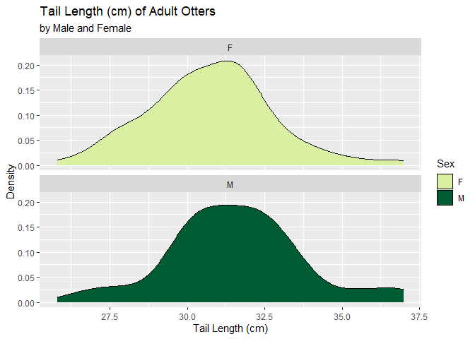<!-- -->

#### Statistical Analysis

With the predictor variable (`SEX`) being categorical and the outcome
variable (`mean_tail_length`) being quantitative, we will want to use a
Welch’s Two Sample t-test to determine if there is a difference in tail
sizes between sexes.

``` r
#creating data frame with only adult otters
seot_tail <- seot %>% 
  filter(FINAL_AGE > 4)

#Welch's Two Sample t-test
t.test(mean_tail_lgth ~ SEX, data = seot_tail)
```

    ## 
    ##  Welch Two Sample t-test
    ## 
    ## data:  mean_tail_lgth by SEX
    ## t = -2.5123, df = 106.21, p-value = 0.0135
    ## alternative hypothesis: true difference in means between group F and group M is not equal to 0
    ## 95 percent confidence interval:
    ##  -1.4564782 -0.1716543
    ## sample estimates:
    ## mean in group F mean in group M 
    ##        30.75315        31.56721

Report: The tail length of mature male otters (ages 5 and above) is
significantly longer than that of mature female otters (Welch Two Sample
t-test, t = -2.5123, df = 106.21, p-value = 0.0135).

## Total Length Analysis

### Total Length by Sex

#### Creating Plots

Just as with tail lengths, the total lengths of otters have been
reported to be different depending on the sex of the otter. Let’s see if
this is true within this dataset. First, let’s create a histogram that
displays the total lengths of the male and female otters.

We will again want to filter for the ages of the otters to be
representative of the adult population. According to the Alaska
Department of Fish and Game, female sea otters become mature around four
years of age and male sea otters become mature at age five (\[insert
citation here\]).

``` r
seot %>% 
  filter(SEX == "M"|SEX == "F") %>% 
  filter(FINAL_AGE > 4) %>% 
  ggplot(mapping = aes(x = body_lgth, fill = SEX)) + 
  scale_fill_viridis_d(name = "Sex", labels = c("Female", "Male"), option = "cividis") +
  geom_density() + 
  facet_wrap(~SEX, ncol = 1) + 
  labs(title = "", 
       x = "Total Body Length (cm)", 
       y = "Density")
```

    ## Warning: Removed 1792 rows containing non-finite values (`stat_density()`).

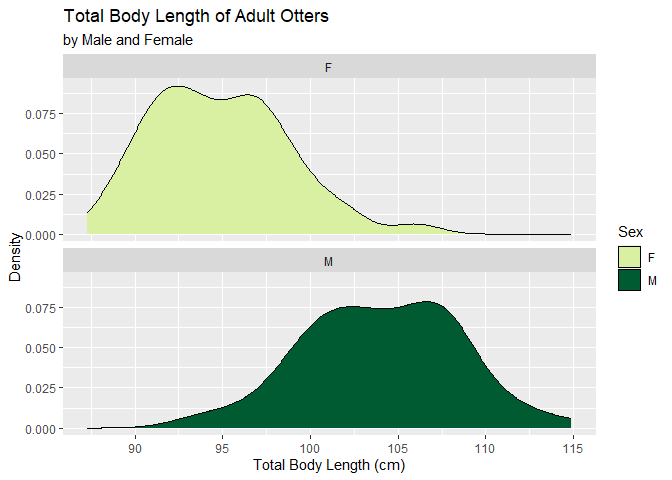<!-- -->

#### Statistical Analysis

With the predictor variable (`SEX`) being categorical and the outcome
variable (`body_lgth`) being quantitative, we will want to use a Welch’s
Two Sample t-test to determine if there is a difference in total lengths
between sexes.

``` r
#creating data frame with only adult otters
seot_body <- seot %>% 
  filter(FINAL_AGE > 4)

#Welch's Two Sample t-test
t.test(body_lgth ~ SEX, data = seot_body)
```

    ## 
    ##  Welch Two Sample t-test
    ## 
    ## data:  body_lgth by SEX
    ## t = -14.226, df = 101.57, p-value < 2.2e-16
    ## alternative hypothesis: true difference in means between group F and group M is not equal to 0
    ## 95 percent confidence interval:
    ##  -10.47586  -7.91192
    ## sample estimates:
    ## mean in group F mean in group M 
    ##        94.84545       104.03934

Report: The total length of mature male otters (ages 5 and above) is
significantly longer than that of mature female otters (Welch Two Sample
t-test, t = -14.226, df = 101.57, p-value \< 0.0005). Adult male otters
have an average body length (from nose to tip of tail) of 104.04 cm
while adult female otters have an average body length of 94.85 cm.

## Age Diversity Among Sexes With Observations

``` r
seot %>% 
  filter(SEX != "U") %>% 
  ggplot(aes(x=FINAL_AGE, fill = SEX)) + 
   geom_histogram(binwidth = 1) +
  xlim(0,25) + 
  facet_grid(~SEX)
```

    ## Warning: Removed 993 rows containing non-finite values (`stat_bin()`).

    ## Warning: Removed 4 rows containing missing values (`geom_bar()`).

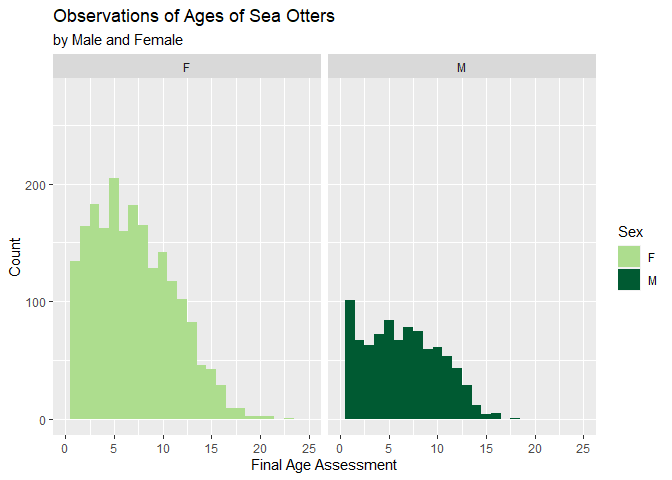<!-- -->

## Paw Width and Prey

The paw width data was collected in an effort to study the estimates of
prey size in relation to paw size for sea otter foraging studies. If we
are able to find the appropriate datasets, it would be interesting to
study the relationship between paw size and prey size.

The `PAW` variable is the width of the front paw at the widest point, as
measured in millimeters.

``` r
#can I reorder this by region? eastern to western?
seot$REGION <- factor(seot$REGION, levels = c("west_aleutians", "east_aleutians", "alaskan_peninsula", "southeast_alaska", "kodiak", "prince_william_sound"))

seot %>% 
  filter(PAW > 0) %>% 
  ggplot(mapping = aes(x = REGION, y = PAW, fill = REGION)) + 
  geom_boxplot() + 
  scale_fill_viridis_d(option = "magma") +
  scale_x_discrete(guide = guide_axis(n.dodge = 3))
```

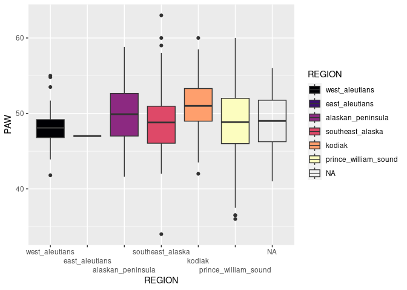<!-- -->

### Statistical Difference in Paw Size Between Sexes

``` r
seot %>% 
  filter(PAW > 0) %>% 
  ggplot(mapping = aes(x = PAW, fill = SEX)) +
  geom_histogram() + 
  facet_wrap(~SEX, ncol = 1) + 
  scale_fill_brewer(palette = "Set2") + 
  labs(x = "Paw Width (mm)", 
       y = "Count", 
       fill = "Sex")
```

    ## `stat_bin()` using `bins = 30`. Pick better value with `binwidth`.

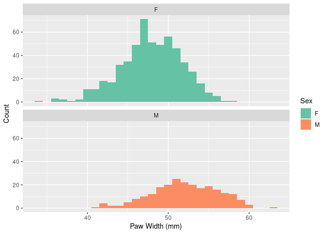<!-- -->

``` r
seot_paw <- seot %>% 
  filter(FINAL_AGE > 6)

pawaov <- aov(PAW ~ SEX, data = seot)
summary(pawaov)
```

    ##              Df Sum Sq Mean Sq F value Pr(>F)    
    ## SEX           1   2901  2901.5   192.3 <2e-16 ***
    ## Residuals   781  11787    15.1                   
    ## ---
    ## Signif. codes:  0 '***' 0.001 '**' 0.01 '*' 0.05 '.' 0.1 ' ' 1
    ## 3695 observations deleted due to missingness

## Canine and Sexing

The canine width was measured as a potential metric to sex the
individuals. We would like to see if there are any significant
differences between male canine lengths and female canine lengths (with
respect to the ages of the individuals).

The canine measurement is labeled under the `CAN_DIA` column, where a
measurement of the diameter of canine tooth (mm) was taken at the gum
line, which is the widest dimension. This canine width was measured with
a caliper and recorded to the nearest 0.1 mm.

### Creating Plots

Let’s create a plot to visualize the distribution of the data. This will
help us determine which type of statistical test will be the most
appropriate to use. First, we have to filter the `seot` dataset so that
we will be able to visualize the `CAN_DIA` and `SEX` variables that
we’re interested in.

``` r
seot_sex <- seot %>% 
  mutate(CAN_DIA = as.numeric(CAN_DIA)) %>% 
  filter(SEX != "U") %>% 
  filter(CAN_DIA > 0) %>% 
  filter(FINAL_AGE > 0)


#boxplot
ggplot(data = seot_sex, mapping = aes(x = SEX, y = CAN_DIA, fill = SEX)) + 
  geom_boxplot() + 
  scale_fill_brewer(palette = "Set2") +
  ylim(2,12) + 
  labs(title = "Canine Diameter by Sex",
       x = "Sex",
       y = "Diameter (mm)", 
       color = "Sex")
```

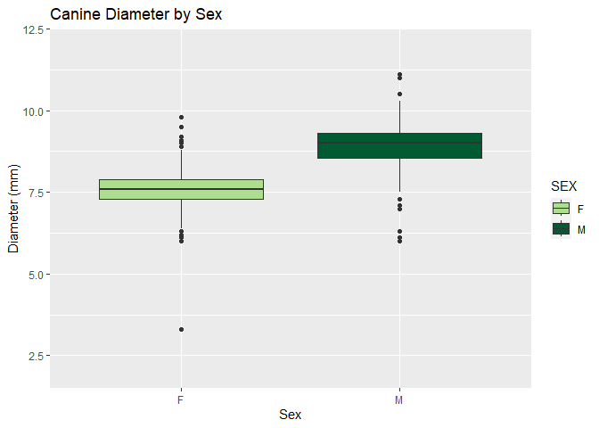<!-- -->

``` r
#scatterplot
ggplot(data = seot_sex, mapping = aes(x = FINAL_AGE, y = CAN_DIA, color = CAN_DIA)) + 
  geom_jitter() + 
  ylim(5,12) + 
  geom_smooth(color = "white") +
  facet_grid(~SEX) +
  scale_color_viridis_c(option = "magma") + 
  labs(title = "Canine Diameter by Sex",
       x = "Sex",
       y = "Diameter (mm)", 
       color = "Sex")
```

    ## `geom_smooth()` using method = 'loess' and formula = 'y ~ x'

    ## Warning: Removed 1 rows containing non-finite values (`stat_smooth()`).

    ## Warning: Removed 1 rows containing missing values (`geom_point()`).

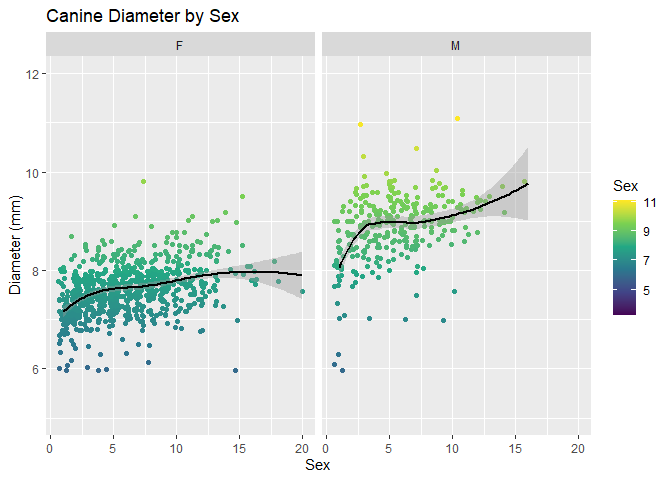<!-- -->

``` r
#interactive scatterplot
ggplotsex <- gapminder %>% 
  ggplot(data = seot_sex, mapping = aes(x = FINAL_AGE, y = CAN_DIA, color = SEX)) + 
  geom_jitter() + 
  ylim(2,12) + 
  scale_color_viridis_d(option = "inferno") +
  geom_smooth(color = "firebrick4") +
  facet_grid(~SEX) +
  labs(title = "Canine Diameter by Sex",
       x = "Sex",
       y = "Diameter (mm)", 
       color = "Sex")

#ggplotly(ggplotsex)
```

``` r
#histogram
ggplot(data = seot_sex, mapping = aes(x = CAN_DIA, fill = SEX)) +
  geom_histogram() + 
  facet_grid(~SEX) + 
  xlim(2,13) + 
  labs( title = "Canine Diameter of Sea Otters", 
        subtitle = "by Sex", 
        x = "Canine Diameter (mm)", 
        y = "Count", 
        fill = "Sex")
```

    ## `stat_bin()` using `bins = 30`. Pick better value with `binwidth`.

    ## Warning: Removed 4 rows containing missing values (`geom_bar()`).

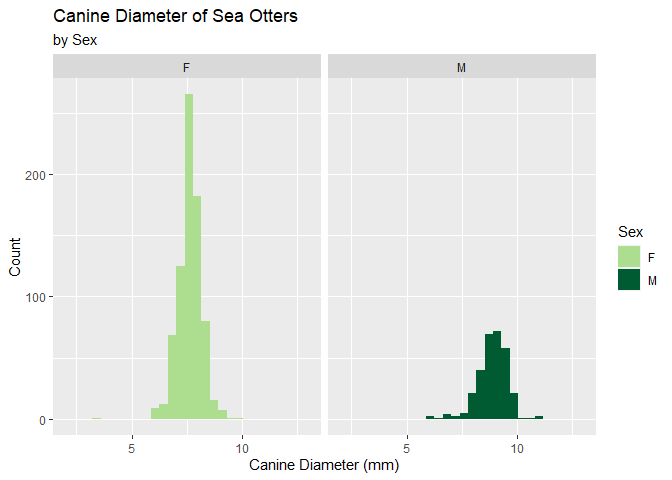<!-- -->

### Statistical Analysis

To truly determine if the measurement of the canine diameter at the gum
line is an appropriate metric by which to sex a sea otter, statistical
testing should be performed. As was seen above, the distribution of both
sexes appears to conform to a normal distribution. This suggests that we
can use a test that follows a two-sample t-test with equal variance.

``` r
t.test(CAN_DIA ~ SEX, data = seot_sex, var.equal = TRUE)
```

    ## 
    ##  Two Sample t-test
    ## 
    ## data:  CAN_DIA by SEX
    ## t = -32.662, df = 1063, p-value < 2.2e-16
    ## alternative hypothesis: true difference in means between group F and group M is not equal to 0
    ## 95 percent confidence interval:
    ##  -1.349716 -1.196737
    ## sample estimates:
    ## mean in group F mean in group M 
    ##        7.604700        8.877926

The diameter of the canine tooth for female sea otters is significantly
smaller than that of the male otters (Two Sample t-test; t = -19.164, df
= 1132, p-value \< 2.2e-16). This would mean that this would be an
appropriate metric by which to determine the sex of an unknown sea
otter.

## Baculum Length and Aging

The baculum length was measured on males a way to estimate age-class of
the animal. We would like to perform statistical analysis on if there is
a difference in baculum length in males of various ages and if this is
an appropriate metric by which to estimate the age of male individuals.

The baculum measurement is found under the `BACULA_LGTH` column with the
unit of measurement being centimeters. The baculum length was measure
using a tape measure and feeling the ends of the bone and recorded to
the nearest 0.5 cm.

### Creating Plots

Let’s create a plot to visualize the distribution of the data. This will
help us determine which type of statistical test will be the most
appropriate to use. First, we have to filter the `seot` dataset so that
we will be able to visualize the `BACULA_LGTH` and `FINAL_AGE` variables
that we’re interested in.

``` r
seot_baculum <- seot %>% 
  filter(SEX == "M") %>% 
  mutate(FINAL_AGE = as.numeric(FINAL_AGE)) %>% 
  filter(FINAL_AGE > 0) %>% 
  mutate(BACULA_LGTH = as.numeric(BACULA_LGTH)) %>% 
  filter(BACULA_LGTH > 0)

ggplot(data = seot_baculum, mapping = aes(x = FINAL_AGE, y = BACULA_LGTH, color = FINAL_AGE)) +
  geom_jitter() + 
  scale_color_viridis_c(option = "magma") +
  geom_smooth(color = "green") +
  labs(title = "Baculum Length by Age", 
       x = "Final Age", 
       y = "Bacula Length (cm)", 
       color = "Age")
```

    ## `geom_smooth()` using method = 'loess' and formula = 'y ~ x'

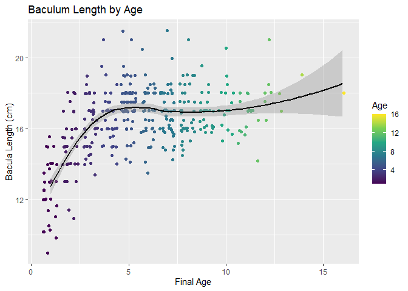<!-- -->

### Statistical Analysis

The statistics that we find with the Tukey HSD test that we performed is
a little convoluted, so let’s tidy this up and group ages into
categories and try again.

``` r
#create dataframe that includes the variables we want
seot_baculum <- seot_baculum %>% 
  mutate(FINAL_AGE = as.factor(FINAL_AGE)) %>% 
  select(BACULA_LGTH, FINAL_AGE) 

#creating the ANOVA test
aovbaculum <- aov(BACULA_LGTH~FINAL_AGE, data = seot_baculum)
summary(aovbaculum)
```

    ##              Df Sum Sq Mean Sq F value Pr(>F)    
    ## FINAL_AGE    14    666   47.57    23.1 <2e-16 ***
    ## Residuals   369    760    2.06                   
    ## ---
    ## Signif. codes:  0 '***' 0.001 '**' 0.01 '*' 0.05 '.' 0.1 ' ' 1

``` r
#Tukey HSD Test
TukeyHSD(aovbaculum)
```

    ##   Tukey multiple comparisons of means
    ##     95% family-wise confidence level
    ## 
    ## Fit: aov(formula = BACULA_LGTH ~ FINAL_AGE, data = seot_baculum)
    ## 
    ## $FINAL_AGE
    ##              diff         lwr        upr     p adj
    ## 2-1    2.48931452  1.25440609  3.7242229 0.0000000
    ## 3-1    3.70806452  2.52209858  4.8940305 0.0000000
    ## 4-1    4.07865275  2.86174772  5.2955578 0.0000000
    ## 5-1    4.90116796  3.81093208  5.9914039 0.0000000
    ## 6-1    4.40165426  3.22253921  5.5807693 0.0000000
    ## 7-1    4.34556452  3.21646455  5.4746645 0.0000000
    ## 8-1    4.41482127  3.22167672  5.6079658 0.0000000
    ## 9-1    4.38206452  3.06482886  5.6993002 0.0000000
    ## 10-1   4.81806452  3.27681571  6.3593133 0.0000000
    ## 11-1   4.26473118  2.72348237  5.8059800 0.0000000
    ## 12-1   4.98306452  3.03982301  6.9263060 0.0000000
    ## 13-1   4.95806452  1.38302012  8.5331089 0.0003057
    ## 14-1   6.45806452  1.47938172 11.4367473 0.0011769
    ## 16-1   5.45806452  0.47938172 10.4367473 0.0169371
    ## 3-2    1.21875000  0.04303368  2.3944663 0.0336807
    ## 4-2    1.58933824  0.38242004  2.7962564 0.0008820
    ## 5-2    2.41185345  1.33277608  3.4909308 0.0000000
    ## 6-2    1.91233974  0.74353438  3.0811451 0.0000046
    ## 7-2    1.85625000  0.73792071  2.9745793 0.0000030
    ## 8-2    1.92550676  0.74254962  3.1084639 0.0000054
    ## 9-2    1.89275000  0.58473493  3.2007651 0.0001178
    ## 10-2   2.32875000  0.79537413  3.8621259 0.0000360
    ## 11-2   1.77541667  0.24204080  3.3087925 0.0079063
    ## 12-2   2.49375000  0.55674685  4.4307532 0.0013545
    ## 13-2   2.46875000 -1.10290734  6.0404073 0.5461845
    ## 14-2   3.96875000 -1.00750120  8.9450012 0.2950481
    ## 16-2   2.96875000 -2.00750120  7.9450012 0.7748084
    ## 4-3    0.37058824 -0.78620384  1.5273803 0.9989533
    ## 5-3    1.19310345  0.17039902  2.2158079 0.0070639
    ## 6-3    0.69358974 -0.42338043  1.8105599 0.7205652
    ## 7-3    0.63750000 -0.42653796  1.7015380 0.7693689
    ## 8-3    0.70675676 -0.42501352  1.8385270 0.7123695
    ## 9-3    0.67400000 -0.58791118  1.9359112 0.8871835
    ## 10-3   1.11000000 -0.38424159  2.6042416 0.4170397
    ## 11-3   0.55666667 -0.93757493  2.0509083 0.9948619
    ## 12-3   1.27500000 -0.63117355  3.1811735 0.6031593
    ## 13-3   1.25000000 -2.30503200  4.8050320 0.9971596
    ## 14-3   2.75000000 -2.21433202  7.7143320 0.8561537
    ## 16-3   1.75000000 -3.21433202  6.7143320 0.9970828
    ## 5-4    0.82251521 -0.23591145  1.8809419 0.3381666
    ## 6-4    0.32300151 -0.82676587  1.4727689 0.9997636
    ## 7-4    0.26691176 -0.83150503  1.3653286 0.9999581
    ## 8-4    0.33616852 -0.82798208  1.5003191 0.9996749
    ## 9-4    0.30341176 -0.98761979  1.5944433 0.9999722
    ## 10-4   0.73941176 -0.77950252  2.2583260 0.9429105
    ## 11-4   0.18607843 -1.33283585  1.7049927 1.0000000
    ## 12-4   0.90441176 -1.02116354  2.8299871 0.9571105
    ## 13-4   0.87941176 -2.68606088  4.4448844 0.9999498
    ## 14-4   2.37941176 -2.59240230  7.3512258 0.9500976
    ## 16-4   1.37941176 -3.59240230  6.3512258 0.9997956
    ## 6-5   -0.49951370 -1.51426562  0.5152382 0.9377597
    ## 7-5   -0.55560345 -1.51178119  0.4005743 0.8065949
    ## 8-5   -0.48634669 -1.51736709  0.5446737 0.9555781
    ## 9-5   -0.51910345 -1.69150223  0.6532953 0.9739241
    ## 10-5  -0.08310345 -1.50256005  1.3363532 1.0000000
    ## 11-5  -0.63643678 -2.05589338  0.7830198 0.9709339
    ## 12-5   0.08189655 -1.76623675  1.9300299 1.0000000
    ## 13-5   0.05689655 -3.46735537  3.5811485 1.0000000
    ## 14-5   1.55689655 -3.38544009  6.4992332 0.9991308
    ## 16-5   0.55689655 -4.38544009  5.4992332 1.0000000
    ## 7-6   -0.05608974 -1.11248640  1.0003069 1.0000000
    ## 8-6    0.01316701 -1.11142228  1.1377563 1.0000000
    ## 9-6   -0.01958974 -1.27506453  1.2358850 1.0000000
    ## 10-6   0.41641026 -1.07239969  1.9052202 0.9997754
    ## 11-6  -0.13692308 -1.62573302  1.3518869 1.0000000
    ## 12-6   0.58141026 -1.32050843  2.4833289 0.9993783
    ## 13-6   0.55641026 -2.99634214  4.1091627 0.9999998
    ## 14-6   2.05641026 -2.90628956  7.0191101 0.9856237
    ## 16-6   1.05641026 -3.90628956  6.0191101 0.9999919
    ## 8-7    0.06925676 -1.00277659  1.1412901 1.0000000
    ## 9-7    0.03650000 -1.17212374  1.2451237 1.0000000
    ## 10-7   0.47250000 -0.97702043  1.9220204 0.9987343
    ## 11-7  -0.08083333 -1.53035376  1.3686871 1.0000000
    ## 12-7   0.63750000 -1.23382283  2.5088228 0.9979648
    ## 13-7   0.61250000 -2.92396774  4.1489677 0.9999994
    ## 14-7   2.11250000 -2.83855483  7.0635548 0.9812164
    ## 16-7   1.11250000 -3.83855483  6.0635548 0.9999841
    ## 9-8   -0.03275676 -1.30141689  1.2359034 1.0000000
    ## 10-8   0.40324324 -1.09670231  1.9031888 0.9998589
    ## 11-8  -0.15009009 -1.65003564  1.3498555 1.0000000
    ## 12-8   0.56824324 -1.34240490  2.4788914 0.9995444
    ## 13-8   0.54324324 -3.01418999  4.1006765 0.9999999
    ## 14-8   2.04324324 -2.92280862  7.0092951 0.9865410
    ## 16-8   1.04324324 -3.92280862  6.0092951 0.9999931
    ## 10-9   0.43600000 -1.16442260  2.0364226 0.9998350
    ## 11-9  -0.11733333 -1.71775594  1.4830893 1.0000000
    ## 12-9   0.60100000 -1.38950048  2.5915005 0.9994593
    ## 13-9   0.57600000 -3.02495086  4.1769509 0.9999998
    ## 14-9   2.07600000 -2.92131798  7.0733180 0.9852834
    ## 16-9   1.07600000 -3.92131798  6.0733180 0.9999907
    ## 11-10 -0.55333333 -2.34266020  1.2359935 0.9992925
    ## 12-10  0.16500000 -1.98032755  2.3103275 1.0000000
    ## 13-10  0.14000000 -3.54879183  3.8287918 1.0000000
    ## 14-10  1.64000000 -3.42098064  6.7009806 0.9988134
    ## 16-10  0.64000000 -4.42098064  5.7009806 1.0000000
    ## 12-11  0.71833333 -1.42699421  2.8636609 0.9983079
    ## 13-11  0.69333333 -2.99545850  4.3821252 0.9999983
    ## 14-11  2.19333333 -2.86764731  7.2543140 0.9784031
    ## 16-11  1.19333333 -3.86764731  6.2543140 0.9999710
    ## 13-12 -0.02500000 -3.89900631  3.8490063 1.0000000
    ## 14-12  1.47500000 -3.72252487  6.6725249 0.9997341
    ## 16-12  0.47500000 -4.72252487  5.6725249 1.0000000
    ## 14-13  1.50000000 -4.50158476  7.5015848 0.9999411
    ## 16-13  0.50000000 -5.50158476  6.5015848 1.0000000
    ## 16-14 -1.00000000 -7.93003315  5.9300332 0.9999999

Now we can more clearly see how the baculum length relates to ages.

``` r
#create dataframe that includes the variables we want
seot_baculum_2 <- seot %>% 
  filter(SEX == "M") %>% 
  mutate(AGE_CATEGORY = as.numeric(AGE_CATEGORY)) %>% 
  filter(AGE_CATEGORY > 0) %>% 
  mutate(BACULA_LGTH = as.numeric(BACULA_LGTH)) %>% 
  filter(BACULA_LGTH > 0)

seot_baculum_2 <- seot_baculum_2 %>% 
  mutate(AGE_CATEGORY = as.factor(AGE_CATEGORY)) %>% 
  select(BACULA_LGTH, AGE_CATEGORY) 

#creating the ANOVA test
aovbaculum2 <- aov(BACULA_LGTH~AGE_CATEGORY, data = seot_baculum_2)
summary(aovbaculum2)
```

    ##               Df Sum Sq Mean Sq F value Pr(>F)    
    ## AGE_CATEGORY   2  591.6  295.79     112 <2e-16 ***
    ## Residuals    457 1207.4    2.64                   
    ## ---
    ## Signif. codes:  0 '***' 0.001 '**' 0.01 '*' 0.05 '.' 0.1 ' ' 1

``` r
#Tukey HSD Test
TukeyHSD(aovbaculum2)
```

    ##   Tukey multiple comparisons of means
    ##     95% family-wise confidence level
    ## 
    ## Fit: aov(formula = BACULA_LGTH ~ AGE_CATEGORY, data = seot_baculum_2)
    ## 
    ## $AGE_CATEGORY
    ##             diff        lwr       upr     p adj
    ## 7-1.5  2.9650718  2.4911866 3.4389571 0.0000000
    ## 13-1.5 3.2243750  2.4249551 4.0237949 0.0000000
    ## 13-7   0.2593032 -0.4467105 0.9653168 0.6635316

REPORT: The baculum length of individuals who are ages 1 - 7 are
significantly different than one another (one-way ANOVA, F_2,457, = 112,
P \< 0.005). In a Tukey HSD post-hoc test, the baculum length of
individuals who were from ages 7 to 13 did not differ significantly
(refer to Tukey multiple comparisons of means). This would suggest that
you could use the baculum length to estimate the age of individuals who
were 7 years or younger, but not for individuals who are over 7 years
old.

## Creating a Model of Baculum Length by Age

``` r
#install.packages("tidymodels")
#library(tidymodels)
```

For each additional year, the male otter’s baculum is expected to grow
by 0.22 cm. For otters that are 0 (aka newborn), the baculum length is
expected to be 14.33 cm.

``` r
#first, we need to filter out the na values (that being -9.0)
seot_bacula <- seot %>% 
  filter(BACULA_LGTH > 0)

#now, let's create the linear model comparing final age to baculum length
#seot_model_baculum <- linear_reg() %>%
  #set_engine("lm") %>% 
  #fit(BACULA_LGTH ~ FINAL_AGE, data = seot_bacula)

#let's tidy this model
#seot_model_baculum %>% tidy()
```

``` r
#augmenting the baculum data
#seot_model_baculum_augment <- augment(seot_model_baculum$fit)

#ggplot(seot_model_baculum_augment, mapping = aes(x = .fitted, y = .resid)) +
  #geom_jitter(alpha = 0.75) +
  #geom_smooth(color = "black") +
  #labs(x = "Predicted Age", y = "Residuals")

#assessing the r-squared value
#glance(seot_model_baculum)$adj.r.squared
```

## Weight by Tail Length

\[insert background information here\]

### Creating Plots

``` r
#creating a plot that visualizes the relationship between weight and tail length
ggplot(data = seot, mapping = aes(x = WEIGHT, y = mean_tail_lgth, color = WEIGHT)) + 
  geom_point(alpha = 0.75) +
  scale_color_viridis_c(option = "magma") +
  ylim(15, 40) + 
  xlim(0, 45) + 
  geom_smooth(color = "white") + 
  labs(x = "Weight (kg)", 
       y = "Mean Tail Length (cm)", 
       color = "Weight")
```

    ## `geom_smooth()` using method = 'gam' and formula = 'y ~ s(x, bs = "cs")'

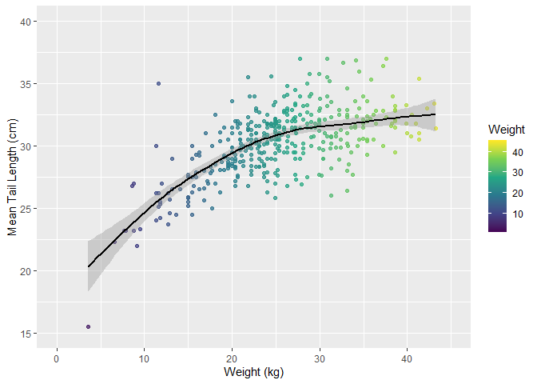<!-- -->

### Statistical Analysis

With the tail length and the weight of the otter being both quantitative
variables, we should use a simple regression statistical test to
determine if there is a statistical significance.

``` r
#creating the linear model
weight.tail.lm <- lm(mean_tail_lgth ~ WEIGHT, data = seot)

summary(weight.tail.lm)
```

    ## 
    ## Call:
    ## lm(formula = mean_tail_lgth ~ WEIGHT, data = seot)
    ## 
    ## Residuals:
    ##     Min      1Q  Median      3Q     Max 
    ## -9.7535 -1.3674  0.0441  1.4192  7.8818 
    ## 
    ## Coefficients:
    ##             Estimate Std. Error t value Pr(>|t|)    
    ## (Intercept) 24.41433    0.38995   62.61   <2e-16 ***
    ## WEIGHT       0.23309    0.01483   15.72   <2e-16 ***
    ## ---
    ## Signif. codes:  0 '***' 0.001 '**' 0.01 '*' 0.05 '.' 0.1 ' ' 1
    ## 
    ## Residual standard error: 2.141 on 398 degrees of freedom
    ##   (4078 observations deleted due to missingness)
    ## Multiple R-squared:  0.383,  Adjusted R-squared:  0.3814 
    ## F-statistic:   247 on 1 and 398 DF,  p-value: < 2.2e-16

REPORT: There is a significant relationship (p \< 0.001) between tail
length and weight of adult otters (R2 = 2.14 ± 0.014), with a 0.23-mm
increase in reported tail length for every year increase in the otter’s
age.

The regression equation is: tail length = 24.41 + 0.23(weight) ± 0.014.

## Recapture Data

## Spatial Analysis

We want to determine if there is a difference of morphometric
measurements on a spatial scale.

### Introduction

First, let’s see if there is a size difference between Prince William’s
Sound and the Western Aleutians.

``` r
seot %>% 
  filter(REGION == "west_aleutians") %>% 
  count(LOCATION)
```

    ##               LOCATION    n
    ## 1                 adak  508
    ## 2           adak - boi   20
    ## 3   adak - clam lagoon   41
    ## 4    adak - finger bay    9
    ## 5    adak - gannet rks   12
    ## 6     adak - kuluk bay   25
    ## 7   adak - lucky point   11
    ## 8  adak - sweeper cove   15
    ## 9    adak - zeto point    7
    ## 10            amchitka 1240
    ## 11                attu    2
    ## 12   attu - casco cove    3
    ## 13 attu - massacre bay   18
    ## 14      delarof island  144
    ## 15              kanaga  328
    ## 16               kiska   14
    ## 17       nitzki island    1
    ## 18              shemya    8
    ## 19              tanaga  608

``` r
seot %>% 
  count(REGION)
```

    ##                 REGION    n
    ## 1       west_aleutians 3014
    ## 2       east_aleutians    1
    ## 3    alaskan_peninsula   81
    ## 4     southeast_alaska  174
    ## 5               kodiak  148
    ## 6 prince_william_sound  985
    ## 7                 <NA>   75

``` r
#creating a dataset that includes only the west aleutians and prince williams sound
seot_pws_wa <- seot %>% 
  filter(REGION == "west_aleutians"|REGION == "prince_william_sound") %>% 
  filter(WEIGHT > 0) %>% 
  filter(AGE_CATEGORY > -1) %>% 
  filter(FINAL_AGE > -1)

#mapping weight by age category between the two locations (histogram)
seot_pws_wa %>% 
  filter(AGE_CATEGORY > -1) %>% 
  filter(FINAL_AGE > -1) %>% 
  ggplot(data = seot_pws_wa, mapping = aes(x = WEIGHT), color = REGION) + 
  geom_histogram() + 
  scale_color_viridis_d(option = "magma") +
  facet_wrap(AGE_CATEGORY~REGION, ncol = 2) + 
  labs(title = "Weight by Location", 
       x = "Weight (lbs)", 
       y = "Count")
```

    ## `stat_bin()` using `bins = 30`. Pick better value with `binwidth`.

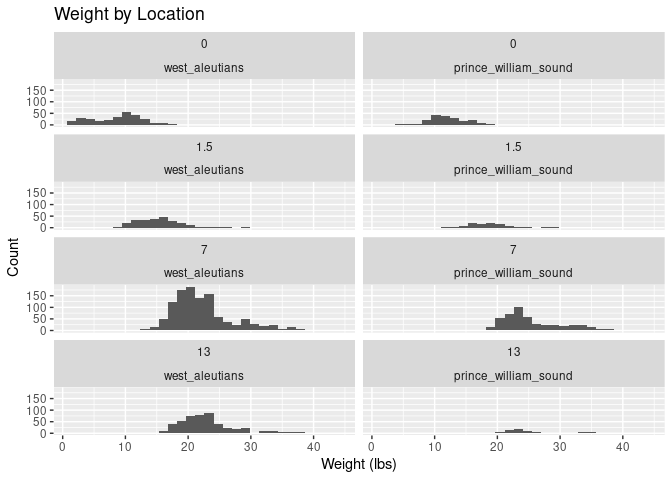<!-- -->

``` r
#mapping weight by age category between the two locations (scatterplot)
#how do I color this differently???
seot_pws_wa %>% 
  filter(FINAL_AGE > -1) %>% 
  ggplot(data = seot_pws_wa, mapping = aes(x = FINAL_AGE, y = WEIGHT, color = FINAL_AGE)) + 
  geom_jitter() +
  scale_color_viridis_c(option = "plasma") +
  facet_wrap(~REGION) +
  geom_smooth(color = "white") +
  labs(x = "Final Age", 
       y = "Weight (lbs)", 
       color = "Final Age")
```

    ## `geom_smooth()` using method = 'gam' and formula = 'y ~ s(x, bs = "cs")'

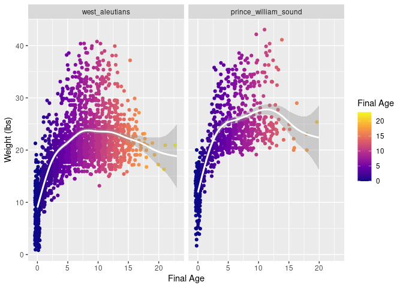<!-- -->

To statistically test this, we would want to perform an ANOVA test.

### Weights of Otters vs. Different Regions

Let’s compare the weight differences of otters that are considered to be
adults (age \> 4) between the different regions.

``` r
#creating a dataset that includes only the age classes that we want (7)
seot_adult <- seot %>% 
  filter(FINAL_AGE > 4) %>% 
  filter(WEIGHT > 0)

#factor reordering the locations from west to east
seot_adult$REGION <- factor(seot_adult$REGION, levels = c("west_aleutians", "east_aleutians", "alaskan_peninsula", "southeast_alaska", "kodiak", "prince_william_sound"))

#mapping
#fix the NA issue? 
seot_adult %>% 
  ggplot(mapping = aes(x = REGION, y = WEIGHT, fill = REGION)) + 
  geom_boxplot() + 
  theme(axis.text.x = element_blank()) +
  scale_fill_viridis_d(option = "plasma")+
  theme_gray()+
   theme(axis.text.x=element_blank(),
        axis.ticks.x=element_blank()) + 
  labs(title = "", 
       x = "Region", 
       y = "Weight (km))", 
       fill = "Region")
```

<!-- -->
“west_aleutians”, “east_aleutians”, “alaskan_peninsula”,

``` r
#creating the ANOVA test
aovspatial2 <- aov(WEIGHT~REGION, data = seot_adult)
summary(aovspatial2)
```

    ##               Df Sum Sq Mean Sq F value Pr(>F)    
    ## REGION         5   9809  1961.8   74.94 <2e-16 ***
    ## Residuals   1941  50809    26.2                   
    ## ---
    ## Signif. codes:  0 '***' 0.001 '**' 0.01 '*' 0.05 '.' 0.1 ' ' 1
    ## 47 observations deleted due to missingness

``` r
#Tukey HSD Test
TukeyHSD(aovspatial2)
```

    ##   Tukey multiple comparisons of means
    ##     95% family-wise confidence level
    ## 
    ## Fit: aov(formula = WEIGHT ~ REGION, data = seot_adult)
    ## 
    ## $REGION
    ##                                              diff        lwr       upr
    ## east_aleutians-west_aleutians           9.1302121  -5.469668 23.730092
    ## alaskan_peninsula-west_aleutians        7.9656960   5.314884 10.616508
    ## southeast_alaska-west_aleutians         7.0851572   5.505131  8.665183
    ## kodiak-west_aleutians                   7.2968788   5.010558  9.583199
    ## prince_william_sound-west_aleutians     3.2037061   2.385739  4.021674
    ## alaskan_peninsula-east_aleutians       -1.1645161 -15.992586 13.663554
    ## southeast_alaska-east_aleutians        -2.0450549 -16.719568 12.629458
    ## kodiak-east_aleutians                  -1.8333333 -16.600598 12.933932
    ## prince_william_sound-east_aleutians    -5.9265060 -20.538622  8.685610
    ## southeast_alaska-alaskan_peninsula     -0.8805388  -3.915610  2.154532
    ## kodiak-alaskan_peninsula               -0.6688172  -4.124600  2.786965
    ## prince_william_sound-alaskan_peninsula -4.7619899  -7.479386 -2.044593
    ## kodiak-southeast_alaska                 0.2117216  -2.510798  2.934241
    ## prince_william_sound-southeast_alaska  -3.8814511  -5.570806 -2.192096
    ## prince_william_sound-kodiak            -4.0931727  -6.456370 -1.729976
    ##                                            p adj
    ## east_aleutians-west_aleutians          0.4764345
    ## alaskan_peninsula-west_aleutians       0.0000000
    ## southeast_alaska-west_aleutians        0.0000000
    ## kodiak-west_aleutians                  0.0000000
    ## prince_william_sound-west_aleutians    0.0000000
    ## alaskan_peninsula-east_aleutians       0.9999230
    ## southeast_alaska-east_aleutians        0.9987238
    ## kodiak-east_aleutians                  0.9992710
    ## prince_william_sound-east_aleutians    0.8571062
    ## southeast_alaska-alaskan_peninsula     0.9624668
    ## kodiak-alaskan_peninsula               0.9939175
    ## prince_william_sound-alaskan_peninsula 0.0000093
    ## kodiak-southeast_alaska                0.9999267
    ## prince_william_sound-southeast_alaska  0.0000000
    ## prince_william_sound-kodiak            0.0000125

Statistically differing prince_william_sound-alaskan_peninsula
-4.7619899 -7.571534 -1.952446 0.0000128
west_aleutians-alaskan_peninsula -7.9656960 -10.706398 -5.224994
0.0000000 prince_william_sound-kodiak -4.0931727 -6.536506 -1.649839
0.0000171 west_aleutians-kodiak -7.2968788 -9.660729 -4.933029 0.0000000
prince_william_sound-lower_cook_inlet -5.6967188 -8.019035 -3.374402
0.0000000 west_aleutians-lower_cook_inlet -8.9004249 -11.138965
-6.661885 0.0000000 southeast_alaska-prince_william_sound 3.8814511
2.134809 5.628093 0.0000000 west_aleutians-prince_william_sound
-3.2037061 -4.049411 -2.358001 0.0000000 west_aleutians-southeast_alaska
-7.0851572 -8.718763 -5.451552 0.0000000

Not significant: west_aleutians-east_aleutians -9.1302121 -24.225179
5.964754 0.5583097

REPORT: The Western Aleutian otters who were older than 6 years of age
were significantly heavier than otters that were captured in the south
east region of Alaska (Alaskan Peninsula, Southeast Alaska, Prince
William Sound, Lower Cook Inlet, Kodiak Island) (one-way ANOVA, F_6,1472
= 43.37, P \< 0.005).

### Tail Length by Area

#### Creating Plots

We know that sea otter tail lengths are known to be morphometrically
different by sex, as was shown above. We now want to investigate if
there are any spatial differences between otter tail lengths by their
location.

To break down the morphometric differences between the otters, let’s
begin by looking at the tail lengths of the individuals. Let’s create a
histogram that displays the tail lengths of the otters at differing
locations.

``` r
#first, let's factor reorder the areas so their in order of the eastern-most location to the western-most location
seot_taillength <- seot %>% 
  filter(AREA == "andreanof_islands"|AREA == "eastern_alaskan_peninsula"|AREA == "kachemak_bay"|AREA == "northern_southeast_alaska"|AREA == "rat_islands"|AREA == "southern_southeast_alaska"|AREA == "western_alaskan_peninsula"|AREA == "western_prince_william_sound") %>% 
  mutate(AREA = fct_relevel(AREA, c("andreanof_islands", "western_alaskan_peninsula", "southern_southeast_alaska", "northern_southeast_alaska", "eastern_alaskan_peninsula", "kachemak_bay", "western_prince_william_sound")))

#boxplot of tail length by area
seot_taillength %>% 
  ggplot(mapping = aes(x = AREA, y = mean_tail_lgth, fill = AREA)) +
  geom_boxplot() + 
  theme(axis.text.x = element_blank()) +
  scale_fill_viridis_d(option = "plasma")+
  theme_gray()+
   theme(axis.text.x=element_blank(),
        axis.ticks.x=element_blank()) + 
  labs(title = "", 
       x = "Area", 
       y = "Tail Length (cm)", 
       fill = "Area")
```

    ## Warning: Removed 3524 rows containing non-finite values (`stat_boxplot()`).

<!-- -->

#### Statistical Analysis

With the predictor variable (`AREA`) being categorical and the outcome
variable (`mean_tail_length`) being quantitative, we will want to use a
ANOVA to determine if there is a difference in tail sizes between sexes.

``` r
tailareaaov <- aov(mean_tail_lgth ~ AREA, data = seot)
summary(tailareaaov)
```

    ##              Df Sum Sq Mean Sq F value   Pr(>F)    
    ## AREA          7  505.3   72.19   11.59 2.08e-13 ***
    ## Residuals   394 2455.0    6.23                     
    ## ---
    ## Signif. codes:  0 '***' 0.001 '**' 0.01 '*' 0.05 '.' 0.1 ' ' 1
    ## 4076 observations deleted due to missingness

``` r
TukeyHSD(tailareaaov)
```

    ##   Tukey multiple comparisons of means
    ##     95% family-wise confidence level
    ## 
    ## Fit: aov(formula = mean_tail_lgth ~ AREA, data = seot)
    ## 
    ## $AREA
    ##                                                              diff          lwr
    ## eastern_alaskan_peninsula-andreanof_islands             0.6075000 -1.475645414
    ## kachemak_bay-andreanof_islands                          0.6265625 -1.194121952
    ## northern_southeast_alaska-andreanof_islands            -0.1925000 -2.275645414
    ## rat_islands-andreanof_islands                          -0.7182143 -2.734143683
    ## southern_southeast_alaska-andreanof_islands             1.4250000 -0.629009078
    ## western_alaskan_peninsula-andreanof_islands             1.7169118 -0.311041175
    ## western_prince_william_sound-andreanof_islands         -1.4053105 -3.075340378
    ## kachemak_bay-eastern_alaskan_peninsula                  0.0190625 -1.664007844
    ## northern_southeast_alaska-eastern_alaskan_peninsula    -0.8000000 -2.764008331
    ## rat_islands-eastern_alaskan_peninsula                  -1.3257143 -3.218280069
    ## southern_southeast_alaska-eastern_alaskan_peninsula     0.8175000 -1.115577133
    ## western_alaskan_peninsula-eastern_alaskan_peninsula     1.1094118 -0.795956188
    ## western_prince_william_sound-eastern_alaskan_peninsula -2.0128105 -3.531636927
    ## northern_southeast_alaska-kachemak_bay                 -0.8190625 -2.502132844
    ## rat_islands-kachemak_bay                               -1.3447768 -2.943902266
    ## southern_southeast_alaska-kachemak_bay                  0.7984375 -0.848433551
    ## western_alaskan_peninsula-kachemak_bay                  1.0903493 -0.523907249
    ## western_prince_william_sound-kachemak_bay              -2.0318730 -3.164229307
    ## rat_islands-northern_southeast_alaska                  -0.5257143 -2.418280069
    ## southern_southeast_alaska-northern_southeast_alaska     1.6175000 -0.315577133
    ## western_alaskan_peninsula-northern_southeast_alaska     1.9094118  0.004043812
    ## western_prince_william_sound-northern_southeast_alaska -1.2128105 -2.731636927
    ## southern_southeast_alaska-rat_islands                   2.1432143  0.282767102
    ## western_alaskan_peninsula-rat_islands                   2.4351261  0.603486469
    ## western_prince_william_sound-rat_islands               -0.6870962 -2.112336630
    ## western_alaskan_peninsula-southern_southeast_alaska     0.2919118 -1.581557080
    ## western_prince_william_sound-southern_southeast_alaska -2.8303105 -4.308922077
    ## western_prince_william_sound-western_alaskan_peninsula -3.1222222 -4.564419211
    ##                                                               upr     p adj
    ## eastern_alaskan_peninsula-andreanof_islands             2.6906454 0.9869729
    ## kachemak_bay-andreanof_islands                          2.4472470 0.9665152
    ## northern_southeast_alaska-andreanof_islands             1.8906454 0.9999930
    ## rat_islands-andreanof_islands                           1.2977151 0.9595637
    ## southern_southeast_alaska-andreanof_islands             3.4790091 0.4075888
    ## western_alaskan_peninsula-andreanof_islands             3.7448647 0.1663992
    ## western_prince_william_sound-andreanof_islands          0.2647195 0.1723570
    ## kachemak_bay-eastern_alaskan_peninsula                  1.7021328 1.0000000
    ## northern_southeast_alaska-eastern_alaskan_peninsula     1.1640083 0.9190439
    ## rat_islands-eastern_alaskan_peninsula                   0.5668515 0.3945064
    ## southern_southeast_alaska-eastern_alaskan_peninsula     2.7505771 0.9027529
    ## western_alaskan_peninsula-eastern_alaskan_peninsula     3.0147797 0.6379129
    ## western_prince_william_sound-eastern_alaskan_peninsula -0.4939840 0.0016517
    ## northern_southeast_alaska-kachemak_bay                  0.8640078 0.8162870
    ## rat_islands-kachemak_bay                                0.2543487 0.1729960
    ## southern_southeast_alaska-kachemak_bay                  2.4453086 0.8191896
    ## western_alaskan_peninsula-kachemak_bay                  2.7046058 0.4440499
    ## western_prince_william_sound-kachemak_bay              -0.8995166 0.0000022
    ## rat_islands-northern_southeast_alaska                   1.3668515 0.9902432
    ## southern_southeast_alaska-northern_southeast_alaska     3.5505771 0.1779910
    ## western_alaskan_peninsula-northern_southeast_alaska     3.8147797 0.0490780
    ## western_prince_william_sound-northern_southeast_alaska  0.3060160 0.2282411
    ## southern_southeast_alaska-rat_islands                   4.0036615 0.0116252
    ## western_alaskan_peninsula-rat_islands                   4.2667656 0.0015691
    ## western_prince_william_sound-rat_islands                0.7381443 0.8234823
    ## western_alaskan_peninsula-southern_southeast_alaska     2.1653806 0.9997575
    ## western_prince_william_sound-southern_southeast_alaska -1.3516988 0.0000003
    ## western_prince_william_sound-western_alaskan_peninsula -1.6800252 0.0000000

REPORT: \[figure this out i guess\]
