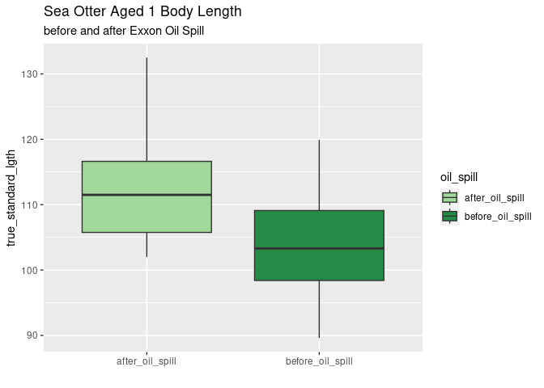
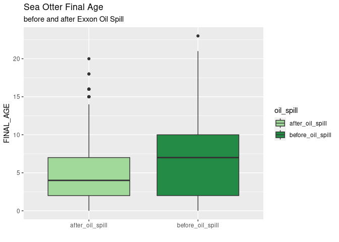

Oil Spill Analysis
================
Autumn Pauly and Asher Panikian

# Background Information

These data within the USFWS and USGS dataset was collected primarily
during experimental harvests primarily conducted in the 1960’s and
1970’s, or during sea otter captures related to USFWS and USGS sea otter
sampling and tagging studies conducted from the late 1980’s up to and
including 2019, or recovered dead during the 1989 Exxon Valdez Oil spill
(EVOS).

We were interested to see if there were any differences between the
otters that were captured before and after the oil spill.

# Loading the Data

First, we’ll want to load the appropriate packages and data for the
analysis of this dataset.

    ## ── Attaching core tidyverse packages ──────────────────────── tidyverse 2.0.0 ──
    ## ✔ dplyr     1.1.4     ✔ readr     2.1.5
    ## ✔ forcats   1.0.0     ✔ stringr   1.5.1
    ## ✔ ggplot2   3.4.4     ✔ tibble    3.2.1
    ## ✔ lubridate 1.9.3     ✔ tidyr     1.3.1
    ## ✔ purrr     1.0.2     
    ## ── Conflicts ────────────────────────────────────────── tidyverse_conflicts() ──
    ## ✖ dplyr::filter() masks stats::filter()
    ## ✖ dplyr::lag()    masks stats::lag()
    ## ℹ Use the conflicted package (<http://conflicted.r-lib.org/>) to force all conflicts to become errors

# Analyzing the Data

### Otter’s Weight before and after the Exxon Oil Spill

#### Creating Plots

``` r
#sea otters after the oil spill
seot <- seot %>% 
  mutate(oil_spill = case_when(YEAR < 1989 ~ "before_oil_spill", 
                               YEAR > 1989 ~ "after_oil_spill"))

#adult weight
seot %>% 
  filter(FINAL_AGE > 4) %>% 
  filter(oil_spill == "before_oil_spill"|oil_spill == "after_oil_spill") %>% 
  ggplot(mapping = aes(y = WEIGHT, x = oil_spill)) + 
  geom_boxplot() +
  labs(title = "Adult Sea Otter Weight", 
       subtitle = "before and after Exxon Oil Spill", 
       x = "")
```

    ## Warning: Removed 2 rows containing non-finite values (`stat_boxplot()`).

<!-- -->

``` r
#otters aged 4 weight
seot %>% 
  filter(FINAL_AGE == "4") %>%
  filter(oil_spill == "before_oil_spill"|oil_spill == "after_oil_spill") %>% 
  ggplot(mapping = aes(y = WEIGHT, x = oil_spill)) + 
  geom_boxplot() +
  labs(title = "Sea Otter Aged 4 Weight", 
       subtitle = "before and after Exxon Oil Spill", 
       x = "")
```

    ## Warning: Removed 1 rows containing non-finite values (`stat_boxplot()`).

<!-- -->

``` r
#otters aged 3 weight
seot %>% 
  filter(FINAL_AGE == "3") %>% 
  filter(oil_spill == "before_oil_spill"|oil_spill == "after_oil_spill") %>% 
  ggplot(mapping = aes(y = WEIGHT, x = oil_spill)) + 
  geom_boxplot() +
  labs(title = "Sea Otter Aged 3 Weight", 
       subtitle = "before and after Exxon Oil Spill", 
       x = "")
```

    ## Warning: Removed 1 rows containing non-finite values (`stat_boxplot()`).

<!-- -->

``` r
#otters aged 2 weight
seot %>% 
  filter(FINAL_AGE == "2") %>%
  filter(oil_spill == "before_oil_spill"|oil_spill == "after_oil_spill") %>% 
  ggplot(mapping = aes(y = WEIGHT, x = oil_spill)) + 
  geom_boxplot() +
  labs(title = "Sea Otter Aged 2 Weight", 
       subtitle = "before and after Exxon Oil Spill", 
       x = "")
```

<!-- -->

``` r
#otters aged 1 weight
seot %>% 
  filter(FINAL_AGE == "1") %>%
  filter(oil_spill == "before_oil_spill"|oil_spill == "after_oil_spill") %>% 
  ggplot(mapping = aes(y = WEIGHT, x = oil_spill)) + 
  geom_boxplot() +
  labs(title = "Sea Otter Aged 1 Weight", 
       subtitle = "before and after Exxon Oil Spill", 
       x = "")
```

<!-- -->

#### Check the R-Squared

``` r
# #now, let's create the linear model comparing weight to year
# seot_model_oilweight <- linear_reg() %>%
#   set_engine("lm") %>% 
#   fit(WEIGHT ~ oil_spill, data = seot)
# 
# #let's tidy this model
# seot_model_oilweight %>% tidy()
# 
# #augmenting the weight data
# seot_model_oilweight_augment <- augment(seot_model_oilweight$fit)
# 
# ggplot(seot_model_oilweight_augment, mapping = aes(x = .fitted, y = .resid)) +
#   geom_jitter(alpha = 0.75) +
#   geom_smooth(color = "black") +
#   labs(x = "Predicted weight", y = "Residuals")
# 
# #assessing the r-squared value
# glance(seot_model_oilweight)$adj.r.squared
```

The r-squared value is `0.03906333`, which means that the variable
`oil_spill` accounts for 39% of the variation in the dependent variable,
`WEIGHT`.

#### Statistical Analysis

``` r
#Welch's Two Sample t-test
t_test_weight <- t.test(WEIGHT ~ oil_spill, data = seot)
t_test_weight
```

    ## 
    ##  Welch Two Sample t-test
    ## 
    ## data:  WEIGHT by oil_spill
    ## t = 12.888, df = 3045.5, p-value < 2.2e-16
    ## alternative hypothesis: true difference in means between group after_oil_spill and group before_oil_spill is not equal to 0
    ## 95 percent confidence interval:
    ##  2.430731 3.303018
    ## sample estimates:
    ##  mean in group after_oil_spill mean in group before_oil_spill 
    ##                       23.05600                       20.18913

``` r
#two-way ANOVA
two_anova_weight_oil <- aov(WEIGHT ~ oil_spill + FINAL_AGE + oil_spill:FINAL_AGE, data = seot)
summary(two_anova_weight_oil)
```

    ##                       Df Sum Sq Mean Sq F value   Pr(>F)    
    ## oil_spill              1  10650   10650   317.2  < 2e-16 ***
    ## FINAL_AGE              1  63135   63135  1880.2  < 2e-16 ***
    ## oil_spill:FINAL_AGE    1   1773    1773    52.8 4.54e-13 ***
    ## Residuals           3467 116418      34                     
    ## ---
    ## Signif. codes:  0 '***' 0.001 '**' 0.01 '*' 0.05 '.' 0.1 ' ' 1
    ## 1007 observations deleted due to missingness

``` r
#interaction plot of data
interaction.plot(x.factor=seot$FINAL_AGE, trace.factor = seot$oil_spill, response = seot$WEIGHT, type = "o",pch=16)
```

<!-- -->

The two-way ANOVA suggests that there is a statistical significance with
the interaction between the two variables `FINAL_AGE` and `oil_spill`
for the dependent variable `WEIGHT`, we will have to perform any
analysis of simple events. For simplicity’s sake, I will be categorizing
the ages to juvenile (`0-4`) and adult (`>4`)

### Otter’s morphometric measurements before and after the Exxon Oil Spill

#### Creating Plots

``` r
#adult body length
seot %>% 
  filter(FINAL_AGE > 4) %>% 
  filter(oil_spill == "before_oil_spill"|oil_spill == "after_oil_spill") %>% 
  ggplot(mapping = aes(y = true_standard_lgth, x = oil_spill)) + 
  geom_boxplot() +
  labs(title = "Adult Sea Otter Body Length", 
       subtitle = "before and after Exxon Oil Spill", 
       x = "")
```

    ## Warning: Removed 36 rows containing non-finite values (`stat_boxplot()`).

<!-- -->

``` r
#otters aged 4 body length
seot %>% 
  filter(FINAL_AGE == "4") %>%
  filter(oil_spill == "before_oil_spill"|oil_spill == "after_oil_spill") %>% 
  ggplot(mapping = aes(y = true_standard_lgth, x = oil_spill)) + 
  geom_boxplot() +
  labs(title = "Sea Otter Aged 4 Body Length", 
       subtitle = "before and after Exxon Oil Spill", 
       x = "")
```

    ## Warning: Removed 4 rows containing non-finite values (`stat_boxplot()`).

<!-- -->

``` r
#otters aged 3 body length
seot %>% 
  filter(FINAL_AGE == "3") %>% 
  filter(oil_spill == "before_oil_spill"|oil_spill == "after_oil_spill") %>% 
  ggplot(mapping = aes(y = true_standard_lgth, x = oil_spill)) + 
  geom_boxplot() +
  labs(title = "Sea Otter Aged 3 Body Length", 
       subtitle = "before and after Exxon Oil Spill", 
       x = "")
```

    ## Warning: Removed 2 rows containing non-finite values (`stat_boxplot()`).

<!-- -->

``` r
#otters aged 2 body length
seot %>% 
  filter(FINAL_AGE == "2") %>%
  filter(oil_spill == "before_oil_spill"|oil_spill == "after_oil_spill") %>% 
  ggplot(mapping = aes(y = true_standard_lgth, x = oil_spill)) + 
  geom_boxplot() +
  labs(title = "Sea Otter Aged 2 Body Length", 
       subtitle = "before and after Exxon Oil Spill", 
       x = "")
```

<!-- -->

``` r
#otters aged 1 body length
seot %>% 
  filter(FINAL_AGE == "1") %>%
  filter(oil_spill == "before_oil_spill"|oil_spill == "after_oil_spill") %>% 
  ggplot(mapping = aes(y = true_standard_lgth, x = oil_spill)) + 
  geom_boxplot() +
  labs(title = "Sea Otter Aged 1 Body Length", 
       subtitle = "before and after Exxon Oil Spill", 
       x = "")
```

    ## Warning: Removed 3 rows containing non-finite values (`stat_boxplot()`).

<!-- -->

#### Check the R-Squared

``` r
# #now, let's create the linear model comparing weight to year
# seot_model_oillength <- linear_reg() %>%
#   set_engine("lm") %>% 
#   fit(true_standard_lgth ~ oil_spill, data = seot)
# 
# #let's tidy this model
# seot_model_oillength %>% tidy()
# 
# #augmenting the weight data
# seot_model_oillength_augment <- augment(seot_model_oillength$fit)
# 
# ggplot(seot_model_oillength_augment, mapping = aes(x = .fitted, y = .resid)) +
#   geom_jitter(alpha = 0.75) +
#   geom_smooth(color = "black") +
#   labs(x = "Predicted weight", y = "Residuals")
# 
# #assessing the r-squared value
# glance(seot_model_oillength)$adj.r.squared
```

#### Statistical Analysis

``` r
#Welch's Two Sample t-test
t_test_length <- t.test(true_standard_lgth ~ oil_spill, data = seot)
t_test_length
```

    ## 
    ##  Welch Two Sample t-test
    ## 
    ## data:  true_standard_lgth by oil_spill
    ## t = -3.2363, df = 3598.8, p-value = 0.001222
    ## alternative hypothesis: true difference in means between group after_oil_spill and group before_oil_spill is not equal to 0
    ## 95 percent confidence interval:
    ##  -2.3095399 -0.5669207
    ## sample estimates:
    ##  mean in group after_oil_spill mean in group before_oil_spill 
    ##                       119.6340                       121.0722

``` r
#two-way ANOVA
two_anova_lgth_oil <- aov(true_standard_lgth ~ oil_spill + FINAL_AGE + oil_spill:FINAL_AGE, data = seot)
summary(two_anova_lgth_oil)
```

    ##                       Df Sum Sq Mean Sq  F value Pr(>F)    
    ## oil_spill              1     29      29    0.207 0.6491    
    ## FINAL_AGE              1 325614  325614 2297.583 <2e-16 ***
    ## oil_spill:FINAL_AGE    1    416     416    2.933 0.0869 .  
    ## Residuals           3375 478306     142                    
    ## ---
    ## Signif. codes:  0 '***' 0.001 '**' 0.01 '*' 0.05 '.' 0.1 ' ' 1
    ## 1099 observations deleted due to missingness

With there being no statistical significance with the interaction
between the two variables `FINAL_AGE` and `oil_spill` for the dependent
variable `true_standard_length`, we don’t have to perform any analysis
of simple events.

REPORT: There was no significant impact of the oil spill on the body
length of the sea otter population (Two-way ANOVA; F_1,3375, f = 0.207,
p=0.65). There was a significant impact on the age of the otter on the
body length (Two-way ANOVA; F_1,3375, f = 2297.583, p \< 0.0005).

### Otter’s Final Age before and after the Exxon Oil Spill

#### Creating Plots

``` r
#plot of age at capture before and after oil spill
seot %>% 
  filter(oil_spill == "before_oil_spill"|oil_spill == "after_oil_spill") %>% 
  ggplot(mapping = aes(y = FINAL_AGE, x = oil_spill)) + 
  geom_boxplot() +
  labs(title = "Sea Otter Final Age", 
       subtitle = "before and after Exxon Oil Spill", 
       x = "")
```

    ## Warning: Removed 947 rows containing non-finite values (`stat_boxplot()`).

<!-- -->

#### Check the R-Squared

``` r
# #now, let's create the linear model comparing age to year
# seot_model_oilage <- linear_reg() %>%
#   set_engine("lm") %>% 
#   fit(FINAL_AGE ~ oil_spill, data = seot)
# 
# #let's tidy this model
# seot_model_oilage %>% tidy()
# 
# #augmenting the weight data
# seot_model_oilage_augment <- augment(seot_model_oilage$fit)
# 
# ggplot(seot_model_oilage_augment, mapping = aes(x = .fitted, y = .resid)) +
#   geom_jitter(alpha = 0.75) +
#   geom_smooth(color = "black") +
#   labs(x = "Predicted weight", y = "Residuals")
# 
# #assessing the r-squared value
# glance(seot_model_oilage)$adj.r.squared
```

The r-squared value is `0.04269101`, which means that the variable
`oil_spill` accounts for 4.26% of the variation in the dependent
variable, `WEIGHT`.

#### Statistical Analysis

``` r
#Welch's Two Sample t-test
t_test_age <- t.test(FINAL_AGE ~ oil_spill, data = seot)
t_test_age
```

    ## 
    ##  Welch Two Sample t-test
    ## 
    ## data:  FINAL_AGE by oil_spill
    ## t = -12.825, df = 3472.6, p-value < 2.2e-16
    ## alternative hypothesis: true difference in means between group after_oil_spill and group before_oil_spill is not equal to 0
    ## 95 percent confidence interval:
    ##  -2.131725 -1.566355
    ## sample estimates:
    ##  mean in group after_oil_spill mean in group before_oil_spill 
    ##                       4.770642                       6.619682

``` r
#one-way ANOVA
anova_age_oil <- aov(FINAL_AGE ~ oil_spill, data = seot)
summary(anova_age_oil)
```

    ##               Df Sum Sq Mean Sq F value Pr(>F)    
    ## oil_spill      1   2928  2927.5     156 <2e-16 ***
    ## Residuals   3475  65208    18.8                   
    ## ---
    ## Signif. codes:  0 '***' 0.001 '**' 0.01 '*' 0.05 '.' 0.1 ' ' 1
    ## 1001 observations deleted due to missingness

``` r
TukeyHSD(anova_age_oil)
```

    ##   Tukey multiple comparisons of means
    ##     95% family-wise confidence level
    ## 
    ## Fit: aov(formula = FINAL_AGE ~ oil_spill, data = seot)
    ## 
    ## $oil_spill
    ##                                     diff      lwr      upr p adj
    ## before_oil_spill-after_oil_spill 1.84904 1.558793 2.139287     0

REPORT: The otters captured before the oil spill were significantly
older than the otters captured after the oil spill (Welch Two Sample
t-test; t = -12.825, df = 3472.6, p-value \< 0.0005).
