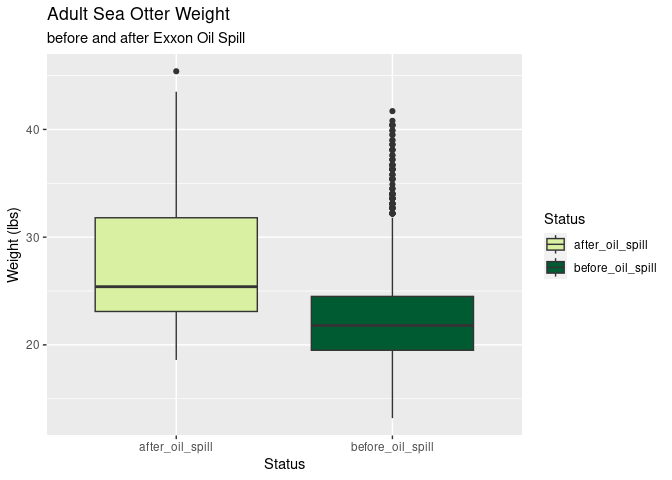
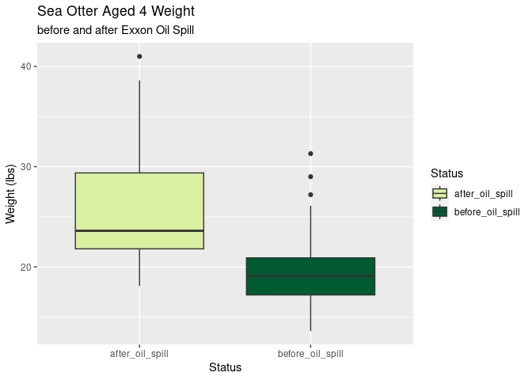
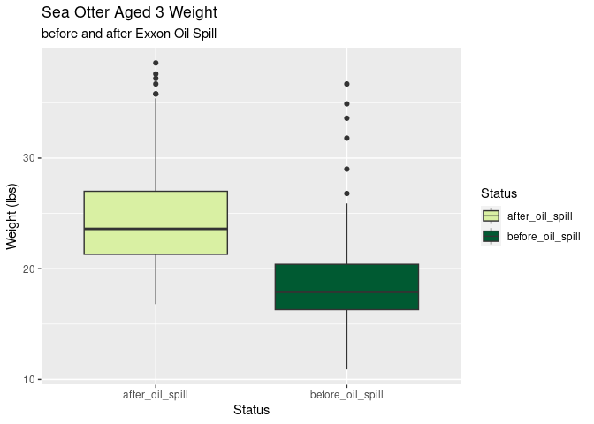
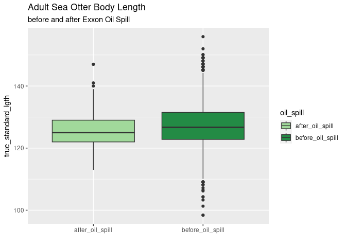
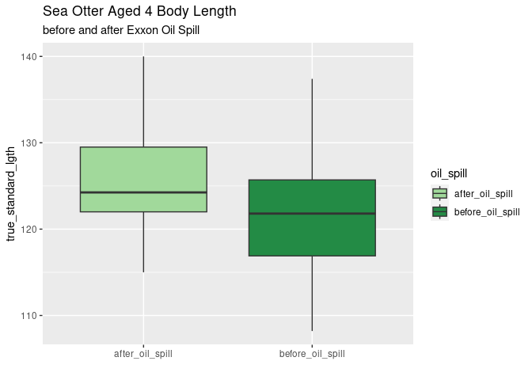
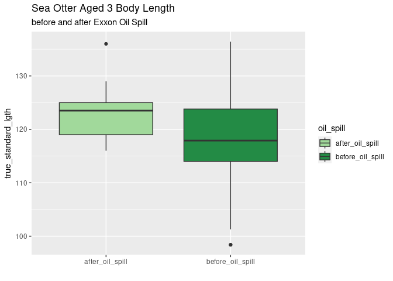

Oil Spill Analysis
================
Autumn Pauly and Asher Panikian

# Background Information

These data within the USFWS and USGS dataset was collected primarily
during experimental harvests primarily conducted in the 1960’s and
1970’s, or during sea otter captures related to USFWS and USGS sea otter
sampling and tagging studies conducted from the late 1980’s up to and
including 2019, or recovered dead during the 1989 Exxon Valdez Oil spill
(EVOS).

We were interested to see if there were any differences between the
otters that were captured before and after the oil spill.

# Loading the Data

First, we’ll want to load the appropriate packages and data for the
analysis of this dataset.

    ## ── Attaching core tidyverse packages ──────────────────────── tidyverse 2.0.0 ──
    ## ✔ dplyr     1.1.4     ✔ readr     2.1.5
    ## ✔ forcats   1.0.0     ✔ stringr   1.5.1
    ## ✔ ggplot2   3.4.4     ✔ tibble    3.2.1
    ## ✔ lubridate 1.9.3     ✔ tidyr     1.3.1
    ## ✔ purrr     1.0.2     
    ## ── Conflicts ────────────────────────────────────────── tidyverse_conflicts() ──
    ## ✖ dplyr::filter() masks stats::filter()
    ## ✖ dplyr::lag()    masks stats::lag()
    ## ℹ Use the conflicted package (<http://conflicted.r-lib.org/>) to force all conflicts to become errors

# Analyzing the Data

### General Otter’s Weight before and after the Exxon Oil Spill

#### Creating Plots

``` r
#sea otters after the oil spill
seot <- seot %>% 
  mutate(oil_spill = case_when(YEAR < 1989 ~ "before_oil_spill", 
                               YEAR > 1989 ~ "after_oil_spill"))

#adult weight
seot %>% 
  filter(FINAL_AGE > 4) %>% 
  filter(oil_spill == "before_oil_spill"|oil_spill == "after_oil_spill") %>% 
  ggplot(mapping = aes(y = WEIGHT, x = oil_spill, fill = oil_spill)) + 
  geom_boxplot() +
  scale_fill_manual(values = c("#d9f0a3", "#005a32")) +
  labs(title = "Adult Sea Otter Weight", 
       subtitle = "before and after Exxon Oil Spill", 
       x = "Status", 
       y = "Weight (lbs)",
       fill = "Status")
```

    ## Warning: Removed 2 rows containing non-finite values (`stat_boxplot()`).

<!-- -->

``` r
#otters aged 4 weight
seot %>% 
  filter(FINAL_AGE == "4") %>%
  filter(oil_spill == "before_oil_spill"|oil_spill == "after_oil_spill") %>% 
  ggplot(mapping = aes(y = WEIGHT, x = oil_spill, fill = oil_spill)) + 
  geom_boxplot() +
  scale_fill_manual(values = c("#d9f0a3", "#005a32")) +
  labs(title = "Sea Otter Aged 4 Weight", 
       subtitle = "before and after Exxon Oil Spill", 
       x = "Status", 
       y = "Weight (lbs)",
       fill = "Status")
```

    ## Warning: Removed 1 rows containing non-finite values (`stat_boxplot()`).

<!-- -->

``` r
#otters aged 3 weight
seot %>% 
  filter(FINAL_AGE == "3") %>% 
  filter(oil_spill == "before_oil_spill"|oil_spill == "after_oil_spill") %>% 
  ggplot(mapping = aes(y = WEIGHT, x = oil_spill, fill = oil_spill)) + 
  geom_boxplot() +
  scale_fill_manual(values = c("#d9f0a3", "#005a32")) +
  labs(title = "Sea Otter Aged 3 Weight", 
       subtitle = "before and after Exxon Oil Spill", 
       x = "Status", 
       y = "Weight (lbs)",
       fill = "Status")
```

    ## Warning: Removed 1 rows containing non-finite values (`stat_boxplot()`).

<!-- -->

``` r
#otters aged 2 weight
seot %>% 
  filter(FINAL_AGE == "2") %>%
  filter(oil_spill == "before_oil_spill"|oil_spill == "after_oil_spill") %>% 
  ggplot(mapping = aes(y = WEIGHT, x = oil_spill, fill = oil_spill)) + 
  geom_boxplot() +
  scale_fill_manual(values = c("#d9f0a3", "#005a32")) +
  labs(title = "Sea Otter Aged 2 Weight", 
       subtitle = "before and after Exxon Oil Spill", 
       x = "Status", 
       y = "Weight (lbs)",
       fill = "Status")
```

<!-- -->

``` r
#otters aged 1 weight
seot %>% 
  filter(FINAL_AGE == "1") %>%
  filter(oil_spill == "before_oil_spill"|oil_spill == "after_oil_spill") %>% 
  ggplot(mapping = aes(y = WEIGHT, x = oil_spill, fill = oil_spill)) + 
  geom_boxplot() +
  scale_fill_manual(values = c("#d9f0a3", "#005a32")) +
  labs(title = "Sea Otter Aged 1 Weight", 
       subtitle = "before and after Exxon Oil Spill", 
       x = "Status", 
       y = "Weight (lbs)",
       fill = "Status")
```

<!-- -->

#### Check the R-Squared

``` r
# #now, let's create the linear model comparing weight to year
# seot_model_oilweight <- linear_reg() %>%
#   set_engine("lm") %>%
#   fit(WEIGHT ~ oil_spill, data = seot)
# 
# #let's tidy this model
# seot_model_oilweight %>% tidy()
# 
# #augmenting the weight data
# seot_model_oilweight_augment <- augment(seot_model_oilweight$fit)
# 
# ggplot(seot_model_oilweight_augment, mapping = aes(x = .fitted, y = .resid)) +
#   geom_jitter(alpha = 0.75) +
#   geom_smooth(color = "black") +
#   labs(x = "Predicted weight", y = "Residuals")
# 
# #assessing the r-squared value
# glance(seot_model_oilweight)$adj.r.squared
```

The r-squared value is `0.03906333`, which means that the variable
`oil_spill` accounts for 39% of the variation in the dependent variable,
`WEIGHT`.

#### Statistical Analysis

``` r
#Welch's Two Sample t-test
t_test_weight <- t.test(WEIGHT ~ oil_spill, data = seot)
t_test_weight
```

    ## 
    ##  Welch Two Sample t-test
    ## 
    ## data:  WEIGHT by oil_spill
    ## t = 12.888, df = 3045.5, p-value < 2.2e-16
    ## alternative hypothesis: true difference in means between group after_oil_spill and group before_oil_spill is not equal to 0
    ## 95 percent confidence interval:
    ##  2.430731 3.303018
    ## sample estimates:
    ##  mean in group after_oil_spill mean in group before_oil_spill 
    ##                       23.05600                       20.18913

``` r
#two-way ANOVA
two_anova_weight_oil <- aov(WEIGHT ~ oil_spill + FINAL_AGE + oil_spill:FINAL_AGE, data = seot)
summary(two_anova_weight_oil)
```

    ##                       Df Sum Sq Mean Sq F value   Pr(>F)    
    ## oil_spill              1  10650   10650   317.2  < 2e-16 ***
    ## FINAL_AGE              1  63135   63135  1880.2  < 2e-16 ***
    ## oil_spill:FINAL_AGE    1   1773    1773    52.8 4.54e-13 ***
    ## Residuals           3467 116418      34                     
    ## ---
    ## Signif. codes:  0 '***' 0.001 '**' 0.01 '*' 0.05 '.' 0.1 ' ' 1
    ## 1007 observations deleted due to missingness

``` r
#interaction plot of data
interaction.plot(x.factor=seot$FINAL_AGE, trace.factor = seot$oil_spill, response = seot$WEIGHT, type = "o",pch=16)
```

<!-- -->

The two-way ANOVA suggests that there is a statistical significance with
the interaction between the two variables `FINAL_AGE` and `oil_spill`
for the dependent variable `WEIGHT`, we will have to perform any
analysis of simple events. For simplicity’s sake, I will be categorizing
the ages to juvenile (`0-4`) and adult (`>4`)

### Specific Otter’s Weight before and after the Exxon Oil Spill

We have already looked to see if the general weight of the captured sea
otters were significantly different before and after the Exxon oil
spill, but now we’d like to see if there were any regional differences
between the weights.

#### Creating Plots

As shown below, the West Aleutians are one of the only sites where there
were otters captured both before and after the oil spill. As such, we
will be analyzing this region of Alaska.

``` r
seot %>%
  filter(FINAL_AGE > 4|AGE_CATEGORY > 6) %>% 
  ggplot(mapping = aes(x = YEAR)) + 
  geom_histogram() + 
  facet_wrap(~REGION) + 
  labs(title = "Otters Observed Through the Years", 
       subtitle = "by Region", 
       x = "Year", 
       y = "Count")
```

    ## `stat_bin()` using `bins = 30`. Pick better value with `binwidth`.

<!-- -->

``` r
seot_west_aleutians <- seot %>% 
  filter(REGION == "west_aleutians")
```

``` r
seot_west_aleutians %>%
  filter(FINAL_AGE > 4|AGE_CATEGORY > 6) %>% 
  ggplot(mapping = aes(y = WEIGHT, x = YEAR, color = oil_spill)) + 
  geom_jitter() +
  scale_color_manual(values = c("#78c679", "#005a32")) +
  geom_smooth(color = "black") +
  labs(title = "Otters Observed Through the Years", 
       subtitle = "in the West Aleutians", 
       x = "Year", 
       y = "Count", 
       color = "Status")
```

    ## `geom_smooth()` using method = 'gam' and formula = 'y ~ s(x, bs = "cs")'

    ## Warning: Removed 2 rows containing non-finite values (`stat_smooth()`).

    ## Warning: Removed 2 rows containing missing values (`geom_point()`).

<!-- -->

``` r
seot_west_aleutians %>%
  filter(FINAL_AGE > 4|AGE_CATEGORY > 6) %>% 
  ggplot(mapping = aes(y = WEIGHT, x = oil_spill, fill = oil_spill)) + 
  scale_fill_manual(values = c("#78c679", "#005a32")) +
  geom_boxplot() +
  labs(title = "Otters Observed Through the Years", 
       subtitle = "in the West Aleutians", 
       x = "Status", 
       y = "Count", 
       fill = "Status")
```

    ## Warning: Removed 2 rows containing non-finite values (`stat_boxplot()`).

<!-- -->

#### Check the R-Squared

``` r
# #now, let's create the linear model comparing weight to year
# seot_wa_model_oilweight <- linear_reg() %>%
#   set_engine("lm") %>%
#   fit(WEIGHT ~ oil_spill, data = seot_west_aleutians)
# 
# #let's tidy this model
# seot_wa_model_oilweight %>% tidy()
# 
# #augmenting the weight data
# seot_wa_model_oilweight_augment <- augment(seot_wa_model_oilweight$fit)
# 
# ggplot(seot_wa_model_oilweight_augment, mapping = aes(x = .fitted, y = .resid)) +
#   geom_jitter(alpha = 0.75) +
#   geom_smooth(color = "black") +
#   labs(x = "Predicted weight", y = "Residuals")
# 
# #assessing the r-squared value
# glance(seot_wa_model_oilweight)$adj.r.squared
```

REPORT: The r-squared value is `0.01960116`, which means that the
variable `oil_spill` accounts for 1.96% of the variation in the
dependent variable, `WEIGHT`.

``` r
# #now, let's create the linear model comparing weight to year
# seot_new_wa_model_oilweight <- linear_reg() %>%
#   set_engine("lm") %>%
#   fit(WEIGHT ~ oil_spill, data = seot_west_aleutians)
# 
# #augmenting the weight data
# seot_new_wa_model_oilweight_augment <- augment(seot_new_wa_model_oilweight$fit)
# 
# ggplot(seot_new_wa_model_oilweight_augment, mapping = aes(x = .fitted, y = .resid)) +
#   geom_jitter(alpha = 0.75) +
#   geom_smooth(color = "black") +
#   labs(x = "Predicted weight", y = "Residuals")
# 
# #assessing the new r-squared value
# glance(seot_new_wa_model_oilweight)$adj.r.squared
```

REPORT: The r-squared value is `0.4123082`, which means that the
variable `oil_spill` along with the variable `FINAL_AGE` accounts for
41.23% of the variation in the dependent variable, `WEIGHT`.

Now, we would like to assess the r-squared value of the variable
`oil_spill` on the adult sea otter populations in the Western Aleutians.

``` r
# seot_west_aleutians_adult <- seot_west_aleutians %>% 
#   filter(FINAL_AGE > 4|AGE_CATEGORY > 6)
# 
# #now, let's create the linear model comparing weight to year
# seot_adult_wa_model_oilweight <- linear_reg() %>%
#   set_engine("lm") %>%
#   fit(WEIGHT ~ oil_spill, data = seot_west_aleutians_adult)
# 
# #let's tidy this model
# seot_adult_wa_model_oilweight %>% tidy()
# 
# #augmenting the weight data
# seot_adult_wa_model_oilweight_augment <- augment(seot_adult_wa_model_oilweight$fit)
# 
# ggplot(seot_adult_wa_model_oilweight_augment, mapping = aes(x = .fitted, y = .resid)) +
#   geom_jitter(alpha = 0.75) +
#   geom_smooth(color = "black") +
#   labs(x = "Predicted weight", y = "Residuals")
# 
# #assessing the r-squared value
# glance(seot_adult_wa_model_oilweight)$adj.r.squared
```

#### Statistical Analysis

``` r
#Welch's Two Sample t-test
t_test_wa_weight <- t.test(WEIGHT ~ oil_spill, data = seot_west_aleutians)
t_test_wa_weight
```

    ## 
    ##  Welch Two Sample t-test
    ## 
    ## data:  WEIGHT by oil_spill
    ## t = 7.4412, df = 399.18, p-value = 6.181e-13
    ## alternative hypothesis: true difference in means between group after_oil_spill and group before_oil_spill is not equal to 0
    ## 95 percent confidence interval:
    ##  2.127360 3.655039
    ## sample estimates:
    ##  mean in group after_oil_spill mean in group before_oil_spill 
    ##                       22.94312                       20.05192

REPORT: There was a significant impact of the oil spill on the weight of
the adult sea otter population in the Western Aleutians (Welch Two
Sample t-test; t = 7.4412, df = 399.18, p-value \< 0.005). An assessment
of the r-squared value suggests that the variable `oil_spill` accounts
for 1.96% of the variation in the dependent variable, `WEIGHT` in the
western Aluetians.

### Otter’s Weight Year by Year \*\*\*get rid of this??

We will be continuing to assess the otter populations in the Western
Aleutians, as this area is the only area to have otter captures both
before and after the oil spill.

``` r
#all otters weight
seot %>% 
  filter(oil_spill == "before_oil_spill"|oil_spill == "after_oil_spill") %>% 
  filter(SEX == "M"|SEX == "F") %>% 
  ggplot(mapping = aes(y = WEIGHT, x = YEAR, color = oil_spill)) + 
  geom_jitter() +
  scale_color_manual(values = c("#78c679", "#005a32")) +
  geom_smooth(color = "black") +
  labs(title = "Adult Sea Otter Weight", 
       subtitle = "before and after Exxon Oil Spill", 
       x = "")
```

    ## `geom_smooth()` using method = 'gam' and formula = 'y ~ s(x, bs = "cs")'

    ## Warning: Removed 7 rows containing non-finite values (`stat_smooth()`).

    ## Warning: Removed 7 rows containing missing values (`geom_point()`).

<!-- -->

``` r
#all otters weight
seot %>% 
  filter(oil_spill == "before_oil_spill"|oil_spill == "after_oil_spill") %>% 
  filter(SEX == "M"|SEX == "F") %>% 
  filter(FINAL_AGE > 4) %>% 
  ggplot(mapping = aes(y = WEIGHT, x = YEAR, color = oil_spill)) + 
  geom_jitter() +
  scale_color_manual(values = c("#78c679", "#005a32")) +
  geom_smooth(color = "black") +
  labs(title = "Adult Sea Otter Weight", 
       subtitle = "before and after Exxon Oil Spill", 
       x = "Year",
       y = "Weight (lbs)",
       color = "Status")
```

    ## `geom_smooth()` using method = 'gam' and formula = 'y ~ s(x, bs = "cs")'

    ## Warning: Removed 2 rows containing non-finite values (`stat_smooth()`).

    ## Warning: Removed 2 rows containing missing values (`geom_point()`).

<!-- -->

### Otter’s Body Length before and after the Exxon Oil Spill

#### Creating Plots

``` r
#adult body length
seot_west_aleutians %>% 
  filter(FINAL_AGE > 4|AGE_CATEGORY > 6) %>% 
  filter(oil_spill == "before_oil_spill"|oil_spill == "after_oil_spill") %>%
  ggplot(mapping = aes(y = true_standard_lgth, x = oil_spill, fill = oil_spill)) + 
  geom_boxplot() +
    scale_fill_manual(values = c("#a1d99b", "#238b45")) +
  labs(title = "Adult Sea Otter Body Length", 
       subtitle = "before and after Exxon Oil Spill", 
       x = "")
```

    ## Warning: Removed 80 rows containing non-finite values (`stat_boxplot()`).

<!-- -->

``` r
#otters aged 4 body length
seot_west_aleutians %>% 
  filter(FINAL_AGE == "4") %>%
  filter(oil_spill == "before_oil_spill"|oil_spill == "after_oil_spill") %>% 
  ggplot(mapping = aes(y = true_standard_lgth, x = oil_spill, fill = oil_spill)) + 
  geom_boxplot() +
    scale_fill_manual(values = c("#a1d99b", "#238b45")) +
  labs(title = "Sea Otter Aged 4 Body Length", 
       subtitle = "before and after Exxon Oil Spill", 
       x = "")
```

    ## Warning: Removed 1 rows containing non-finite values (`stat_boxplot()`).

<!-- -->

``` r
#otters aged 3 body length
seot_west_aleutians %>% 
  filter(FINAL_AGE == "3") %>% 
  filter(oil_spill == "before_oil_spill"|oil_spill == "after_oil_spill") %>% 
  ggplot(mapping = aes(y = true_standard_lgth, x = oil_spill, fill = oil_spill)) + 
  geom_boxplot() +
    scale_fill_manual(values = c("#a1d99b", "#238b45")) +
  labs(title = "Sea Otter Aged 3 Body Length", 
       subtitle = "before and after Exxon Oil Spill", 
       x = "")
```

<!-- -->

``` r
#otters aged 2 body length
seot_west_aleutians %>% 
  filter(FINAL_AGE == "2") %>%
  filter(oil_spill == "before_oil_spill"|oil_spill == "after_oil_spill") %>%
  ggplot(mapping = aes(y = true_standard_lgth, x = oil_spill, fill = oil_spill)) + 
  geom_boxplot() +
    scale_fill_manual(values = c("#a1d99b", "#238b45")) +
  labs(title = "Sea Otter Aged 2 Body Length", 
       subtitle = "before and after Exxon Oil Spill", 
       x = "")
```

<!-- -->

``` r
#otters aged 1 body length
seot_west_aleutians %>% 
  filter(FINAL_AGE == "1") %>%
  filter(oil_spill == "before_oil_spill"|oil_spill == "after_oil_spill") %>%  
  ggplot(mapping = aes(y = true_standard_lgth, x = oil_spill, fill = oil_spill)) + 
  geom_boxplot() +
    scale_fill_manual(values = c("#a1d99b", "#238b45")) +
  labs(title = "Sea Otter Aged 1 Body Length", 
       subtitle = "before and after Exxon Oil Spill", 
       x = "")
```

<!-- -->

#### Check the R-Squared

``` r
# #now, let's create the linear model comparing weight to year
# seot_model_oillength <- linear_reg() %>%
#   set_engine("lm") %>%
#   fit(true_standard_lgth ~ oil_spill, data = seot_west_aleutians)
# 
# #let's tidy this model
# seot_model_oillength %>% tidy()
# 
# #augmenting the weight data
# seot_model_oillength_augment <- augment(seot_model_oillength$fit)
# 
# ggplot(seot_model_oillength_augment, mapping = aes(x = .fitted, y = .resid)) +
#   geom_jitter(alpha = 0.75) +
#   geom_smooth(color = "black") +
#   labs(x = "Predicted weight", y = "Residuals")
# 
# #assessing the r-squared value
# glance(seot_model_oillength)$adj.r.squared
```

#### Statistical Analysis

We are performing a statistical analysis on the body length of adult
otters before and after the Exxon Oil Spill. This is an analysis of two
variables (one qualitative, one quantitative), where there are two
groups being compared against parametric, independent samples. This
suggests that we should use a Welch Two Sample t-test for statistical
analysis.

``` r
#Welch's Two Sample t-test
t_test_length <- t.test(true_standard_lgth ~ oil_spill, data = seot_west_aleutians)
t_test_length
```

    ## 
    ##  Welch Two Sample t-test
    ## 
    ## data:  true_standard_lgth by oil_spill
    ## t = -1.0462, df = 350.38, p-value = 0.2962
    ## alternative hypothesis: true difference in means between group after_oil_spill and group before_oil_spill is not equal to 0
    ## 95 percent confidence interval:
    ##  -2.6933877  0.8228886
    ## sample estimates:
    ##  mean in group after_oil_spill mean in group before_oil_spill 
    ##                       120.0904                       121.0256

REPORT: There was no significant impact of the oil spill on the body
length of the sea otter population (Welch Two Sample t-test; t =
-1.0462, df = 350.38, p-value = 0.2962).

### Adult Otter’s Baculum Length before and after the Exxon Oil Spill

#### Creating Plots

``` r
#adult body length
seot_west_aleutians %>% 
  filter(FINAL_AGE > 4) %>% 
  filter(oil_spill == "before_oil_spill"|oil_spill == "after_oil_spill") %>%
  filter(REGION == "west_aleutians") %>% 
  ggplot(mapping = aes(y = BACULA_LGTH, x = oil_spill, fill = oil_spill)) + 
  geom_boxplot() +
  scale_fill_manual(values = c("#a1d99b", "#238b45")) +
  labs(title = "Adult Sea Otter Bacula Length", 
       subtitle = "before and after Exxon Oil Spill", 
       x = "")
```

    ## Warning: Removed 1281 rows containing non-finite values (`stat_boxplot()`).

<!-- -->

#### Check the R-Squared

``` r
# #now, let's create the linear model comparing weight to year
# seot_model_baclength <- linear_reg() %>%
#   set_engine("lm") %>%
#   fit(BACULA_LGTH ~ oil_spill, data = seot_west_aleutians)
# 
# #let's tidy this model
# seot_model_baclength %>% tidy()
# 
# #augmenting the weight data
# seot_model_baclength_augment <- augment(seot_model_baclength$fit)
# 
# ggplot(seot_model_baclength_augment, mapping = aes(x = .fitted, y = .resid)) +
#   geom_jitter(alpha = 0.75) +
#   geom_smooth(color = "black") +
#   labs(x = "Predicted weight", y = "Residuals")
# 
# #assessing the r-squared value
# glance(seot_model_baclength)$adj.r.squared
```

#### Statistical Analysis

We are performing a statistical analysis on the body length of adult
otters before and after the Exxon Oil Spill. This is an analysis of two
variables (one qualitative, one quantitative), where there are two
groups being compared against parametric, independent samples. This
suggests that we should use a Welch Two Sample t-test for statistical
analysis.

``` r
#Welch's Two Sample t-test
t_test_length <- t.test(BACULA_LGTH ~ oil_spill, data = seot_west_aleutians)
t_test_length
```

    ## 
    ##  Welch Two Sample t-test
    ## 
    ## data:  BACULA_LGTH by oil_spill
    ## t = 4.6688, df = 183.77, p-value = 5.829e-06
    ## alternative hypothesis: true difference in means between group after_oil_spill and group before_oil_spill is not equal to 0
    ## 95 percent confidence interval:
    ##  1.057485 2.605329
    ## sample estimates:
    ##  mean in group after_oil_spill mean in group before_oil_spill 
    ##                       15.84857                       14.01716

``` r
#two-way ANOVA
two_anova_lgth_bac <- aov(BACULA_LGTH ~ oil_spill + FINAL_AGE + oil_spill:FINAL_AGE, data = seot_west_aleutians)
summary(two_anova_lgth_bac)
```

    ##                      Df Sum Sq Mean Sq F value   Pr(>F)    
    ## oil_spill             1  200.1   200.1   60.99 1.19e-12 ***
    ## FINAL_AGE             1  995.8   995.8  303.45  < 2e-16 ***
    ## oil_spill:FINAL_AGE   1   74.7    74.7   22.78 4.50e-06 ***
    ## Residuals           141  462.7     3.3                     
    ## ---
    ## Signif. codes:  0 '***' 0.001 '**' 0.01 '*' 0.05 '.' 0.1 ' ' 1
    ## 2869 observations deleted due to missingness

With there being no statistical significance with the interaction
between the two variables `FINAL_AGE` and `oil_spill` for the dependent
variable `BACULA_LGTH`, we don’t have to perform any analysis of simple
events.

REPORT: There was a significant difference in baculum sizes in adult
male otters before and after the Exxon Mobil oil spill in 1989 (Welch
Two Sample t-test; t = 4.6688, df = 183.77, p-value = 0.005). The
average baculum length for adult male otters before the oil spill was
14.02 mm and 15.85 mm after the oil spill.

There was no significant impact of the oil spill on the body length of
the sea otter population (Two-way ANOVA; F_1,3375, f = 0.207, p=0.65).
There was a significant impact on the age of the otter on the body
length (Two-way ANOVA; F_1,3375, f = 2297.583, p \< 0.0005).

### Temporal Time Scale

We want to see if there was a noticale change in baculum length over
time.

``` r
seot <- seot %>% 
  mutate(YEAR = as.numeric(YEAR))

seot %>% 
  filter(FINAL_AGE > 4) %>% 
  ggplot(mapping = aes(x = YEAR, y = BACULA_LGTH, color = BACULA_LGTH)) + 
  geom_jitter() + 
  scale_color_viridis_c() +
  geom_smooth(color = "black") + 
  labs(title = "Baculum Length of Adult Otters", 
       subtitle = "Through the Years", 
       x= "Year", 
       y = "Baculum Length (mm)", 
       color = "Baculum Length")
```

    ## `geom_smooth()` using method = 'gam' and formula = 'y ~ s(x, bs = "cs")'

    ## Warning: Removed 1747 rows containing non-finite values (`stat_smooth()`).

    ## Warning: Removed 1747 rows containing missing values (`geom_point()`).

<!-- -->

### Otter’s Final Age before and after the Exxon Oil Spill

#### Creating Plots

``` r
#plot of age at capture before and after oil spill
seot_age_oilspill_graph <- seot %>% 
  filter(oil_spill == "before_oil_spill"|oil_spill == "after_oil_spill") %>% 
  ggplot(mapping = aes(y = FINAL_AGE, x = oil_spill, fill = oil_spill)) + 
  geom_boxplot() +
  scale_fill_manual(values = c("#a1d99b", "#238b45")) +
  labs(title = "Sea Otter Final Age", 
       subtitle = "before and after Exxon Oil Spill", 
       x = "")

seot_age_oilspill_graph
```

    ## Warning: Removed 947 rows containing non-finite values (`stat_boxplot()`).

<!-- -->

#### Check the R-Squared

``` r
# #now, let's create the linear model comparing age to year
# seot_model_oilage <- linear_reg() %>%
#   set_engine("lm") %>%
#   fit(FINAL_AGE ~ oil_spill, data = seot)
# 
# #let's tidy this model
# seot_model_oilage %>% tidy()
# 
# #augmenting the weight data
# seot_model_oilage_augment <- augment(seot_model_oilage$fit)
# 
# ggplot(seot_model_oilage_augment, mapping = aes(x = .fitted, y = .resid)) +
#   geom_jitter(alpha = 0.75) +
#   geom_smooth(color = "black") +
#   labs(x = "Predicted weight", y = "Residuals")
# 
# #assessing the r-squared value
# glance(seot_model_oilage)$adj.r.squared
```

The r-squared value is `0.04269101`, which means that the variable
`oil_spill` accounts for 4.26% of the variation in the dependent
variable, `WEIGHT`.

#### Statistical Analysis

We are performing a statistical analysis on the ages of captured adult
otters before and after the Exxon Oil Spill. This is an analysis of two
variables (one qualitative, one quantitative), where there are two
groups being compared against parametric, independent samples. This
suggests that we should use a Welch Two Sample t-test for statistical
analysis.

``` r
#Welch's t-test
t.test(data = seot, FINAL_AGE ~ oil_spill)
```

    ## 
    ##  Welch Two Sample t-test
    ## 
    ## data:  FINAL_AGE by oil_spill
    ## t = -12.825, df = 3472.6, p-value < 2.2e-16
    ## alternative hypothesis: true difference in means between group after_oil_spill and group before_oil_spill is not equal to 0
    ## 95 percent confidence interval:
    ##  -2.131725 -1.566355
    ## sample estimates:
    ##  mean in group after_oil_spill mean in group before_oil_spill 
    ##                       4.770642                       6.619682

REPORT: The otters captured before the oil spill were significantly
older than the otters captured after the oil spill (Welch Two Sample
t-test; t = -12.825, df = 3472.6, p-value \< 0.005).
